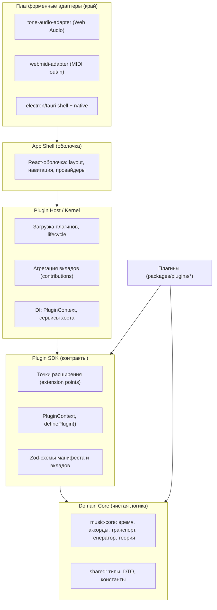
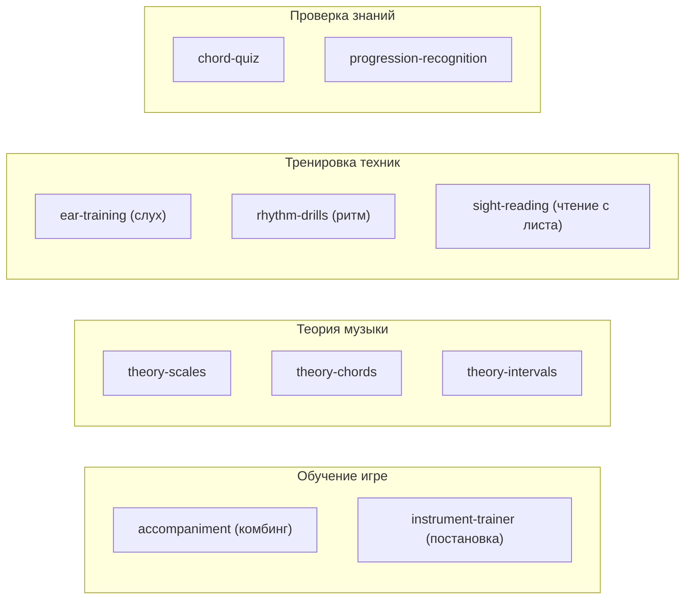
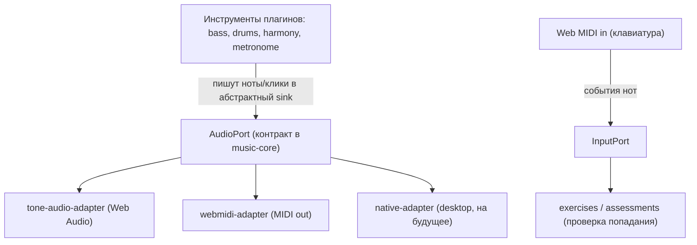
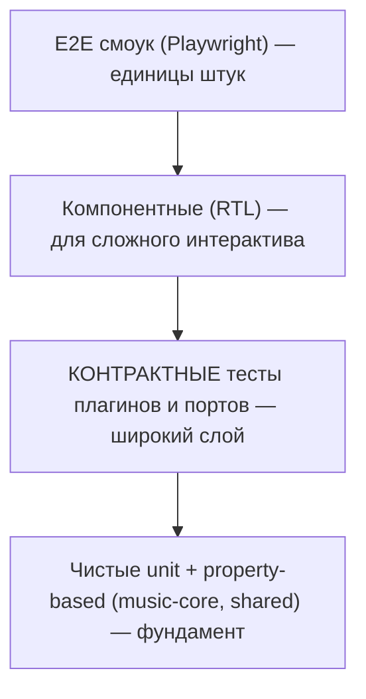
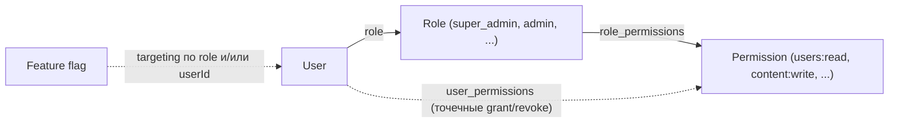
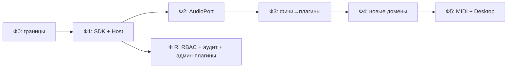

# Архитектура Jazz Trainer

> Статус: **целевая архитектура + план миграции**. Документ описывает, к чему мы идём и как туда прийти от текущего кода поэтапно. Немедленный рефакторинг не требуется — каждая фаза самостоятельна и не ломает прод.
>
> Контекст решений (зафиксировано с владельцем продукта):
> - Плагины подключаются **на этапе сборки** (build-time реестр), без динамической загрузки кода в рантайме.
> - Плагины пишет **только команда** (first-party). Песочница, изоляция чужого кода и публичный версионируемый SDK **не нужны**.
> - Целевые платформы: **Web (браузер)**, **Desktop (Electron/Tauri)**, **MIDI-устройства** (Web MIDI).
> - Репозиторий — **единое монорепо** (обоснование в разделе 9).
> - Административный домен — **RBAC (роль → permissions) + неизменяемый audit log**, админка как набор плагинов внутри `apps/web` (раздел 10).

---

## 1. Принципы

1. **Тонкое ядро, толстые плагины.** Приложение — это оболочка (shell) + хост, которые знают только о *контрактах*. Вся предметная функциональность (уроки, упражнения, квизы, инструменты) поставляется плагинами.
2. **Зависимости только сверху вниз.** Ядро не знает о плагинах. Плагины не знают друг о друге. Платформенные детали (Tone.js, Web MIDI, Electron) живут на самом краю, за портами.
3. **Контракт важнее реализации.** Граница между хостом и плагином — это типизированный контракт (`@jazz/plugin-sdk`). Меняем реализацию свободно, контракт — осознанно.
4. **Детерминированное ядро.** Вся музыкальная логика (`music-core`) — чистая, без браузерных API и без IO. Это делает её переносимой между платформами и дешёвой в тестировании.
5. **Co-location.** Всё, что относится к одной фиче, лежит в одной папке: UI, логика, контент, i18n, тесты. Никакого размазывания фичи по дереву.
6. **Без дублирования по горизонтали.** Общая работа (парсинг аккордов, транспорт, расписание звука, теория) живёт в ядре и предоставляется плагинам через сервисы хоста — плагины не переписывают это у себя.

---

## 2. Слои



**Правило слоёв (проверяется линтером, см. §8):**

| Слой | Может импортировать | Не может |
|---|---|---|
| `core` (`music-core`, `shared`) | только друг друга и stdlib | shell, host, sdk, плагины, браузерные API |
| `plugin-sdk` | `core` | shell, host, плагины, платформенные адаптеры |
| `plugin-host` | `sdk`, `core` | конкретные плагины, платформенные адаптеры напрямую |
| плагины (`plugins/*`) | `sdk`, `core` | другие плагины, shell, host напрямую |
| адаптеры | `sdk`, `core` | плагины |
| shell | host, sdk | внутренности плагинов |

---

## 3. Плагинная модель

### 3.1. Что такое плагин

Плагин — это пакет (`packages/plugins/<name>`), который экспортирует единственный типизированный объект через `definePlugin(...)`. Объект содержит **манифест** (метаданные) и **вклады (contributions)** в известные точки расширения.

```ts
// packages/plugins/theory-scales/src/index.ts
import { definePlugin } from '@jazz/plugin-sdk';

export default definePlugin({
  manifest: {
    id: 'theory.scales',
    name: 'Гаммы и лады',
    apiVersion: 1,
    category: 'theory',
    description: 'Справочник гамм с интерактивной визуализацией.',
  },
  contributes: {
    routes: [
      { path: '/learn/scales', element: () => import('./ScalesPage') },
    ],
    navItems: [
      { section: 'learn', label: 'Гаммы', to: '/learn/scales', icon: 'scale' },
    ],
    lessons: [scalesIntroLesson],
    settingsSchema: scalesSettingsSchema,
  },
  // Опциональный жизненный цикл
  setup(ctx) { /* регистрация в сервисах хоста, подписки */ },
  dispose() { /* очистка */ },
});
```

### 3.2. Точки расширения (extension points)

Точки расширения — это контракт хоста. Они покрывают все четыре запрошенных домена (обучение игре, теория, тренировка техник, проверка знаний) и переиспользуют то, что уже есть в коде.

| Точка | Назначение | Откуда растёт в текущем коде |
|---|---|---|
| `routes` | Страницы/экраны плагина | React Router 7 (`App.tsx`) |
| `navItems` | Пункты меню/навигации | `Header.tsx` |
| `commands` | Именованные действия (для палитры команд, хоткеев) | — (новое) |
| `lessons` | Учебная единица: контент + проверка усвоения | — (новое, домен «теория/обучение») |
| `exercises` | Интерактивная тренировка (дрилл техники, слуха, ритма) | — (новое, домен «техника») |
| `assessments` | Проверка знаний: квиз/тест с подсчётом результата | — (новое, домен «проверка») |
| `instruments` | Звуковой движок (бас, барабаны, гармония, метроном) | **уже есть** `Instrument` interface в `music-core/audio` |
| `generators` | Генератор учебного материала (прогрессии, последовательности) | **уже есть** `PatternDef` в `music-core/generator` |
| `theoryProviders` | Модель/справочник теории (гаммы, аккорды, интервалы) | растёт из `music-core/chords` |
| `settingsSchema` | Декларация настроек плагина (Zod) | растёт из `shared/dto` + `useSettings` |

Точки расширения **не зашиты раз и навсегда** — добавление новой точки осознанное изменение SDK + хоста. Но плагины внутри своей категории добавляются без изменения хоста.

### 3.3. Категории плагинов (домены обучения)



Каждый домен — это набор плагинов, использующих одни и те же точки расширения по-разному:
- **Обучение игре** опирается в основном на `instruments` + `exercises` + `routes` (живая игра под аккомпанемент, метроном, MIDI-ввод).
- **Теория** опирается на `lessons` + `theoryProviders` + `routes`.
- **Тренировка техник** — на `exercises` + `instruments` + `assessments` (дрилл с подсчётом прогресса).
- **Проверка знаний** — на `assessments` + `generators` (генерируем вопросы из учебного материала).

Унификация в том, что «урок», «упражнение» и «квиз» — это три формы одной абстракции **активности (activity)** с общим жизненным циклом (`start → interact → evaluate → report`). Это убирает дублирование между доменами: прогресс-трекинг, подсчёт результата, сохранение в БД — общие сервисы хоста, а не код каждого плагина.

### 3.4. Реестр (build-time)

Поскольку плагины first-party и подключаются на сборке, реестр — это **статический массив импортов**, без динамической загрузки:

```ts
// packages/plugin-registry/src/index.ts
import theoryScales from '@jazz/plugin-theory-scales';
import earTraining from '@jazz/plugin-ear-training';
import chordQuiz from '@jazz/plugin-chord-quiz';
// ...

export const PLUGINS = [theoryScales, earTraining, chordQuiz /* ... */];
```

Хост на старте принимает `PLUGINS`, валидирует каждый манифест (Zod), проверяет уникальность `id`, собирает вклады в индексы (роутер, меню, реестр инструментов, каталог активностей) и вызывает `setup(ctx)`. Дерево-шейкинг Vite уберёт неиспользуемый код выключенных плагинов.

Включение/выключение плагина — это редактирование одного массива (или флага в манифесте), а не правка ядра.

### 3.5. PluginContext — сервисы хоста

Плагин не лезет в глобальные синглтоны. Хост инъецирует `PluginContext` — фасад над общими возможностями. Это **единственный** способ плагина получить доступ к звуку, хранилищу, настройкам и навигации, что и устраняет дублирование.

```ts
interface PluginContext {
  audio: AudioService;        // порт к звуку: транспорт, инструменты, MIDI
  storage: StorageService;    // персист прогресса/состояния плагина
  settings: SettingsService;  // чтение/запись настроек плагина (по его schema)
  navigation: NavigationService;
  events: EventBus;           // межплагинная связь только через типизированные события
  music: MusicCore;           // чистые функции: parseChord, transpose, generate, theory
  query: QueryClient;         // общий TanStack Query
}
```

Межплагинное взаимодействие — **только** через `events` (типизированная шина) и общие сервисы. Прямых импортов между плагинами нет (запрещено линтером).

---

## 4. Звук и MIDI: порты и адаптеры

Сейчас `useTransport` жёстко завязан на Tone.js. Для Web + Desktop + MIDI нужен **порт** (абстрактный звуковой выход) и сменные **адаптеры**.



- **`music-core` уже почти готов к этому:** `TransportEngine`, `Instrument`, `ClickSink` — чистые. Достаточно поднять понятие «звуковой выход» до явного `AudioPort` и переместить туда `ClickSink`/voice-абстракцию.
- **Инструменты не знают, куда играют** — Tone.Synth или MIDI-устройство. Это убирает дублирование звуковой логики между платформами.
- **MIDI-ввод** становится `InputPort` — источник событий для упражнений на технику и проверки знаний (нажал ли ученик правильную ноту вовремя).
- Текущий `useTransport` превращается в тонкий React-хук поверх `tone-audio-adapter`.

---

## 5. Целевая структура директорий

```
jazz-trainer/
├── apps/
│   ├── web/                      @jazz/web — App Shell (React 19, Vite, Router)
│   │   └── src/shell/            layout, провайдеры, монтаж хоста
│   ├── api/                      @jazz/api — Fastify + Drizzle (без изменений по слоям)
│   └── desktop/                  (фаза 5) Electron/Tauri-оболочка, переиспользует web
│
├── packages/
│   ├── shared/                   @jazz/shared — типы, DTO (Zod), константы
│   ├── music-core/               @jazz/music-core — чистая логика
│   │   ├── audio/                + AudioPort, InputPort (порты)
│   │   ├── chords/ time/ playback/ generator/ dsl/ theory/
│   │
│   ├── plugin-sdk/               @jazz/plugin-sdk — КОНТРАКТЫ
│   │   ├── extension-points.ts   типы точек расширения
│   │   ├── context.ts            PluginContext, сервисы
│   │   ├── activity.ts           общая абстракция lesson/exercise/assessment
│   │   ├── manifest.schema.ts    Zod-схема манифеста
│   │   └── definePlugin.ts       хелпер + валидация
│   │
│   ├── plugin-host/              @jazz/plugin-host — загрузка, lifecycle, агрегация, DI
│   ├── plugin-registry/          @jazz/plugin-registry — статический список PLUGINS
│   │
│   ├── adapters/
│   │   ├── tone-audio-adapter/   реализация AudioPort через Tone.js
│   │   └── webmidi-adapter/      реализация AudioPort/InputPort через Web MIDI
│   │
│   └── plugins/
│       ├── core-editor/          (бывш. editor) грид-редактор как плагин
│       ├── core-player/          (бывш. player) плеер как плагин
│       ├── catalog/              (бывш. catalog) публичный каталог
│       ├── theory-scales/
│       ├── theory-chords/
│       ├── ear-training/
│       ├── rhythm-drills/
│       ├── chord-quiz/
│       └── _template/            эталонный плагин-шаблон (см. §6)
│
├── docs/                         существующие 01–08 + features/
└── ARCHITECTURE.md               (этот файл)
```

> Существующие фичи (`editor`, `player`, `catalog`) становятся **обычными плагинами**. Это доказывает, что плагинная модель полная: если ядро может выразить ключевые фичи, оно выразит и любые новые.

---

## 6. Как эта архитектура экономит токены на разработку

Это не побочный эффект — это прямое следствие границ. Стоимость AI-разработки задачи ≈ объём контекста, который нужно прочитать и удержать, чтобы задачу сделать. Архитектура минимизирует этот объём.

### 6.1. Контекст задачи ≈ один плагин, а не всё приложение

Чтобы добавить новый урок/упражнение/квиз, агенту нужно прочитать ровно:
1. контракт `@jazz/plugin-sdk` (компактные типы),
2. один эталонный плагин той же категории (`_template` или сосед),
3. сам новый плагин.

Не нужно грузить `web`, `api` или всё `music-core`. **Стоимость растёт линейно от числа фич, а не квадратично** (как в монолите, где каждая новая фича переплетается со всеми прочими и заставляет читать всё больше).

### 6.2. Типы-контракты — это сжатая спецификация

Узкие стабильные контракты избавляют агента от «чтения по цепочке» через слои. Вместо трассировки реализации `audio → transport → tone` агент опирается на сигнатуру `AudioService`. TypeScript-типы дают максимум смысла на минимум токенов; `strict` + `Zod` превращают намерение в проверяемую форму, которую не надо перечитывать.

### 6.3. Шаблонность снижает рассуждения

Каждый плагин повторяет одну форму (`definePlugin` + вклады). Появляется эталон (`_template`) и, при желании, skill-генератор. Агент пишет «по образцу» — а воспроизведение шаблона дешевле в токенах, чем проектирование с нуля каждый раз.

### 6.4. Отсутствие runtime-инфраструктуры — экономия в чистом виде

Выбор **build-time + first-party** означает, что мы **не пишем и не поддерживаем**: песочницу, изоляцию, версионирование публичного API, проверку прав, маркетплейс. Каждый такой кусок инфраструктуры — это код, который пришлось бы держать в контексте при *каждой* связанной задаче. Мы платим за него ноль токенов — и на разработке, и на сопровождении. (Для контраста: runtime-маркетплейс сторонних авторов *увеличил* бы стоимость каждой задачи, потому что версионирование и безопасность становятся сквозной заботой.)

### 6.5. Co-location = меньше навигации

Всё про фичу — в одной папке. Агент открывает одну директорию вместо прыжков `routes/ ↔ components/ ↔ stores/ ↔ queries/ ↔ test/`. Локальность снижает объём поиска и число «промахов» при чтении.

### 6.6. Стабильное ядро с тестами-оракулами

`music-core` детерминирован и покрыт тестами. Большинство фич живёт *поверх* него в плагинах и не трогает ядро. Агент редко и безопасно меняет ядро, а контрактные тесты ловят регрессии локально — меньше итераций «сломал → чинил», а каждая такая итерация стоит токенов.

> **Итог по экономии:** дешевле всего то, что не нужно читать. Эта архитектура максимизирует объём кода, который при типовой задаче можно *не* открывать: соседние плагины, инфраструктуру изоляции (её нет), внутренности ядра (за ним контракт).

---

## 7. Стратегия тестирования (чтобы не ломалось при каждом изменении)

Ключевой принцип против ломкости: **тестируем контракты и чистую логику, а не детали UI-реализации.** Изменение одного плагина не должно ронять тесты других. Этого добиваемся изоляцией + контрактными проверками.



### Уровень 1 — Чистый unit + property-based (фундамент, дёшево, много)
- `music-core`: `parseChord`, `transpose`, `generate`, `timeSignature`, `PlaybackStateMachine`, DSL parse/serialize.
- **Golden/snapshot** для генератора и DSL: фиксированный вход → фиксированный выход. Ловит непреднамеренные изменения музыкальной логики.
- **Property-based** (`fast-check`) для теории: `serialize(parse(x)) === x` (round-trip), `transpose(transpose(g, +n), -n) === g` (инверсия), интервалы симметричны. Эти инварианты ловят целые классы багов без перечисления случаев.

### Уровень 2 — Контрактные тесты (главный барьер от ломкости)
- **Валидатор плагинов:** один общий `validatePlugin(plugin)` прогоняется по **всем** зарегистрированным плагинам в `plugin-registry`. Проверяет: манифест проходит Zod-схему, `id` уникален, все `routes`/`navItems` ссылаются на существующее, `lessons`/`exercises`/`assessments` соответствуют схеме активности, `settingsSchema` валиден. Любой плагин, нарушивший контракт, валит сборку **мгновенно и точечно**.
- **Контракт портов:** общий набор тестов для `AudioPort`/`InputPort`, который проходят *оба* адаптера (`tone`, `webmidi`). Гарантирует взаимозаменяемость: нота планируется в нужное время, `dispose` чистит ресурсы, события ввода нормализованы. Это позволяет добавлять платформы без регрессий.
- **Контракт активности:** `start → interact → evaluate → report` ведёт себя одинаково для уроков, упражнений и квизов.

### Уровень 3 — Host / registry интеграция
- Хост собирает плагины: роутер строится без коллизий путей, меню агрегируется, `setup/dispose` вызываются в порядке, выключенный плагин исчезает из всех индексов.

### Уровень 4 — Компонентные (RTL), точечно
- Только для сложного интерактива: грид-редактор, плеер-тулбар, активный экран упражнения. Тестируем поведение и доступность, **не** вёрстку. Не пишем компонентный тест на каждую кнопку.

### Уровень 5 — E2E (Playwright), тонкий смоук
- Критические пути целиком, единицы сценариев: логин → создать грид → воспроизвести; пройти урок; пройти квиз и увидеть результат; переключить инструмент/MIDI-выход. E2E дорог и хрупок — держим минимум, остальное ловим ниже.

### Статический контроль как «нулевой уровень тестов»
- **TypeScript `strict`** на всём дереве.
- **ESLint-boundaries** (`eslint-plugin-boundaries` / `import/no-restricted-paths`): запрет импортов, нарушающих §2 (плагин→плагин, core→browser, host→конкретный плагин). Это «тест архитектуры» на каждом сохранении, дешевле любого рантайм-теста.

**Что покрывать обязательно (минимум, чтобы не ломалось):** весь `music-core` (unit + golden + property), валидатор плагинов по всему реестру, контракт портов для каждого адаптера, host-интеграция, плюс 4–6 E2E-смоуков. Этого достаточно, потому что хрупкость живёт на границах — а границы здесь явные и проверяемые.

---

## 8. Границы как код (линтер)

Правило слоёв из §2 закрепляется конфигом, а не дисциплиной:

```jsonc
// .eslintrc — фрагмент (import/no-restricted-paths)
{
  "zones": [
    { "target": "packages/music-core", "from": ["apps", "packages/plugins", "packages/plugin-host"] },
    { "target": "packages/plugins/*",   "from": ["packages/plugins/!(self)"] }, // плагин ↛ плагин
    { "target": "packages/plugin-sdk",  "from": ["apps/web/src/shell"] }         // sdk ↛ shell
  ]
}
```

Нарушение архитектуры становится ошибкой сборки. Это и защищает экономию токенов (границы не «протекают»), и держит тесты независимыми.

---

## 9. Разделять ли бэк и фронт на отдельные репозитории

**Нет. Оставляем единое монорепо.** Обоснование:

1. **End-to-end типизация контракта API.** `@jazz/shared` (Zod DTO) — единый источник правды для фронта и бэка. В разных репозиториях это требует публикации версионированного пакета и порождает рассинхрон «фронт ждёт v2, бэк отдаёт v1».
2. **`music-core` общий.** Чистая логика нужна и фронту (воспроизведение, генерация), и потенциально бэку (валидация гридов, серверная генерация). Один пакет, ноль дублирования.
3. **Атомарные изменения через границу.** Поменять endpoint и его потребителя — один PR, один прогон CI, один ревью. В polyrepo это два PR с координацией.
4. **Дешевле для AI-разработки.** Один граф зависимостей, один контекст. Рефакторинг через границу API проходит за один заход вместо чтения двух репозиториев и склейки.
5. **Плагины — это пакеты того же монорепо** (build-time). Разделение репозиториев напрямую противоречит выбранной плагинной модели.
6. **Нет организационной причины.** Команда одна (first-party), релизные циклы общие, отдельные права доступа не нужны.

**Независимый деплой не требует разделения репозиториев.** Он достигается раздельными build-таргетами (`apps/web`, `apps/api`) и CI с path-фильтрами: меняли только `apps/api` — деплоим только бэк.

**Когда стоило бы разделить (честные контр-условия, сейчас не выполняются):** разные команды с независимыми релизными циклами и SLA; потребность в раздельных правах доступа к коду; выделение `music-core` в OSS; кардинально разные тулчейны CI. Если что-то из этого появится — выносим `music-core` + `shared` + `plugin-sdk` в публикуемые пакеты, бэк отделяем последним. До тех пор монорепо строго выгоднее.

---

## 10. Административный домен: RBAC и audit log

Админка — это **предметный домен**, а не привилегированная надстройка вне архитектуры. Она подчиняется тем же правилам слоёв, что и всё остальное, но добавляет сквозную модель доступа (RBAC) и неизменяемый журнал действий (audit log).

### 10.1. Где живёт админка (решение)

> Развилку «отдельное приложение vs встроенный раздел» оставили на инженерное решение — фиксирую его здесь.

**Решение: админка — это набор admin-плагинов внутри того же `apps/web`, за RBAC-guard'ом.** Не отдельное приложение.

Плагины: `admin-users`, `admin-content`, `admin-flags`, `admin-assets`, `admin-diagnostics`. Каждый — обычный плагин по контракту §3, монтируется под `/admin/*` и виден только при наличии нужных permissions.

Почему так:
1. **Переиспользование без дублирования.** Админка редактирует те же гармонические сетки тем же DSL (`music-core/dsl`), показывает те же типы (`shared`), ходит через тот же `apiClient`/`QueryClient`, живёт в том же shell. Отдельное `apps/admin` форкнуло бы shell, auth, сборку, дизайн-систему — и каждую правку пришлось бы делать дважды.
2. **Ложится на плагинную модель.** Админ-разделы — естественные плагины: разные вклады в `routes`/`navItems`/`commands`, гейтятся по permission. Нулевая новая инфраструктура.
3. **Дешевле в токенах.** Один контекст, один граф зависимостей; правка «модель сетки → редактор → админ-редактор» проходит за один заход.

**Изоляция достигается без отдельного приложения:**
- Весь `/admin/*` за `RbacGuard` (нет permission — нет роутов, нет пунктов меню, редирект).
- Код админ-плагинов дерево-шейкится в отдельные чанки (lazy `import()` в `routes`) — обычный пользователь их бандл не грузит.
- На сервере все админ-эндпоинты под `/api/admin/*` за RBAC-middleware — **источник истины по доступу всегда сервер**, фронтовый guard только прячет UI.

**Контр-условие (когда вынести `apps/admin`):** если появится требование разнести админку на отдельный домен/инфраструктуру с независимым деплоем и сетевой изоляцией (например, доступ только из корпоративной сети) — выносим `apps/admin`, переиспользуя те же admin-плагины и shell-пакеты. Архитектура к этому готова: плагины платформенно-нейтральны. Для текущего first-party MVP это избыточно.

### 10.2. RBAC: роль → permissions-каталог

Проверки доступа идут **по permission, а не по имени роли**. Роль — это именованный набор permissions. Это позволяет менять права роли и добавлять точечные исключения, не трогая код проверок.



**Каталог permissions** (домен:действие, расширяется по мере роста):

```
users:read   users:write   users:block   users:delete
content:read content:write content:publish content:delete
flags:read   flags:write
assets:read  assets:write
diagnostics:read
system:write  audit:read
```

**Матрица ролей** (роль → permissions; источник правды — сервер):

| Роль | Permissions |
|---|---|
| `super_admin` | `*` (все, включая `users:delete`, `system:write`, `audit:read`) |
| `admin` | users:* (кроме delete), content:*, flags:*, assets:*, diagnostics:read, audit:read |
| `content_editor` | content:read/write/publish, assets:read, теги/сложность/упражнения |
| `support` | users:read, users:block, diagnostics:read — **без** `*:delete` |
| `developer` | flags:*, diagnostics:read, system:write, audit:read |
| `viewer` | `*:read` (только просмотр) |

Точечный доступ к конкретным возможностям конкретным пользователям (например, бета-фиче) реализуется через `user_permissions` (grant/revoke поверх роли) и/или targeting feature-флага (§10.4).

**Расширение контракта плагинов.** Вклады получают опциональное поле доступа — хост сам прячет недоступное:

```ts
contributes: {
  routes:   [{ path: '/admin/users', element: () => import('./UsersPage'), requires: 'users:read' }],
  navItems: [{ section: 'admin', label: 'Пользователи', to: '/admin/users', requires: 'users:read' }],
  commands: [{ id: 'user.block', requires: 'users:block', run: (ctx, id) => ... }],
}
```

**Двойное enforcement (обязательно):**
- **Сервер — источник истины.** RBAC-middleware (`apps/api`, эволюция текущего `auth.plugin.ts`) проверяет permission на каждом `/api/admin/*`; запрет = `403`. Никакое действие нельзя выполнить, обойдя UI.
- **Фронт — только UX.** `usePermission('users:block')` и `RbacGuard` прячут кнопки/роуты. Это не безопасность, а удобство.
- **Инварианты безопасности:** нельзя понизить/удалить последнего `super_admin`; нельзя выдать себе больше прав, чем имеешь; `support` физически не имеет `*:delete`.

### 10.3. Возможности по разделам

**Пользователи** (`admin-users`, permissions `users:*`) — список с пагинацией; поиск по email/нику; просмотр профиля; смена роли (только `users:write`); блокировка/разблокировка (`users:block`, ставит `user.status = blocked`, рвёт сессии); удаление только `super_admin`.

**Контент** (`admin-content`, permissions `content:*`) — список гармонических сеток/композиций каталога; **создание/редактирование через DSL — переиспользуем `music-core/dsl` (parse/serialize), не дублируем парсер**; теги (many-to-many); сложность (enum); статус `draft`/`published` (`content:publish` отдельным permission — редактор пишет, публикует тоже редактор, но право выделено); импорт/экспорт (DSL-текст или JSON `GridContent`, валидация через Zod из `shared`).

**Feature flags** (`admin-flags`, permissions `flags:*`) — см. §10.4.

**Ассеты** (`admin-assets`, permissions `assets:*`) — список sample packs; пометка активного pack; ссылки на CDN; версия ассетов (для инвалидации кэша/обновления клиентов). Sample pack здесь — данные для звукового слоя (§4): адаптеры грузят семплы по CDN-ссылке активного pack.

**Диагностика** (`admin-diagnostics`, permission `diagnostics:read`) — последние ошибки (хвост из error-лога/Sentry-подобного хранилища); версия приложения (`apps/web` + `apps/api` build info); базовая статистика использования (DAU, число сеток, воспроизведений). Только чтение; никаких деструктивных действий.

### 10.4. Feature flags (свой движок)

Хранятся в своей БД (Drizzle), без внешних сервисов. Каждый флаг: `key`, `enabled` (глобальный рубильник), targeting по ролям (`roles: Role[]`), targeting по пользователям (`userIds: string[]` — точечный доступ конкретным пользователям). Резолюция: `enabled && (roleMatch || userMatch)` (если targeting пуст — действует только `enabled`).

Сервер отдаёт пользователю его карту флагов в сессии/`/api/me`; фронт читает через `useFlag('new-ear-trainer')`. Плагины могут гейтить вклады по флагу так же, как по permission. Все изменения флагов пишутся в audit log.

> Контр-условие: если позже понадобятся процентные выкатки, A/B и сегменты — мигрируем на Unleash/Flagsmith за тем же интерфейсом `useFlag`/`FlagsService`. Для first-party MVP свой движок проще и без внешних зависимостей.

### 10.5. Audit log (обязательно)

Неизменяемый журнал всех изменяющих действий администраторов.

- **Что пишем:** любое не-`read` действие через `/api/admin/*` (смена роли, блокировка, публикация/удаление контента, переключение флага, смена активного sample pack, grant/revoke permission).
- **Запись:** `id`, `actorUserId`, `action` (напр. `user.block`), `targetType`+`targetId`, `before`/`after` (JSON-diff), `timestamp`, `ip`, `userAgent`, `reason?`.
- **Неизменяемость:** append-only, без UPDATE/DELETE на уровне сервиса; чистка только архивацией/ретеншеном. Чтение журнала — отдельный permission `audit:read` (есть у `super_admin`, `admin`, `support`, `developer`).
- **Реализация без дублирования:** единый `withAudit(action, fn)` wrapper в `apps/api/services` оборачивает мутации админ-сервисов и пишет запись в той же транзакции, что и само изменение (консистентность). Плагины не пишут аудит вручную — это делает серверный слой.

### 10.6. Изменения в данных и API (сводно)

Новые таблицы (Drizzle, та же SQLite): `roles`, `permissions`, `role_permissions`, `user_permissions`, `feature_flags`, `sample_packs`, `audit_log`; поля на `users`: `role`, `status`. Новые роуты: `/api/admin/users`, `/api/admin/content`, `/api/admin/flags`, `/api/admin/assets`, `/api/admin/diagnostics`, `/api/admin/audit` — все за RBAC-middleware.

### 10.7. Тестирование админ-домена (дополнение к §7)

- **RBAC-матрица как тест-таблица:** параметризованный тест «роль × permission × endpoint» проверяет, что сервер отдаёт `200`/`403` строго по матрице §10.2. Это главный барьер от регрессий доступа.
- **Инварианты безопасности:** нельзя удалить последнего `super_admin`; эскалация привилегий невозможна; `support` не может выполнить `*:delete`.
- **Audit-полнота:** контрактный тест — каждая мутирующая админ-операция порождает ровно одну audit-запись с корректным `before`/`after`; запись неизменяема.
- **Flag-резолюция:** unit на матрицу `enabled × roleMatch × userMatch`.
- **Импорт/экспорт контента:** round-trip `export(import(x)) === x` через DSL/JSON (property-based, как в §7).

---

## 11. План миграции (поэтапный, без остановки прода)

Каждая фаза самодостаточна, мержится отдельно, не ломает существующее.

### Фаза 0 — Закрепить границы (1 шаг, дёшево)
- Включить `strict` везде, добавить `eslint-plugin-boundaries`/`import/no-restricted-paths` по §2/§8.
- Зафиксировать текущие нарушения как baseline, далее — только улучшение.
- **Результат:** архитектурные правила теперь принудительны. Риск минимальный.

### Фаза 1 — Выделить контракты и хост
- Создать `@jazz/plugin-sdk` (точки расширения, `PluginContext`, `definePlugin`, схемы) и `@jazz/plugin-host`.
- Хост пока обслуживает существующие фичи как **встроенные псевдоплагины** (адаптер вокруг текущих роутов/меню), реальная структура файлов не двигается.
- Написать `validatePlugin` + host-интеграционные тесты.
- **Результат:** контракт существует и проверяется, прод не тронут.

### Фаза 2 — Звуковой порт
- Поднять `AudioPort`/`InputPort` в `music-core/audio`, перенести туда `ClickSink`/voice-абстракцию.
- Обернуть текущий `useTransport` в `tone-audio-adapter` за портом.
- Написать контрактные тесты порта.
- **Результат:** звук абстрагирован, поведение идентично, открыт путь к MIDI/desktop.

### Фаза 3 — Перенести существующие фичи в плагины
- По одной: `editor` → `core-editor`, `player` → `core-player`, `catalog` → `catalog`. Каждая — отдельный PR с переносом файлов в `packages/plugins/*` и регистрацией в реестре.
- Удалять старое размещение только после зелёных тестов фичи.
- **Результат:** плагинная модель доказана на реальных фичах, дублирование «псевдоплагинов» из фазы 1 убрано.

### Фаза 4 — Новые домены как плагины
- Создать `_template`. Затем `theory-scales`, `ear-training`, `rhythm-drills`, `chord-quiz` и т.д. — каждый изолированно, поверх стабильного контракта.
- **Результат:** рост функциональности при линейной стоимости разработки.

### Фаза 5 — MIDI и Desktop
- `webmidi-adapter` (out + in) за тем же портом; упражнения на технику получают живой MIDI-ввод.
- `apps/desktop` (Electron/Tauri), переиспользующий shell; при необходимости — `native-adapter`.
- **Результат:** Web + Desktop + MIDI на одном ядре, без форков логики.

> **Фаза R — RBAC, аудит и админка (§10).** Идёт параллельно после Фазы 1, не на хвосте. Порядок внутри: (R1) схема RBAC + permissions-каталог + RBAC-middleware на сервере + `withAudit`-wrapper + audit_log; (R2) фронтовые `usePermission`/`RbacGuard` и поле `requires` во вкладах; (R3) admin-плагины по разделам (users → content → flags → assets → diagnostics); (R4) свой движок feature flags. RBAC/аудит инфраструктурны и нужны рано — до того, как админ-функции начнут менять прод-данные.



---

## 12. Сводка решений (ADR-кратко)

| Решение | Выбор | Почему |
|---|---|---|
| Подключение плагинов | Build-time реестр | Нет рантайм-инфраструктуры → минимум кода и токенов |
| Авторы плагинов | First-party | Не нужны песочница, версионирование публичного API, безопасность |
| Граница хост↔плагин | Типизированный SDK + Zod-манифест | Контракт как сжатая спецификация, контрактные тесты против ломкости |
| Звук/MIDI | Порты + адаптеры | Один код инструментов на Web/Desktop/MIDI без дублирования |
| Общие фичи (editor/player) | Тоже плагины | Доказывает полноту модели, единый стиль разработки |
| Репозиторий | Единое монорепо | E2E-типизация, общий `music-core`, атомарные PR, дешевле для AI |
| Независимый деплой | Build-таргеты + CI path-фильтры | Достигается без разделения репозиториев |
| Тесты | Контракты + чистое ядро + тонкий E2E | Хрупкость живёт на границах — границы явные и проверяемые |
| Архитектурные правила | ESLint boundaries + TS strict | Принудительны на каждом сохранении |
| Размещение админки | Admin-плагины в том же `apps/web` за RBAC-guard | Переиспользует shell/DSL/типы, ложится на плагинную модель, дешевле; контр-условие в §10.1 |
| Модель доступа | RBAC: роль → permissions-каталог | Проверки по permission, точечные grant/revoke, расширяемо без правок кода проверок |
| Enforcement доступа | Сервер — источник истины, фронт — UX | Никакое действие нельзя выполнить в обход UI |
| Feature flags | Свой движок в БД (роль + userId targeting) | Без внешних зависимостей для MVP; контр-условие — Unleash/Flagsmith при процентных выкатках |
| Audit log | Append-only, `withAudit` в транзакции мутации | Полнота и неизменяемость журнала, без ручной записи в плагинах |

---

*Документ описывает целевое состояние и путь к нему. Перед реализацией каждой фазы стоит свериться с актуальным кодом — структура проекта развивается.*
