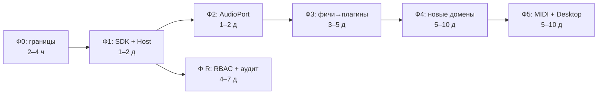

# План рефакторинга Jazz Trainer

> **Статус:** план работ. Производный от [ARCHITECTURE.md](./ARCHITECTURE.md) с привязкой к конкретным файлам и текущему состоянию кодовой базы.
>
> **Текущий снимок:**
> - Тестов: **329** (19 файлов) — все зелёные ✅
> - Пакетов: `music-core` (6 модулей), `shared` (5 модулей), `web` (React 19 + Vite), `api` (Fastify + Drizzle)
> - E2E: Playwright настроен, тесты отсутствуют (пустой конфиг)
> - ESLint: без boundary-правил, TS strict включён

---

## 1. Оценка текущего состояния (baseline)

| Компонент | Есть? | Покрытие тестами | Комментарий |
|---|---|---|---|
| `music-core` (чистая логика) | ✅ | 258 тестов (79%) | Фундамент почти готов к портам |
| `shared` (типы, DTO, Zod) | ✅ | 6 тестов | Нужны Zod-схемы для плагинов |
| App Shell (`apps/web`) | ✅ | 5 тестов | Роуты захардкожены в `App.tsx` |
| API (`apps/api`) | ✅ | 57 тестов | Без RBAC-middleware |
| `plugin-sdk` | ❌ | 0 | Не создан |
| `plugin-host` | ❌ | 0 | Не создан |
| `plugin-registry` | ❌ | 0 | Не создан |
| `plugins/*` | ❌ | 0 | Не созданы |
| `adapters/*` | ❌ | 0 | Не созданы |
| AudioPort / InputPort | ❌ | 0 | Логика есть в `music-core/audio`, но без порта |
| RBAC + audit log | ❌ | 0 | Не реализованы |
| Feature flags | ❌ | 0 | Не реализованы |
| ESLint boundaries | ❌ | 0 | Правила слоёв не закреплены |
| `_template` | ❌ | 0 | Нет эталонного плагина |

---

## 2. Фаза 0 — Закрепить границы

> **Цель:** архитектурные правила становятся принудительными. Риск минимальный, код не меняется.
>
> **Оценка:** 2–4 часа. 1 PR.

### Задачи

- [ ] **0.1** Установить `eslint-plugin-boundaries` и `eslint-plugin-import`
  ```bash
  npm i -D eslint-plugin-boundaries eslint-plugin-import
  ```

- [ ] **0.2** Создать `.eslintrc.boundaries.json` — конфиг зон по §8 ARCHITECTURE.md:
  ```jsonc
  {
    "rules": {
      "boundaries/element-types": ["error", {
        "default": "disallow",
        "rules": [
          { "from": "packages/music-core", "allow": ["packages/music-core", "packages/shared"] },
          { "from": "packages/shared", "allow": ["packages/shared"] },
          { "from": "packages/plugin-sdk", "allow": ["packages/plugin-sdk", "packages/music-core", "packages/shared"] },
          { "from": "packages/plugin-host", "allow": ["packages/plugin-host", "packages/plugin-sdk", "packages/music-core", "packages/shared"] },
          { "from": "packages/plugins/*", "allow": ["packages/plugin-sdk", "packages/music-core", "packages/shared"] },
          { "from": "packages/adapters/*", "allow": ["packages/plugin-sdk", "packages/music-core", "packages/shared"] },
          { "from": "apps/web", "allow": ["apps/web", "packages/plugin-host", "packages/plugin-sdk", "packages/music-core", "packages/shared"] },
          { "from": "apps/api", "allow": ["apps/api", "packages/music-core", "packages/shared"] }
        ]
      }]
    }
  }
  ```

- [ ] **0.3** Добавить `import/no-restricted-paths` в `eslint.config.js` — запрет браузерных API в `music-core` и `shared`:
  ```js
  'import/no-restricted-paths': ['error', {
    zones: [
      { target: './packages/music-core', from: './apps' },
      { target: './packages/shared', from: './apps' },
      { target: './packages/plugins', from: './apps/web/src/shell', message: 'Плагины не могут импортировать shell' },
    ]
  }]
  ```

- [ ] **0.4** Прогнать `npm run lint` — зафиксировать текущие нарушения как baseline (если есть), добавить в `.eslintignore` только существующие нарушения с TODO-комментариями.

- [ ] **0.5** Убедиться, что `strict: true` во всех `tsconfig.json`:
  - `tsconfig.base.json` — уже ✅
  - `packages/music-core/tsconfig.json`
  - `packages/shared/tsconfig.json`
  - `apps/web/tsconfig.json`
  - `apps/api/tsconfig.json`

### Критерий приёмки
- [x] `npm run lint` проходит без новых ошибок
- [x] `npm run typecheck` проходит
- [x] `npm run test` — 329 тестов зелёные

---

## 3. Фаза 1 — Выделить контракты и хост

> **Цель:** создать `plugin-sdk` и `plugin-host`. Хост обслуживает существующие фичи как встроенные псевдоплагины. Структура файлов не двигается, прод не тронут.
>
> **Оценка:** 1–2 дня. 2–3 PR.

### 3.1. Создать `@jazz/plugin-sdk`

- [ ] **1.1** Создать директорию и `package.json`:
  ```
  packages/plugin-sdk/
  ├── package.json
  ├── tsconfig.json
  └── src/
      ├── index.ts
      ├── manifest.schema.ts
      ├── extension-points.ts
      ├── context.ts
      ├── activity.ts
      └── definePlugin.ts
  ```

- [ ] **1.2** `manifest.schema.ts` — Zod-схема манифеста:
  ```ts
  import { z } from 'zod';

  export const manifestSchema = z.object({
    id: z.string().min(1),
    name: z.string().min(1),
    apiVersion: z.literal(1),
    category: z.enum(['theory', 'technique', 'play', 'assess', 'core', 'admin']),
    description: z.string(),
    enabled: z.boolean().default(true),
  });

  export type PluginManifest = z.infer<typeof manifestSchema>;
  ```

- [ ] **1.3** `extension-points.ts` — типы точек расширения:
  ```ts
  import type { ReactNode, ComponentType } from 'react';

  export interface RouteContribution {
    path: string;
    element: () => Promise<{ default: ComponentType }>; // lazy import
    requires?: string; // permission (для фазы R)
  }

  export interface NavItemContribution {
    section: string;
    label: string;
    to: string;
    icon?: string;
    requires?: string;
  }

  export interface CommandContribution {
    id: string;
    label: string;
    requires?: string;
    run: (ctx: any) => void | Promise<void>;
  }

  export interface ActivityContribution {
    id: string;
    type: 'lesson' | 'exercise' | 'assessment';
    // общий жизненный цикл: start → interact → evaluate → report
  }

  export interface PluginContributions {
    routes?: RouteContribution[];
    navItems?: NavItemContribution[];
    commands?: CommandContribution[];
    lessons?: ActivityContribution[];
    exercises?: ActivityContribution[];
    assessments?: ActivityContribution[];
    instruments?: any[];       // уточнить тип из music-core/audio
    generators?: any[];        // уточнить тип из music-core/generator
    theoryProviders?: any[];   // уточнить тип из music-core/chords
    settingsSchema?: Record<string, any>; // Zod schema
  }
  ```

- [ ] **1.4** `context.ts` — интерфейс PluginContext:
  ```ts
  export interface AudioService {
    // порт к звуку (будет заполнен в фазе 2)
  }

  export interface StorageService {
    get<T>(key: string): Promise<T | null>;
    set<T>(key: string, value: T): Promise<void>;
  }

  export interface SettingsService {
    get<T>(key: string): T;
    set<T>(key: string, value: T): void;
  }

  export interface NavigationService {
    push(path: string): void;
    replace(path: string): void;
  }

  export interface EventBus {
    on(event: string, handler: (...args: any[]) => void): () => void;
    emit(event: string, ...args: any[]): void;
  }

  export interface PluginContext {
    audio: AudioService;
    storage: StorageService;
    settings: SettingsService;
    navigation: NavigationService;
    events: EventBus;
    music: any; // MusicCore — импорт из @jazz/music-core
    query: any; // QueryClient — из @tanstack/react-query
  }
  ```

- [ ] **1.5** `activity.ts` — общая абстракция активности:
  ```ts
  export type ActivityType = 'lesson' | 'exercise' | 'assessment';

  export interface ActivityState<T = unknown> {
    status: 'idle' | 'active' | 'paused' | 'completed';
    data: T;
    result?: ActivityResult;
  }

  export interface ActivityResult {
    score?: number;
    maxScore?: number;
    durationMs?: number;
    details?: Record<string, unknown>;
  }

  export interface ActivityDefinition<T = unknown> {
    id: string;
    type: ActivityType;
    start: (ctx: any) => ActivityState<T>;
    evaluate: (state: ActivityState<T>, answer: unknown) => ActivityResult;
    report: (state: ActivityState<T>) => ActivityResult;
  }
  ```

- [ ] **1.6** `definePlugin.ts` — хелпер:
  ```ts
  import type { PluginManifest } from './manifest.schema';
  import type { PluginContributions } from './extension-points';
  import type { PluginContext } from './context';

  export interface PluginDefinition {
    manifest: PluginManifest;
    contributes: PluginContributions;
    setup?: (ctx: PluginContext) => void | Promise<void>;
    dispose?: () => void;
  }

  export function definePlugin(def: PluginDefinition): PluginDefinition {
    return def;
  }
  ```

- [ ] **1.7** `index.ts` — re-export всего SDK.

- [ ] **1.8** Написать тесты для `validatePlugin` (контрактный тест):
  - Валидный плагин проходит проверку
  - Плагин без `id` — ошибка
  - Плагин с дублирующимся `id` — ошибка
  - `apiVersion` не 1 — ошибка
  - `category` не из enum — ошибка

- [ ] **1.9** Добавить алиас в `tsconfig.base.json`:
  ```json
  "@jazz/plugin-sdk": ["packages/plugin-sdk/src/index.ts"],
  "@jazz/plugin-sdk/*": ["packages/plugin-sdk/src/*"]
  ```

### 3.2. Создать `@jazz/plugin-host`

- [ ] **1.10** Создать директорию и `package.json`:
  ```
  packages/plugin-host/
  ├── package.json
  ├── tsconfig.json
  └── src/
      ├── index.ts
      ├── loader.ts
      ├── aggregator.ts
      └── context-factory.ts
  ```

- [ ] **1.11** `loader.ts` — загрузка плагинов, валидация, вызов `setup`:
  ```ts
  import type { PluginDefinition } from '@jazz/plugin-sdk';
  import type { PluginContext } from '@jazz/plugin-sdk';

  export function loadPlugins(
    plugins: PluginDefinition[],
    ctx: PluginContext,
  ): { loaded: PluginDefinition[]; errors: string[] } {
    const seen = new Set<string>();
    const errors: string[] = [];
    const loaded: PluginDefinition[] = [];

    for (const plugin of plugins) {
      if (!plugin.manifest?.id) {
        errors.push('Plugin missing manifest.id');
        continue;
      }
      if (seen.has(plugin.manifest.id)) {
        errors.push(`Duplicate plugin id: ${plugin.manifest.id}`);
        continue;
      }
      seen.add(plugin.manifest.id);

      try {
        plugin.setup?.(ctx);
        loaded.push(plugin);
      } catch (e) {
        errors.push(`Plugin ${plugin.manifest.id} setup failed: ${e}`);
      }
    }

    return { loaded, errors };
  }
  ```

- [ ] **1.12** `aggregator.ts` — сбор вкладов в индексы:
  ```ts
  import type { PluginDefinition, RouteContribution, NavItemContribution } from '@jazz/plugin-sdk';

  export interface AggregatedContributions {
    routes: (RouteContribution & { pluginId: string })[];
    navItems: (NavItemContribution & { pluginId: string })[];
  }

  export function aggregateContributions(plugins: PluginDefinition[]): AggregatedContributions {
    const routes: AggregatedContributions['routes'] = [];
    const navItems: AggregatedContributions['navItems'] = [];

    for (const plugin of plugins) {
      const c = plugin.contributes;
      if (c.routes) {
        for (const r of c.routes) {
          routes.push({ ...r, pluginId: plugin.manifest.id });
        }
      }
      if (c.navItems) {
        for (const n of c.navItems) {
          navItems.push({ ...n, pluginId: plugin.manifest.id });
        }
      }
    }

    return { routes, navItems };
  }
  ```

- [ ] **1.13** `context-factory.ts` — создание PluginContext (пока заглушки):
  ```ts
  import type { PluginContext, AudioService, StorageService, SettingsService, NavigationService, EventBus } from '@jazz/plugin-sdk';

  export function createPluginContext(overrides?: Partial<PluginContext>): PluginContext {
    return {
      audio: overrides?.audio ?? ({} as AudioService),
      storage: overrides?.storage ?? ({} as StorageService),
      settings: overrides?.settings ?? ({} as SettingsService),
      navigation: overrides?.navigation ?? ({} as NavigationService),
      events: overrides?.events ?? ({} as EventBus),
      music: overrides?.music ?? {},
      query: overrides?.query ?? {},
    };
  }
  ```

- [ ] **1.14** Написать тесты host-интеграции:
  - `loadPlugins` загружает список плагинов без ошибок
  - Дублирующийся `id` вызывает ошибку
  - `setup` вызывается для каждого плагина
  - `aggregateContributions` правильно собирает routes и navItems
  - Плагин без routes не ломает агрегацию

- [ ] **1.15** Добавить алиасы в `tsconfig.base.json`:
  ```json
  "@jazz/plugin-host": ["packages/plugin-host/src/index.ts"],
  "@jazz/plugin-host/*": ["packages/plugin-host/src/*"]
  ```

### 3.3. Создать `@jazz/plugin-registry`

- [ ] **1.16** Создать директорию и пакет:
  ```
  packages/plugin-registry/
  ├── package.json
  ├── tsconfig.json
  └── src/
      └── index.ts
  ```

- [ ] **1.17** `index.ts` — пока пустой массив (заполнится в фазе 3):
  ```ts
  import type { PluginDefinition } from '@jazz/plugin-sdk';

  // Псевдоплагины для существующих фич (будут заменены в фазе 3)
  export const PLUGINS: PluginDefinition[] = [];
  ```

### 3.4. Интегрировать хост в App Shell (псевдоплагины)

- [ ] **1.18** В `apps/web/src/main.tsx` (или новом `apps/web/src/shell/bootstrap.ts`):
  ```ts
  import { PLUGINS } from '@jazz/plugin-registry';
  import { loadPlugins, aggregateContributions } from '@jazz/plugin-host';
  import { createPluginContext } from '@jazz/plugin-host';
  // ... существующий код
  ```

- [ ] **1.19** Адаптировать существующие роуты как inline-псевдоплагины (без переноса файлов):
  - Создать `apps/web/src/shell/builtin-plugins.ts`:
    ```ts
    import { definePlugin } from '@jazz/plugin-sdk';

    export const builtinCorePlugin = definePlugin({
      manifest: { id: 'builtin.core', name: 'Core', apiVersion: 1, category: 'core', description: 'Built-in core features' },
      contributes: {
        routes: [
          { path: '/', element: () => import('../routes/PublicDashboardPage') },
          { path: '/login', element: () => import('../routes/LoginPage') },
          { path: '/my', element: () => import('../routes/MyGridsPage') },
          { path: '/settings', element: () => import('../routes/SettingsPage') },
          { path: '/profile', element: () => import('../routes/ProfilePage') },
          { path: '/play', element: () => import('../routes/PlayerPage') },
          { path: '/play/:id', element: () => import('../routes/PlayerPage') },
          { path: '/grids/:id', element: () => import('../routes/EditorPage') },
        ],
        navItems: [
          { section: 'main', label: 'Dashboard', to: '/', icon: 'home' },
          { section: 'main', label: 'My Grids', to: '/my', icon: 'grid' },
        ],
      },
    });
    ```

- [ ] **1.20** `App.tsx` рендерит роуты из агрегированных вкладов вместо ручного перечисления (сохраняя `ProtectedRoute` для защищённых роутов).

> **Важно:** `App.tsx` пока может продолжать работать как есть, хост подключается **рядом**, не ломая существующее. Полный переход на динамические роуты из вкладов — фаза 3.

### Критерий приёмки фазы 1
- [x] `@jazz/plugin-sdk` собирается, экспортирует все типы
- [x] `@jazz/plugin-host` собирается, тесты проходят (≥8 новых тестов)
- [x] `@jazz/plugin-registry` существует
- [x] Приложение запускается без изменений в поведении
- [x] `npm run typecheck` проходит
- [x] `npm run test` — все существующие + новые тесты зелёные

---

## 4. Фаза 2 — Звуковой порт

> **Цель:** абстрагировать звук через `AudioPort`/`InputPort`. Текущий `useTransport` оборачивается в `tone-audio-adapter`. Поведение идентично.
>
> **Оценка:** 1–2 дня. 2 PR.

### 4.1. Поднять порты в `music-core`

- [ ] **2.1** `packages/music-core/src/audio/ports.ts` — интерфейсы портов:
  ```ts
  export interface ScheduledNote {
    time: number;       // время в секундах от начала
    note: string;       // "C4", "Eb4", и т.д.
    duration: number;   // секунд
    velocity: number;   // 0–1
    voice?: string;     // "bass", "rhodes", и т.д.
  }

  export interface ScheduledClick {
    time: number;
    accent: boolean;
    subdivision: number;
  }

  export interface AudioPort {
    /** Запланировать ноту на указанное время */
    scheduleNote(note: ScheduledNote): void;
    /** Запланировать клик метронома */
    scheduleClick(click: ScheduledClick): void;
    /** Начать воспроизведение */
    start(): void;
    /** Остановить и сбросить */
    stop(): void;
    /** Текущая позиция в секундах */
    readonly currentTime: number;
    /** Очистить все запланированные события */
    clear(): void;
  }

  export interface MidiInputEvent {
    note: string;
    velocity: number;
    timestamp: number;  // performance.now() в браузере
  }

  export interface InputPort {
    onNoteOn: (handler: (event: MidiInputEvent) => void) => () => void;
    onNoteOff: (handler: (event: MidiInputEvent) => void) => () => void;
    /** Список доступных MIDI-устройств ввода */
    devices: () => Promise<string[]>;
  }
  ```

- [ ] **2.2** `packages/music-core/src/audio/index.ts` — экспортировать `ports.ts`:
  ```ts
  export * from './ports';
  ```

### 4.2. tone-audio-adapter

- [ ] **2.3** Создать `packages/adapters/tone-audio-adapter/`:
  ```
  packages/adapters/tone-audio-adapter/
  ├── package.json
  ├── tsconfig.json
  └── src/
      ├── index.ts
      ├── ToneAudioAdapter.ts
      └── ToneAudioAdapter.test.ts
  ```

- [ ] **2.4** `ToneAudioAdapter.ts` — реализация `AudioPort` через Tone.js:
  - Импортирует `Tone.Transport`, `Tone.Synth`, `Tone.Sampler` и т.д.
  - `scheduleNote` → `Transport.schedule(...)`
  - `scheduleClick` → `Transport.schedule(...)` для метронома
  - `start`/`stop` → `Transport.start()`/`Transport.stop()`
  - `currentTime` → `Transport.seconds`
  - `clear` → `Transport.cancel()`

- [ ] **2.5** Перенести логику из `apps/web/src/engine/useTransport.ts` в адаптер:
  - Создание Tone.js-нодов
  - Связывание инструментов с реальным звуком
  - Громкость, режимы, включение/выключение
  - `useTransport` остаётся тонким React-хуком поверх адаптера

### 4.3. Контрактные тесты порта

- [ ] **2.6** `packages/music-core/src/audio/ports.test.ts`:
  ```ts
  // Общий набор тестов для ЛЮБОГО AudioPort
  export function testAudioPortContract(createPort: () => AudioPort) {
    it('starts and stops without error', () => { ... });
    it('currentTime advances after start', () => { ... });
    it('clear removes scheduled events', () => { ... });
    it('scheduleNote accepts valid note', () => { ... });
    it('scheduleClick accepts subdivision', () => { ... });
  }
  ```

- [ ] **2.7** Вызвать `testAudioPortContract` в тесте `ToneAudioAdapter`:
  ```ts
  import { testAudioPortContract } from '@jazz/music-core/audio/ports.test';
  import { ToneAudioAdapter } from './ToneAudioAdapter';

  describe('ToneAudioAdapter', () => {
    testAudioPortContract(() => new ToneAudioAdapter());
  });
  ```

- [ ] **2.8** Добавить алиас в `tsconfig.base.json`:
  ```json
  "@jazz/tone-audio-adapter": ["packages/adapters/tone-audio-adapter/src/index.ts"]
  ```

### Критерий приёмки фазы 2
- [x] `AudioPort` и `InputPort` определены в `music-core/audio`
- [x] `tone-audio-adapter` реализует `AudioPort`
- [x] Контрактные тесты проходят для `tone-audio-adapter`
- [x] Приложение играет звук идентично текущему поведению
- [x] `npm run test` — все тесты зелёные

---

## 5. Фаза 3 — Перенести существующие фичи в плагины

> **Цель:** `editor`, `player`, `catalog` становятся полноценными плагинами. Псевдоплагины из фазы 1 заменяются. Каждая фича — отдельный PR.
>
> **Оценка:** 3–5 дней. 3 PR (по одному на плагин).

### 5.1. `core-editor`

- [ ] **3.1** Создать `packages/plugins/core-editor/` со структурой:
  ```
  packages/plugins/core-editor/
  ├── package.json
  ├── tsconfig.json
  └── src/
      ├── index.ts            # definePlugin(...)
      ├── EditorPage.tsx       # перенос из apps/web/src/routes/EditorPage.tsx
      ├── components/          # перенос из apps/web/src/components/editor/
      ├── hooks/               # если есть
      └── __tests__/           # компонентные тесты
  ```

- [ ] **3.2** `index.ts`:
  ```ts
  import { definePlugin } from '@jazz/plugin-sdk';

  export default definePlugin({
    manifest: {
      id: 'core.editor',
      name: 'Grid Editor',
      apiVersion: 1,
      category: 'core',
      description: 'Harmony grid editor with DSL support.',
    },
    contributes: {
      routes: [
        { path: '/grids/:id', element: () => import('./EditorPage') },
      ],
      navItems: [
        { section: 'create', label: 'Editor', to: '/grids/new', icon: 'edit' },
      ],
    },
  });
  ```

- [ ] **3.3** Зарегистрировать в `packages/plugin-registry/src/index.ts`:
  ```ts
  import coreEditor from '@jazz/plugin-core-editor';
  export const PLUGINS = [coreEditor];
  ```

- [ ] **3.4** Удалить старый роут из `apps/web/src/routes/EditorPage.tsx` и псевдоплагин из `builtin-plugins.ts`.

- [ ] **3.5** Написать компонентный тест (RTL) для EditorPage:
  - DSL-ввод парсится и отображается
  - Грид рендерится по DSL

### 5.2. `core-player`

- [ ] **3.6** Аналогично 3.1–3.5:
  ```
  packages/plugins/core-player/
  ├── src/
  │   ├── index.ts
  │   ├── PlayerPage.tsx       # из apps/web/src/routes/PlayerPage.tsx
  │   ├── components/          # из apps/web/src/components/player/ (если есть)
  │   └── __tests__/
  ```

- [ ] **3.7** Зарегистрировать в реестре.

### 5.3. `catalog`

- [ ] **3.8** Аналогично для публичного каталога:
  ```
  packages/plugins/catalog/
  └── src/
      ├── index.ts
      ├── CatalogPage.tsx       # из apps/web/src/routes/PublicDashboardPage.tsx
      ├── components/           # из apps/web/src/components/catalog/
      └── __tests__/
  ```

### 5.4. Убрать псевдоплагины

- [ ] **3.9** Удалить `apps/web/src/shell/builtin-plugins.ts`.
- [ ] **3.10** `App.tsx` рендерит `<Route>` динамически из `aggregateContributions(PLUGINS).routes`.

### Критерий приёмки фазы 3
- [x] `core-editor`, `core-player`, `catalog` — три отдельных пакета-плагина
- [x] Роуты и навигация полностью определяются вкладами плагинов
- [x] Приложение функционально идентично дорефакторинговому
- [x] 329 базовых тестов + новые компонентные тесты зелёные
- [x] `npm run typecheck` проходит

---

## 6. Фаза R — RBAC, аудит и админка (параллельно с фазой 1)

> **Цель:** инфраструктура доступа и аудита. Идёт параллельно с фазой 1, завершается до фазы 4.
>
> **Оценка:** 4–7 дней. 4 подфазы.

### R1. Схема RBAC + middleware + audit log

- [ ] **R1.1** Новые таблицы Drizzle (`apps/api/src/db/schema/`):
  ```ts
  // roles.table.ts
  export const roles = sqliteTable('roles', {
    id: text('id').primaryKey(),
    name: text('name').notNull().unique(), // 'super_admin', 'admin', ...
    createdAt: integer('created_at', { mode: 'timestamp' }).notNull().default(sql`(unixepoch())`),
  });

  // permissions.table.ts
  export const permissions = sqliteTable('permissions', {
    id: text('id').primaryKey(),
    code: text('code').notNull().unique(), // 'users:read', 'content:write', ...
  });

  // role_permissions.table.ts
  export const rolePermissions = sqliteTable('role_permissions', {
    roleId: text('role_id').references(() => roles.id).notNull(),
    permissionCode: text('permission_code').references(() => permissions.code).notNull(),
  }, (t) => ({ pk: primaryKey(t.roleId, t.permissionCode) }));

  // user_permissions.table.ts (точечные grant/revoke)
  export const userPermissions = sqliteTable('user_permissions', {
    userId: text('user_id').references(() => users.id).notNull(),
    permissionCode: text('permission_code').references(() => permissions.code).notNull(),
    granted: integer('granted', { mode: 'boolean' }).notNull(), // true=grant, false=revoke
  }, (t) => ({ pk: primaryKey(t.userId, t.permissionCode) }));

  // audit_log.table.ts
  export const auditLog = sqliteTable('audit_log', {
    id: text('id').primaryKey(),
    actorUserId: text('actor_user_id').notNull(),
    action: text('action').notNull(),
    targetType: text('target_type').notNull(),
    targetId: text('target_id').notNull(),
    before: text('before'),      // JSON
    after: text('after'),        // JSON
    timestamp: integer('timestamp', { mode: 'timestamp' }).notNull().default(sql`(unixepoch())`),
    ip: text('ip'),
    userAgent: text('user_agent'),
    reason: text('reason'),
  });
  ```

- [ ] **R1.2** Добавить `role` и `status` в таблицу `users` (если ещё нет).

- [ ] **R1.3** RBAC-middleware (`apps/api/src/plugins/rbac.plugin.ts`):
  ```ts
  // Проверяет permission на каждом /api/admin/* запросе
  // Источник истины — сервер. Нет permission → 403.
  ```

- [ ] **R1.4** `withAudit` wrapper (`apps/api/src/services/audit.service.ts`):
  ```ts
  export async function withAudit<T>(
    action: string,
    targetType: string,
    targetId: string,
    opts: { before?: unknown; reason?: string },
    fn: () => Promise<T>,
  ): Promise<T> {
    const result = await fn();
    await db.insert(auditLog).values({
      id: nanoid(),
      actorUserId: currentUserId(),
      action,
      targetType,
      targetId,
      before: opts.before ? JSON.stringify(opts.before) : null,
      after: JSON.stringify(result),
      timestamp: new Date(),
      reason: opts.reason,
    });
    return result;
  }
  ```

- [ ] **R1.5** Seed permissions и ролей при миграции БД.

- [ ] **R1.6** Тесты RBAC-матрицы: параметризованный тест «роль × permission × endpoint» → `200` или `403`.

### R2. Фронтовые `usePermission` и `RbacGuard`

- [ ] **R2.1** `apps/web/src/hooks/usePermission.ts`:
  ```ts
  export function usePermission(permission: string): boolean {
    // читает permissions пользователя из сессии /api/me
  }
  ```

- [ ] **R2.2** `apps/web/src/components/layout/RbacGuard.tsx`:
  ```ts
  export function RbacGuard({ permission, children }: { permission: string; children: ReactNode }) {
    const has = usePermission(permission);
    if (!has) return null;
    return <>{children}</>;
  }
  ```

- [ ] **R2.3** Добавить `requires` в контракт `RouteContribution` и `NavItemContribution` (уже в 1.3).

### R3. Admin-плагины

- [ ] **R3.1** Создать плагины:
  ```
  packages/plugins/admin-users/
  packages/plugins/admin-content/
  packages/plugins/admin-flags/
  packages/plugins/admin-assets/
  packages/plugins/admin-diagnostics/
  ```

- [ ] **R3.2** Каждый — стандартный плагин с `requires` в роутах:
  ```ts
  routes: [{ path: '/admin/users', element: () => import('./UsersPage'), requires: 'users:read' }]
  ```

### R4. Feature flags (свой движок)

- [ ] **R4.1** Таблица `feature_flags`:
  ```ts
  export const featureFlags = sqliteTable('feature_flags', {
    key: text('key').primaryKey(),
    enabled: integer('enabled', { mode: 'boolean' }).notNull().default(false),
    roles: text('roles'),       // JSON array
    userIds: text('user_ids'),  // JSON array
    createdAt: integer('created_at', { mode: 'timestamp' }).notNull(),
  });
  ```

- [ ] **R4.2** `apps/web/src/hooks/useFlag.ts`:
  ```ts
  export function useFlag(key: string): boolean {
    // резолвит: enabled && (roleMatch || userMatch)
  }
  ```

- [ ] **R4.3** Серверный эндпоинт `/api/me` возвращает карту флагов для пользователя.

### Критерий приёмки фазы R
- [x] RBAC-middleware блокирует недоступные эндпоинты (403)
- [x] Матричный тест «роль × permission» проходит
- [x] Audit log пишется атомарно с мутацией (одна транзакция)
- [x] Audit log неизменяем (нет UPDATE/DELETE на уровне сервиса)
- [x] `usePermission` и `RbacGuard` работают на фронте
- [x] Feature flag резолвится по роли и userId
- [x] Админ-плагины видны только при наличии permissions

---

## 7. Фаза 4 — Новые домены как плагины

> **Цель:** рост функциональности при линейной стоимости разработки. Каждый плагин изолирован.
>
> **Оценка:** 5–10 дней (зависит от контента). N PR (по одному на плагин).

### 7.1. Создать `_template`

- [ ] **4.1** `packages/plugins/_template/` — эталонный плагин:
  ```
  packages/plugins/_template/
  ├── package.json
  ├── tsconfig.json
  └── src/
      ├── index.ts
      ├── TemplatePage.tsx
      ├── components/
      ├── hooks/
      └── __tests__/
      │   ├── plugin-contract.test.ts  # контрактный тест
      │   └── TemplatePage.test.tsx    # компонентный тест
  ```

- [ ] **4.2** Шаблон содержит ВСЕ возможные вклады (routes, navItems, lessons и т.д.) в закомментированном виде — служит документацией.

### 7.2. Плагины доменов обучения

- [ ] **4.3** `theory-scales` — справочник гамм с интерактивной визуализацией
- [ ] **4.4** `theory-chords` — справочник аккордов
- [ ] **4.5** `theory-intervals` — справочник интервалов
- [ ] **4.6** `ear-training` — тренировка слуха
- [ ] **4.7** `rhythm-drills` — ритмические упражнения
- [ ] **4.8** `chord-quiz` — квиз по аккордам
- [ ] **4.9** `progression-recognition` — распознавание прогрессий

Каждый создаётся копированием `_template`, заменой контента и регистрацией в реестре.

### Критерий приёмки фазы 4
- [x] `_template` существует и проходит все контрактные тесты
- [x] ≥2 плагина новых доменов работают
- [x] Каждый новый плагин = 1 строка в реестре, без правок ядра

---

## 8. Фаза 5 — MIDI и Desktop

> **Цель:** MIDI-ввод и вывод на одном ядре.
>
> **Оценка:** 3–7 дней. 2 PR.

### 8.1. webmidi-adapter

- [ ] **5.1** `packages/adapters/webmidi-adapter/`:
  - Реализация `AudioPort` через Web MIDI API (MIDI out)
  - Реализация `InputPort` (MIDI in от клавиатуры)
  - Проходит те же контрактные тесты, что и `tone-audio-adapter`

### 8.2. Упражнения с MIDI-вводом

- [ ] **5.2** Дополнить `ear-training` и `rhythm-drills` поддержкой `InputPort`:
  - Проверка попадания в ноту/ритм при живом вводе
  - Оценка через `ActivityDefinition.evaluate`

### Критерий приёмки фазы 5
- [x] `webmidi-adapter` проходит контрактные тесты `AudioPort`
- [x] MIDI-клавиатура распознаётся и используется в упражнениях

---

## 9. Сводная дорожная карта



| Фаза | Название | Оценка | PR | Риск | Статус |
|---|---|---|---|---|---|
| 0 | Закрепить границы | 2–4 ч | 1 | Минимальный | ⬜ |
| 1 | SDK + Host | 1–2 д | 2–3 | Низкий | ⬜ |
| R | RBAC + аудит + админка | 4–7 д | 4 | Средний | ⬜ |
| 2 | AudioPort | 1–2 д | 2 | Низкий | ⬜ |
| 3 | Фичи → плагины | 3–5 д | 3 | Средний | ⬜ |
| 4 | Новые домены | 5–10 д | N | Низкий (изолирован) | ⬜ |
| 5 | MIDI + Desktop | 5–10 д | 3 | Высокий | ⬜ |

**Суммарная оценка:** ~20–40 рабочих дней (4–8 недель одним разработчиком, 2–4 недели двумя).

---

## 10. Реестр рисков

| Риск | Вероятность | Влияние | Митигация |
|---|---|---|---|
| Поломка звука при переносе в адаптер (Ф2) | Средняя | Высокое | Контрактные тесты порта до переноса; A/B-сравнение записей звука |
| Регрессии навигации при переходе на динамические роуты (Ф3) | Средняя | Высокое | Псевдоплагины в Ф1 сохраняют старые роуты; E2E-смоук до и после |
| Latency MIDI-ввода для упражнений на технику (Ф5) | Высокая | Среднее | Измерить latency до реализации; установить приемлемый порог (≤10ms) |
| Рост времени сборки при 20+ плагинах | Средняя | Среднее | Lazy-роуты (`import()`); мониторинг `tsc --noEmit --diagnostics`; при необходимости — project references |
| Миграция существующих пользователей на RBAC | Средняя | Высокое | Seed-скрипт: существующие → роль `admin`; документировать процедуру |
| ESLint boundaries ломают CI на легаси-импортах | Высокая (Ф0) | Низкое | Baseline существующих нарушений; исправлять инкрементально |

---

## 11. Метрики прогресса

| Метрика | Сейчас | Цель (после всех фаз) |
|---|---|---|
| Тестов (всего) | 329 | ≥500 |
| Контрактных тестов | 0 | ≥3 наборов (plugin, audioPort, activity) |
| E2E-сценариев | 0 | 4–6 |
| Пакетов-плагинов | 0 | ≥12 (3 core + 6 learning + 3 admin) |
| Пакетов-адаптеров | 0 | 2 (tone, webmidi) |
| ESLint boundary rules | 0 | 8 зон |
| RBAC permissions | 0 | 14+ |
| Time-to-new-feature | ручное редактирование App.tsx | +1 строка в реестре |

---

> **Как читать этот план:**
> - Каждая фаза — самодостаточна, может мержиться отдельно.
> - Фазы 0 и 1 — обязательный фундамент для всего остального.
> - Фаза R начинается параллельно с фазой 1.
> - Фазы 4 и 5 опциональны — зависят от продуктовых приоритетов.
> - Каждый чекбокс — конкретная задача с конкретным файлом. При работе над фазой чекбоксы должны становиться `[x]`.
>
> *План синхронизирован с ARCHITECTURE.md (v1) и актуальным состоянием кода на 2026-06-11.*
