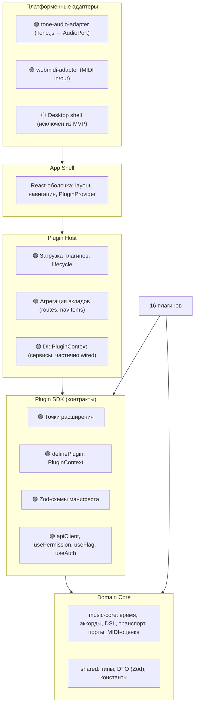
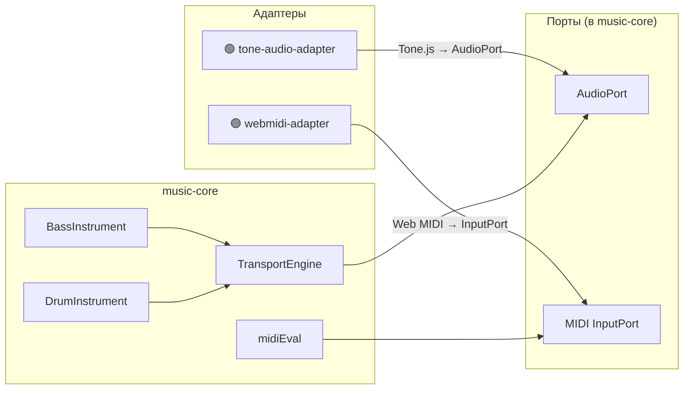
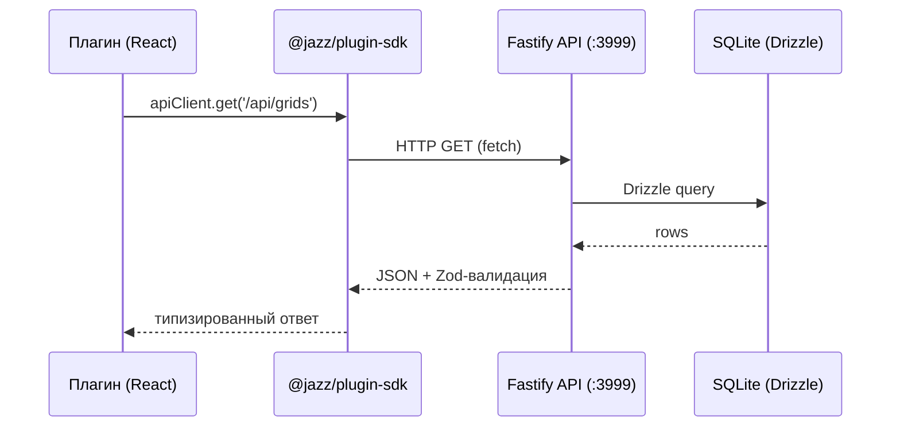

# Архитектура Jazz Trainer — текущее состояние

> **Назначение:** Описание текущей архитектуры — то, что реализовано и работает сейчас.
> **Аудитория:** Разработчики (`software-engineer`), технические писатели (`tech-writer`), AI-агенты.
> **Целевое видение:** См. `docs/ARCHITECTURE_VISION.md` (готовит `software-architect`).
> **Технический долг:** См. `docs/TECH_DEPT.md` (готовит `software-architect`).
>
> Статусы: 🟢 = реализовано, 🟡 = частично, 🔴 = запланировано, ⚪ = исключено.

---

## 1. Принципы

1. **Тонкое ядро, толстые плагины.** Приложение — оболочка (shell) + plugin-host. Вся фичевая логика — в плагинах. Ядро знает только контракты.
2. **Зависимости сверху вниз.** Ядро не знает о плагинах. Плагины не знают друг о друге. Платформенные детали — на краю, за портами.
3. **Контракт важнее реализации.** Граница хост↔плагин — типизированный контракт в `@jazz/plugin-sdk`. Меняем реализацию свободно, контракт — осознанно.
4. **Детерминированное ядро.** Музыкальная логика (`music-core`) — чистая, без браузерных API и IO. Переносима между платформами, дёшева в тестировании.
5. **Co-location.** Всё, что относится к одной фиче — в одной папке: UI, логика, контент, тесты.
6. **Без дублирования по горизонтали.** Общая работа (парсинг аккордов, транспорт, теория) — в ядре, предоставляется плагинам через сервисы хоста.

---

## 2. Слои



**Правило слоёв (принудительно, ESLint `boundaries`):**

| Слой                            | Может импортировать         | Не может                                  |
| ------------------------------- | --------------------------- | ----------------------------------------- |
| `core` (`music-core`, `shared`) | друг друга, stdlib          | shell, host, sdk, плагины, браузерные API |
| `plugin-sdk`                    | `core`                      | shell, host, плагины, адаптеры            |
| `plugin-host`                   | `sdk`, `core`               | конкретные плагины, адаптеры напрямую     |
| `plugins/*`                     | `sdk`, `core`, `ui`         | другие плагины, shell, host напрямую      |
| `adapters/*`                    | `sdk`, `core`               | плагины                                   |
| `apps/web`                      | host, sdk, core, shared, ui | внутренности плагинов                     |
| `apps/api`                      | core, shared                | sdk, host, плагины, shell                 |

---

## 3. Плагинная модель (build-time)

### 3.1. Плагин

Плагин = пакет в `packages/plugins/<name>/`, экспортирующий объект через `definePlugin()`:

```ts
export default definePlugin({
  manifest: {
    id: 'theory.scales', // уникальный ID
    name: 'Scales', // читаемое имя
    apiVersion: 1, // версия API
    category: 'theory', // core|admin|theory|practice|assess
    description: '...', // описание
  },
  contributes: {
    routes: [{ path: '/scales', element: () => import('./ScalesPage') }],
    navItems: [{ section: 'learn', label: 'Scales', to: '/scales', icon: 'music' }],
  },
});
```

### 3.2. Точки расширения

| Точка                                            | Назначение                                         | Статус                        |
| ------------------------------------------------ | -------------------------------------------------- | ----------------------------- |
| `routes`                                         | Страницы плагина (lazy import)                     | 🟢 16 плагинов                |
| `navItems`                                       | Пункты меню (main, create, learn, practice, admin) | 🟢                            |
| `commands`                                       | Именованные действия (палитра, хоткеи)             | 🔴 Типы есть, не используется |
| `lessons` / `exercises` / `assessments`          | Учебные активности                                 | 🔴 Типы есть, не используется |
| `instruments` / `generators` / `theoryProviders` | Звуковые движки, генераторы, теория                | 🔴 Тип `unknown[]`            |
| `settingsSchema`                                 | Декларация настроек плагина                        | 🟡 Тип есть, не используется  |

### 3.3. Категории и плагины (16 шт.)

| Категория  | Плагины                                                                            |
| ---------- | ---------------------------------------------------------------------------------- |
| `core`     | `core-editor` (грид-редактор), `core-player` (плеер), `catalog` (каталог)          |
| `theory`   | `theory-scales`, `theory-chords`, `theory-intervals`                               |
| `practice` | `ear-training` (MIDI, слух), `rhythm-drills` (MIDI, ритм)                          |
| `assess`   | `chord-quiz`, `progression-recognition`                                            |
| `admin`    | `admin-users`, `admin-content`, `admin-flags`, `admin-assets`, `admin-diagnostics` |

### 3.4. Реестр и загрузка

```ts
// packages/plugin-registry/src/index.ts — build-time реестр
import coreEditor from '@jazz/plugin-core-editor';
// ... 15 импортов

export const PLUGINS = [coreEditor, corePlayer, catalog, ...];

// apps/web/src/shell/bootstrap.ts — загрузка в shell
const { loaded, errors } = loadPlugins(allPlugins, createPluginContext());
export const contributions = aggregateContributions(loaded);
```

### 3.5. PluginContext

```ts
interface PluginContext {
  audio: AudioService; // 🟡 заглушка
  storage: StorageService; // 🟡 заглушка
  settings: SettingsService; // 🟡 заглушка
  navigation: NavigationService; // 🟡 заглушка
  events: EventBus; // 🟡 заглушка
  music: unknown; // 🔴 не типизирован
  query: unknown; // 🔴 не типизирован
}
```

### 3.6. ActivityRunner (жизненный цикл активностей)

Типы определены (`activity.ts`): `ActivityType`, `ActivityState`, `ActivityDefinition`. Сама машина состояний в хосте — 🔴 не реализована.

---

## 4. Звук и MIDI: порты и адаптеры



**Адаптеры:**

- `tone-audio-adapter` — оборачивает Tone.js в `AudioPort`, изолирует браузерное API от ядра.
- `webmidi-adapter` — предоставляет MIDI-ввод (оценка игры) и MIDI-вывод.

---

## 5. API-слой (фронт ↔ бэк)

**Контракт:** Zod-DTO в `@jazz/shared` — единый источник правды.



**Аутентификация:** Google OAuth. Dev-login fallback (`AUTH_DEV_MODE=true`) для разработки.

---

## 6. RBAC и аудит

### 6.1. Модель доступа

**Сервер — источник истины.** Фронт — UX (скрытие/показ UI).

```
Роль → permissions (n:n)
```

| Роль          | Permissions                                                                        |
| ------------- | ---------------------------------------------------------------------------------- |
| `super_admin` | Все 11 permissions                                                                 |
| `admin`       | `users:read`, `content:*`, `flags:*`, `assets:*`, `diagnostics:read`, `audit:read` |
| `user`        | `users:read` (свой профиль), `content:read`                                        |

**Permissions (11 шт.):** `users:read`, `users:write`, `content:read`, `content:write`, `flags:read`, `flags:write`, `assets:read`, `assets:write`, `diagnostics:read`, `audit:read`, `admin`.

**Механизм:** Middleware `rbac.plugin.ts` → `RbacGuard` проверяет permission на каждом защищённом маршруте.

### 6.2. Feature flags

Собственный движок в БД (таблица `feature_flags`). Резолюция через `resolveFlags()` на сервере, фронт через `useFlag()`.

### 6.3. Audit log

Append-only таблица `audit_log`. Все мутации — через `withAudit()`: `actor_id`, `action`, `entity_type`, `entity_id`, `old_values`, `new_values`.

---

## 7. Стратегия тестирования

| Уровень        | Что                                   | Инструмент | Статус          |
| -------------- | ------------------------------------- | ---------- | --------------- |
| Unit           | Чистое ядро (`music-core`, `shared`)  | Vitest     | 🟢              |
| Контрактные    | SDK-схемы (`manifest.schema.test.ts`) | Vitest     | 🟢              |
| Интеграционные | Адаптеры, API-эндпоинты               | Vitest     | 🟡 Частично     |
| E2E            | Критические пользовательские сценарии | Playwright | 🔴 Не настроены |

**Принцип:** Тесты лежат рядом с кодом (`src/__tests__/` или `src/*.test.ts`).

---

## 8. Структура директорий

```
jazz-trainer/
├── apps/
│   ├── web/                    # React + Vite (оболочка)
│   └── api/                    # Fastify + SQLite + Drizzle
├── packages/
│   ├── music-core/             # Чистая музыкальная логика
│   │   ├── audio/              # TransportEngine, инструменты, AudioPort
│   │   ├── chords/             # parseChord
│   │   ├── dsl/                # parseGrid
│   │   ├── time/               # Время, длительности
│   │   ├── playback/           # Машина состояний воспроизведения
│   │   └── generator/          # Генераторы прогрессий
│   ├── shared/                 # DTO (Zod), константы, общие типы
│   ├── plugin-sdk/             # Контракты: extension points, хуки, apiClient
│   ├── plugin-host/            # Загрузка плагинов, агрегация вкладов
│   ├── plugin-registry/        # Build-time реестр всех плагинов
│   ├── plugins/                # 16 плагинов (вся фичевая логика)
│   │   ├── _template/          # Эталон для копирования
│   │   ├── core-editor/
│   │   ├── core-player/
│   │   ├── catalog/
│   │   ├── theory-scales/
│   │   ├── theory-chords/
│   │   ├── theory-intervals/
│   │   ├── ear-training/
│   │   ├── rhythm-drills/
│   │   ├── chord-quiz/
│   │   ├── progression-recognition/
│   │   ├── admin-users/
│   │   ├── admin-content/
│   │   ├── admin-flags/
│   │   ├── admin-assets/
│   │   └── admin-diagnostics/
│   ├── adapters/               # Платформенные адаптеры
│   │   ├── tone-audio-adapter/
│   │   └── webmidi-adapter/
│   └── ui/                     # Общие UI-компоненты
├── docs/                       # Документация
│   ├── ARCHITECTURE_BASE.md    # Этот документ (текущая архитектура + ADR)
│   ├── ARCHITECTURE_VISION.md  # Целевое видение (агент architect)
│   ├── FUNCTIONS.md            # Каталог возможностей
│   ├── TECH_DEPT.md            # План улучшения кодовой базы (агент architect)
│   ├── DRUMS.md                # Спецификация барабанов
│   └── RHODES.md               # Спецификация Rhodes
├── CLAUDE.md                   # Навигатор для AI-агентов
└── README.md                   # Первое знакомство с проектом
```

---

## 9. Архитектурные решения (ADR)

### ADR-001: Build-time плагины (не runtime)

**Дата:** 2026-06
**Статус:** 🟢 Принято
**Контекст:** Нужен механизм расширения приложения без изменения ядра.
**Решение:** Плагины подключаются на этапе сборки через статический реестр (`plugin-registry`). Никакой динамической загрузки кода в рантайме.
**Альтернативы:** Динамическая загрузка (импорт по URL/строке). Отклонено — не нужно, т.к. плагины first-party.
**Последствия:** Простая модель загрузки, tree-shaking через Vite, никакой песочницы. Добавление плагина = изменение реестра + пересборка.

### ADR-002: First-party плагины

**Дата:** 2026-06
**Статус:** 🟢 Принято
**Контекст:** Кто пишет плагины?
**Решение:** Только команда проекта (first-party). Сторонние разработчики не поддерживаются.
**Альтернативы:** Публичный SDK с версионированием, песочница, маркетплейс. Отклонено — избыточно для учебного тренажёра.
**Последствия:** Можно менять контракт SDK без обратной совместимости. Не нужна изоляция кода. Проще архитектура.

### ADR-003: Монорепо

**Дата:** 2026-06
**Статус:** 🟢 Принято
**Контекст:** Несколько пакетов с разной скоростью изменений.
**Решение:** Единое монорепо (npm workspaces). Все пакеты в одном репозитории.
**Альтернативы:** Отдельные репозитории (polyrepo). Отклонено — overhead синхронизации версий, сложнее рефакторинг.
**Последствия:** Быстрый рефакторинг через границы пакетов. CI не настроен (path-фильтры для независимого деплоя — 🔴).

### ADR-004: Типизированный SDK + Zod-манифест

**Дата:** 2026-06
**Статус:** 🟢 Принято
**Контекст:** Как описать контракт хост↔плагин?
**Решение:** TypeScript-интерфейсы + Zod-валидация манифеста. `definePlugin()` гарантирует типобезопасность.
**Альтернативы:** JSON Schema, runtime-проверки без типов, соглашения без проверок. Отклонено.
**Последствия:** Ошибки контракта видны на этапе сборки. Zod даёт runtime-валидацию + статические типы из одной схемы.

### ADR-005: Порты + адаптеры для звука/MIDI

**Дата:** 2026-06
**Статус:** 🟢 Принято (адаптеры готовы, wiring частичный)
**Контекст:** Ядро должно быть чистым (без браузерных API), но нужен звук и MIDI.
**Решение:** Порт (`AudioPort`, `InputPort`) — интерфейс в `music-core`. Адаптер (`tone-audio-adapter`, `webmidi-adapter`) — реализация с конкретным браузерным API.
**Альтернативы:** Прямое использование Tone.js в плагинах. Отклонено — нарушает чистоту ядра и переносимость.
**Последствия:** Ядро тестируется без браузера. Платформенные адаптеры заменяемы. Добавлена абстракция, но она изолирована на краю.

### ADR-006: RBAC: роль → permissions

**Дата:** 2026-06
**Статус:** 🟢 Принято
**Контекст:** Нужна модель доступа для админки.
**Решение:** RBAC: пользователь имеет одну роль, роль содержит набор permissions (n:n связь). Сервер — источник истины, enforce на middleware. Фронт — UX (скрытие/показ UI через `usePermission`).
**Альтернативы:** ACL (на пользователя), ABAC (на атрибуты), только серверный enforce. Отклонено — RBAC проще для нашего масштаба.
**Последствия:** 3 роли, 11 permissions. Легко расширять (добавить permission → добавить роли → seed).

### ADR-007: Audit log (append-only)

**Дата:** 2026-06
**Статус:** 🟢 Принято
**Контекст:** Нужен след всех мутаций.
**Решение:** Append-only таблица `audit_log`. Запись через `withAudit()` с `actor_id`, `action`, `entity_type`, `old_values`, `new_values`. Неизменяемый лог.
**Альтернативы:** Изменяемый лог, event sourcing. Отклонено — append-only проще и надёжнее.
**Последствия:** Полный след действий. Нельзя удалить запись (только дописать).

### ADR-008: Feature flags (свой движок в БД)

**Дата:** 2026-06
**Статус:** 🟢 Принято
**Контекст:** Нужен механизм включения/выключения фич без деплоя.
**Решение:** Собственный движок: таблица `feature_flags`, резолюция через `resolveFlags()`, фронт через `useFlag()`. Build-time vs runtime флаги — разные механизмы.
**Альтернативы:** LaunchDarkly, GrowthBook, env-переменные. Отклонено — внешний сервис избыточен, env-переменные требуют перезапуска.
**Последствия:** Полный контроль над флагами через админку. Нет зависимостей от внешних сервисов.

### ADR-009: ESLint boundaries (границы как код)

**Дата:** 2026-06
**Статус:** 🟢 Принято
**Контекст:** Как предотвратить нарушение границ слоёв?
**Решение:** `eslint-plugin-boundaries` с правилом `default: disallow`. Разрешены только явно указанные импорты между слоями.
**Альтернативы:** Code review, соглашения, dependency-cruiser. Отклонено — линтер ловит нарушения автоматически на pre-commit.
**Последствия:** 0 нарушений границ. Любое нарушение = ошибка линтера.

### ADR-010: REST + Zod-DTO контракт

**Дата:** 2026-06
**Статус:** 🟢 Принято
**Контекст:** Как описать контракт API?
**Решение:** REST поверх Fastify. Контракт — Zod-DTO в `@jazz/shared`. Один источник правды для фронта и бэка.
**Альтернативы:** GraphQL, tRPC, OpenAPI отдельно. Отклонено — REST проще для нашей модели данных, Zod-DTO даёт валидацию + типы.
**Последствия:** Типобезопасность от БД до фронта. Изменение DTO автоматически подсвечивает все места использования.

### ADR-011: Админка как плагины в apps/web

**Дата:** 2026-06
**Статус:** 🟢 Принято
**Контекст:** Где разместить админку?
**Решение:** Административные функции — как плагины в том же `apps/web`. 5 плагинов: `admin-users`, `admin-content`, `admin-flags`, `admin-assets`, `admin-diagnostics`.
**Альтернативы:** Отдельное приложение (admin panel SPA), отдельный пакет. Отклонено — переиспользование shell, навигации, SDK.
**Последствия:** Админка разделяет ту же оболочку и навигацию. Доступ контролируется через `requires: 'permission'` в маршрутах и `usePermission` в UI.

### ADR-012: ActivityRunner (типы определены, не реализован)

**Дата:** 2026-06
**Статус:** 🟡 Предложено
**Контекст:** Нужна унификация учебных активностей (урок, упражнение, квиз).
**Решение:** `ActivityRunner` — машина состояний в хосте. Типы: `ActivityType`, `ActivityState<T>`, `ActivityDefinition<T>`. Статусы: idle → active → paused → completed.
**Альтернативы:** Каждый плагин сам управляет состоянием. Текущий подход (де-факто).
**Последствия:** (Если реализовать) Единое управление активностями, возобновление, общий прогресс.

### ADR-013: Desktop исключён из MVP

**Дата:** 2026-06
**Статус:** ⚪ Исключено из скоупа Ф5
**Контекст:** Нужен ли десктоп (Electron/Tauri)?
**Решение:** Исключить из MVP. Контр-условие на будущее: если веб-версия достигает лимитов (latency, MIDI-доступ), возвращаемся.
**Альтернативы:** Electron с самого начала. Отклонено — удваивает сложность, веб покрывает потребности.
**Последствия:** Нет Desktop-оболочки. Адаптеры готовы к добавлению десктопа в будущем.

---

## 10. Фазы миграции — статус

| Фаза                | Статус | Ключевой результат                                                                   |
| ------------------- | ------ | ------------------------------------------------------------------------------------ |
| Ф0 — Границы        | ✅     | ESLint boundaries + strict, 0 нарушений                                              |
| Ф1 — SDK + Host     | ✅     | `plugin-sdk`, `plugin-host`, `plugin-registry`, shell bootstrap                      |
| ФR — RBAC + аудит   | ✅     | 3 роли, 11 permissions, audit log, `usePermission`/`useFlag`                         |
| Ф2 — AudioPort      | 🟢     | `tone-audio-adapter` + `webmidi-adapter` готовы. Wiring в shell — частично           |
| Ф3 — Фичи → плагины | ✅     | `core-editor`, `core-player`, `catalog` вынесены                                     |
| Ф4 — Новые домены   | 🟡     | 10 domain-плагинов созданы. Наполнение контентом — в процессе                        |
| Ф5 — MIDI           | 🟡     | `webmidi-adapter` (354 строки, 72 теста), `midiEval`, MIDI-плагины. Desktop исключён |

---

_Документ описывает текущую архитектуру. Обновлён 2026-06-13. Фазы 0, 1, R, 3 готовы ✅, Фазы 2, 4, 5 частично 🟡. Целевое видение — в `ARCHITECTURE_VISION.md`._
