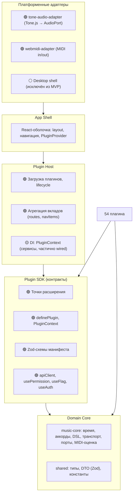
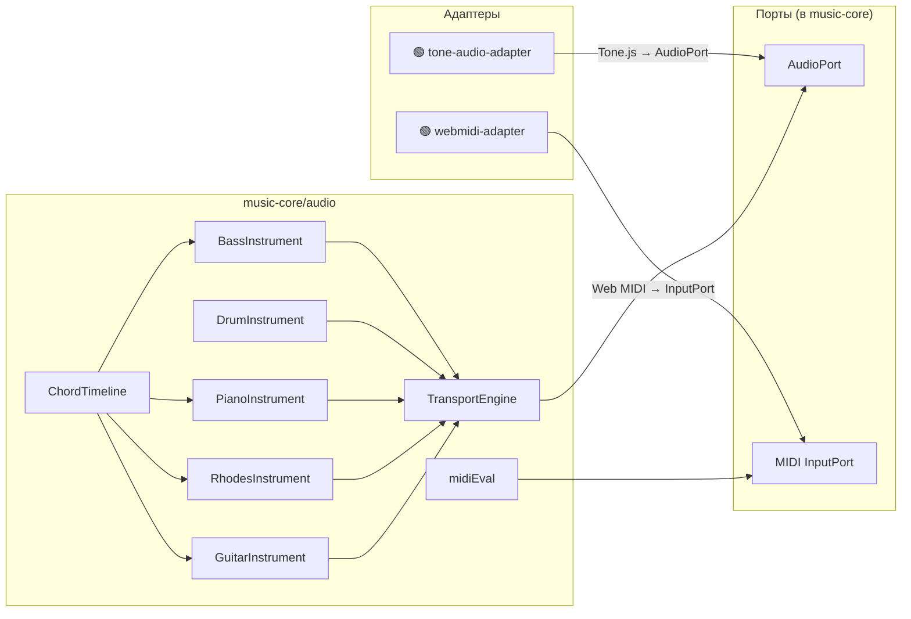
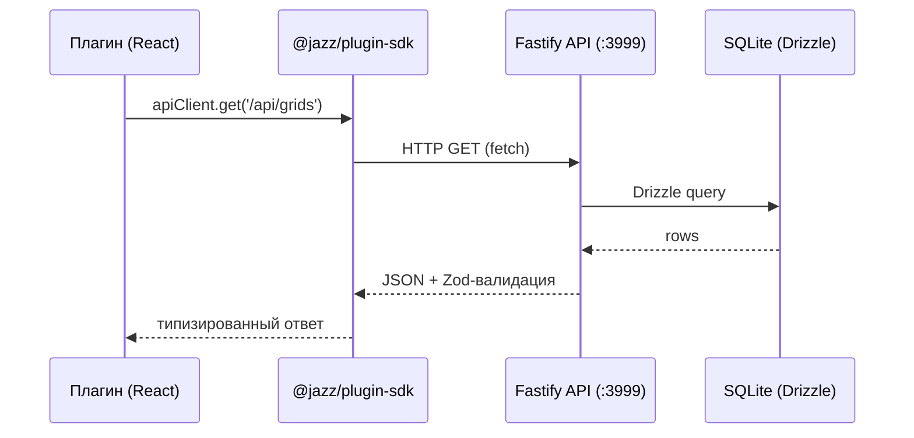

# Архитектура Amazilia — текущее состояние

> **Назначение:** Описание текущей архитектуры — то, что реализовано и работает сейчас.
> **Аудитория:** Разработчики (`software-engineer`), технические писатели (`tech-writer`), AI-агенты.
> **Целевое видение:** См. `docs/ARCHITECTURE_VISION.md` (готовит `software-architect`).
> **Технический долг:** См. `docs/ARCHIVE/TECH_DEPT.md` (готовит `software-architect`).
>
> Статусы: 🟢 = реализовано, 🟡 = частично, 🔴 = запланировано, ⚪ = исключено.

---

## 1. Принципы

1. **Тонкое ядро, толстые плагины.** Приложение — оболочка (shell) + plugin-host. Вся фичевая логика — в плагинах. Ядро знает только контракты.
2. **Зависимости сверху вниз.** Ядро не знает о плагинах. Плагины не знают друг о друге. Платформенные детали — на краю, за портами.
3. **Контракт важнее реализации.** Граница хост↔плагин — типизированный контракт в `@jazz/plugin-sdk`. Меняем реализацию свободно, контракт — осознанно.
4. **Детерминированное ядро.** Музыкальная логика (`music-core`) — чистая, без браузерных API и IO. Переносима между платформами, дёшева в тестировании.
5. **Co-location.** Всё, что относится к одной фиче — в одной папке: UI, логика, контент, тесты.
6. **Без дублирования по горизонтали.** Общая работа (парсинг аккордов, транспорт, теория) — в ядре, предоставляется плагинам через сервисы хоста.

---

## 2. Слои


```mermaid
graph TD
    subgraph edge["Платформенные адаптеры"]
        A1["🟢 tone-audio-adapter (Tone.js → AudioPort)"]
        A2["🟢 webmidi-adapter (MIDI in/out)"]
        A3["⚪ Desktop shell (исключён из MVP)"]
    end

    subgraph shell["App Shell"]
        S1["React-оболочка: layout, навигация, PluginProvider"]
    end

    subgraph host["Plugin Host"]
        H1["🟢 Загрузка плагинов, lifecycle"]
        H2["🟢 Агрегация вкладов (routes, navItems)"]
        H3["🟡 DI: PluginContext (сервисы, частично wired)"]
    end

    subgraph sdk["Plugin SDK (контракты)"]
        K1["🟢 Точки расширения"]
        K2["🟢 definePlugin, PluginContext"]
        K3["🟢 Zod-схемы манифеста"]
        K4["🟢 apiClient, usePermission, useFlag, useAuth"]
    end

    subgraph core["Domain Core"]
        C1["music-core: время, аккорды, DSL, транспорт, порты, MIDI-оценка"]
        C2["shared: типы, DTO (Zod), константы"]
    end

    edge --> shell
    shell --> host
    host --> sdk
    sdk --> core
    plugins["54 плагина"] --> sdk
    plugins --> core
```

**Правило слоёв (принудительно, ESLint `boundaries`):**

| Слой                            | Может импортировать         | Не может                                  |
| ------------------------------- | --------------------------- | ----------------------------------------- |
| `core` (`music-core`, `shared`) | друг друга, stdlib          | shell, host, sdk, плагины, браузерные API |
| `plugin-sdk`                    | `core`                      | shell, host, плагины, адаптеры            |
| `plugin-host`                   | `sdk`, `core`               | конкретные плагины, адаптеры напрямую     |
| `plugins/*`                     | `sdk`, `core`, `ui`         | другие плагины, shell, host напрямую      |
| `adapters/*`                    | `sdk`, `core`               | плагины                                   |
| `apps/web`                      | host, sdk, core, shared, ui | внутренности плагинов                     |
| `apps/api`                      | core, shared                | sdk, host, плагины, shell                 |

---

## 3. Плагинная модель (build-time)

### 3.1. Плагин

Плагин = пакет в `packages/plugins/<name>/`, экспортирующий объект через `definePlugin()`:

```ts
export default definePlugin({
  manifest: {
    id: 'theory.scales', // уникальный ID
    name: 'Scales', // читаемое имя
    apiVersion: 1, // версия API
    category: 'theory', // core|admin|theory|practice|assess
    description: '...', // описание
  },
  contributes: {
    routes: [{ path: '/scales', element: () => import('./ScalesPage') }],
    navItems: [{ section: 'learn', label: 'Scales', to: '/scales', icon: 'music' }],
  },
});
```

### 3.2. Точки расширения

| Точка                                            | Назначение                                         | Статус                                                                                                                |
| ------------------------------------------------ | -------------------------------------------------- | --------------------------------------------------------------------------------------------------------------------- |
| `routes`                                         | Страницы плагина (lazy import)                     | 🟢 54 плагина                                                                                                         |
| `navItems`                                       | Пункты меню (main, create, learn, practice, admin) | 🟢                                                                                                                    |
| `commands`                                       | Именованные действия (палитра, хоткеи)             | 🔴 Типы есть, не используется                                                                                         |
| `lessons` / `exercises` / `assessments`          | Учебные активности                                 | 🔴 Типы есть, не используется                                                                                         |
| `instruments` / `generators` / `theoryProviders` | Звуковые движки, генераторы, теория                | 🟡 `instruments` типизирован (`InstrumentContribution`), 2 кита-плагина; `generators`/`theoryProviders` — `unknown[]` |
| `settingsSchema`                                 | Декларация настроек плагина                        | 🟡 Тип есть, не используется                                                                                          |

### 3.3. Категории и плагины (54 шт.)

| Категория     | Кол-во | Плагины                                                                                                                                                                                                                                                                                                                                                                                                                                                                                                        |
| ------------- | ------ | -------------------------------------------------------------------------------------------------------------------------------------------------------------------------------------------------------------------------------------------------------------------------------------------------------------------------------------------------------------------------------------------------------------------------------------------------------------------------------------------------------------- |
| `core`        | 4      | `core-editor` (грид-редактор), `core-player` (плеер), `catalog` (каталог), `core-settings` (настройки аранжировки)                                                                                                                                                                                                                                                                                                                                                                                             |
| `instruments` | 7      | `instrument.upright-piano` (Upright Piano), `instrument.jazz-drum-kit` (Jazz Kit), `instrument.funk-drum-kit` (Funk Kit), `instrument.percussion` (Latin Perc), `instrument.metronome` (метроном), `instrument.bass` (Upright + Electric Bass), `instrument.rhodes` (Rhodes)                                                                                                                                                                                                                                   |
| `theory`      | 22     | `theory-catalog` (каталог лекций), `theory-scales`, `theory-chords`, `theory-intervals`, `theory-chord-tones`, `theory-approach-notes`, `theory-arpeggios`, `theory-rhythm`, `theory-groove`, `theory-blues`, `theory-ii-v-i`, `theory-scales-jazz`, `theory-voicings`, `theory-voice-leading`, `theory-diminished-harmony`, `theory-coltrane-changes`, `theory-blues-advanced`, `theory-rhythm-changes`, `theory-turnarounds`, `theory-tritone-sub`, `theory-modal-interchange`, `theory-secondary-dominants` |
| `practice`    | 3      | `ear-training` (MIDI, слух), `rhythm-drills` (MIDI, ритм), `practice-cards` (карточки)                                                                                                                                                                                                                                                                                                                                                                                                                         |
| `assess`      | 2      | `chord-quiz`, `progression-recognition`                                                                                                                                                                                                                                                                                                                                                                                                                                                                        |
| `play`        | 1      | `visual-midi-keyboard` (виртуальная MIDI-клавиатура)                                                                                                                                                                                                                                                                                                                                                                                                                                                           |
| `admin`       | 15     | `admin-catalog` (каталог админки), `admin-users`, `admin-roles`, `admin-content`, `admin-flags`, `admin-assets`, `admin-diagnostics`, `admin-defaults` (настройки по умолчанию), `admin-exercises` (упражнения), `admin-theory` (теория), `admin-piano-constructor`, `admin-drum-constructor`, `admin-percussion-constructor`, `admin-bass-constructor`, `admin-rhodes-constructor`                                                                                                                            |

### 3.4. Реестр и загрузка

```ts
// packages/plugin-registry/src/index.ts — build-time реестр
import coreEditor from '@jazz/plugin-core-editor';
// ... 43 импорта

export const PLUGINS = [coreEditor, corePlayer, catalog, ...]; // 54 плагина

// apps/web/src/shell/bootstrap.ts — загрузка в shell
const { loaded, errors } = loadPlugins(allPlugins, createPluginContext());
export const contributions = aggregateContributions(loaded);
```

### 3.5. PluginContext

```ts
interface PluginContext {
  audio: AudioService; // 🟡 заглушка
  storage: StorageService; // 🟡 заглушка
  settings: SettingsService; // 🟡 заглушка
  navigation: NavigationService; // 🟡 заглушка
  events: EventBus; // 🟡 заглушка
  instruments: InstrumentRegistryService; // 🟢 типизирован
  music: unknown; // 🔴 не типизирован
  query: unknown; // 🔴 не типизирован
}
```

### 3.6. ActivityRunner (жизненный цикл активностей)

Типы определены (`activity.ts`): `ActivityType`, `ActivityState`, `ActivityDefinition`. Сама машина состояний в хосте — 🔴 не реализована.

---

## 4. Звук и MIDI: порты и адаптеры


```mermaid
graph LR
    subgraph adapters["Адаптеры"]
        TA["🟢 tone-audio-adapter"]
        WA["🟢 webmidi-adapter"]
    end
    subgraph ports["Порты (в music-core)"]
        AP["AudioPort"]
        IP["MIDI InputPort"]
    end
    subgraph core["music-core/audio"]
        TE["TransportEngine"]
        BI["BassInstrument"]
        DI["DrumInstrument"]
        PI["PianoInstrument"]
        RI["RhodesInstrument"]
        GI["GuitarInstrument"]
        ME["midiEval"]
        CT["ChordTimeline"]
    end

    TA -->|Tone.js → AudioPort| AP
    WA -->|Web MIDI → InputPort| IP
    TE --> AP
    BI --> TE
    DI --> TE
    PI --> TE
    RI --> TE
    GI --> TE
    ME --> IP
    CT --> BI
    CT --> PI
    CT --> RI
    CT --> GI
```

**Адаптеры:**

- `tone-audio-adapter` — оборачивает Tone.js в `AudioPort`, изолирует браузерное API от ядра.
- `webmidi-adapter` — предоставляет MIDI-ввод (оценка игры) и MIDI-вывод.

### 4.1. Инструменты (12 шт.)

Все инструменты реализуют интерфейс `Instrument` из `instrument.ts` и регистрируются через `InstrumentManifest`:

| Инструмент      | Класс                  | Манифест                                                  | Семплы                                                                     | Стилей | Рандомайзер       |
| --------------- | ---------------------- | --------------------------------------------------------- | -------------------------------------------------------------------------- | ------ | ----------------- |
| Upright Bass    | `BassInstrument`       | `@jazz/plugin-bass` → `uprightBassManifest` (плагин)      | SneakyBass, pluck/mute ×4 RR                                               | 5      | `BassRandomizer`  |
| Electric Bass   | `BassInstrument`       | `@jazz/plugin-bass` → `electricBassManifest` (плагин)     | darkblack, reg/stac/rel/ghost ×4 RR                                        | 5      | `BassRandomizer`  |
| Jazz Drum Kit   | `DrumInstrument`       | `@jazz/plugin-jazz-drum-kit` (плагин)                     | Swirly Drums 1104, 4 velocity-слоя ×4 RR                                   | 5      | —                 |
| Funk Drum Kit   | `DrumInstrument`       | `@jazz/plugin-funk-drum-kit` (плагин)                     | Virtuosity Drums, 2–5 layers ×4 RR                                         | 5      | —                 |
| Grand Piano     | `PianoInstrument`      | `uprightPianoManifest` (плагин) / `salamanderManifest`    | Upright KW (VSUpright1, 3 vel. слоя) / Salamander Grand                    | 5      | `PianoRandomizer` |
| Rhodes          | `RhodesInstrument`     | `@jazz/plugin-rhodes` → `rhodesManifest` (плагин)         | jRhodes3c, 4 velocity-слоя                                                 | 5      | —                 |
| Guitar          | `GuitarInstrument`     | `guitarManifest`                                          | Nylon/Steel, E2–E5, 9 анкерных нот                                         | 5      | —                 |
| Electric Guitar | `GuitarInstrument`     | `electricGuitarManifest`                                  | Electric, 2 velocity-слоя (normal/soft), E2–C#6                            | 5      | —                 |
| Vibraphone      | `VibraphoneInstrument` | `vibraphoneManifest`                                      | Vibraphone, 2 velocity-слоя, C3–C6                                         | 5      | —                 |
| Organ           | `OrganInstrument`      | `organManifest`                                           | Hammond-style, 2 velocity-слоя, C2–C7                                      | 5      | —                 |
| Percussion      | `PercussionInstrument` | `@jazz/plugin-percussion` → `percussionManifest` (плагин) | Latin perc, 16 звуков (conga, clave, shaker, …)                            | 5      | —                 |
| Clarinet        | `ClarinetInstrument`   | `clarinetManifest`                                        | Clarinet, 2 velocity-слоя, D3–C6                                           | 5      | —                 |
| Metronome       | `MetronomeInstrument`  | `@jazz/plugin-metronome` (плагин)                         | 8 звуков (analog/button/stick/retro/switch/cross-stick/hh-chick/hh-closed) | —      | —                 |

**Сольные инструменты (SoloInstrument):** отдельная подсистема для live MIDI-ввода (см. §4.5). 7 манифестов: `synthDefault`, `pianoUprightSolo`, `pianoSalamanderSolo`, `rhodesJRhodes3cSolo`, `clarinetSolo`, `vibraphoneSolo`, `guitarNylonSolo`.

**StyleProfile** (`packages/music-core/src/styleProfile.ts`): централизованные стиле-специфичные настройки — ростеры инструментов (required/recommended/optional/hidden), per-instrument дефолты (pattern, voicing, mode) и ансамбли-предсеты (duet/trio/quartet/quintet/full).

### 4.2. Система манифестов

`InstrumentManifest` (в `instrumentManifest.ts`) — самодостаточное описание инструмента:

```ts
interface InstrumentManifest {
  id: string; // уникальный ID: 'upright' | 'jazz-drum-kit' | 'funk-drum-kit' | 'piano' | ...
  name: string; // читаемое имя
  family: InstrumentFamily; // 'pitched' | 'drums' | 'percussion'
  settingsPrefix: string; // ключ для настроек (e.g. 'piano', 'drums')
  createInstrument(): Instrument; // фабрика (чистая логика, без Tone.js)
  sampleManifest: SampleManifest; // раскладка аудиофайлов
  defaultSettings?: Record<string, unknown>;
  perStyleDefaults?: Partial<Record<Style, Record<string, unknown>>>; // стиле-специфичные оверрайды
}
```

`perStyleDefaults` — опциональные per-style оверрайды для `defaultSettings`. При выборе стиля значения из `perStyleDefaults[style]` накладываются поверх `defaultSettings` через `resolveInstrumentDefaults()`. Например, Modern Kit в bossa отключает snare и включает rim.

`SampleManifest` унифицирует pitched (слои `layers`) и unpitched (`oneshots`) инструменты:

- **Pitched** (Bass, Grand Piano, Rhodes, Guitar, Electric Guitar, Vibraphone, Organ, Clarinet): `layers` — `{ [layerName]: { [note]: filename } }`

- **Unpitched** (Drums, Percussion): `velocityOneshots` — `{ [soundName]: { [velocityLayer]: [filename_rr1, ...] } }` + `rrCount`

### 4.3. ChordTimeline

`ChordTimeline` — общий источник аккордов для всех гармонических инструментов. Поддерживает sub-bar разрешение: несколько аккордов в одном такте с указанием начальной и конечной доли.

### 4.4. Взаимодействие инструментов

- **Bass ↔ Drums/Percussion:** независимы (разные частотные диапазоны и EventSink'и)
- **Grand Piano ↔ Rhodes:** комплементарная модель (ADR-014). Grand Piano — основной слой, Rhodes — фоновый. Конфликты разрешаются через `pianoRhodesInteraction.ts`: сдвиг Rhodes на 1/16 при пересечении с Grand Piano.
- **Grand Piano/Rhodes/Vibraphone/Organ ↔ Bass:** гармонические инструменты избегают нижнего регистра (C3–C4), оставляя его басу.
- **Clarinet:** монофонический — не конфликтует с полифоническими инструментами.
- **Guitar/Electric Guitar:** собственный EventSink, не пересекается с Grand Piano/Rhodes.

### 4.5. Сольные инструменты (SoloInstrument)

Отдельная подсистема для live MIDI-ввода. В отличие от `Instrument` (планирование нот в будущее через `TransportEngine`), `SoloInstrument` реагирует на события `noteOn`/`noteOff` в реальном времени.

**Интерфейс `SoloInstrument`** (`soloInstrument.ts`):

```ts
interface SoloInstrument {
  readonly id: string;
  readonly name: string;
  readonly category: 'synth' | 'sampled' | 'reuse';
  noteOn(midiNote: number, velocity: number, time?: number): void;
  noteOff(midiNote: number, time?: number): void;
  connect(destination: unknown): void;
  disconnect(): void;
  dispose(): void;
}
```

**Три категории:**

- `synth` — синтезаторные тембры (SynthSoloInstrument, Tone.js PolySynth)
- `sampled` — сэмплированные инструменты (SamplerSoloInstrument, Tone.js Sampler)
- `reuse` — переиспользование сэмплера аккомпанирующего инструмента (ReuseSoloInstrument)

**7 манифестов** в `manifests/`:

| Категория | ID                 | Название                 |
| --------- | ------------------ | ------------------------ |
| synth     | `synth-default`    | Default Synth            |
| sampled   | `piano-upright`    | Upright Piano            |
| sampled   | `piano-salamander` | Grand Piano (Salamander) |
| sampled   | `rhodes-jrhodes3c` | Rhodes                   |
| sampled   | `clarinet`         | Clarinet                 |
| sampled   | `vibraphone`       | Vibraphone               |
| sampled   | `guitar-nylon`     | Nylon Guitar             |

**Жизненный цикл:** `SoloInstrumentHost` управляет созданием, переключением тембров и dispose. Каждый тембр — один экземпляр; смена тембра = dispose старого + create нового.

Подробнее: `docs/ARCHIVE/MIDI_INSTRUMENT_ARCHITECTURE.md`, `docs/ARCHIVE/MIDI_ARCHITECTURE.md`.

---

## 5. API-слой (фронт ↔ бэк)

**Контракт:** Zod-DTO в `@jazz/shared` — единый источник правды.


```mermaid
sequenceDiagram
    participant P as Плагин (React)
    participant SDK as @jazz/plugin-sdk
    participant API as Fastify API (:3999)
    participant DB as SQLite (Drizzle)

    P->>SDK: apiClient.get('/api/grids')
    SDK->>API: HTTP GET (fetch)
    API->>DB: Drizzle query
    DB-->>API: rows
    API-->>SDK: JSON + Zod-валидация
    SDK-->>P: типизированный ответ
```

**Аутентификация:** Google OAuth. Dev-login fallback (`AUTH_DEV_MODE=true`) для разработки.

---

## 6. RBAC и аудит

### 6.1. Модель доступа

**Сервер — источник истины.** Фронт — UX (скрытие/показ UI).

```
Роль → permissions (n:n)
```

| Роль             | Краткое описание                                                                  |
| ---------------- | --------------------------------------------------------------------------------- |
| `super_admin`    | Все 23 permissions                                                                |
| `admin`          | 20 permissions (всё, кроме `users:write`, `roles:write`, `system:settings:write`) |
| `catalog_editor` | 13 permissions (база `user` + управление каталогом + `admin`)                     |
| `user`           | 7 permissions (каталог, упражнения, композиции, теория, профиль)                  |

**Permissions (23 шт.):** Подробный каталог всех разрешений и полная матрица ролей — в [`ROLES.md`](ROLES.md).

**Механизм:** Middleware `rbac.plugin.ts` → `RbacGuard` проверяет permission на каждом защищённом маршруте.

### 6.2. Feature flags

Собственный движок в БД (таблица `feature_flags`). Резолюция через `resolveFlags()` на сервере, фронт через `useFlag()`.

### 6.3. Audit log

Append-only таблица `audit_log`. Все мутации — через `withAudit()`: `actor_id`, `action`, `entity_type`, `entity_id`, `old_values`, `new_values`.

---

## 7. Стратегия тестирования

| Уровень        | Что                                   | Инструмент | Статус          |
| -------------- | ------------------------------------- | ---------- | --------------- |
| Unit           | Чистое ядро (`music-core`, `shared`)  | Vitest     | 🟢              |
| Контрактные    | SDK-схемы (`manifest.schema.test.ts`) | Vitest     | 🟢              |
| Интеграционные | Адаптеры, API-эндпоинты               | Vitest     | 🟡 Частично     |
| E2E            | Критические пользовательские сценарии | Playwright | 🔴 Не настроены |

**Принцип:** Тесты лежат рядом с кодом (`src/__tests__/` или `src/*.test.ts`).

---

## 8. Структура директорий

```
jazz-trainer/
├── apps/
│   ├── web/                    # React + Vite (оболочка)
│   └── api/                    # Fastify + SQLite + Drizzle
├── packages/
│   ├── music-core/             # Чистая музыкальная логика
│   │   ├── audio/              # TransportEngine, инструменты, AudioPort, манифесты
│   │   ├── chords/             # parseChord
│   │   ├── dsl/                # parseGrid
│   │   ├── time/               # Время, длительности
│   │   ├── playback/           # Машина состояний воспроизведения
│   │   └── generator/          # Генераторы прогрессий
│   ├── shared/                 # DTO (Zod), константы, общие типы
│   ├── plugin-sdk/             # Контракты: extension points, хуки, apiClient
│   ├── plugin-host/            # Загрузка плагинов, агрегация вкладов
│   ├── plugin-registry/        # Build-time реестр всех плагинов
│   ├── plugins/                # 54 плагина (вся фичевая логика)
│   │   ├── _template/          # Эталон для копирования
│   │   ├── core-editor/
│   │   ├── core-player/
│   │   ├── catalog/
│   │   ├── core-settings/
│   │   ├── visual-midi-keyboard/
│   │   ├── practice-cards/
│   │   ├── ear-training/
│   │   ├── rhythm-drills/
│   │   ├── chord-quiz/
│   │   ├── progression-recognition/
│   │   ├── instruments/        # 7 плагинов-инструментов
│   │   │   ├── upright-piano/
│   │   │   ├── jazz-drum-kit/
│   │   │   ├── funk-drum-kit/
│   │   │   ├── percussion/
│   │   │   ├── metronome/
│   │   │   ├── bass/
│   │   │   └── rhodes/
│   │   ├── theory/             # 22 плагина теории
│   │   │   ├── theory-catalog/
│   │   │   ├── theory-scales/
│   │   │   ├── theory-chords/
│   │   │   ├── theory-intervals/
│   │   │   ├── theory-chord-tones/
│   │   │   ├── theory-approach-notes/
│   │   │   ├── theory-arpeggios/
│   │   │   ├── theory-rhythm/
│   │   │   ├── theory-groove/
│   │   │   ├── theory-blues/
│   │   │   ├── theory-ii-v-i/
│   │   │   ├── theory-scales-jazz/
│   │   │   ├── theory-voicings/
│   │   │   ├── theory-voice-leading/
│   │   │   ├── theory-diminished-harmony/
│   │   │   ├── theory-coltrane-changes/
│   │   │   ├── theory-blues-advanced/
│   │   │   ├── theory-rhythm-changes/
│   │   │   ├── theory-turnarounds/
│   │   │   ├── theory-tritone-sub/
│   │   │   ├── theory-modal-interchange/
│   │   │   └── theory-secondary-dominants/
│   │   └── admin/              # 15 плагинов администрирования
│   │       ├── admin-catalog/
│   │       ├── admin-users/
│   │       ├── admin-roles/
│   │       ├── admin-content/
│   │       ├── admin-flags/
│   │       ├── admin-assets/
│   │       ├── admin-diagnostics/
│   │       ├── admin-defaults/
│   │       ├── admin-exercises/
│   │       ├── admin-theory/
│   │       ├── admin-piano-constructor/
│   │       ├── admin-drum-constructor/
│   │       ├── admin-percussion-constructor/
│   │       ├── admin-bass-constructor/
│   │       ├── admin-rhodes-constructor/
│   │       └── admin-constructor-shared/
│   ├── adapters/               # Платформенные адаптеры
│   │   ├── tone-audio-adapter/
│   │   └── webmidi-adapter/
│   └── ui/                     # Общие UI-компоненты
├── docs/                       # Документация
│   ├── ARCHITECTURE_BASE.md    # Этот документ (текущая архитектура + ADR)
│   ├── ARCHITECTURE_VISION.md  # Целевое видение (агент architect)
│   ├── FUNCTIONS.md            # Каталог возможностей
│   ├── ROLES.md                # Каталог ролей и матрица разрешений
│   ├── AUTH.md                 # Целевое решение: OAuth, Magic Link, Stripe
│   ├── CHORDS.md               # Multi-chord бары и ChordTimeline
│   ├── VISION.md               # Продуктовое видение
│   ├── Instruments/            # Спецификации инструментов
│   │   ├── BASS.md
│   │   ├── PIANO.md
│   │   ├── RHODES.md
│   │   ├── DRUMS.md
│   │   ├── GUITAR.md
│   │   ├── VIBRAPHONE.md
│   │   ├── ORGAN.md
│   │   ├── PERCUSSION.md
│   │   ├── CLARINET.md
│   │   ├── ALL_CHORDS.md
│   │   ├── MELODIC-PLUGIN.md
│   │   └── RHYTHMIC-PLUGIN.md
│   ├── Genres/                 # Стили и аранжировка
│   │   └── STYLES.md
│   └── ARCHIVE/                # Архивные документы
│       ├── TECH_DEPT.md
│       ├── EXERSISE-VISION.md
│       ├── EXERSISE-ARCHITECTURE.md
│       ├── EXERSISE-PLAN.md
│       ├── EXERSISE-TODO.md
│       ├── MIDI_INSTRUMENT_ARCHITECTURE.md
│       ├── MIDI_ARCHITECTURE.md
│       ├── ARANGEMENT_VISION.md
│       └── SCALES-VISION.md
├── CLAUDE.md                   # Навигатор для AI-агентов
└── README.md                   # Первое знакомство с проектом
```

---

## 9. Архитектурные решения (ADR)

### ADR-001: Build-time плагины (не runtime)

**Дата:** 2026-06
**Статус:** 🟢 Принято
**Контекст:** Нужен механизм расширения приложения без изменения ядра.
**Решение:** Плагины подключаются на этапе сборки через статический реестр (`plugin-registry`). Никакой динамической загрузки кода в рантайме.
**Альтернативы:** Динамическая загрузка (импорт по URL/строке). Отклонено — не нужно, т.к. плагины first-party.
**Последствия:** Простая модель загрузки, tree-shaking через Vite, никакой песочницы. Добавление плагина = изменение реестра + пересборка.

### ADR-002: First-party плагины

**Дата:** 2026-06
**Статус:** 🟢 Принято
**Контекст:** Кто пишет плагины?
**Решение:** Только команда проекта (first-party). Сторонние разработчики не поддерживаются.
**Альтернативы:** Публичный SDK с версионированием, песочница, маркетплейс. Отклонено — избыточно для учебного тренажёра.
**Последствия:** Можно менять контракт SDK без обратной совместимости. Не нужна изоляция кода. Проще архитектура.

### ADR-003: Монорепо

**Дата:** 2026-06
**Статус:** 🟢 Принято
**Контекст:** Несколько пакетов с разной скоростью изменений.
**Решение:** Единое монорепо (npm workspaces). Все пакеты в одном репозитории.
**Альтернативы:** Отдельные репозитории (polyrepo). Отклонено — overhead синхронизации версий, сложнее рефакторинг.
**Последствия:** Быстрый рефакторинг через границы пакетов. CI не настроен (path-фильтры для независимого деплоя — 🔴).

### ADR-004: Типизированный SDK + Zod-манифест

**Дата:** 2026-06
**Статус:** 🟢 Принято
**Контекст:** Как описать контракт хост↔плагин?
**Решение:** TypeScript-интерфейсы + Zod-валидация манифеста. `definePlugin()` гарантирует типобезопасность.
**Альтернативы:** JSON Schema, runtime-проверки без типов, соглашения без проверок. Отклонено.
**Последствия:** Ошибки контракта видны на этапе сборки. Zod даёт runtime-валидацию + статические типы из одной схемы.

### ADR-005: Порты + адаптеры для звука/MIDI

**Дата:** 2026-06
**Статус:** 🟢 Принято (адаптеры готовы, wiring частичный)
**Контекст:** Ядро должно быть чистым (без браузерных API), но нужен звук и MIDI.
**Решение:** Порт (`AudioPort`, `InputPort`) — интерфейс в `music-core`. Адаптер (`tone-audio-adapter`, `webmidi-adapter`) — реализация с конкретным браузерным API.
**Альтернативы:** Прямое использование Tone.js в плагинах. Отклонено — нарушает чистоту ядра и переносимость.
**Последствия:** Ядро тестируется без браузера. Платформенные адаптеры заменяемы. Добавлена абстракция, но она изолирована на краю.

### ADR-006: RBAC: роль → permissions

**Дата:** 2026-06
**Статус:** 🟢 Принято
**Контекст:** Нужна модель доступа для админки.
**Решение:** RBAC: пользователь может иметь несколько ролей (n:n связь user↔role), роль содержит набор permissions (n:n связь role↔permission). Сервер — источник истины, enforce на middleware. Фронт — UX (скрытие/показ UI через `usePermission`).
**Альтернативы:** ACL (на пользователя), ABAC (на атрибуты), только серверный enforce. Отклонено — RBAC проще для нашего масштаба.
**Последствия:** 4 роли, 23 permissions. Легко расширять (добавить permission → добавить роли → seed).

### ADR-007: Audit log (append-only)

**Дата:** 2026-06
**Статус:** 🟢 Принято
**Контекст:** Нужен след всех мутаций.
**Решение:** Append-only таблица `audit_log`. Запись через `withAudit()` с `actor_id`, `action`, `entity_type`, `old_values`, `new_values`. Неизменяемый лог.
**Альтернативы:** Изменяемый лог, event sourcing. Отклонено — append-only проще и надёжнее.
**Последствия:** Полный след действий. Нельзя удалить запись (только дописать).

### ADR-008: Feature flags (свой движок в БД)

**Дата:** 2026-06
**Статус:** 🟢 Принято
**Контекст:** Нужен механизм включения/выключения фич без деплоя.
**Решение:** Собственный движок: таблица `feature_flags`, резолюция через `resolveFlags()`, фронт через `useFlag()`. Build-time vs runtime флаги — разные механизмы.
**Альтернативы:** LaunchDarkly, GrowthBook, env-переменные. Отклонено — внешний сервис избыточен, env-переменные требуют перезапуска.
**Последствия:** Полный контроль над флагами через админку. Нет зависимостей от внешних сервисов.

### ADR-009: ESLint boundaries (границы как код)

**Дата:** 2026-06
**Статус:** 🟢 Принято
**Контекст:** Как предотвратить нарушение границ слоёв?
**Решение:** `eslint-plugin-boundaries` с правилом `default: disallow`. Разрешены только явно указанные импорты между слоями.
**Альтернативы:** Code review, соглашения, dependency-cruiser. Отклонено — линтер ловит нарушения автоматически на pre-commit.
**Последствия:** 0 нарушений границ. Любое нарушение = ошибка линтера.

### ADR-010: REST + Zod-DTO контракт

**Дата:** 2026-06
**Статус:** 🟢 Принято
**Контекст:** Как описать контракт API?
**Решение:** REST поверх Fastify. Контракт — Zod-DTO в `@jazz/shared`. Один источник правды для фронта и бэка.
**Альтернативы:** GraphQL, tRPC, OpenAPI отдельно. Отклонено — REST проще для нашей модели данных, Zod-DTO даёт валидацию + типы.
**Последствия:** Типобезопасность от БД до фронта. Изменение DTO автоматически подсвечивает все места использования.

### ADR-011: Админка как плагины в apps/web

**Дата:** 2026-06
**Статус:** 🟢 Принято
**Контекст:** Где разместить админку?
**Решение:** Административные функции — как плагины в том же `apps/web`. 15 плагинов: `admin-catalog`, `admin-users`, `admin-roles`, `admin-content`, `admin-flags`, `admin-assets`, `admin-diagnostics`, `admin-defaults`, `admin-exercises`, `admin-theory`, `admin-piano-constructor`, `admin-drum-constructor`, `admin-percussion-constructor`, `admin-bass-constructor`, `admin-rhodes-constructor`.
**Альтернативы:** Отдельное приложение (admin panel SPA), отдельный пакет. Отклонено — переиспользование shell, навигации, SDK.
**Последствия:** Админка разделяет ту же оболочку и навигацию. Доступ контролируется через `requires: 'permission'` в маршрутах и `usePermission` в UI.

### ADR-012: ActivityRunner (типы определены, не реализован)

**Дата:** 2026-06
**Статус:** 🟡 Предложено
**Контекст:** Нужна унификация учебных активностей (урок, упражнение, квиз).
**Решение:** `ActivityRunner` — машина состояний в хосте. Типы: `ActivityType`, `ActivityState<T>`, `ActivityDefinition<T>`. Статусы: idle → active → paused → completed.
**Альтернативы:** Каждый плагин сам управляет состоянием. Текущий подход (де-факто).
**Последствия:** (Если реализовать) Единое управление активностями, возобновление, общий прогресс.

### ADR-013: Desktop исключён из MVP

**Дата:** 2026-06
**Статус:** ⚪ Исключено из скоупа Ф5
**Контекст:** Нужен ли десктоп (Electron/Tauri)?
**Решение:** Исключить из MVP. Контр-условие на будущее: если веб-версия достигает лимитов (latency, MIDI-доступ), возвращаемся.
**Альтернативы:** Electron с самого начала. Отклонено — удваивает сложность, веб покрывает потребности.
**Последствия:** Нет Desktop-оболочки. Адаптеры готовы к добавлению десктопа в будущем.

### ADR-014: Grand Piano + Rhodes: комплементарная модель (основной + фоновый слой)

**Дата:** 2026-06
**Статус:** 🟢 Принято
**Контекст:** Изначально Rhodes был основным гармоническим инструментом. С добавлением Grand Piano встал вопрос: как двум гармоническим инструментам сосуществовать, не создавая «кашу»?
**Решение:** Разделение ролей: **Grand Piano — основной слой** (активный компинг, профили, полный регистр C3–C6), **Rhodes — комплементарный слой** (разреженный ритм, верхний регистр C4–C6, низкие velocity). Конфликты разрешаются автоматически через `pianoRhodesInteraction.ts`.
**Альтернативы:** Оба инструмента с равными правами (конфликты), только один инструмент (потеря текстуры), радио-кнопка «или Grand Piano или Rhodes» (менее гибко). Отклонено.
**Последствия:** Rhodes-движок получил второй режим `RhodesLayerMode` (pads, subtle-offbeats, high-comping, ambient-swells, stab-accents). Legacy-режим `RhodesCompingMode` сохранён для обратной совместимости. Добавлен модуль `pianoRhodesInteraction.ts`.

### ADR-015: MIDI как внутреннее представление конкретных нот

**Дата:** 2026-06-19
**Статус:** 🟢 Принято
**Контекст:** Ноты представлены двумя способами: строки (`"C4"`) и MIDI-номера (`60`). Виртуальная клавиатура, Solo-инструменты и midiEval уже на MIDI. Аккомпанемент (Bass, Piano, Rhodes, Guitar) генерирует строки. Конверсия note ↔ MIDI дублирована в 6 местах.
**Решение:** Принять MIDI-номер как каноническое внутреннее представление **конкретных нот** (результат voicing'а). Сохранить `ChordSymbol` как доменную абстракцию для аккордов. Миграция в 4 фазы: унификация конверсии → EventPayload на MIDI → `ScheduledNote.midiNote` → нотный стан.
**Альтернативы:** Оставить всё на строках (отклонено — дублирование и двойная конверсия). Всё на MIDI включая ChordSymbol (отклонено — потеря семантики качества аккордов).
**Последствия:** Единый модуль `noteConverter.ts` вместо 6 дубликатов. WebMidiAdapter без конверсии на горячем пути. Виртуальная клавиатура, нотный стан, оценка игры — на одном языке. Подробнее: `docs/ARCHIVE/MIDI_ARCHITECTURE.md`.

### ADR-016: StyleProfile — централизованные стиле-специфичные настройки

**Дата:** 2026-07-01
**Статус:** 🟢 Принято
**Контекст:** С добавлением 12 инструментов и 5 стилей управление per-instrument поведением (какие инструменты активны, какие паттерны/voicing'и использовать) стало разрозненным. Каждый инструмент дублировал стиле-логику.
**Решение:** `StyleProfile` (`music-core/src/styleProfile.ts`) — централизованный реестр стиле-специфичных настроек: ростеры инструментов (required/recommended/optional/hidden), per-instrument дефолты (pattern, voicing, mode) и ансамбли-предсеты (duet/trio/quartet/quintet/full). `InstrumentManifest.perStyleDefaults` — опциональные per-style оверрайды для `defaultSettings`, резолвятся через `resolveInstrumentDefaults()`.
**Альтернативы:** Разрозненные per-style switch/case в каждом инструменте (текущий подход до рефакторинга). Отклонено — дублирование, сложность добавления нового стиля/инструмента.
**Последствия:** Добавление стиля = одна запись в `StyleProfile`. Добавление инструмента = манифест + запись в профилях. Ансамбли-предсеты позволяют мгновенно переключать состав (дуэт → квинтет). Подробнее: `docs/Genres/STYLES.md`.

### ADR-017: Plugin instruments — киты/инструменты как плагины

**Дата:** 2026-07-06
**Статус:** 🟢 Принято
**Контекст:** Кит-специфичная логика (манифест, sample registry, articulation map) жила в `music-core`, хотя концептуально это фичевый код, а не ядро. Добавление нового кита требовало правки ядра. Точка расширения `instruments` была `unknown[]`.
**Решение:** Инструментальные киты (jazz-drum-kit, funk-drum-kit) вынесены в плагины `packages/plugins/instruments/<kit>/`. Каждый плагин экспортирует `InstrumentManifest` + `articulationMap` через типизированную точку `contributes.instruments: InstrumentContribution[]`. Host (`useTransport.ts`) импортирует манифесты напрямую из плагинов по алиасу. Ядро (`music-core`) содержит только инструмент-агностичный `DrumInstrument` и generic pattern-engine (`pattern/`).
**Альтернативы:** Оставить киты в `music-core`. Отклонено — раздувает ядро фичевым кодом. Полностью через contributions runtime (без прямого импорта). Отклонено — избыточная индирекция для build-time реестра.
**Последствия:** Добавление кита = новый плагин + регистрация + алиасы (3 файла), без правки ядра. Папка `packages/plugins/instruments/` — эталонная структура для будущей миграции остальных инструментов (bass, piano, guitar, …). Аудио-ресурсы (Tone.js-каналы) пока остаются в `useTransport` — инкрементальная миграция.

### ADR-018: OAuth 2.0 + PKCE (Google OAuth enhancement)

**Дата:** 2026-07
**Статус:** 🟢 Принято
**Контекст:** Базовая Google OAuth-авторизация работала, но без PKCE и nonce-верификации была уязвима к CSRF и code interception.
**Решение:** Добавлен PKCE (code verifier/challenge), nonce в id_token для предотвращения replay-атак, опциональный hd-фильтр для ограничения доменом. OAuth state хранится в httpOnly lax cookie.
**Альтернативы:** Оставить без PKCE (отклонено — стандарт безопасности OAuth 2.1). Внешний identity-провайдер (отклонено — избыточно для MVP).
**Последствия:** Повышенная безопасность OAuth-потока. Дополнительный round-trip для code_verifier. hd-фильтр позволяет ограничить доступ корпоративным доменом.

### ADR-019: GitHub OAuth

**Дата:** 2026-07
**Статус:** 🟢 Принято
**Контекст:** Нужен второй OAuth-провайдер для разработчиков и технической аудитории.
**Решение:** GitHub OAuth 2.0 с PKCE. Профиль пользователя (id, login, email, name, avatar_url) получается через GitHub API. Email при необходимости запрашивается отдельно.
**Альтернативы:** Только Google (отклонено — ограничивает аудиторию). GitLab, Bitbucket (отклонено — меньшая популярность).
**Последствия:** Два OAuth-провайдера. Общая инфраструктура (PKCE, state-cookie) переиспользуется.

### ADR-020: Magic Link authentication

**Дата:** 2026-07
**Статус:** 🟢 Принято
**Контекст:** Нужен способ входа без OAuth-провайдера и без паролей.
**Решение:** Magic Link: пользователь вводит email → получает ссылку с HS256 JWT-токеном (15-минутный TTL). Токен содержит email, jti, iat, exp. При переходе по ссылке токен проверяется (подпись + срок), затем ищется в БД по хешу (SHA-256) для one-time use.
**Альтернативы:** Парольная аутентификация (отклонено — неудобно, требует хранения хешей). OTP по SMS (отклонено — дорого).
**Последствия:** Простой и безопасный вход без паролей. Зависимость от email-сервиса (Resend). JWT не хранится в БД — только хеш.

### ADR-021: TOTP 2FA для super_admin

**Дата:** 2026-07
**Статус:** 🟢 Принято
**Контекст:** super_admin имеет полный доступ к системе. Нужна дополнительная защита от компрометации.
**Решение:** TOTP (RFC 6238, SHA1, 6 цифр, 30-секундный период, ±1 окно). Секрет генерируется сервером (20 байт, base32). Настройка через QR (otpauth:// URL). Проверка при входе и перед критическими операциями.
**Альтернативы:** FIDO2/WebAuthn (отклонено — требует hardware-ключа, избыточно для MVP). SMS OTP (отклонено — небезопасно, дорого).
**Последствия:** Повышенная безопасность super_admin. Укороченный TTL сессии для super_admin (15 минут). Инвалидация при смене роли.

### ADR-022: Email-сервис (Resend)

**Дата:** 2026-07
**Статус:** 🟢 Принято
**Контекст:** Magic Link требует отправки email. Нужен надёжный email-провайдер.
**Решение:** Resend API для отправки транзакционных писем. В development-режиме (без API-ключа) ссылка печатается в консоль. HTML-шаблон встроен в код (без внешних шаблонизаторов).
**Альтернативы:** SendGrid, Mailgun, AWS SES (отклонено — Resend проще и дешевле для малых объёмов). SMTP напрямую (отклонено — проблемы с deliverability).
**Последствия:** Простая интеграция. Fallback на консоль для разработки. 403 от Resend (free tier / unverified domain) обрабатывается как dev-режим.

### ADR-023: Ручной биллинг + subscription tiers

**Дата:** 2026-07
**Статус:** 🟢 Принято
**Контекст:** Нужна монетизация, но Stripe-интеграция отложена на будущее.
**Решение:** Три тарифных уровня (free, pro, premium) управляются вручную через админ-панель. Заявки с лэндинга → админ approve/reject → активация подписки. Cron-задача деградации просроченных подписок (grace period 7 дней).
**Альтернативы:** Stripe с первого дня (отклонено — P3, требует KYC, банковского аккаунта). Только бесплатный режим (отклонено — нужна монетизация).
**Последствия:** Ручной процессинг заявок (нагрузка на админа). Готовность к Stripe-миграции (схема БД поддерживает stripe-поля).

### ADR-024: Subscription → RBAC (ролевая модель тарифов)

**Дата:** 2026-07
**Статус:** 🟢 Принято
**Контекст:** Как разграничить доступ по тарифам?
**Решение:** Каждому тарифу соответствует роль (`subscriber_free`, `subscriber_pro`, `subscriber_premium`). При активации подписки пользователю назначается роль. Feature-gating через RBAC permissions + feature flags.
**Альтернативы:** Отдельная система per-tier gating (отклонено — дублирование с RBAC). Feature flags без ролей (отклонено — нет гранулярности).
**Последствия:** Единая модель доступа. Легко добавлять новые тарифы (роль + permissions).

### ADR-025: GDPR compliance (consent, export, deletion)

**Дата:** 2026-07
**Статус:** 🟢 Принято
**Контекст:** EU-пользователи требуют GDPR-соответствия: consent, data export, right to deletion.
**Решение:** Три механизма: (1) consent tracking — таблица `consent_records`, запись при каждом изменении согласия; (2) data export — JSON со всеми данными пользователя; (3) account deletion — двухфазное (soft delete с 30-дневным grace period).
**Альтернативы:** Игнорировать GDPR (отклонено — юридический риск). Внешний compliance-сервис (отклонено — избыточно).
**Последствия:** Базовая GDPR-готовность. Data retention cron для очистки старых soft-deleted аккаунтов.

### ADR-026: Device tracking и управление сессиями

**Дата:** 2026-07
**Статус:** 🟢 Принято
**Контекст:** Пользователь должен видеть и управлять своими активными сессиями.
**Решение:** Каждая сессия хранит fingerprint (user-agent + IP-хвост). Список сессий доступен через API. Можно удалить конкретную сессию или все кроме текущей. Sliding expiration продлевает сессию при активности.
**Альтернативы:** Только одна сессия (отклонено — неудобно). JWT без серверного tracking (отклонено — невозможность инвалидации).
**Последствия:** Пользователь контролирует свои сессии. Sliding expiration улучшает UX.

### ADR-027: Account linking по email

**Дата:** 2026-07
**Статус:** 🟢 Принято
**Контекст:** Пользователь может зайти через Google, GitHub, или Magic Link — каждый создаёт отдельный аккаунт. Нужно объединять.
**Решение:** При OAuth-входе проверяется: если email уже существует (от другого провайдера) — связываем аккаунты через `providers` JSON-поле (массив provider:providerId пар).
**Альтернативы:** Запрет нескольких провайдеров (отклонено — плохой UX). Полное объединение аккаунтов (отклонено — сложно и рискованно).
**Последствия:** Бесшовный вход через любой провайдер. `providers` поле позволяет отследить историю связывания.

### ADR-028: Auth security hardening (helmet, rate-limit, CORS, IP-allowlist)

**Дата:** 2026-07
**Статус:** 🟢 Принято
**Контекст:** Auth-эндпоинты — критическая поверхность атаки. Нужны стандартные меры защиты.
**Решение:** (1) Helmet — security headers (CSP, HSTS, X-Frame-Options, X-Content-Type-Options, Referrer-Policy). (2) Rate limiting — per-endpoint на auth-маршруты (login, magic-link, OAuth). (3) CORS — строгий origin. (4) IP-allowlist для admin-эндпоинтов (super_admin). (5) Secure cookies — httpOnly, secure (production), sameSite strict/lax.
**Альтернативы:** Без helmet (отклонено — OWASP top-10). Rate-limit через внешний сервис (отклонено — проще встроить в Fastify).
**Последствия:** Соответствие OWASP рекомендациям. Rate-limit защищает от брутфорса. Admin IP-фильтр добавляет слой защиты.

## 10. Фазы миграции — статус

| Фаза                | Статус | Ключевой результат                                                                            |
| ------------------- | ------ | --------------------------------------------------------------------------------------------- |
| Ф0 — Границы        | ✅     | ESLint boundaries + strict, 0 нарушений                                                       |
| Ф1 — SDK + Host     | ✅     | `plugin-sdk`, `plugin-host`, `plugin-registry`, shell bootstrap                               |
| ФR — RBAC + аудит   | ✅     | 7 ролей, 29 permissions, audit log, `usePermission`/`useFlag`, billing roles ([ROLES.md](ROLES.md)) |
| Ф2 — AudioPort      | 🟢     | `tone-audio-adapter` + `webmidi-adapter` готовы, 12 инструментов, манифесты, EventSink        |
| Ф3 — Фичи → плагины | ✅     | `core-editor`, `core-player`, `catalog` вынесены                                              |
| Ф4 — Новые домены   | 🟡     | 22 theory-плагина, 3 practice, 2 assess, 1 play созданы. StyleProfile, per-style overrides 🟢 |
| Ф5 — MIDI           | 🟡     | `webmidi-adapter`, `midiEval`, MIDI-плагины. Desktop исключён                                 |

---

_Документ описывает текущую архитектуру. Обновлён 2026-07-26. Фазы 0, 1, R, 2, 3 готовы ✅, Фазы 4, 5 частично 🟡. 28 ADR принято (ADR-001–028). Плагинов: 54. Инструментов: 12 аккомпанемента + 7 сольных. Целевое видение — в `ARCHITECTURE_VISION.md`._
