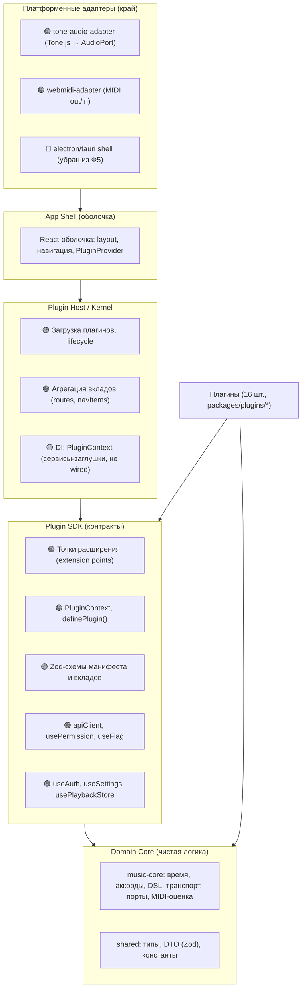
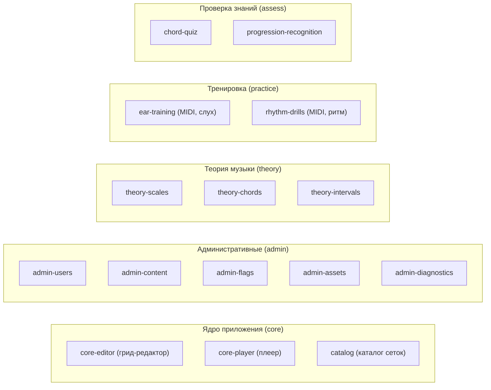
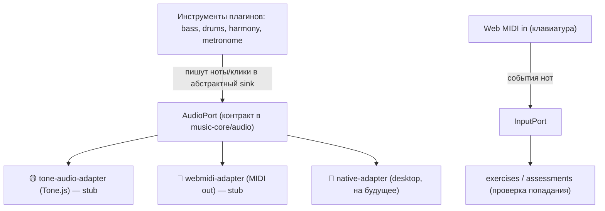
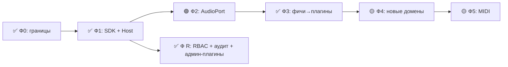

# Архитектурное видение Jazz Trainer

> **Назначение:** Целевая архитектура — куда движется проект.
> **Аудитория:** Разработчики, архитекторы, AI-агенты (`software-architect`).
> **Кто готовит:** `software-architect` — Senior Software Architect (`.agents/skills/software-architect/SKILL.md`).
>
> **Текущая архитектура (то, что реализовано):** См. `ARCHITECTURE_BASE.md`.
> **Технический долг и план улучшений:** См. `TECH_DEPT.md`.
>
> Статусы ниже: 🟢 = реализовано, 🟡 = частично, 🔴 = запланировано, ⚪ = исключено.
> Документ описывает целевую архитектуру с разметкой статуса — видно, что уже сделано, а что предстоит.
>
> Контекст ключевых решений:
>
> - Плагины подключаются **на этапе сборки** (build-time реестр), без динамической загрузки кода в рантайме.
> - Плагины пишет **только команда** (first-party). Песочница, изоляция чужого кода и публичный версионируемый SDK **не нужны**.
> - Целевые платформы: **Web (браузер)**, **Desktop (Electron/Tauri)**, **MIDI-устройства** (Web MIDI).
> - Репозиторий — **единое монорепо**.
> - Административный домен — **RBAC (роль → permissions) + неизменяемый audit log**, админка как набор плагинов внутри `apps/web`.

---

## 1. Принципы

1. **Тонкое ядро, толстые плагины.** Приложение — это оболочка (shell) + хост, которые знают только о _контрактах_. Вся предметная функциональность (уроки, упражнения, квизы, инструменты) поставляется плагинами.
2. **Зависимости только сверху вниз.** Ядро не знает о плагинах. Плагины не знают друг о друге. Платформенные детали (Tone.js, Web MIDI, Electron) живут на самом краю, за портами.
3. **Контракт важнее реализации.** Граница между хостом и плагином — это типизированный контракт (`@jazz/plugin-sdk`). Меняем реализацию свободно, контракт — осознанно.
4. **Детерминированное ядро.** Вся музыкальная логика (`music-core`) — чистая, без браузерных API и без IO. Это делает её переносимой между платформами и дешёвой в тестировании.
5. **Co-location.** Всё, что относится к одной фиче, лежит в одной папке: UI, логика, контент, i18n, тесты. Никакого размазывания фичи по дереву.
6. **Без дублирования по горизонтали.** Общая работа (парсинг аккордов, транспорт, расписание звука, теория) живёт в ядре и предоставляется плагинам через сервисы хоста — плагины не переписывают это у себя.

---

## 2. Слои



**Правило слоёв (принудительно, через ESLint `eslint-plugin-boundaries`, см. §8):**

| Слой                            | Файлы                                        | Может импортировать         | Не может                                            |
| ------------------------------- | -------------------------------------------- | --------------------------- | --------------------------------------------------- |
| `core` (`music-core`, `shared`) | `packages/music-core/*`, `packages/shared/*` | только друг друга и stdlib  | shell, host, sdk, плагины, браузерные API           |
| `plugin-sdk`                    | `packages/plugin-sdk/*`                      | `core`                      | shell, host, плагины, платформенные адаптеры        |
| `plugin-host`                   | `packages/plugin-host/*`                     | `sdk`, `core`               | конкретные плагины, платформенные адаптеры напрямую |
| плагины (`plugins/*`)           | `packages/plugins/*`                         | `sdk`, `core`, `ui`         | другие плагины, shell, host напрямую                |
| адаптеры                        | `packages/adapters/*`                        | `sdk`, `core`               | плагины                                             |
| shell                           | `apps/web`                                   | host, sdk, core, shared, ui | внутренности плагинов                               |
| api                             | `apps/api`                                   | core, shared                | sdk, host, плагины, shell                           |

---

## 3. Плагинная модель

### 3.1. Что такое плагин 🟢

Плагин — это пакет (`packages/plugins/<name>`), который экспортирует единственный типизированный объект через `definePlugin(...)`. Объект содержит **манифест** (метаданные) и **вклады (contributions)** в известные точки расширения.

```ts
// packages/plugins/theory-scales/src/index.ts
import { definePlugin } from '@jazz/plugin-sdk';

export default definePlugin({
  manifest: {
    id: 'theory.scales',
    name: 'Scales',
    apiVersion: 1 as const,
    category: 'theory' as const,
    description: 'Interactive scale reference with visualization.',
  },
  contributes: {
    routes: [{ path: '/scales', element: () => import('./ScalesPage') }],
    navItems: [{ section: 'learn', label: 'Scales', to: '/scales', icon: 'music' }],
  },
  // setup(ctx) { /* опционально */ },
  // dispose() { /* опционально */ },
});
```

**Фактический `ManifestSchema` (Zod):**

```ts
// packages/plugin-sdk/src/manifest.schema.ts
export const manifestSchema = z.object({
  id: z.string().min(1),
  name: z.string().min(1),
  apiVersion: z.literal(1),
  category: z.enum(['theory', 'technique', 'play', 'assess', 'practice', 'core', 'admin']),
  description: z.string(),
  enabled: z.boolean().default(true),
});
```

### 3.2. Точки расширения (extension points) 🟢 (типы) / 🟡 (наполнение)

Точки расширения — это контракт хоста.

| Точка             | Назначение                                                                     | Статус                                            |
| ----------------- | ------------------------------------------------------------------------------ | ------------------------------------------------- |
| `routes`          | Страницы/экраны плагина (lazy `import()`)                                      | 🟢 Используется всеми 16 плагинами                |
| `navItems`        | Пункты меню/навигации (секции: `main`, `create`, `learn`, `practice`, `admin`) | 🟢 Используется                                   |
| `commands`        | Именованные действия (палитра команд, хоткеи)                                  | 🔴 Тип определён, не используется                 |
| `lessons`         | Учебная единица: контент + проверка                                            | 🔴 Тип определён, не используется                 |
| `exercises`       | Интерактивная тренировка                                                       | 🔴 Тип определён, не используется                 |
| `assessments`     | Проверка знаний: квиз/тест                                                     | 🔴 Тип определён, не используется                 |
| `instruments`     | Звуковой движок (бас, барабаны, гармония)                                      | 🔴 Тип `unknown[]`                                |
| `generators`      | Генератор учебного материала                                                   | 🔴 Тип `unknown[]`                                |
| `theoryProviders` | Модель/справочник теории                                                       | 🔴 Тип `unknown[]`                                |
| `settingsSchema`  | Декларация настроек плагина                                                    | 🟡 Тип `Record<string, unknown>`, не используется |

**Фактические типы вкладов:**

```ts
// packages/plugin-sdk/src/extension-points.ts
export interface RouteContribution {
  path: string;
  element: () => Promise<any>; // lazy import
  requires?: string; // permission (RBAC)
}

export interface NavItemContribution {
  section: string;
  label: string;
  to: string;
  icon?: string;
  requires?: string;
}

export interface CommandContribution {
  id: string;
  label: string;
  requires?: string;
  run: (ctx: unknown) => void | Promise<void>;
}

export interface PluginContributions {
  routes?: RouteContribution[];
  navItems?: NavItemContribution[];
  commands?: CommandContribution[];
  lessons?: ActivityContribution[];
  exercises?: ActivityContribution[];
  assessments?: ActivityContribution[];
  instruments?: unknown[];
  generators?: unknown[];
  theoryProviders?: unknown[];
  settingsSchema?: Record<string, unknown>;
}
```

### 3.3. Категории плагинов (домены обучения) 🟢



**Фактический список плагинов** (16 штук, все зарегистрированы в `packages/plugin-registry/src/index.ts`):

| Плагин                    | Категория | Маршруты                   | Навигация                               |
| ------------------------- | --------- | -------------------------- | --------------------------------------- |
| `core.editor`             | core      | `/grids/:id`               | create → Editor                         |
| `core.player`             | core      | `/grids/:id/play`          | —                                       |
| `catalog`                 | core      | `/`, `/grids/:id` (view)   | main → Catalog                          |
| `admin.users`             | admin     | `/admin/users`             | admin → Users                           |
| `admin.content`           | admin     | `/admin/content`           | admin → Content                         |
| `admin.flags`             | admin     | `/admin/flags`             | admin → Flags                           |
| `admin.assets`            | admin     | `/admin/assets`            | admin → Assets                          |
| `admin.diagnostics`       | admin     | `/admin/diagnostics`       | admin → Diagnostics                     |
| `theory.scales`           | theory    | `/scales`                  | learn → Scales                          |
| `theory.chords`           | theory    | `/chords`                  | learn → Chords                          |
| `theory.intervals`        | theory    | `/intervals`               | learn → Intervals                       |
| `practice.ear-training`   | practice  | `/ear-training`            | practice → Ear Training (MIDI ввод, 🟢) |
| `practice.rhythm-drills`  | practice  | `/rhythm-drills`           | practice → Rhythm Drills (MIDI tap, 🟢) |
| `chord-quiz`              | assess    | `/chord-quiz`              | practice → Chord Quiz                   |
| `progression-recognition` | assess    | `/progression-recognition` | practice → Progression Recog.           |

Плюс один **встроенный псевдоплагин** `builtin.core` (в `apps/web/src/shell/builtin-plugins.ts`) для страниц, которые ещё не вынесены в отдельные плагины: `/login`, `/my`, `/settings`, `/profile`, `/`.

### 3.4. Реестр (build-time) 🟢

```ts
// packages/plugin-registry/src/index.ts
import coreEditor from '@jazz/plugin-core-editor';
import corePlayer from '@jazz/plugin-core-player';
import catalog from '@jazz/plugin-catalog';
// ... ещё 13 импортов

export const PLUGINS: PluginDefinition[] = [
  coreEditor,
  corePlayer,
  catalog,
  adminUsers,
  adminContent,
  adminFlags,
  adminAssets,
  adminDiagnostics,
  theoryScales,
  theoryChords,
  theoryIntervals,
  earTraining,
  rhythmDrills,
  chordQuiz,
  progressionRecognition,
];
```

**Загрузка в shell:**

```ts
// apps/web/src/shell/bootstrap.ts
import { PLUGINS } from '@jazz/plugin-registry';
import { loadPlugins, aggregateContributions, createPluginContext } from '@jazz/plugin-host';
import { builtinCorePlugin } from './builtin-plugins';

const allPlugins = [builtinCorePlugin, ...PLUGINS];
const ctx = createPluginContext();
const { loaded, errors } = loadPlugins(allPlugins, ctx);

export const contributions = aggregateContributions(loaded);
```

### 3.5. PluginContext — сервисы хоста 🟢 (типы) / 🟡 (реализация)

```ts
// packages/plugin-sdk/src/context.ts
export interface PluginContext {
  audio: AudioService; // 🟡 заглушка до wiring
  storage: StorageService; // 🟡 заглушка
  settings: SettingsService; // 🟡 заглушка
  navigation: NavigationService; // 🟡 заглушка
  events: EventBus; // 🟡 заглушка
  music: unknown; // 🔴 не типизирован
  query: unknown; // 🔴 не типизирован
}
```

Фабрика (`createPluginContext` в `plugin-host`) создаёт контекст с пустыми объектами-заглушками. В реальном shell сервисы не wired — плагины пока используют SDK хуки (`useAuth`, `useSettings`, `usePlaybackStore`) и собственные импорты `music-core` напрямую, а не через `ctx`.

**Целевое состояние** (документировано для фазы wiring): `PluginContext` получает реальные реализации — `ctx.audio` = `AudioPort` из адаптера, `ctx.music` = реэкспорт `music-core`, `ctx.query` = `QueryClient` из TanStack Query, `ctx.storage` = API-backed storage, `ctx.settings` = синхронизированные настройки.

### 3.6. Жизненный цикл активности (ActivityRunner) 🔴

Типы определены:

```ts
// packages/plugin-sdk/src/activity.ts
export type ActivityType = 'lesson' | 'exercise' | 'assessment';

export interface ActivityState<T = unknown> {
  status: 'idle' | 'active' | 'paused' | 'completed';
  data: T;
  result?: ActivityResult;
}

export interface ActivityDefinition<T = unknown> {
  id: string;
  type: ActivityType;
  start: (ctx: unknown) => ActivityState<T>;
  evaluate: (state: ActivityState<T>, answer: unknown) => ActivityResult;
  report: (state: ActivityState<T>) => ActivityResult;
}
```

Сам `ActivityRunner` (машина состояний в хосте) не реализован. Плагины пока не используют абстракцию активности.

---

## 4. Звук и MIDI: порты и адаптеры



**🟢 Реализовано:**

- `AudioPort` и `InputPort` — контракты в `music-core/audio/ports.ts`
- `ScheduledNote`, `ScheduledClick`, `MidiInputEvent` — типы данных
- `testAudioPortContract()` — контрактный тест для любого адаптера (`music-core/audio/ports.contract.ts`)
- `music-core/audio/midiEval.ts` — `evaluateNote`, `evaluateNoteSequence`, `evaluateRhythm`, `scoreNoteEval`, `scoreRhythmEval` (оценка MIDI-ввода)
- `music-core/audio` содержит: `TransportEngine`, `BassInstrument`, `RhodesInstrument`, `DrumInstrument`, `MetronomeInstrument`, `ChordTimeline`, `RoundRobinCounter`, реестры семплов
- `tone-audio-adapter` — реализует `AudioPort` через Tone.js (119 строк, 18 тестов, проходит `testAudioPortContract`)
- `webmidi-adapter` — реализует `AudioPort` + `InputPort` через Web MIDI API (354 строки, 72 теста, авто-reconnect, all-notes-off)

**🟡 Частично:**

- `useTransport` всё ещё живёт в `apps/web/src/engine/useTransport.ts`, не обёрнут в адаптер (хотя сами адаптеры готовы)

**🔴 Запланировано:**

- Wiring: переключить `useTransport` на `tone-audio-adapter` через `PluginContext.audio.audioPort`
- `native-adapter` для desktop (убран из фазы 5, контр-условие)

---

## 5. Фактическая структура директорий

```
jazz-trainer/
├── apps/
│   ├── web/                          @jazz/web — App Shell (React 19, Vite, Router)
│   │   ├── src/
│   │   │   ├── App.tsx               рендерит маршруты из contributions
│   │   │   ├── main.tsx              точка входа, импортирует bootstrap
│   │   │   ├── shell/
│   │   │   │   ├── bootstrap.ts      загрузка плагинов + агрегация
│   │   │   │   └── builtin-plugins.ts псевдоплагин для невынесенных страниц
│   │   │   ├── components/           layout (AppShell, Header, RbacGuard, ProtectedRoute), UI
│   │   │   ├── pages/                Dashboard, Login (остальные — в плагинах)
│   │   │   ├── engine/               useTransport (будет перемещён в адаптер)
│   │   │   ├── routes/               MyGrids, Settings, Profile (невынесенные)
│   │   │   └── stores/, queries/, hooks/, lib/
│   │   ├── vite.config.ts            алиасы на все пакеты и плагины
│   │   └── package.json
│   ├── api/                          @jazz/api — Fastify + Drizzle (SQLite)
│   │   ├── src/
│   │   │   ├── index.ts              точка входа: buildServer + listen
│   │   │   ├── server.ts             buildServer: регистрация плагинов и роутов
│   │   │   ├── config.ts             загрузка конфигурации (env + defaults)
│   │   │   ├── db/                   schema.ts, index.ts, migrate.ts, seed.ts
│   │   │   ├── plugins/              auth.plugin.ts, rbac.plugin.ts
│   │   │   ├── routes/               auth, settings, grids, patterns
│   │   │   └── services/             auth, rbac, audit, grids
│   │   └── package.json
│   └── desktop/                      🔴 (фаза 5)
│
├── packages/
│   ├── shared/                       @jazz/shared — DTO (Zod), типы, константы
│   │   └── src/  dto.ts, constants.ts, music.ts, generator.ts, grids.ts
│   │
│   ├── music-core/                   @jazz/music-core — чистая логика
│   │   └── src/
│   │       ├── audio/    TransportEngine, Instrument, AudioPort, InputPort,
│   │       │             Bass/Rhodes/Drum/Metronome instruments, midiEval,
│   │       │             sampleRegistry, chordTimeline, ports.contract
│   │       ├── chords/   parseChord, serializeChord, ChordData
│   │       ├── dsl/      parseGrid, serializeGrid, roundtrip
│   │       ├── time/     timeSignature, beat utilities
│   │       ├── playback/ PlaybackStateMachine
│   │       └── generator/ PatternDef, generators
│   │
│   ├── plugin-sdk/                   @jazz/plugin-sdk — КОНТРАКТЫ
│   │   └── src/
│   │       ├── manifest.schema.ts    Zod-схема + validateManifest
│   │       ├── extension-points.ts   RouteContribution, NavItemContribution, ...
│   │       ├── context.ts            PluginContext, сервисы
│   │       ├── activity.ts           ActivityType, ActivityState, ActivityDefinition
│   │       ├── definePlugin.ts       PluginDefinition + definePlugin()
│   │       ├── apiClient.ts          fetch-обёртка с типизированными ошибками
│   │       ├── transport.ts          UseTransportOptions, TransportControls
│   │       ├── host-context.tsx       PluginProvider (React Context для useTransport)
│   │       ├── hooks/                usePermission, useFlag
│   │       ├── queries/              useAuth, useSettings, useEffectiveSettings
│   │       └── stores/               usePlaybackStore, useEditorStore, useLocalSettingsStore
│   │
│   ├── plugin-host/                  @jazz/plugin-host — ядро хоста
│   │   └── src/
│   │       ├── loader.ts             loadPlugins (валидация id, dedup, enabled, setup)
│   │       ├── aggregator.ts         aggregateContributions (сбор routes+navItems)
│   │       ├── context-factory.ts    createPluginContext (заглушки)
│   │       └── __tests__/host.test.ts 11 интеграционных тестов
│   │
│   ├── plugin-registry/              @jazz/plugin-registry — статический список
│   │   └── src/index.ts              export const PLUGINS: PluginDefinition[]
│   │
│   ├── adapters/
│   │   ├── tone-audio-adapter/       🟢 AudioPort через Tone.js (119 строк, 18 тестов)
│   │   └── webmidi-adapter/          🟢 AudioPort + InputPort через Web MIDI (354 строки, 72 теста)
│   │
│   ├── plugins/
│   │   ├── _template/                эталонный плагин для копирования
│   │   ├── core-editor/              грид-редактор (EditorPage + компоненты)
│   │   ├── core-player/              плеер
│   │   ├── catalog/                  публичный каталог
│   │   ├── admin-users/              управление пользователями
│   │   ├── admin-content/            управление контентом
│   │   ├── admin-flags/              feature flags
│   │   ├── admin-assets/             ассеты/sample packs
│   │   ├── admin-diagnostics/        диагностика
│   │   ├── theory-scales/            гаммы и лады
│   │   ├── theory-chords/            аккорды
│   │   ├── theory-intervals/         интервалы
│   │   ├── ear-training/             тренировка слуха
│   │   ├── rhythm-drills/            ритмические упражнения
│   │   ├── chord-quiz/               квиз по аккордам
│   │   └── progression-recognition/  распознавание прогрессий
│   │
│   └── ui/                           @jazz/ui — общие компоненты
│       └── src/  HarmonyGrid, PlayerToolbar, Button, Card, Input, Slider, ...
│
├── docs/                             ARCHITECTURE_VISION.md, TECH_DEPT.md, ...
├── eslint.config.js                  границы (boundaries) + restricted-paths
├── tsconfig.base.json                общий конфиг с paths на все пакеты
├── vitest.config.ts                  конфиг тестов с алиасами
└── package.json                      workspaces: packages/*, adapters/*, plugins/*, apps/*
```

---

## 6. API-слой (фронт ↔ бэк) 🟢

- **Протокол — REST поверх Fastify** (`apps/api`). Эндпоинты: `/api/health`, `/api/auth/*`, `/api/settings`, `/api/grids`, `/api/patterns`.
- **Контракт — `@jazz/shared` как единый источник правды.** Zod-DTO (`UserDTOSchema`, `UserSettingsDTOSchema`, `MeResponseSchema`) валидируют тело запроса на сервере и типизируют ответ на клиенте. `apiClient` в `plugin-sdk` — типизированная обёртка над `fetch`.
- **Конвейер запроса:** `request → cors → cookie → auth (сессия) → rbac (на /api/admin/*) → handler`.
- **RBAC middleware** (`apps/api/src/plugins/rbac.plugin.ts`): декорирует `request.hasPermission()`, авто-гардит `/api/admin/*`.
- **Audit log** (`apps/api/src/services/audit.service.ts`): `withAudit()` и `withAuditSync()` — обёртки для мутирующих операций, пишут запись в `audit_log`.
- **Плагины не регистрируют собственные серверные роуты** — серверный API стабилен и принадлежит `apps/api`.

---

## 7. Стратегия тестирования 🟢

Фактический охват тестами (на 2026-06-13, 483 тестов):

| Уровень                  | Что покрыто                                                                                                                                                                                  | Статус                     |
| ------------------------ | -------------------------------------------------------------------------------------------------------------------------------------------------------------------------------------------- | -------------------------- |
| Unit + property-based    | `music-core`: parseChord, serializeChord, DSL roundtrip, TransportEngine, BassInstrument, DrumInstrument, RhodesVoicing, midiEval, Instrument                                                | 🟢 ~300+ тестов            |
| Контрактные              | `plugin-sdk`: validateManifest (8 тестов). `music-core`: testAudioPortContract. `tone-audio-adapter` (18 тестов), `webmidi-adapter` (72 теста). `_template` и плагины: plugin-contract тесты | 🟢 8 + контракты адаптеров |
| Host/registry интеграция | `plugin-host`: loadPlugins + aggregateContributions + createPluginContext (11 тестов)                                                                                                        | 🟢 11 тестов               |
| Компонентные (RTL)       | —                                                                                                                                                                                            | 🔴 Не начато               |
| E2E (Playwright)         | — (конфиг есть, тестов нет)                                                                                                                                                                  | 🔴 Не начато               |
| Статический контроль     | TS `strict`, ESLint boundaries (8 зон), `import/no-restricted-paths` (3 правила)                                                                                                             | 🟢 0 нарушений границ      |

**Что нужно добавить** (минимум против ломкости): контрактные тесты по всем плагинам реестра, контракт портов для каждого адаптера, 4–6 E2E-смоуков.

---

## 8. Границы как код (линтер) 🟢

Реализовано в `eslint.config.js`:

```jsonc
// eslint-plugin-boundaries: матрица зависимостей (9 правил, default: disallow)
{
  "from": "packages/music-core",   "allow": ["music-core", "shared"] },
  "from": "packages/shared",       "allow": ["shared"] },
  "from": "packages/plugin-sdk",   "allow": ["plugin-sdk", "music-core", "shared"] },
  "from": "packages/plugin-host",  "allow": ["plugin-host", "plugin-sdk", "music-core", "shared"] },
  "from": "packages/plugins",      "allow": ["plugin-sdk", "music-core", "shared", "ui"] },
  "from": "packages/adapters",     "allow": ["plugin-sdk", "music-core", "shared"] },
  "from": "apps/web",              "allow": ["apps/web", "plugin-host", "plugin-sdk", "music-core", "shared", "ui"] },
  "from": "apps/api",              "allow": ["apps/api", "music-core", "shared"] },
  "from": "packages/ui",           "allow": ["ui", "music-core", "shared"] }
```

Плюс `import/no-restricted-paths`: запрет `apps/* → music-core`, `apps/* → shared`, `apps/web/src/shell → plugins`, `apps/web/src → plugins`, `apps/web/src → adapters`.

Нарушение архитектуры — ошибка сборки (`error`).

---

## 9. Монорепо (обоснование)

> Детали реализации см. в `ARCHITECTURE_BASE.md` §8 и ADR-003.

**Оставляем единое монорепо.** Реализовано: workspaces в `package.json`, общий `tsconfig.base.json` с paths, алиасы в `vite.config.ts` и `vitest.config.ts`.

---

## 10. Административный домен: RBAC и audit log 🟢

### 10.1. Размещение админки

Админка — это 5 admin-плагинов внутри `apps/web`, за RBAC-guard'ом: `admin-users`, `admin-content`, `admin-flags`, `admin-assets`, `admin-diagnostics`.

### 10.2. RBAC: роль → permissions-каталог

**Фактическая схема БД** (`apps/api/src/db/schema.ts`):

```sql
-- Таблицы
users         (role TEXT DEFAULT 'user', status TEXT DEFAULT 'active')
roles         (id, name UNIQUE)
permissions   (id, code UNIQUE)
role_permissions (role_id, permission_code) PK
user_permissions (user_id, permission_code, granted BOOLEAN) PK
```

**Фактические permissions** (`apps/api/src/services/rbac.service.ts`):

```ts
export const RBAC_PERMISSIONS = {
  USERS_READ: 'users:read',
  USERS_WRITE: 'users:write',
  CONTENT_READ: 'content:read',
  CONTENT_WRITE: 'content:write',
  FLAGS_READ: 'flags:read',
  FLAGS_WRITE: 'flags:write',
  ASSETS_READ: 'assets:read',
  ASSETS_WRITE: 'assets:write',
  DIAGNOSTICS_READ: 'diagnostics:read',
  AUDIT_READ: 'audit:read',
  ADMIN: 'admin',
};
```

**Фактические роли** (упрощённый набор — не все роли из целевого документа):

```ts
export const RBAC_ROLES = {
  SUPER_ADMIN: 'super_admin',
  ADMIN: 'admin',
  USER: 'user',
};
```

Роли `content_editor`, `support`, `developer`, `viewer` из целевого документа ещё не добавлены.

**Двойное enforcement:**

- **Сервер** — `rbac.plugin.ts`: авто-guard `/api/admin/*` (проверяет `request.hasPermission('admin')`), `requirePermission()` для точечных проверок.
- **Фронт** — `usePermission('users:read')` в `plugin-sdk/hooks`, `RbacGuard` в `apps/web/src/components/layout`.

### 10.3. Feature flags 🟢

Свой движок в БД (`feature_flags` таблица): `key`, `enabled`, `roles` (JSON), `userIds` (JSON). Резолюция: `resolveFlags(db, userRole, userId)` в `rbac.service.ts`. Фронт: `useFlag(key)` в `plugin-sdk/hooks`.

### 10.4. Audit log 🟢

Таблица `audit_log` (append-only): `id`, `actorUserId`, `action`, `targetType`, `targetId`, `before`, `after`, `timestamp`, `ip`, `userAgent`, `reason`. Обёртки `withAudit()` / `withAuditSync()` в `audit.service.ts` — пишут запись атомарно с мутацией.

---

## 11. План миграции — статус выполнения



| Фаза                | Статус | Когда          | Ключевой результат                                                                                                                       |
| ------------------- | ------ | -------------- | ---------------------------------------------------------------------------------------------------------------------------------------- |
| Ф0 — Границы        | ✅     | 2026-06-11     | ESLint boundaries + strict + restricted-paths, 0 нарушений                                                                               |
| Ф1 — SDK + Host     | ✅     | 2026-06-11     | `plugin-sdk` (8 файлов), `plugin-host` (6 файлов), `plugin-registry`, shell bootstrap                                                    |
| Ф R — RBAC + аудит  | ✅     | 2026-06-11     | DB: role/permission/flag/audit таблицы, RBAC middleware, `withAudit`, `usePermission`/`useFlag`                                          |
| Ф2 — AudioPort      | 🟢     | 2026-06-12     | Адаптеры реализованы: `tone-audio-adapter` (Tone.js → AudioPort), `webmidi-adapter` (MIDI → AudioPort+InputPort). Остался wiring в shell |
| Ф3 — Фичи → плагины | ✅     | 2026-06-11     | `core-editor`, `core-player`, `catalog` вынесены. App.tsx рендерит из `contributions`                                                    |
| Ф4 — Новые домены   | 🟡     | scaffold готов | 10 domain-плагинов созданы и зарегистрированы. `ear-training`, `rhythm-drills` получили MIDI-реализацию                                  |
| Ф5 — MIDI           | 🟡     | 2026-06-12     | `webmidi-adapter` (354 строки, 72 теста), `midiEval`, MIDI-плагины (`ear-training`, `rhythm-drills`). Desktop убран из scope             |

---

## 12. Сводка решений (ADR-кратко)

| Решение                     | Выбор                                                     | Статус                                                                |
| --------------------------- | --------------------------------------------------------- | --------------------------------------------------------------------- |
| Подключение плагинов        | Build-time реестр                                         | 🟢 Реализовано                                                        |
| Авторы плагинов             | First-party                                               | 🟢                                                                    |
| Граница хост↔плагин         | Типизированный SDK + Zod-манифест                         | 🟢 Реализовано                                                        |
| Звук/MIDI                   | Порты + адаптеры                                          | 🟢 `tone-audio-adapter` + `webmidi-adapter` готовы, wiring в процессе |
| Общие фичи (editor/player)  | Тоже плагины                                              | 🟢 Вынесены                                                           |
| Репозиторий                 | Единое монорепо                                           | 🟢                                                                    |
| Независимый деплой          | Build-таргеты + CI path-фильтры                           | 🔴 CI не настроен                                                     |
| Тесты                       | Контракты + чистое ядро + тонкий E2E                      | 🟡 Unit + контрактные + адаптеры (483 теста), E2E нет                 |
| Архитектурные правила       | ESLint boundaries + TS strict                             | 🟢 0 нарушений                                                        |
| Размещение админки          | Admin-плагины в том же `apps/web`                         | 🟢 5 плагинов                                                         |
| Модель доступа              | RBAC: роль → permissions (3 роли, 11 permissions)         | 🟢 Реализовано                                                        |
| Enforcement доступа         | Сервер — источник истины, фронт — UX                      | 🟢 `rbac.plugin.ts` + `RbacGuard`                                     |
| Feature flags               | Свой движок в БД                                          | 🟢 Реализовано                                                        |
| Audit log                   | Append-only, `withAudit`                                  | 🟢 Реализовано                                                        |
| API-слой                    | REST поверх Fastify, контракт — Zod-DTO из `@jazz/shared` | 🟢                                                                    |
| Состояние активности        | `ActivityRunner` в хосте                                  | 🔴 Только типы                                                        |
| Семантика EventBus          | pub/sub + request/response                                | 🔴 Не реализована                                                     |
| Build-time vs runtime флаги | Разные механизмы                                          | 🟡 Флаги реализованы, дерево-шейкинг зависит от Vite                  |
| Общие UI-компоненты         | `@jazz/ui` как отдельный пакет, доступен плагинам         | 🟢 Реализовано                                                        |
| Desktop-оболочка            | Исключена из MVP, контр-условие на будущее                | 🔴 Убрана из Ф5                                                       |

---

_Документ подготовлен агентом `software-architect`. Обновлён 2026-06-13. Отражает целевое видение архитектуры и прогресс: Фазы 0, 1, 2, 3, R готовы ✅, Фазы 4 и 5 частично 🟡._
