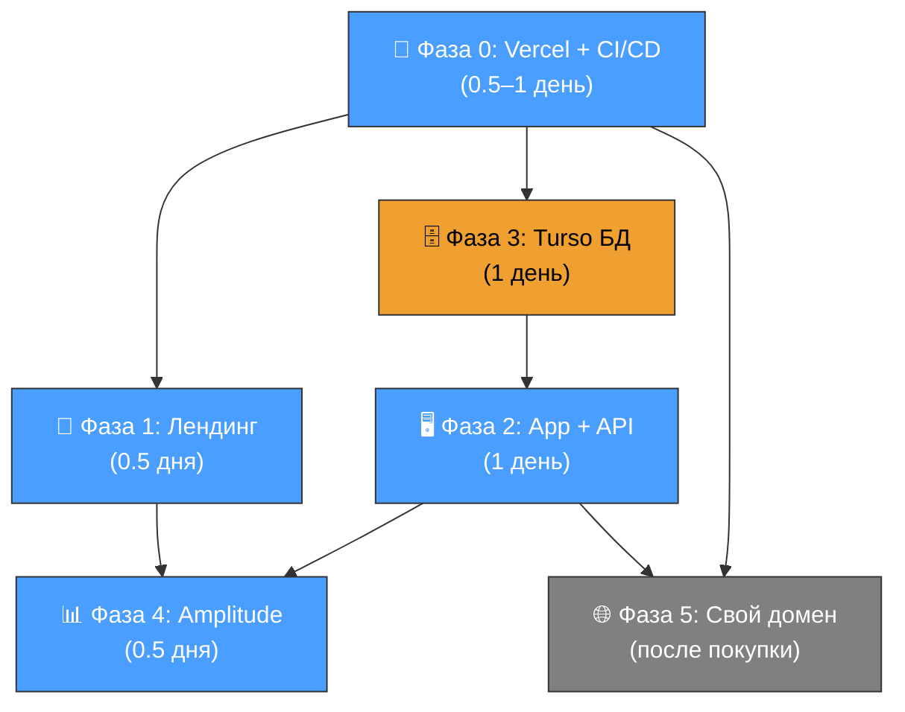

# DEPLOYMENT-PLAN — План раскатки Amazilia для DevOps

> **Версия:** v1.0 от 2026-07-27
> **Основание:** `docs/DEPLOYMENT.md` — архитектура размещения
> **Исполнитель:** devops AI agent
> **Приоритеты заказчика:** P0 (CI/CD + домены) → P1 (Лендинг) → P2 (App + API) → P3 (Turso БД) → P4 (Amplitude)

---

## 0. Исходное состояние (baseline)

| Артефакт | Статус |
|----------|--------|
| `infra/` директория | ❌ Не создана |
| `.github/workflows/ci.yml` | ✅ Есть, но без `lint` и `build` шагов |
| `apps/landing/vercel.json` | ❌ Нет |
| `apps/web/vercel.json` | ❌ Нет |
| `apps/api/vercel.json` | ❌ Нет |
| Vercel-проекты | ❌ Не созданы |
| Turso БД | ❌ Не создана |
| Amplitude | ❌ Не подключён |
| Пользовательский домен (`amazilia.app`) | ❌ Не куплен |

> **Примечание:** в DEPLOYMENT.md указан GitHub, но пользователь упоминает GitLab. Проект на GitHub — план исходит из этого. При необходимости миграции на GitLab — добавится этап 0.0.

---

## Фаза 0: Vercel Git Integration + базовый CI/CD (приоритет P0)

**Цель:** три пустых Vercel-проекта связаны с репозиторием, CI/CD пайплайн проверяет код при PR/push в `main`, получены временные домены.

### Шаг 0.1 — Установка и аутентификация Vercel CLI

```bash
# Установить Vercel CLI глобально
npm i -g vercel

# Залогиниться в Vercel (откроет браузер)
vercel login

# Привязать репозиторий к Vercel-команде (создаст .vercel/)
vercel link
```

**Результат:** Vercel CLI готов к работе, в корне появится `.vercel/` (добавить в `.gitignore`).

### Шаг 0.2 — Создание трёх Vercel-проектов

Каждый проект — отдельный деплой из монорепо. Создаются через Vercel Dashboard:

| # | Проект | Root Directory | Framework | Назначение |
|---|--------|---------------|-----------|------------|
| 0.2.1 | **Landing** | `apps/landing` | Other (Vite static) | Лендинг |
| 0.2.2 | **Studio** | `apps/web` | Other (Vite React SPA) | Веб-приложение |
| 0.2.3 | **API** | `apps/api` | Other (Node.js → serverless) | REST API |

**Порядок действий (Vercel Dashboard → Add New → Project):**

1. Выбрать GitHub-репозиторий
2. Указать **Root Directory** соответственно
3. Framework Preset = **Other**
4. **НЕ нажимать Deploy** — сначала создадим `vercel.json` для каждого проекта

**Результат:** три Vercel-проекта созданы, каждый получил временный домен:
- `<landing-project>.vercel.app`
- `<studio-project>.vercel.app`
- `<api-project>.vercel.app`

### Шаг 0.3 — Создание `infra/` структуры

Создать директорию IaC согласно `DEPLOYMENT.md §4.1`:

```bash
mkdir -p infra/vercel/env infra/turso infra/resend
```

Файлы для создания (порядок ниже):

#### 0.3.1 — `infra/README.md`

```markdown
# Инфраструктура Amazilia

Версионируемая конфигурация инфраструктуры. Управляется devops-агентом.

## Структура

- `vercel/` — конфиги Vercel-проектов (Vercel CLI)
- `turso/` — Terraform-конфиги Turso БД
- `resend/` — конфиги Resend (email)

## Быстрые команды

- Деплой: `vercel --prod`
- Переменные: `vercel env ls`
- Секреты: `sops -e infra/vercel/env/production.env`
```

#### 0.3.2 — `infra/vercel/landing.json`

```json
{
  "name": "amazilia-landing",
  "framework": null,
  "buildCommand": "cd ../.. && npm run build -- --filter=@jazz/landing",
  "outputDirectory": "dist",
  "installCommand": "cd ../.. && npm ci",
  "devCommand": "cd ../.. && npm run dev -- --filter=@jazz/landing",
  "git": {
    "deploymentEnabled": {
      "main": true
    }
  }
}
```

#### 0.3.3 — `infra/vercel/studio.json`

```json
{
  "name": "amazilia-studio",
  "framework": null,
  "buildCommand": "cd ../.. && npm run build -- --filter=@jazz/web",
  "outputDirectory": "dist",
  "installCommand": "cd ../.. && npm ci",
  "devCommand": "cd ../.. && npm run dev -- --filter=@jazz/web",
  "rewrites": [
    {
      "source": "/api/:path*",
      "destination": "https://<api-project>.vercel.app/api/:path*"
    }
  ],
  "headers": [
    {
      "source": "/assets/(.*)",
      "headers": [
        { "key": "Cache-Control", "value": "public, max-age=31536000, immutable" }
      ]
    }
  ],
  "git": {
    "deploymentEnabled": {
      "main": true
    }
  }
}
```

> ⚠️ `destination` — подставить реальный домен API-проекта из шага 0.2.

#### 0.3.4 — `infra/vercel/api.json`

```json
{
  "name": "amazilia-api",
  "framework": null,
  "buildCommand": "cd ../.. && npm run build -- --filter=@jazz/api",
  "installCommand": "cd ../.. && npm ci",
  "functions": {
    "api/[...path].ts": {
      "memory": 512,
      "maxDuration": 30
    }
  },
  "git": {
    "deploymentEnabled": {
      "main": true
    }
  }
}
```

### Шаг 0.4 — Создание `vercel.json` в директориях проектов

Создать симлинки или копии из `infra/vercel/` на время настройки:

```bash
# Лендинг
cp infra/vercel/landing.json apps/landing/vercel.json

# Веб-приложение
cp infra/vercel/studio.json apps/web/vercel.json

# API
cp infra/vercel/api.json apps/api/vercel.json
```

> В будущем Vercel-проекты можно будет сконфигурировать через Dashboard, и `vercel.json` станет не нужен (IaC в `infra/` — source of truth, dashboard — execution). Но для первой настройки через Git Integration файлы в корне проекта необходимы.

### Шаг 0.5 — Актуализация CI/CD пайплайна

Текущий `.github/workflows/ci.yml` не содержит шагов `lint` и `build`. Обновить:

```yaml
name: CI

on:
  pull_request:
  push:
    branches: [main]

jobs:
  verify:
    runs-on: ubuntu-latest
    steps:
      - uses: actions/checkout@v4

      - uses: actions/setup-node@v4
        with:
          node-version: 22
          cache: npm

      - name: Install dependencies
        run: npm ci

      - name: Rebuild native modules
        run: npm rebuild better-sqlite3

      - name: Typecheck
        run: npm run typecheck

      - name: Lint
        run: npm run lint

      - name: Tests
        run: npm run test
```

**Изменения относительно текущего:**
- Добавлен шаг `npm run lint` (строка между typecheck и test)

> **Почему без `build`:** Vercel выполняет сборку на своей стороне. CI проверяет только качество кода (typecheck + lint + test). Если нужна проверка сборки в CI — добавить шаг `npm run build` (увеличит время CI на ~2–5 мин).

### Шаг 0.6 — Настройка Vercel Git Integration (автодеплой)

В каждом Vercel-проекте (Dashboard → Settings → Git):

1. Убедиться, что Git-репозиторий подключён
2. **Production Branch** = `main`
3. **Pull Request** → автоматический Preview-деплой = включён
4. **Skipped commits:** `[skip ci]`, `[skip deploy]`

**Результат Фазы 0:**
- Три пустых Vercel-проекта связаны с GitHub
- CI/CD: PR → lint/typecheck/test + Preview-деплой; merge в main → Production-деплой
- Три временных домена: `<project>.vercel.app`
- `infra/` структура создана и закоммичена

---

## Фаза 1: Лендинг на временном домене (приоритет P1)

**Цель:** работающий лендинг на `<landing-project>.vercel.app`, видимый внешнему миру.

### Шаг 1.1 — Проверить, что `apps/landing` собирается

```bash
cd apps/landing
npm run build
```

Ожидаемый результат: `dist/` с `index.html`, CSS, JS.

### Шаг 1.2 — Настроить переменные окружения для лендинга

Через Vercel Dashboard (проект Landing → Settings → Environment Variables):

| Переменная | Значение | Окружение |
|-----------|----------|-----------|
| `VITE_AMPLITUDE_API_KEY` | (взять из Amplitude, см. Фазу 4) | Production, Preview |

Пока Amplitude не настроен — можно оставить пустым (или временный ключ).

### Шаг 1.3 — Первый деплой лендинга

**Способ A: Push в `main`** (рекомендовано)

```bash
git add apps/landing/vercel.json infra/
git commit -m "feat: add Vercel deployment configs"
git push origin main
```

Vercel автоматически задеплоит лендинг на production-домен.

**Способ B: Vercel CLI (если нужен ручной контроль)**

```bash
cd apps/landing
vercel --prod
```

### Шаг 1.4 — Валидация лендинга

- [ ] Лендинг открывается по `https://<landing-project>.vercel.app`
- [ ] HTTPS работает (Vercel автоматически выпускает сертификат)
- [ ] Нет ошибок в консоли браузера
- [ ] Все статические ресурсы загружаются (CSS, изображения, шрифты)
- [ ] CTA-кнопки ведут на корректные URL (пока могут быть заглушками)

**Результат Фазы 1:** лендинг доступен по URL, можно показать заказчику.

---

## Фаза 2: Веб-приложение + API (приоритет P2)

**Цель:** работающее приложение на `<studio-project>.vercel.app` и API на `<api-project>.vercel.app`.

### Шаг 2.1 — Подготовка API к serverless

**Исполнитель:** software-engineer (потребуется изменение кода).

Текущий API использует `better-sqlite3` (нативный модуль) — **несовместим с Vercel serverless**. Необходима миграция на Turso (Фаза 3), но для первого деплоя — два варианта:

**Вариант A (рекомендован):** Мигрировать на Turso до деплоя API (т.е. Фазу 3 частично — см. шаг 3.1).

**Вариант B:** Временно обернуть API в Docker и деплоить не как Vercel serverless (Fly.io / Railway). Это противоречит DEPLOYMENT.md.

→ **Решение:** объединить шаги 2.1 и 3.1. Сначала миграция БД, потом деплой API.

### Шаг 2.2 — Миграция `better-sqlite3` → `@libsql/client` (см. Фазу 3, шаг 3.1)

Выполняется software-engineer. DevOps ждёт готовности миграции.

### Шаг 2.3 — Создание serverless-обёртки для API

Файл `apps/api/api/[...path].ts`:

```typescript
// apps/api/api/[...path].ts — Vercel Serverless Function entrypoint
import { buildServer } from '../src/server.js';
import fastifyVercel from '@fastify/vercel';

const app = await buildServer();
await app.ready();

export default fastifyVercel(app);
```

Проверить, что `@fastify/vercel` установлен:

```bash
npm install --workspace=@jazz/api @fastify/vercel
```

### Шаг 2.4 — Rate-limit: переключить на внешний стор

Текущий `apps/api/src/plugins/rate-limit.plugin.ts` использует in-memory хранилище — **не работает в serverless** (инстансы не разделяют память).

Варианты:
- **Upstash Redis** (нативная Vercel-интеграция, рекомендуется DEPLOYMENT.md)
- **Turso-счётчик** (проще, но дополнительная нагрузка на БД)

→ Рекомендовано: **Upstash Redis** (бесплатный тир: 10K команд/день).

### Шаг 2.5 — Настройка переменных окружения API

Через Vercel Dashboard (проект API → Settings → Environment Variables):

| Переменная | Значение | Окружение |
|-----------|----------|-----------|
| `DATABASE_URL` | `libsql://<db-name>-<org>.turso.io` | Production |
| `DATABASE_AUTH_TOKEN` | Turso auth token | Production |
| `RESEND_API_KEY` | Resend API key | Production |
| `PUBLIC_URL` | `https://<api-project>.vercel.app` | Production |

### Шаг 2.6 — Настройка переменных окружения веб-приложения

Через Vercel Dashboard (проект Studio → Settings → Environment Variables):

| Переменная | Значение | Окружение |
|-----------|----------|-----------|
| `VITE_API_BASE_URL` | `https://<api-project>.vercel.app` | Production |
| `VITE_AMPLITUDE_API_KEY` | Amplitude API key | Production |
| `VITE_SENTRY_DSN` | Sentry DSN | Production |

### Шаг 2.7 — Деплой API

```bash
# Из корня монорепо
cd apps/api
vercel --prod
```

### Шаг 2.8 — Деплой веб-приложения

```bash
cd apps/web
vercel --prod
```

### Шаг 2.9 — Валидация приложения

- [ ] Веб-приложение открывается по `https://<studio-project>.vercel.app`
- [ ] API отвечает по `https://<api-project>.vercel.app/api/health`
- [ ] Прокси `/api/*` из веб-приложения работает (проверить в Network-табе)
- [ ] CORS разрешён между доменами (проверить `apps/api/src/server.ts` — уже настроен через `@fastify/cors`)
- [ ] Стадия 1 (открытый доступ): приложение доступно без авторизации

**Результат Фазы 2:** лендинг + приложение + API работают на временных доменах Vercel.

---

## Фаза 3: Turso Database (приоритет P3)

**Цель:** production-БД создана, миграции накачены, API работает с Turso, `better-sqlite3` удалён.

### Шаг 3.1 — Миграция драйвера (software-engineer)

Заменить `better-sqlite3` → `@libsql/client` в `apps/api/`:

```bash
npm uninstall --workspace=@jazz/api better-sqlite3
npm install --workspace=@jazz/api @libsql/client
```

Обновить `apps/api/src/db/index.ts`:
- `import { createClient } from '@libsql/client'` вместо `better-sqlite3`
- Использовать `DATABASE_URL` + `DATABASE_AUTH_TOKEN` из переменных окружения

Обновить `drizzle.config.ts`:
- `driver: 'turso'` вместо `better-sqlite3`
- `url` / `authToken` из переменных окружения

### Шаг 3.2 — Создание Turso БД

Через Turso CLI:

```bash
# Установка Turso CLI
curl -sSfL https://get.tur.so/install.sh | bash

# Логин
turso auth login

# Создать БД для production
turso db create amazilia-prod --type production

# Создать БД для preview
turso db create amazilia-preview --type preview

# Получить URL
turso db show amazilia-prod --url

# Создать auth token
turso db tokens create amazilia-prod
```

### Шаг 3.3 — Запуск миграций на Turso

```bash
# Сгенерировать миграции (если изменилась схема)
npm run db:generate --workspace=@jazz/api

# Накатить на production
DATABASE_URL="libsql://amazilia-prod-..." \
DATABASE_AUTH_TOKEN="..." \
npm run db:migrate --workspace=@jazz/api
```

### Шаг 3.4 — Настройка бэкапов Turso

Turso автоматически делает daily-бэкапы. Проверить:

```bash
turso db show amazilia-prod
# Убедиться: backups: enabled
```

### Шаг 3.5 — Удаление `better-sqlite3` из CI

Убрать строку из `.github/workflows/ci.yml`:

```yaml
# Удалить:
- run: npm rebuild better-sqlite3
```

### Шаг 3.6 — Валидация БД

- [ ] API отвечает на запросы, данные читаются/пишутся
- [ ] Миграции применены (проверить `drizzle migrations list`)
- [ ] Preview-БД изолирована от production
- [ ] `better-sqlite3` не используется в проекте (`grep -r "better-sqlite3" --include="*.json" --include="*.ts"`)

**Результат Фазы 3:** API работает с Turso, данные персистентны, `better-sqlite3` удалён.

---

## Фаза 4: Amplitude Analytics (приоритет P4)

**Цель:** продуктовая аналитика подключена, Amplitude принимает события из лендинга и приложения.

### Шаг 4.1 — Создание Amplitude-проекта

1. Зарегистрироваться на https://amplitude.com
2. Создать проект: **Amazilia**
3. Получить API Key (Settings → Projects → Amazilia → API Key)
4. Создать **отдельный ключ для development/preview** (рекомендовано: разделить prod и test-данные)

### Шаг 4.2 — Установка SDK в веб-приложение

```bash
npm install --workspace=@jazz/web @amplitude/analytics-browser
```

### Шаг 4.3 — Инициализация Amplitude в коде (software-engineer)

Создать `apps/web/src/amplitude.ts`:

```typescript
import * as amplitude from '@amplitude/analytics-browser';

amplitude.init(import.meta.env.VITE_AMPLITUDE_API_KEY, {
  defaultTracking: {
    pageViews: true,
    sessions: true,
    formInteractions: false,
    fileDownloads: false,
  },
});

export { track, setUserId } from '@amplitude/analytics-browser';
```

Импортировать в `apps/web/src/main.tsx`:

```typescript
import './amplitude'; // инициализация Amplitude — до App
```

### Шаг 4.4 — Добавить Amplitude на лендинг

Варианты:
1. **Через npm** (если лендинг использует JS-бандлер)
2. **Через script-тег** (если лендинг — чистый HTML)

Для Vite-лендинга (источник DEPLOYMENT.md §1.1): через npm, аналогично веб-приложению.

### Шаг 4.5 — Базовые события (software-engineer)

Добавить трекинг ключевых событий согласно `DEPLOYMENT.md §9.2`:

| Событие | Где трекать |
|---------|-------------|
| `landing_visit` | `apps/landing` — при загрузке |
| `signup_started` | `apps/web` — клик по кнопке логина |
| `signup_completed` | `apps/web` — успешный логин |
| `exercise_started` | `apps/web` — старт упражнения |
| `exercise_completed` | `apps/web` — завершение упражнения |

### Шаг 4.6 — Настройка переменных окружения

Добавить в Vercel-проекты:

| Проект | Переменная | Значение |
|--------|-----------|----------|
| Landing | `VITE_AMPLITUDE_API_KEY` | Amplitude API Key |
| Studio | `VITE_AMPLITUDE_API_KEY` | Amplitude API Key |

### Шаг 4.7 — Валидация аналитики

- [ ] Amplitude показывает live-пользователей (Amplitude → User Look-Up)
- [ ] События `landing_visit` приходят с лендинга
- [ ] События `page_view` приходят из приложения (автотрекинг)
- [ ] Данные не смешиваются между prod и preview (разные ключи)

**Результат Фазы 4:** Amplitude принимает события, аналитика работает.

---

## Фаза 5: Переключение на собственный домен (после покупки `amazilia.app`)

### Шаг 5.1 — Добавить домен в Vercel

Vercel Dashboard → проект → Settings → Domains → Add Domain:

| Проект | Домен |
|--------|-------|
| Landing | `amazilia.app` |
| Studio | `studio.amazilia.app` |
| API | `api.amazilia.app` |

### Шаг 5.2 — Настроить DNS

Vercel предложит DNS-записи. Добавить их у регистратора домена.

### Шаг 5.3 — Обновить переменные окружения

Заменить временные домены на целевые:
- `VITE_API_BASE_URL` → `https://api.amazilia.app`
- Rewrite в `vercel.json` студии → `https://api.amazilia.app`

### Шаг 5.4 — Редиректы с временных доменов (опционально)

```json
{
  "redirects": [
    {
      "source": "/:path*",
      "destination": "https://amazilia.app/:path*",
      "permanent": true
    }
  ]
}
```

---

## Сводная карта зависимостей



> 🔵 = DevOps, 🟠 = совместно (DevOps + software-engineer)

---

## Оценка трудозатрат

| Фаза | Длительность | Кто | Блокирует |
|------|-------------|-----|-----------|
| Фаза 0: Vercel + CI/CD | 0.5–1 день | DevOps | — |
| Фаза 1: Лендинг | 0.5 дня | DevOps | Фаза 0 |
| Фаза 3: Turso БД | 1 день | DevOps + SE | Фаза 0 (частично) |
| Фаза 2: App + API | 1 день | DevOps + SE | Фаза 3 |
| Фаза 4: Amplitude | 0.5 дня | DevOps + SE | Фазы 1, 2 |
| Фаза 5: Свой домен | 0.5 дня | DevOps | Покупка домена |

**Итого:** 3–4.5 дня (без учёта времени на покупку домена).

---

## Чек-лист готовности (из DEPLOYMENT.md §19)

- [ ] Лендинг деплоится на временный Vercel-домен
- [ ] Веб-приложение деплоится на временный Vercel-домен
- [ ] API деплоится на временный Vercel-домен
- [ ] Turso БД доступна из API
- [ ] HTTPS включен для всех доменов
- [ ] Environment Variables настроены для production
- [ ] CI/CD проходит (lint → typecheck → test)
- [ ] Preview Deployments создаются для PR
- [ ] Amplitude принимает события
- [ ] `DEPLOYMENT.md` закоммичен в репо
- [ ] `DEPLOYMENT-PLAN.md` (этот файл) закоммичен

---

_План создан software-architect AI agent на основе `docs/DEPLOYMENT.md` и приоритетов заказчика. Версия 1.0, 2026-07-27._
