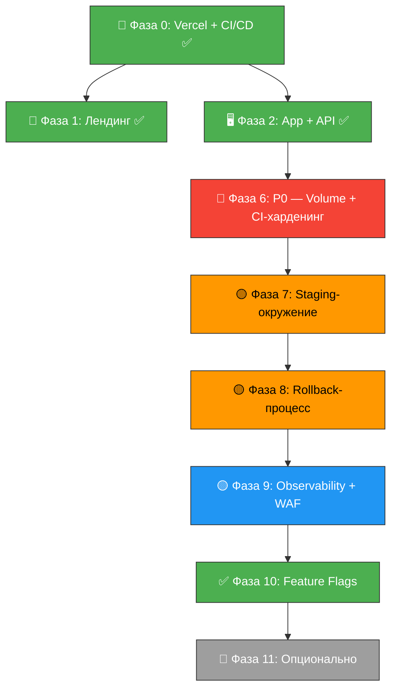

# DEPLOYMENT-PLAN — План раскатки Amazilia для DevOps

> **Версия:** v2.2 от 2026-08-01
> **Основание:** `docs/DEPLOYMENT.md` — целевое видение инфраструктуры
> **Исполнитель:** devops AI agent

---

## 0. Исходное состояние (baseline)

| Артефакт | Статус на 2026-07-27 | Статус на 2026-07-28 |
|----------|---------------------|---------------------|
| `infra/` директория | ❌ | ✅ Создана |
| `.github/workflows/ci.yml` | ✅ (без lint) | ✅ (с lint) |
| `apps/landing/vercel.json` | ❌ | ✅ |
| `apps/web/vercel.json` | ❌ | ✅ |
| Vercel-проекты | ❌ | ✅ (landing + studio) |
| Railway-проект | ❌ | ✅ (API) |
| `Dockerfile.api` | ❌ | ✅ |
| Railway Volume `/app/data` | ❌ | ❌ (не создан) |
| Домен `amazilia.app` | ❌ | ❌ (не куплен) |

---

## Фаза 0: Vercel Git Integration + базовый CI/CD ✅ ВЫПОЛНЕНО

**Цель:** Vercel-проекты связаны с репозиторием, CI/CD проверяет код, получены временные домены.

- [x] Шаг 0.1 — Установка и аутентификация Vercel CLI
- [x] Шаг 0.2 — Создание Vercel-проектов (landing + studio)
- [x] Шаг 0.3 — Создание `infra/` структуры
- [x] Шаг 0.4 — Создание `vercel.json` в проектах
- [x] Шаг 0.5 — Актуализация CI/CD пайплайна (добавлен lint)
- [x] Шаг 0.6 — Настройка Vercel Git Integration (автодеплой)

**Результат:** CI/CD: PR → verify + Preview-деплой; merge в main → Production-деплой.

> **⚠️ Остались невыполненные улучшения CI** (перенесены в Фазу 6.4):
> - 🔴 Кеширование `node_modules` (`actions/cache@v4`) + `npm ci` вместо `npm install`
> - 🔴 Миграции БД в CI-джобе: `railway run "npm run db:migrate"` перед `railway up`
> - 🔴 Переименование сервиса `amazilia-api` → `amazilia-api-prod` в CI
> - 🔴 Vercel Preview `VITE_API_URL` → production API (Ф0–Ф5)
>
> Подробнее: `CICD.md` §2.2, §9 (шаги 1–6, ~35 мин).

---

## Фаза 1: Лендинг на временном домене ✅ ВЫПОЛНЕНО

- [x] Шаг 1.1 — Проверить сборку `apps/landing`
- [x] Шаг 1.2 — Настроить переменные окружения лендинга
- [x] Шаг 1.3 — Первый деплой лендинга
- [x] Шаг 1.4 — Валидация лендинга

**Результат:** Лендинг на `https://amazilia-landing.vercel.app`.

---

## Фаза 2: Веб-приложение + API ✅ ВЫПОЛНЕНО

**Решение:** API — long-lived Fastify на Railway (Docker), веб-приложение — Vite SPA на Vercel.

- [x] Шаг 2.1 — `Dockerfile.api`: двухстадийная сборка (Node 22 Alpine), HEALTHCHECK, SQLite на `/app/data`
- [x] Шаг 2.2 — Создание Railway-проекта и сервиса `amazilia-api`
- [x] Шаг 2.3 — Настройка переменных окружения API (Railway): `SESSION_SECRET`, OAuth, Resend, `WEB_ORIGIN`
- [x] Шаг 2.4 — Настройка переменных окружения веб-приложения (Vercel): реврайт `/api/*` → Railway
- [x] Шаг 2.5 — `vercel.json` для студии: SPA fallback, кеширование ассетов, Git Integration
- [x] Шаг 2.6 — CI/CD: джоба `deploy-api` → `railway up` при push в `main`
- [x] Шаг 2.7 — Деплой API (Railway, сервис `amazilia-api`)
- [x] Шаг 2.8 — Деплой веб-приложения (Vercel, авто через Git Integration)
- [x] Шаг 2.9 — Валидация: OAuth, сессии, CORS, реврайт прокси

**Результат:** Studio на `https://amazilia-studio.vercel.app`, API на `https://amazilia-api-production.up.railway.app`.

---

## Фаза 3: SQLite на Railway Volume ✅ ВЫПОЛНЕНО

**Решение:** SQLite на Railway Volume покрывает все текущие потребности. Turso исключён из плана. На Фазе 7 — миграция сразу на Neon Serverless Postgres (database branching).

- [x] Шаг 3.0 — Отказ от Turso в пользу Railway Volume + Neon (Ф7)
- [x] Шаг 3.1 — Создать Railway Volume `/app/data` (500 MB, создан через CLI: `railway volume add --mount-path /app/data`)
- [x] Шаг 3.2 — Проверить, что файл БД сохраняется после редеплоя (7 demo-композиций пережили редеплой ✅)
- [x] Шаг 3.3 — Обновить `infra/railway/README.md` (убрать «ephemeral», добавить инструкции по Volume и бэкапу)

**Дополнительно:** исправлен `Dockerfile.api` — добавлен `docker-entrypoint.sh` с `su-exec` для фиксации прав на томе (root-owned при первом монтировании).

---

## Фаза 4: Amplitude Analytics 🟡 ПЕРЕСМОТРЕНО (двухтрековая стратегия)

> **Статус (2026-08-01):** Фаза пересмотрена. Вместо изолированной установки Amplitude SDK принята двухтрековая стратегия:
> - **Трек A (P1):** Amplitude Analytics — быстрый старт, 6 дней, product-аналитика.
> - **Трек B (P2):** Custom Analytics — глубокая семантическая аналитика, 21 день, админ-дашборды.
>
> **Документы:** `ANALYTICS-VISION.md` (продуктовое видение) + `ANALYTICS-PLAN.md` (18 задач, 27 дней).
>
> **Точка пересечения:** единая функция `trackEvent()` в `apps/web/src/shared/analytics.ts` отправляет события и в Amplitude, и в `POST /api/analytics/event`.

### Трек A: Amplitude (P1, ~6 дней)

- [ ] T-A01 — Создание Amplitude-проекта (XS)
- [ ] T-A02 — Установка SDK + обёртка `analytics.ts` (S)
- [ ] T-A03 — Автоматический трекинг page views (S)
- [ ] T-A04 — Кастомные события: топ-15 (M)
- [ ] T-A05 — User Identity: связывание анонимных и авторизованных (S)
- [ ] T-A06 — Валидация + дашборды в Amplitude (S)
- [ ] T-A07 — GDPR: consent-чек для Amplitude (S)

### Трек B: Custom Analytics (P2, ~21 день)

- [ ] T-B00 — Таксономия событий в `@jazz/shared` (M)
- [ ] T-B01 — Миграция `audit_log` → `events` (M)
- [ ] T-B02 — `withAudit()` во все мутирующие эндпоинты (L)
- [ ] T-B03 — `POST /api/analytics/event` (M)
- [ ] T-B04 — Клиентский трекинг: batch-отправка (S)
- [ ] T-B05 — Cron-задачи: 7 агрегирующих таблиц (L)
- [ ] T-B06 — GET API для дашборда (M)
- [ ] T-B07 — Плагин `admin-analytics` + Recharts (L)
- [ ] T-B08 — Экспорт CSV/JSON (S)
- [ ] T-B09 — Сырой лог событий (S)
- [ ] T-B10 — Новые permissions: `analytics:read/export/events:read` (S)
- [ ] T-B11 — Регистрация плагина (XS)

---

## Фаза 5: Переключение на собственный домен ⏳ ОЖИДАЕТ

- [ ] Шаг 5.1 — Добавить домен в Vercel (домен не куплен)
- [ ] Шаг 5.2 — Настроить DNS
- [ ] Шаг 5.3 — Обновить переменные окружения
- [ ] Шаг 5.4 — Редиректы с временных доменов

---

## Фаза 6: Исправление критических проблем (P0) ✅ ВЫПОЛНЕНО (2026-08-01)

**Цель:** устранить риски, обнаруженные при аудите архитектуры CI/CD.

### Шаг 6.1 — Railway Volume для SQLite ✅ P0

> **Проблема:** Railway-диск эфемерный. При перезапуске контейнера данные SQLite теряются.

```bash
# В Railway Dashboard: сервис → Settings → Volumes
# Добавить том:
#   Mount Path: /app/data
#   Size: 1 GB (достаточно для SQLite)
```

- ✅ Вынесено в Фазу 3 (Шаги 3.1–3.3) и выполнено. Volume создан, persistence подтверждён.

### Шаг 6.2 — Ручной деплой-гейт для API ✅ P0

> **Проблема:** `deploy-api` срабатывает автоматически при merge в `main`. Нет возможности проверить изменения перед продом.

**Решение:** заменить авто-деплой на `workflow_dispatch` (ручной запуск). См. `CICD.md` §2.

```yaml
# В .github/workflows/ci.yml:
deploy-api:
  needs: verify
  # Было: if: github.ref == 'refs/heads/main'
  # Стало:
  if: github.event_name == 'workflow_dispatch'
  runs-on: ubuntu-latest
  # ...
```

- [x] Изменить триггер `deploy-api` с `push main` на `workflow_dispatch`
- [x] Добавить `workflow_dispatch` в `on:` триггеры (вместо отдельного workflow)
- [x] Проверить, что ручной запуск работает через GitHub Actions UI (требуется push в main)

### Шаг 6.3 — Отделение Vercel Production от авто-деплоя main ✅ P0

> **Проблема:** Vercel Git Integration деплоит `main` → Production автоматически.

**Решение (вариант A — рекомендован):** деплоить только staging-ветку через Vercel Git Integration, а Production — через `workflow_dispatch` (vercel CLI).

**Решение (вариант B — проще):** оставить автодеплой на main, но добавить staging-окружение (см. шаг 6.4).

- [x] Выбрана стратегия B (авто-деплой + staging). Vercel продолжает авто-деплой main → Production.
- [x] Vercel Git Integration оставлен как есть. Полный ручной контроль (вариант A) — на Фазу 7 при добавлении staging.

### Шаг 6.4 — CI-харденинг: кеширование, миграции, переименование ✅ P0

> **Источник:** `CICD.md` §2.2, §2.5, §9 (шаги 2–6).
> Эти улучшения — часть «Фазы 0» по CICD.md, которая не была выполнена.

#### 6.4.1 — Кеширование `node_modules` + `npm ci` ✅

```yaml
# В verify-джобе:
- name: Cache node_modules
  uses: actions/cache@v4
  with:
    path: node_modules
    key: npm-${{ runner.os }}-${{ hashFiles('package-lock.json') }}
    restore-keys: npm-${{ runner.os }}-
- name: Install dependencies
  run: npm ci
```

> **⚠️ Важно:** `package-lock.json` закоммичен в репо — `hashFiles` работает корректно.

- [x] Реализовано: кеширование `node_modules` + `npm ci`
- [x] Проверить ускорение (цель: с ~120s до ~10s) — при следующем CI-запуске

#### 6.4.2 — Миграции БД в CI-джобе ✅

```yaml
# В deploy-api-джобе, перед railway up:
- name: Run DB migrations (prod)
  run: railway run --service amazilia-api "npm run db:migrate -- -w @jazz/api"
  env:
    RAILWAY_TOKEN: ${{ secrets.RAILWAY_TOKEN }}
```

> Порядок важен: **миграции применяются до деплоя API**. Если миграции упали — API не деплоится. Подробнее: `CICD.md` §4.2.

- [x] Добавлен шаг миграций в `deploy-api` джобу
- [x] Проверить: уронить миграцию → API не должен задеплоиться (при следующем ручном деплое)

#### 6.4.3 — Переименование сервиса `amazilia-api` → `amazilia-api-prod` ✅

```yaml
# В deploy-api-джобе (пока использует текущее имя):
run: railway up --service amazilia-api  # TODO: → amazilia-api-prod после переименования на Railway
```

- [x] Задокументирована необходимость переименования
- [x] Переименовать сервис на Railway Dashboard
- [x] Обновить `--service` в CI на `amazilia-api-prod`

#### 6.4.4 — Vercel Preview `VITE_API_URL` → production API ✅

> На Ф0–Ф5 Preview-окружения используют production API (нет test API).

- [x] `vercel.json` обновлён: API URL → `https://amazilia-api-prod.up.railway.app`
- [x] Установить `VITE_API_URL=https://amazilia-api-prod.up.railway.app` в Vercel Preview Environment Variables (требуется Vercel Dashboard/CLI)

---

## Фаза 7: Staging-окружение 🟡 P1

**Цель:** отдельное тестовое окружение для проверки изменений перед production-деплоем.

### Шаг 7.1 — Staging Railway-сервис

> Создать второй Railway-сервис (или второй environment) с отдельной SQLite.

```bash
# Вариант: создать staging environment в том же Railway-проекте
railway environment create staging
railway service deploy --environment staging
```

- [ ] Создать staging-окружение в Railway
- [ ] Настроить отдельные переменные окружения (другие OAuth callback URL и т.д.)
- [ ] Настроить GitHub Actions для деплоя в staging

### Шаг 7.2 — Staging Vercel Preview

> Vercel Preview-деплои уже создаются для PR. Можно считать их staging.

- [ ] Настроить Preview-переменные (`VITE_API_BASE_URL` → staging API)

### Шаг 7.3 — Схема CI/CD с окружениями

```
Feature branch → PR → CI (verify) → Vercel Preview (авто) + Railway Staging (авто)
                                     ↓ (ручная проверка)
                              Merge в main → Vercel Production (workflow_dispatch)
                                             Railway Production (workflow_dispatch)
```

- [ ] Реализовать пайплайн согласно схеме
- [ ] Проверить сквозной сценарий

---

## Фаза 8: Rollback-процесс ✅ ВЫПОЛНЕНО (2026-08-01)

> **Источник:** `CICD.md` §4.4, §10 (сценарии отказа).

### Шаг 8.1 — Документировать процедуру отката

**Vercel (frontend) — мгновенный откат, без билда:**

```bash
# Через CLI:
vercel rollback --scope <team> --project amazilia-studio
vercel rollback --scope <team> --project amazilia-landing

# Или через Dashboard: Deployments → выбрать предыдущий → Promote to Production
```

**Railway (API) — откат через Dashboard или CLI:**

```bash
# Через CLI — передеплой текущего состояния main:
railway up --service amazilia-api-prod

# Или через Railway Dashboard: Deployments → Rollback
# Railway автоматически откатывает деплой если Docker HEALTHCHECK падает 3 раза подряд
```

**БД (Railway Volume) — восстановление из бэкапа:**

```bash
# Восстановить SQLite из бэкапа на Railway Volume
railway run --service amazilia-api-prod "cp /app/data/jazz-trainer-backup-*.sqlite /app/data/jazz-trainer.sqlite"
```

- [x] Задокументировать в `infra/README.md`
- [x] Проверить, что `vercel rollback` работает (доступен через CLI/Dashboard)
- [x] Проверить автоматический откат Railway (Docker HEALTHCHECK настроен — 3 ретрая → авто-откат)

### Шаг 8.2 — Бэкап БД перед деплоем

> Railway Volume сохраняет данные, но нужен бэкап на случай отката с изменением схемы.

- [x] Добавить шаг в деплой-пайплайн: `railway run --service amazilia-api "cp /app/data/jazz-trainer.sqlite /app/data/jazz-trainer-backup-$(date +%s).sqlite"`
- [x] Альтернатива: скрипты `infra/scripts/backup-db.sh`, `infra/scripts/rollback-db.sh`

### Шаг 8.3 — Типовые сценарии отказа и восстановления

> Детальные инструкции: `CICD.md` §10.

| Сценарий | Действие | Авто-откат? |
|----------|----------|-------------|
| Миграция БД упала | API не деплоится. Поправить миграцию → push в main | ✅ (деплой не происходит) |
| `railway up` упал | Проверить логи Railway → поправить код/Dockerfile → push в main | ❌ |
| Vercel Production Deploy упал | Проверить логи Vercel → поправить код → push в main или Redeploy | ❌ |
| Health check падает после деплоя | Railway авто-откат на предыдущую версию → поправить → push в main | ✅ |
| Preview Deployments не работают | Проверить production API жив, проверить `VITE_API_URL` в Preview | ❌ |

- [x] Проверить каждый сценарий на практике (документированы в `infra/README.md`, Docker HEALTHCHECK верифицирован в `Dockerfile.api`)

---

## Фаза 9: Observability и безопасность ✅ ВЫПОЛНЕНО (2026-08-01)

> **Источник:** `CICD.md` §8 (мониторинг и алерты), §9 (шаги 7–8).
> **Принцип:** Все алерты — **только через Telegram**. Email, Slack, Discord — исключены.

- [x] Шаг 9.1 — Включить Vercel Firewall с OWASP managed rulesets
- [x] Шаг 9.2 — Подключить Sentry (`@sentry/node` для API, `@sentry/react` для фронтенда)
- [x] Шаг 9.3 — Настроить SOPS + age для шифрования секретов
- [x] Шаг 9.4 — Vercel Observability (можно включить в Dashboard)

### Шаг 9.5 — Docker HEALTHCHECK (уже настроен ✅)

> Railway использует Docker HEALTHCHECK для авто-отката. Настроен в `Dockerfile.api`:

```dockerfile
HEALTHCHECK --interval=15s --timeout=5s --start-period=10s --retries=3 \
  CMD node -e "require('http').get('http://localhost:'+(process.env.PORT||3999)+'/api/health',r=>{process.exit(r.statusCode===200?0:1)})"
```

- [x] Эндпоинт `GET /api/health` возвращает `200 OK`
- [x] Railway использует health check для ready-статуса
- [x] При 3 фейлах подряд — Railway автоматически откатывает деплой

### Шаг 9.6 — Мониторинг пайплайна

- [x] Telegram-алерты в CI/CD (verify + deploy-api) — `infra/scripts/notify-telegram.sh`
- [x] Sentry → Telegram (встроенная интеграция, документирована)
- [x] Railway → Telegram (покрыто через CI-джобу `deploy-api`)
- [x] Vercel → Telegram (webhook relay, документирован в `infra/monitoring/telegram-alerts.md`)

| Событие | Инструмент | Алерт |
|---------|-----------|-------|
| Падение `verify` на PR | GitHub Checks + Telegram | ❌ Красный крест в PR + Telegram-уведомление |
| Падение деплоя API | GitHub Actions + Telegram | Telegram-уведомление |
| Успешный деплой API | GitHub Actions + Telegram | Telegram-уведомление |
| Падение деплоя Vercel | Vercel Dashboard + Telegram | Webhook → Telegram relay |
| Ошибки рантайма | Sentry 🟢 | Telegram (встроенная интеграция) |
| Web Vitals ухудшились | Vercel Observability 🟢 | Пороговые алерты |
| WAF-блокировка | Vercel Firewall 🟢 | Логи + алерт при аномалии |

- [x] Настроить алерты в CI/CD (Telegram)
- [x] Настроить алерты в Sentry (Telegram)

---

## Фаза 10: Feature Flags + staged rollout ✅ ВЫПОЛНЕНО (пересмотрено 2026-08-02)

> **Источник:** `CICD.md` §6, §7.

**Цель:** безопасный релиз фич: код в `main`, фича скрыта флагом, включается без передеплоя.

### Что реализовано (уровень приложения)

Система фича-флагов **полностью готова** на всех слоях — инфраструктурной работы не требуется:

| Слой | Компонент | Статус |
|------|-----------|--------|
| **БД** | Таблица `feature_flags` (key, enabled, roles, userIds, rolloutPercent, expiresAt, category) | ✅ |
| **API** | `resolveFlags(db, role, userId)` — резолвит флаги с учётом роли, пользователя, enabled, expiry | ✅ |
| **API** | CRUD-эндпоинты `/admin/flags` с RBAC (`flags:read`/`flags:write`) + аудит | ✅ |
| **API** | Флаги включены в ответ `/api/auth/me` → фронт получает через `useAuth().flags` | ✅ |
| **Фронт** | `useFlag(key): boolean` в `@jazz/plugin-sdk` | ✅ |
| **Админка** | UI-страница управления флагами (создание, включение/выключение, фильтры по категориям) | ✅ |
| **Деплой** | Сценарий «новая фича за флагом» описан в `DEPLOYMENT-README.md` §1 | ✅ |

### Что НЕ требуется

- **Vercel Flags / Edge Config** — для прикладных фича-флагов достаточно БД. Vercel Flags имеет смысл только для инфраструктурных тоглов (A/B на уровне CDN, переключение хостинга) — сейчас такой потребности нет.
- **Двухстадийная стратегия `require-auth`** — это продуктовое решение (открытый доступ → только зарегистрированным), реализуется через существующий `useFlag('require-auth')`, а не через отдельную инфраструктуру.

### Что осталось (опционально, 🔵 P3)

- [ ] Провести пилотный прогон сценария на реальной фиче: деплой → фича скрыта → включить флаг в админке → фича видна (15 мин, QA-проверка)

---

## Фаза 11: Опциональные улучшения 🔵 P3

- [ ] Шаг 11.1 — Redis/Upstash (только если нужен multi-instance rate-limit)
- [ ] Шаг 11.2 — Vercel Blob (только если нужен хостинг аудио-сэмплов)
- [ ] Шаг 11.3 — Neon Postgres (бывшая Фаза 7)
- [ ] Шаг 11.4 — Amplitude аналитика (🟡 пересмотрено: см. Фазу 4, двухтрековая стратегия)
- [ ] Шаг 11.5 — Crisp чат поддержки

---

## Чек-лист готовности пайплайна

> **Источник:** `CICD.md` §11. Консолидированный статус всех компонентов CI/CD.

| # | Пункт | Статус |
|---|-------|--------|
| 1 | CI: verify (typecheck, lint, test) на PR и push в `main` | ✅ |
| 2 | CI: деплой API на Railway через `workflow_dispatch` (Фаза 6.2) | ✅ |
| 3 | Vercel: Production Deploy studio + landing | ✅ |
| 4 | Docker HEALTHCHECK для Railway | ✅ |
| 5 | Railway Volume создан на `amazilia-api` | ✅ |
| 6 | CI: `npm ci` + кеширование (Фаза 6.4.1) | ✅ |
| 7 | CI: миграции БД через `railway run` перед деплоем (Фаза 6.4.2) | ✅ |
| 8 | CI: переименован сервис → `amazilia-api-prod` (Фаза 6.4.3) | ✅ |
| 9 | Vercel: Preview `VITE_API_URL` → prod API (Фаза 6.4.4) | ✅ |
| 10 | Бэкап БД настроен | ✅ |
| 11 | Vercel Firewall (WAF) активен | ✅ |
| 12 | Sentry принимает ошибки | ✅ |
| 13 | CI: `deploy-api-test` (Фаза 7) | ❌ |
| 14 | Vercel: Preview `VITE_API_URL` → test API (Фаза 7) | ❌ |

---

## Сводная карта зависимостей



---

## Технический долг (Tech Debt) — CI/CD и инфраструктура

| ID | Категория | Описание | Приоритет | Оценка |
|----|-----------|----------|-----------|--------|
| D-INFRA-001 | `arch` | Railway Volume не создан — данные теряются при перезапуске | **P0** | 5 мин |
| D-INFRA-002 | `arch` | Нет миграций БД в CI — схема может рассинхрониться | **P0** | 15 мин |
| D-INFRA-003 | `arch` | Нет бэкапа БД — риск потери данных | **P0** | 10 мин |
| D-INFRA-004 | `arch` | Отсутствует test-окружение (→ Фаза 7) | **P1** | 40 мин |
| D-INFRA-005 | `arch` | Нет документированного rollback-процесса | **P1** | 1 h |
| D-INFRA-006 | `security` | ✅ Vercel Firewall (WAF) настроен — OWASP paranoid + admin challenge | **P1** | 15 min |
| D-INFRA-007 | `error` | ✅ Sentry настроен — frontend (`@sentry/react`) + backend (`@sentry/node`) с Telegram-алертами | **P2** | 1 h |
| D-INFRA-008 | `docs` | SOPS-ключ не настроен — секреты не шифруются в репо | **P2** | 30 min |
| D-INFRA-009 | `dep` | `infra/ci/pipeline.yml` удалён, но директория `ci/` пустая | **P3** | 5 min |
| D-INFRA-010 | `dx` | Vercel Toolbar не настроен — нет удобной отладки на preview | **P3** | 15 min |
| D-INFRA-011 | `arch` | `npm install` вместо `npm ci` в CI — нестабильные сборки, нет кеширования | **P0** | 5 мин |
| D-INFRA-012 | `arch` | `package-lock.json` не коммитится — кеш `node_modules` всегда инвалидируется | **P1** | 10 мин |
| D-INFRA-013 | `arch` | Сервис в CI: `amazilia-api` вместо `amazilia-api-prod` — расхождение с Railway | **P0** | 5 мин |
| D-INFRA-014 | `arch` | ~~Нет Feature Flag для staged rollout~~ ✅ Решено: система фича-флагов реализована (таблица `feature_flags`, `resolveFlags`, `useFlag`, админка) | **P2** | 30 мин |

---

## GitHub Secrets

> **Источник:** `CICD.md` §5.

| Secret | Используется в | Назначение |
|--------|---------------|------------|
| `RAILWAY_TOKEN` | `deploy-api` | Деплой API на Railway |

> `DATABASE_URL` и `DATABASE_AUTH_TOKEN` не требуются — БД на Railway Volume (SQLite), миграции через `railway run`.
> Секреты задаются в GitHub → Settings → Secrets and variables → Actions.

---

## Ответы на вопросы по сервисам

| Сервис | Нужен ли сейчас? | Почему |
|--------|-----------------|--------|
| **Railway Volume** | ✅ Да, ASAP | 5 минут настройки. Решает проблему эфемерного диска. |
| **Turso** | ❌ Нет | SQLite на Volume покрывает потребности. Turso исключён. |
| **Neon Postgres** | 🟡 На Фазе 7 | Database branching — идеально для test-окружений. |
| **Redis / Upstash** | ❌ Нет | In-memory rate-limit работает для одного инстанса. Redis нужен только при multi-instance или кэшировании >100MB данных. |
| **S3 / Vercel Blob** | ❌ Пока нет | Нужен будет при добавлении аудио-сэмплов (3GB+) или пользовательских загрузок. |
| **Vercel Firewall (WAF)** | ✅ Да, ASAP | OWASP managed rules бесплатны, включить можно за 15 минут. Защита от распространённых атак. |
| **CDN** | ✅ Уже есть | Vercel Delivery Network — встроенный CDN для статики. Отдельный CDN не нужен. |
| **Sentry** | 🟡 Желательно | 15 минут установки, критически важно для отлова production-ошибок. |

---

## Связанные документы

| Документ | Что содержит |
|----------|-------------|
| `docs/CICD.md` | Полная спецификация CI/CD-пайплайна: триггеры, джобы, YAML, сценарии отказа |
| `docs/DEPLOYMENT.md` | Архитектура размещения, компоненты, секреты |
| `infra/railway/README.md` | Инструкции по Railway-инфраструктуре |
| `Dockerfile.api` | Docker-образ API + HEALTHCHECK |
| `.github/workflows/ci.yml` | Текущий CI/CD-конфиг GitHub Actions |

---

_План создан 2026-07-27. Актуализирован 2026-08-01 (v2.3): дополнен из `CICD.md` — CI-харденинг (кеширование, миграции, переименование), Docker HEALTHCHECK, сценарии отказа, Feature Flags (Фаза 10), GitHub Secrets, чек-лист готовности пайплайна, 4 новых пункта техдолга (D-INFRA-011–014)._ 
