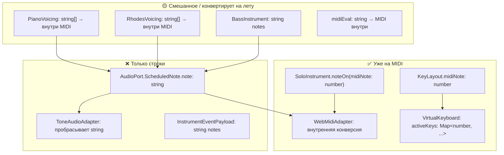
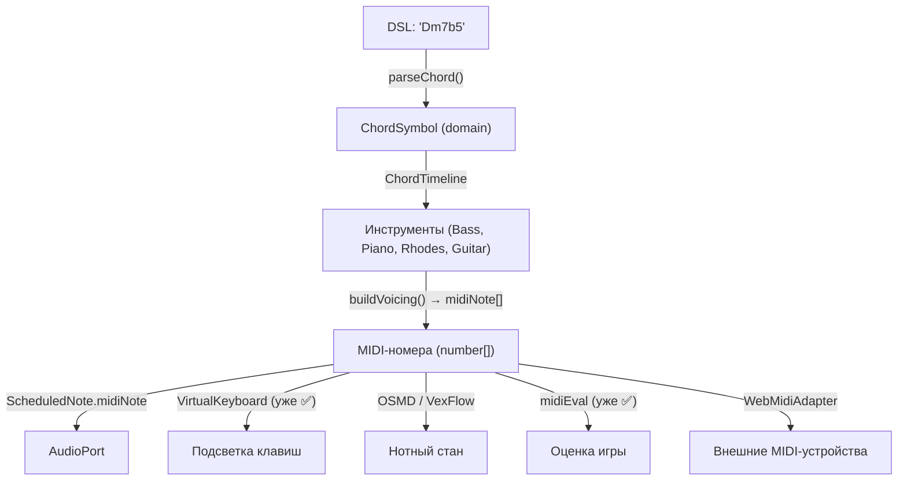

# ADR-015: MIDI как внутреннее представление конкретных нот

> **Дата:** 2026-06-19
> **Статус:** 🟢 Принято
> **Автор:** software-architect AI agent
> **Связанные ADR:** ADR-005 (Ports & Adapters)

---

## Резюме

Ноты в проекте представлены двумя способами: как строки (`"C4"`, `"Eb4"`) и как MIDI-номера (`60`, `63`). Виртуальная клавиатура, Solo-инструменты и midiEval уже работают на MIDI. Аккомпанементные инструменты (Bass, Piano, Rhodes, Guitar) генерируют строки. Конверсия note ↔ MIDI дублирована в 6 местах.

**Решение:** Принять MIDI-номер как каноническое внутреннее представление **конкретных нот** (результат voicing'а), сохранив `ChordSymbol` как доменную абстракцию для аккордов. Мигрировать поэтапно, начиная с унификации конверсии.

---

## 1. Контекст

### 1.1. Текущее состояние: два представления нот



### 1.2. Дублирование конверсии note ↔ MIDI

Конверсия **имя ноты → MIDI-номер** реализована независимо в **6 местах**:

| Файл | Функция | Строки | Примечание |
|------|---------|--------|------------|
| `packages/music-core/src/audio/midiEval.ts` | `parseNoteToMidi()` | 85–93 | Для оценки MIDI-ввода |
| `packages/music-core/src/audio/keyboardLayout.ts` | `noteNameToMidi()` | 155–163 | Для раскладки клавиатуры |
| `packages/music-core/src/audio/pianoVoicing.ts` | `noteToMidi()` / `midiToNote()` | 28–38 | Для голосоведения |
| `packages/music-core/src/audio/rhodesVoicing.ts` | `noteToMidi()` / `midiToNote()` | ≈28–38 | Дубликат pianoVoicing |
| `packages/adapters/webmidi-adapter/src/WebMidiAdapter.ts` | `noteToMidi()` / `midiToNote()` | 58–74 | Для MIDI-вывода |
| `packages/music-core/src/audio/bassInstrument.ts` | `NOTE_SEMITONES` (таблица) | 16–26 | Для генерации басовых нот |

Каждая реализация имеет свой словарь (`NOTE_NAMES`, `SEMITONE`, `NOTE_SEMITONES`) и свою логику конверсии. Это создаёт риск рассинхрона и усложняет рефакторинг.

### 1.3. Цепочка данных: от аккорда до звука

```
DSL ("Dm7b5") → ChordSymbol → ChordTimeline → Инструмент → Voicing (string[]) → EventSink → AudioPort (string) → Адаптер (Tone/WebMIDI)
                                                                                                                         ↑
                                                                                                        Конверсия string → MIDI здесь
```

Ключевое наблюдение: **Voicing уже работает с MIDI-номерами внутри** (pianoVoicing, rhodesVoicing используют `noteToMidi`/`midiToNote`), но на выходе отдаёт строки. Затем адаптеры снова конвертируют строки в MIDI. Это **двойная конверсия** на горячем пути.

---

## 2. Решение

### 2.1. Принцип: «MIDI для нот, ChordSymbol для аккордов»



**Граница ответственности:**

| Слой | Представление | Обоснование |
|------|--------------|-------------|
| DSL / ChordSymbol | `ChordSymbol` (root + quality + ext + alt) | Аккорд — абстракция, а не набор нот. Сведение `Dm7b5` к `[62,65,68,72]` теряет информацию о *качестве*. |
| ChordTimeline | `ChordSymbol \| null` | Операции над аккордами, а не нотами |
| Voicing (pianoVoicing, rhodesVoicing, bass) | `number[]` (MIDI) | Конкретные звуковысотности — естественная точка входа MIDI |
| InstrumentEventPayload | `number` / `number[]` (MIDI) | Горячий путь — никакой конверсии строк |
| ScheduledNote | `midiNote: number` (+ `note?: string` для отладки) | Универсальный контракт для всех адаптеров |
| ToneAudioAdapter | Принимает MIDI, передаёт в Tone.js (поддерживает оба формата) | Без изменений в Tone.js |
| WebMidiAdapter | Прямая отправка MIDI-байтов (без конверсии) | Убирает `noteToMidi()` на каждом событии |
| VirtualKeyboard | `number` (MIDI) ✅ | Уже так |
| SoloInstrument | `number` (MIDI) ✅ | Уже так |
| midiEval | `number` (MIDI) ✅ | Уже конвертит внутри |
| Нотный стан (OSMD/VexFlow) | `number` (MIDI) | Обе библиотеки принимают MIDI-номера |

### 2.2. Что НЕ переходит на MIDI

| Артефакт | Почему |
|----------|--------|
| `ChordSymbol` | Доменный тип. `{root:"D", quality:"halfDiminished", ext:["7"]}` ≠ `[62,65,68,72]`. Аккорд — это не набор нот, а гармоническая функция. |
| DSL-парсер (`parseChord`) | Работает со строками по природе. MIDI здесь не применим. |
| `ChordTimeline` | Оперирует аккордами, а не нотами |
| `DrumEvent` / `DrumSound` | Не pitched-инструмент. Использует свои идентификаторы (`'ride'`, `'kick'`, etc.) |
| `ScheduledClick` | Метроном — не pitched |

---

## 3. План миграции (4 фазы)

### Фаза 1: Унификация конверсии (Quick Win)

**Статус:** 🔴 Не начато
**Оценка:** 4–6 часов
**Риск:** Низкий

**Действия:**
1. Создать `packages/music-core/src/audio/noteConverter.ts`:
   ```ts
   export function noteToMidi(note: string): number;
   export function midiToNote(midi: number): string;
   ```
   Единая реализация с поддержкой всех нотаций (`C#`, `Db`, двойные октавы).

2. Заменить 6 дубликатов на импорт из `noteConverter.ts`:
   - `midiEval.ts`: `parseNoteToMidi` → `noteToMidi`
   - `keyboardLayout.ts`: `noteNameToMidi` → `noteToMidi`
   - `pianoVoicing.ts`: локальные `noteToMidi`/`midiToNote` → импорт
   - `rhodesVoicing.ts`: то же
   - `WebMidiAdapter.ts`: локальные `noteToMidi`/`midiToNote` → импорт из `@jazz/music-core/audio`
   - `bassInstrument.ts`: `NOTE_SEMITONES` → использовать `noteToMidi`

3. Добавить unit-тесты на `noteConverter.ts` (граничные случаи: `Cb4`, `E#3`, `G9`, октавы 0–8).

**DoD:** `npm run typecheck && npm run lint && npm run test` — без ошибок. 0 дубликатов конверсии.

### Фаза 2: InstrumentEventPayload на MIDI

**Статус:** 🔴 Не начато
**Оценка:** 16–24 часа
**Риск:** Средний (затрагивает все инструменты + тесты)

**Действия:**

1. Изменить типы в `instrument.ts`:
   ```ts
   // Было:
   export interface BassEvent { note: string; articulation: BassArticulation; }
   export interface PianoEvent { notes: string[]; }
   export interface RhodesEvent { notes: string[]; }
   export interface GuitarEvent { notes: string[]; strum: GuitarStrum; }

   // Стало:
   export interface BassEvent { midiNote: number; articulation: BassArticulation; }
   export interface PianoEvent { midiNotes: number[]; }
   export interface RhodesEvent { midiNotes: number[]; }
   export interface GuitarEvent { midiNotes: number[]; strum: GuitarStrum; }
   ```

2. Адаптировать генерацию нот в инструментах:
   - `BassInstrument`: генерировать MIDI-номера вместо строк (уже имеет `NOTE_SEMITONES`)
   - `PianoInstrument`: `buildPianoVoicing` возвращает MIDI-номера вместо строк
   - `RhodesInstrument`: `buildVoicing` возвращает MIDI-номера вместо строк
   - `GuitarInstrument`: аналогично

3. Обновить `EventSink` в `ToneAudioAdapter` для работы с MIDI (Tone.js принимает оба формата).

4. Обновить тесты: заменить строковые ожидания на MIDI-номера.

**DoD:** Все инструменты генерируют MIDI. 0 конверсий string→MIDI на горячем пути. Тесты проходят.

### Фаза 3: ScheduledNote — плавная миграция

**Статус:** 🔴 Не начато
**Оценка:** 4–6 часов
**Риск:** Низкий (обратная совместимость)

**Действия:**

1. Расширить `ScheduledNote` в `ports.ts`:
   ```ts
   export interface ScheduledNote {
     time: number;
     note: string;        // сохраняется для обратной совместимости
     midiNote?: number;   // новое: каноническое представление
     duration: number;
     velocity: number;
     voice?: string;
   }
   ```

2. Адаптеры **предпочитают** `midiNote`, если он есть, иначе конвертируют `note`:
   - `ToneAudioAdapter`: `n.midiNote ?? noteToMidi(n.note)`
   - `WebMidiAdapter`: `n.midiNote ?? noteToMidi(n.note)`

3. `TransportEngine` при формировании `ScheduledNote` заполняет оба поля.

4. Через 1–2 релиза (когда все адаптеры обновлены) — сделать `midiNote` обязательным, `note` — опциональным/отладочным.

**DoD:** Обратная совместимость. Все адаптеры работают и со старым, и с новым форматом.

### Фаза 4: Нотный стан и хранение

**Статус:** 🔴 Не начато (ждёт реализации `OSMDSheetMusic`)
**Оценка:** 0 часов (архитектурное решение — делать правильно с нуля)
**Риск:** Отсутствует

**Действия:**

1. `OSMDSheetMusic` (или VexFlow-компонент) принимает ноты как `Array<{midiNote: number, duration: number, startTime: number}>`.
2. При хранении отдельных нот в БД (если появится) — использовать INTEGER для MIDI-номера.
3. При экспорте/импорте MusicXML — использовать MIDI как промежуточный формат.

**DoD:** Новый код работает с MIDI с первого дня.

---

## 4. Альтернативы (отклонённые)

### Альтернатива A: Оставить всё на строках

**Описание:** Не менять текущее представление. Строки остаются каноническим форматом.

**Отклонено потому что:**
- Уже есть раздвоение: клавиатура/Solo/MIDI на числах, аккомпанемент на строках
- Двойная конверсия (voicing → string → MIDI) на горячем пути неоптимальна
- 6 дубликатов конверсии — техдолг, который будет расти

### Альтернатива B: Всё на MIDI, включая ChordSymbol

**Описание:** Перевести абсолютно всё — и аккорды, и ноты — на MIDI-номера.

**Отклонено потому что:**
- `ChordSymbol` — это **доменная абстракция**. `Dm7b5` ≠ `[62,65,68,72]`. Теряется информация о качестве аккорда, функции, голосоведении.
- DSL «Dm7b5» — человекочитаемый формат. Замена на `[62,65,68,72]` сделает сетки нечитаемыми.
- Voicing-алгоритмы (`buildPianoVoicing`) зависят от качества аккорда (major, minor, dominant → разные интервальные формулы). MIDI-номера не несут этой информации.
- Парсинг DSL → `ChordSymbol` → voicing → MIDI — это правильная цепочка. Пропуск `ChordSymbol` ломает архитектуру.

### Альтернатива C: Двойное представление везде

**Описание:** Хранить и `note: string`, и `midiNote: number` во всех структурах.

**Отклонено потому что:**
- Раздувает интерфейсы без необходимости
- Увеличивает риск рассинхрона между полями
- Усложняет тесты (проверять оба поля)
- Достаточно иметь `midiNote` как каноническое и `midiToNote()` для человекочитаемого вывода

---

## 5. Последствия

### Положительные

1. **Единый язык для нот:** Виртуальная клавиатура, живой ввод, оценка игры, нотный стан, MIDI-устройства — все говорят на MIDI. Конверсия происходит один раз (при вводе строк) и один раз (при отображении строк), а не на каждом шаге цепочки.

2. **Устранение 6 дубликатов конверсии:** Один модуль `noteConverter.ts` — единственный источник правды для `noteToMidi`/`midiToNote`.

3. **Упрощение WebMidiAdapter:** Убирается `noteToMidi()` на каждом `scheduleNote()`. MIDI-байты формируются напрямую.

4. **Компактное хранение:** INTEGER (1–2 байта) вместо VARCHAR (2–4 символа) для отдельных нот в БД (если появится).

5. **Упрощение валидации:** `0 <= midiNote <= 127` вместо regex `/^[A-G][#b]?\d+$/`.

6. **Готовность к OSMD/VexFlow:** Обе библиотеки нативно принимают MIDI-номера.

### Отрицательные

1. **Человекочитаемость в отладке:** `[60, 64, 67, 71]` менее понятно, чем `["C4", "E4", "G4", "B4"]`. Митигация: `console.log(midiNotes.map(midiToNote))` при отладке, либо сохранить `note` как опциональное отладочное поле.

2. **Объём изменений:** Фазы 2–3 требуют правок в 15+ файлах и 30+ тестах. Митигация: поэтапный план с обратной совместимостью на каждом шаге.

3. **Риск регрессий в воспроизведении:** Изменение формата событий может привести к тихим ошибкам (строка `"C4"` вместо числа `60`). Митигация: TypeScript-типы предотвращают большинство ошибок на этапе компиляции.

### Нейтральные

1. **Tone.js безразличен к формату:** `triggerAttackRelease("C4", ...)` и `triggerAttackRelease(60, ...)` работают одинаково. Миграция не даёт выигрыша в производительности для Tone-адаптера.

2. **Drum-инструменты не затрагиваются:** `DrumSound` остаётся строковым идентификатором (`'ride'`, `'kick'`).

---

## 6. Оценка трудозатрат

| Фаза | Описание | Оценка | Риск | Зависит от |
|------|----------|--------|------|------------|
| Ф1 | Унификация конверсии (`noteConverter.ts`) | 4–6 ч | Низкий | — |
| Ф2 | `InstrumentEventPayload` на MIDI | 16–24 ч | Средний | Ф1 |
| Ф3 | `ScheduledNote.midiNote` (плавная миграция) | 4–6 ч | Низкий | Ф2 |
| Ф4 | Нотный стан и хранение | 0 ч (арх. решение) | — | Реализация OSMD |
| **Итого** | | **24–36 ч** | | |

---

## 7. Метрики успеха

| Метрика | Было | Стало |
|---------|------|-------|
| Дубликатов `noteToMidi` | 6 | 1 |
| Конверсий string→MIDI на пути `scheduleNote()` в WebMidiAdapter | 1 на каждую ноту | 0 |
| Конверсий string→MIDI на пути voicing→EventSink | 2 (voicing→string + string→MIDI) | 1 (voicing→MIDI) |
| Форматов представления нот в системе | 2 (string + MIDI, в разных слоях) | 1 (MIDI — канонический, string — отладочный) |

---

*ADR принят 2026-06-19. Реализация — согласно плану миграции (4 фазы), начиная с Ф1 (Quick Win: унификация конверсии).*
