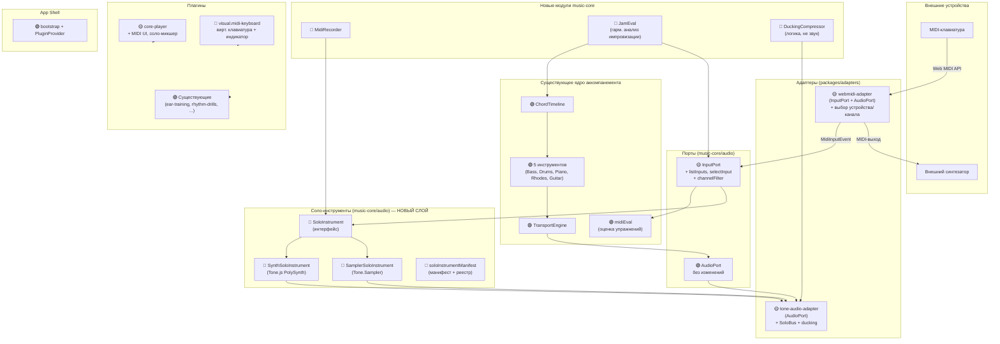
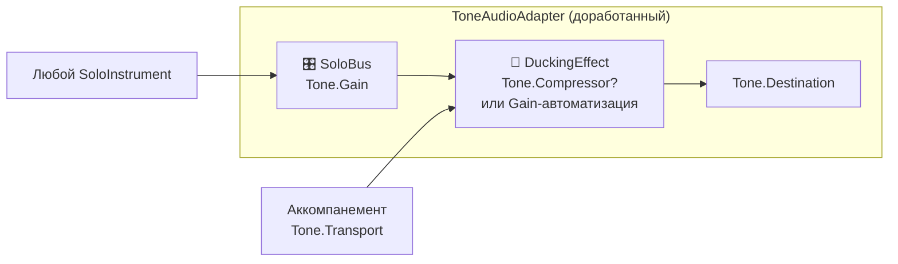
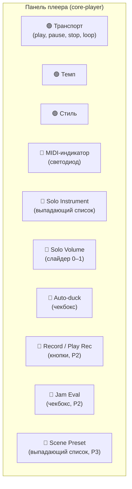
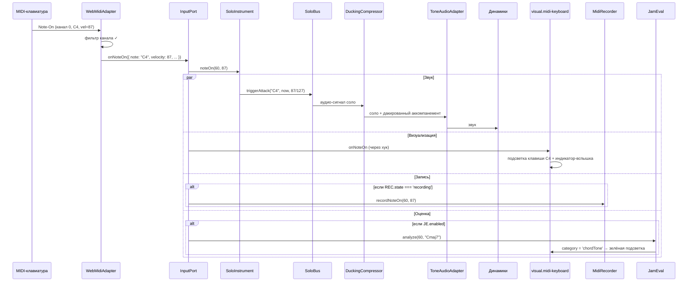
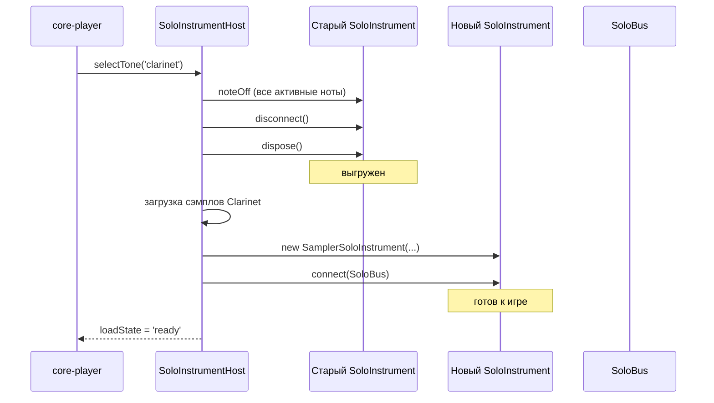
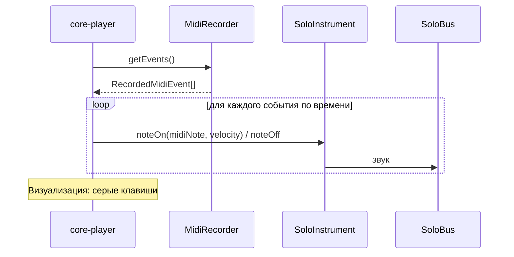

# MIDI INSTRUMENT ARCHITECTURE — Живой MIDI-инструмент

> **Дата:** 2026-06-16
> **Статус:** 🟡 Проект архитектуры (на основе [MIDI_INSTRUMENT_VISION.md](./MIDI_INSTRUMENT_VISION.md))
> **Назначение:** Детальная архитектура функций живого MIDI-инструмента и игры поверх аккомпанемента.
> **Аудитория:** Разработчики, архитектор.
> **Связанные документы:** [ARCHITECTURE_BASE.md](./ARCHITECTURE_BASE.md) (текущая архитектура), [ADR-005](./ARCHITECTURE_BASE.md#adr-005-порты--адаптеры-для-звукаmidi) (порты и адаптеры), [ADR-014](./ARCHITECTURE_BASE.md#adr-014-piano--rhodes-комплементарная-модель-основной--фоновый-слой) (комплементарная модель).

Статусы: 🟢 = реализовано, 🟡 = требует доработки, 🔴 = новый компонент.

---

## 1. Архитектурная цель

Превратить Jazz Trainer из «слушаю и оцениваю» в **«играю с бэндом»**. Для этого:

1. **MIDI-ввод** становится не просто оценкой (`midiEval`), а **живым источником звука** — пользователь слышит свою игру.
2. **Новый слой соло-инструментов** (`SoloInstrument`) — отдельная абстракция поверх существующей системы `Instrument`/`InstrumentManifest` для аккомпанемента.
3. **Соло-шина** (`SoloBus`) в `ToneAudioAdapter` — отдельный аудиотракт для живой игры, не затрагивающий планирование аккомпанемента через `Tone.Transport.schedule`.
4. **Новый плагин** `visual.midi-keyboard` — визуализация игры (виртуальная клавиатура, MIDI-индикатор).
5. **Расширение** `core-player` — новые элементы управления (тембр, громкость соло, ducking, запись).

---

## 2. Общая архитектурная схема



---

## 3. Слои и границы

Новые компоненты строго следуют существующей слоёной архитектуре (см. `ARCHITECTURE_BASE.md` §2). **Ни один новый компонент не нарушает границы слоёв.**

| Слой                  | Существующее                               | Добавляемое                                                                                                                                                     | Статус |
| --------------------- | ------------------------------------------ | --------------------------------------------------------------------------------------------------------------------------------------------------------------- | ------ |
| `core` (`music-core`) | `ports.ts`, `instrument.ts`, `midiEval.ts` | `soloInstrument.ts`, `synthSoloInstrument.ts`, `samplerSoloInstrument.ts`, `soloInstrumentManifest.ts`, `midiRecorder.ts`, `jamEval.ts`, `duckingCompressor.ts` | 🔴     |
| `core` (`shared`)     | DTO, константы                             | `ScenePresetDTO`, `SoloInstrumentDTO`, `MidiSettingsDTO`                                                                                                        | 🔴     |
| `adapters`            | `tone-audio-adapter`, `webmidi-adapter`    | Расширение: `SoloBus`, `deviceSelection`, `channelFilter`                                                                                                       | 🟡     |
| `plugins`             | 17 плагинов                                | `visual.midi-keyboard` (новый), доработка `core-player`                                                                                                         | 🔴     |
| `apps/api`            | `settings.routes.ts`                       | `midiSettings` CRUD (сохранение пресетов, настроек MIDI)                                                                                                        | 🔴     |

**Правила импортов (ESLint `boundaries`) соблюдены:**

- `SoloInstrument` и производные — в `music-core`, **без браузерных API**.
- `SynthSoloInstrument` и `SamplerSoloInstrument` — чистые обёртки: принимают Tone.js-объекты через конструктор (DI), а не импортируют `tone` напрямую. Это сохраняет тестируемость ядра.
- Плагины (`visual.midi-keyboard`, `core-player`) импортируют только `@jazz/plugin-sdk`, `@jazz/music-core`, `@jazz/shared`.
- Адаптеры знают о Tone.js и Web MIDI API — и только они.

---

## 4. Детальный дизайн компонентов

### 4.1. Расширение InputPort (music-core)

**Файл:** `packages/music-core/src/audio/ports.ts` (доработка 🟡)

```ts
/** Информация о MIDI-устройстве ввода. */
export interface MidiDeviceInfo {
  id: string; // Уникальный ID устройства (из Web MIDI API)
  name: string; // Читаемое имя
  manufacturer?: string;
}

/**
 * Расширенный порт MIDI-ввода.
 * Добавляет выбор устройства, фильтр каналов и статус подключения.
 */
export interface InputPort {
  // ── Существующие методы (без изменений) ──
  onNoteOn(handler: (event: MidiInputEvent) => void): () => void;
  onNoteOff(handler: (event: MidiInputEvent) => void): () => void;
  devices(): Promise<string[]>; // 🔴 deprecated, замена на listInputs()

  // ── Новые методы ──
  /** Список доступных входов с метаданными. */
  listInputs(): Promise<MidiDeviceInfo[]>;

  /** Выбрать активное устройство по ID. Если не вызван — слушать все. */
  selectInput(deviceId: string | null): void;

  /** Получить ID текущего активного устройства (null = все). */
  readonly activeDeviceId: string | null;

  /** Фильтр MIDI-каналов: номер канала 0–15 или 'all'. */
  setChannelFilter(channel: number | 'all'): void;

  /** Текущий фильтр каналов. */
  readonly channelFilter: number | 'all';

  /** Статус подключения: 'disconnected' | 'available' | 'connected'. */
  readonly connectionStatus: 'disconnected' | 'available' | 'connected';

  /** Колбэк при изменении состояния подключения (hot-plug). */
  onConnectionChange(
    handler: (status: 'disconnected' | 'available' | 'connected') => void,
  ): () => void;
}
```

**Принципы расширения:**

- Существующие методы `onNoteOn`, `onNoteOff` — без изменений (обратная совместимость).
- `devices()` помечается deprecated, заменяется на `listInputs()`.
- `WebMidiAdapter` уже хранит `inputs` и `onstatechange` — доработка сводится к добавлению `selectInput` и `channelFilter`.

### 4.2. SoloInstrument — новый интерфейс (music-core)

**Файл:** `packages/music-core/src/audio/soloInstrument.ts` (🔴 новый)

```ts
/**
 * Живой соло-инструмент, управляемый MIDI-вводом.
 *
 * В отличие от {@link Instrument} (который планирует ноты через
 * TransportEngine на будущее), SoloInstrument реагирует на живые
 * MIDI-события немедленно.
 *
 * Каждый экземпляр — один тембр. Переключение тембра = dispose
 * старого + создание нового.
 */
export interface SoloInstrument {
  /** Уникальный ID тембра, например 'synth-default', 'piano-salamander'. */
  readonly id: string;

  /** Читаемое имя тембра. */
  readonly name: string;

  /** Категория: 'synth' | 'sampled' | 'reuse' (переиспользование сэмплов аккомпанемента). */
  readonly category: 'synth' | 'sampled' | 'reuse';

  /** Вызвать при MIDI note-on. */
  noteOn(midiNote: number, velocity: number, time?: number): void;

  /** Вызвать при MIDI note-off. */
  noteOff(midiNote: number, time?: number): void;

  /**
   * Подключить выход инструмента к аудио-узлу (обычно SoloBus).
   * Вызывается один раз при инициализации.
   */
  connect(destination: AudioNode): void;

  /** Отключить от аудио-узла. */
  disconnect(): void;

  /** Освободить ресурсы (сэмплы, осцилляторы). */
  dispose(): void;
}
```

**Ключевые отличия от `Instrument`:**
| Аспект | `Instrument` (аккомпанемент) | `SoloInstrument` (соло) |
|---|---|---|
| Триггер | TransportEngine.schedule (look-ahead) | MIDI note-on (реальное время) |
| Метод | `schedule(window, ctx)` | `noteOn(midiNote, velocity)` |
| Время | Абсолютные тики / transport seconds | `performance.now()` / `time` |
| Жизненный цикл | Создаётся на старт, живёт всю сессию | Создаётся/уничтожается при смене тембра |
| Выход | Через TransportEngine → AudioPort | Напрямую в SoloBus → AudioPort |

### 4.3. SynthSoloInstrument — дефолтный синтезатор

**Файл:** `packages/music-core/src/audio/synthSoloInstrument.ts` (🔴 новый)

Чистая обёртка над `Tone.PolySynth`. **Не импортирует Tone.js напрямую** — принимает сконфигурированный синтезатор через конструктор (DI). Это позволяет тестировать логику без браузера.

```ts
export interface SynthSoloInstrumentOptions {
  /** Максимальная полифония (по умолчанию: 16). */
  maxVoices?: number;
  /** Базовые параметры огибающей. */
  envelope?: {
    attack?: number; // сек, default 0.01
    decay?: number; // сек, default 0.1
    sustain?: number; // 0–1, default 0.7
    release?: number; // сек, default 0.2
  };
}

export class SynthSoloInstrument implements SoloInstrument {
  readonly id = 'synth-default';
  readonly name = 'Synth (Default)';
  readonly category = 'synth' as const;

  // Принимает готовый Tone.PolySynth (или совместимый) через DI
  constructor(
    private synth: PolySynthLike,
    options?: SynthSoloInstrumentOptions,
  ) {
    /* ... */
  }

  noteOn(midiNote: number, velocity: number, time?: number): void {
    /* ... */
  }
  noteOff(midiNote: number, time?: number): void {
    /* ... */
  }
  connect(destination: AudioNode): void {
    /* ... */
  }
  disconnect(): void {
    /* ... */
  }
  dispose(): void {
    /* ... */
  }
}
```

**DI-интерфейс `PolySynthLike`:**

```ts
/** Минимальный интерфейс полифонического синтезатора для DI. */
export interface PolySynthLike {
  triggerAttackRelease(
    notes: string | string[],
    duration: number | string,
    time?: number,
    velocity?: number,
  ): void;
  triggerAttack(note: string, time?: number, velocity?: number): void;
  triggerRelease(note: string, time?: number): void;
  connect(destination: any): void;
  disconnect(): void;
  dispose(): void;
  set(params: Record<string, unknown>): void;
  readonly volume: { value: number };
}
```

### 4.4. SamplerSoloInstrument — сэмплированные тембры

**Файл:** `packages/music-core/src/audio/samplerSoloInstrument.ts` (🔴 новый)

Аналогично `SynthSoloInstrument` — чистая DI-обёртка над `Tone.Sampler` (или совместимым):

```ts
export interface SamplerSoloInstrumentOptions {
  /** Базовый URL для сэмплов (если не указан в манифесте). */
  baseUrl?: string;
  /** Слой громкости в dB (по умолчанию: 0). */
  volumeDb?: number;
}

export class SamplerSoloInstrument implements SoloInstrument {
  readonly id: string;
  readonly name: string;
  readonly category = 'sampled' as const;

  constructor(
    id: string,
    name: string,
    private sampler: SamplerLike, // DI
    options?: SamplerSoloInstrumentOptions,
  ) {
    /* ... */
  }
  // ... реализация SoloInstrument
}
```

**Стратегия переиспользования сэмплов аккомпанемента:**

- `piano-salamander`: `category = 'reuse'` — использует тот же `Tone.Sampler`, что и `PianoInstrument`, но подключается к `SoloBus`, а не к транспорту.
- `rhodes-jrhodes3c`: аналогично.
- Это не `SamplerSoloInstrument`, а специальный адаптер `ReuseSoloInstrument`, который оборачивает существующий сэмплер.

### 4.5. SoloInstrumentManifest — система манифестов

**Файл:** `packages/music-core/src/audio/soloInstrumentManifest.ts` (🔴 новый)

Аналог `InstrumentManifest` для соло-инструментов:

```ts
export interface SoloInstrumentManifest {
  /** Уникальный ID тембра. */
  id: string;
  /** Читаемое имя. */
  name: string;
  /** Категория. */
  category: 'synth' | 'sampled' | 'reuse';
  /**
   * Фабрика: создаёт SoloInstrument.
   * Принимает фабрики для создания аудио-объектов
   * (внедряются адаптером, а не импортируются из Tone.js).
   */
  createInstrument(factories: SoloInstrumentFactories): SoloInstrument;
  /**
   * Для sampled/reuse: сэмплы, которые нужно загрузить.
   * Для synth: undefined (синтез не требует загрузки).
   */
  samples?: SoloInstrumentSamples;
  /** Приоритет загрузки (для lazy-load). */
  priority?: 'high' | 'normal' | 'low';
}

/** Фабрики аудио-объектов (внедряются адаптером). */
export interface SoloInstrumentFactories {
  createPolySynth(options?: SynthSoloInstrumentOptions): PolySynthLike;
  createSampler(samples: Record<string, string>, baseUrl: string): SamplerLike;
  getReuseSampler(instrumentId: string): SamplerLike | null;
}

/** Описание сэмплов соло-инструмента. */
export interface SoloInstrumentSamples {
  /** URL-путь к сэмплам относительно baseUrl. */
  baseUrl: string;
  /** Раскладка: нота → имя файла. */
  notes: Record<string, string>;
  /** Длительность нот в секундах (для triggerRelease). */
  noteDurations?: Record<string, number>;
}
```

**Реестр соло-инструментов** — отдельный статический массив (аналогично `INSTRUMENT_MANIFESTS` для аккомпанемента):

```ts
// packages/music-core/src/audio/soloInstrumentRegistry.ts
import { synthDefaultManifest } from './manifests/synthDefaultManifest.js';
import { pianoSalamanderSoloManifest } from './manifests/pianoSalamanderSoloManifest.js';
// ... ещё 6 манифестов

export const SOLO_INSTRUMENT_MANIFESTS: SoloInstrumentManifest[] = [
  synthDefaultManifest, // P0 — всегда доступен
  pianoSalamanderSoloManifest, // P1 — переиспользование
  rhodesJRhodes3cSoloManifest, // P1 — переиспользование
  clarinetManifest, // P1
  vibraphoneManifest, // P1
  guitarNylonSoloManifest, // P1
  synthLeadManifest, // P1 — FMSynth
  trumpetMutedManifest, // P2
  fluteManifest, // P2
];
```

---

## 5. Доработка адаптеров

### 5.1. WebMidiAdapter — выбор устройства и канала

**Файл:** `packages/adapters/webmidi-adapter/src/WebMidiAdapter.ts` (доработка 🟡)

**Текущее состояние:** `WebMidiAdapter` реализует `AudioPort` и `InputPort`. Слушает **все** MIDI-входы одновременно. Канал не фильтруется.

**Необходимые доработки:**

| Метод/Свойство      | Текущее                                            | Целевое                                               |
| ------------------- | -------------------------------------------------- | ----------------------------------------------------- |
| `init()`            | Запрашивает MIDIAccess, подписывается на все входы | Без изменений                                         |
| `handleMidiMessage` | Принимает все каналы                               | Фильтрует по `this.channelFilter`                     |
| `devices()`         | Возвращает `string[]` имён                         | ➕ `listInputs(): Promise<MidiDeviceInfo[]>`          |
| —                   | —                                                  | ➕ `selectInput(deviceId: string \| null)`            |
| —                   | —                                                  | ➕ `activeDeviceId`                                   |
| —                   | —                                                  | ➕ `setChannelFilter(channel \| 'all')`               |
| —                   | —                                                  | ➕ `channelFilter`                                    |
| —                   | —                                                  | ➕ `connectionStatus` (вычисляется из наличия входов) |
| `onstatechange`     | Переподписка на все входы                          | ➕ вызов `onConnectionChange` колбэков                |

**Хранение состояния:**

```ts
private activeInputId: string | null = null;   // null = все
private channelMask: number | 'all' = 'all';
private connectionHandlers: Array<...> = [];
```

**Фильтрация каналов в `handleMidiMessage`:**

```ts
private handleMidiMessage = (event: MidiMessageEvent): void => {
  const data = event.data;
  if (!data || data.length < 3) return;
  const status = data[0]!;
  const channel = status & 0x0f;

  // Фильтр каналов
  if (this.channelMask !== 'all' && channel !== this.channelMask) return;

  // ... остальная логика без изменений
};
```

### 5.2. ToneAudioAdapter — SoloBus и живой звук

**Файл:** `packages/adapters/tone-audio-adapter/src/ToneAudioAdapter.ts` (доработка 🟡)

**Текущее состояние:** `ToneAudioAdapter` — чистый планировщик (schedule + Transport). Живого звука нет.

**Добавляемые компоненты:**



**SoloBus** — отдельная шина (Gain-узел) для всех соло-инструментов:

```ts
export class ToneAudioAdapter implements AudioPort {
  // Существующие поля...
  private soloBus: Tone.Gain; // 🔴 новый
  private duckingGain: Tone.Gain; // 🔴 новый (для автоматизации ducking)
  private accompBus: Tone.Gain; // 🔴 новый (шина аккомпанемента)

  constructor(options: ToneAudioAdapterOptions = {}) {
    // ... существующая инициализация

    // Создание соло-шины
    this.soloBus = new Tone.Gain(0.8).toDestination();
    this.accompBus = new Tone.Gain(0.9);
    this.duckingGain = new Tone.Gain(1);

    // Маршрутизация
    this.accompBus.connect(this.duckingGain);
    this.soloBus.connect(Tone.Destination);
    this.duckingGain.connect(Tone.Destination);
  }

  /** Получить SoloBus для подключения соло-инструментов. */
  getSoloBus(): Tone.Gain {
    return this.soloBus;
  }

  /** Установить громкость соло (0–1). */
  setSoloVolume(value: number): void {
    this.soloBus.gain.rampTo(value, 0.05);
  }

  /**
   * Включить/выключить авто-дакинг.
   * При активном дакинге: когда соло-инструмент играет,
   * громкость аккомпанемента снижается на указанную глубину.
   */
  setDucking(enabled: boolean, depthDb?: number): void {
    /* ... */
  }
}
```

**Ducking-компрессор** (звуковая реализация — в адаптере, логика — в `music-core`):

- **Логика** (`music-core/audio/duckingCompressor.ts`): принимает поток MIDI-событий, определяет «активность» (есть ли игра), вычисляет целевой gain для аккомпанемента. Это чистый код, тестируемый без браузера.
- **Звук** (в `ToneAudioAdapter`): применяет gain-автоматизацию с параметрами attack ~20ms, release ~300ms, мягкий knee.

**Почему не `Tone.Compressor`:** ducking через компрессор на мастер-шине затронул бы и соло, и аккомпанемент. Нужна избирательная автоматизация gain только на шине аккомпанемента.

---

## 6. MidiRecorder — запись перформанса

**Файл:** `packages/music-core/src/audio/midiRecorder.ts` (🔴 новый)

**Чистая логика** (без Tone.js, без Web MIDI):

```ts
/** Одно записанное MIDI-событие. */
export interface RecordedMidiEvent {
  /** MIDI-нота (0–127). */
  midiNote: number;
  /** Velocity (0–127). */
  velocity: number;
  /** Тип события. */
  type: 'noteOn' | 'noteOff';
  /**
   * Время от начала записи в секундах.
   * Привязано к performance.now() во время записи.
   */
  time: number;
}

/** Состояние рекордера. */
export type RecorderState = 'idle' | 'recording' | 'playing';

export class MidiRecorder {
  private events: RecordedMidiEvent[] = [];
  private state: RecorderState = 'idle';
  private startTime: number = 0;
  private playStartTime: number = 0;
  private activeNotes: Set<number> = new Set();

  /** Начать запись. */
  start(): void {
    /* ... */
  }

  /** Остановить запись. */
  stop(): RecordedMidiEvent[] {
    /* ... */
  }

  /** Записать note-on (вызывается из MIDI-обработчика). */
  recordNoteOn(midiNote: number, velocity: number): void {
    /* ... */
  }

  /** Записать note-off. */
  recordNoteOff(midiNote: number): void {
    /* ... */
  }

  /**
   * Получить события для воспроизведения.
   * Возвращает генератор или массив с относительным временем.
   */
  getEvents(): ReadonlyArray<RecordedMidiEvent> {
    /* ... */
  }

  /** Есть ли записанные данные. */
  get hasRecording(): boolean {
    return this.events.length > 0;
  }

  /** Текущее состояние. */
  get currentState(): RecorderState {
    return this.state;
  }

  /** Сбросить запись. */
  clear(): void {
    /* ... */
  }

  /**
   * Экспорт в Standard MIDI File формат (ArrayBuffer).
   * Чистая логика, не зависит от платформы.
   */
  exportMidiFile(): ArrayBuffer {
    /* ... */
  }
}
```

**Интеграция с MIDI-потоком:**

```
MIDI-клавиатура
  → WebMidiAdapter.handleMidiMessage
    → InputPort.onNoteOn / onNoteOff
      ├→ SoloInstrument.noteOn / noteOff (звук)
      ├→ MidiRecorder.recordNoteOn / recordNoteOff (запись, если включена)
      └→ JamEval (оценка, если включена)
```

---

## 7. JamEval — гармонический анализ импровизации

**Файл:** `packages/music-core/src/audio/jamEval.ts` (🔴 новый)

**Чистая логика** — расширение существующего `midiEval`, но для свободной игры (без ожидаемых нот):

```ts
/** Классификация ноты относительно аккорда. */
export type NoteCategory =
  | 'chordTone' // 1, 3, 5, 7 аккорда
  | 'tension' // 9, 11, 13
  | 'chromatic' // Хроматический подход (между chord tones)
  | 'outside'; // Вне тональности и аккорда

/** Результат анализа одной ноты. */
export interface JamNoteAnalysis {
  midiNote: number;
  noteName: string;
  category: NoteCategory;
  /** Аккорд, относительно которого оценивалась нота. */
  relativeToChord: string;
}

/** Накопленная статистика по импровизации. */
export interface JamEvalStatistics {
  /** Общее количество проанализированных нот. */
  totalNotes: number;
  /** Распределение по категориям. */
  distribution: Record<NoteCategory, number>;
  /** Распределение в процентах. */
  distributionPct: Record<NoteCategory, number>;
  /** Средняя velocity. */
  averageVelocity: number;
  /** Диапазон использованных нот (min/max MIDI). */
  noteRange: { min: number; max: number };
  /** Статистика по аккордам сетки. */
  perChord: Record<
    string,
    {
      totalNotes: number;
      distribution: Record<NoteCategory, number>;
    }
  >;
}

export class JamEval {
  private analyses: JamNoteAnalysis[] = [];

  /**
   * Проанализировать ноту относительно текущего аккорда.
   * @param midiNote — сыгранная нота (0–127)
   * @param chord — текущий аккорд из ChordTimeline (строка типа "Cmaj7")
   * @param key — тональность (для определения outside)
   */
  analyze(midiNote: number, chord: string, key?: string): JamNoteAnalysis {
    // Использует существующие parseChord из music-core/chords
    // Определяет принадлежность ноты к аккорду
    // Возвращает категорию
  }

  /** Получить накопленную статистику. */
  getStatistics(): JamEvalStatistics {
    /* ... */
  }

  /** Сбросить статистику. */
  reset(): void {
    /* ... */
  }

  /** Включён ли анализ. */
  enabled: boolean = false;
}
```

**Интеграция с ChordTimeline:**

- `JamEval` получает текущий аккорд через `ChordTimeline.getChordAtTime(transportSeconds)`.
- ChordTimeline уже поддерживает sub-bar разрешение — это позволит точно определить аккорд для каждой ноты.

---

## 8. Визуализация — плагин `visual.midi-keyboard`

**Пакет:** `packages/plugins/visual-midi-keyboard/` (🔴 новый)

### 8.1. Структура плагина

```
packages/plugins/visual-midi-keyboard/
├── src/
│   ├── index.ts                    # definePlugin + вклады
│   ├── VirtualKeyboard.tsx         # Компонент виртуальной клавиатуры
│   ├── VirtualKeyboard.test.ts
│   ├── MidiIndicator.tsx           # MIDI-индикатор (светодиод)
│   ├── MidiIndicator.test.ts
│   ├── MidiLog.tsx                 # MIDI-лог (последние N нот)
│   ├── useMidiVisualizer.ts        # Хук: подписка на MIDI + состояние клавиш
│   └── keyboardLayout.ts           # Раскладка клавиш, геометрия
└── package.json
```

### 8.2. Манифест плагина

```ts
// packages/plugins/visual-midi-keyboard/src/index.ts
export default definePlugin({
  manifest: {
    id: 'visual.midi-keyboard',
    name: 'MIDI Visualizer',
    apiVersion: 1,
    category: 'play', // 🔴 новая категория (или 'practice')
    description: 'Виртуальная MIDI-клавиатура и индикатор игры',
  },
  contributes: {
    // Плагин не добавляет страниц — это оверлей/виджет
    commands: [
      {
        id: 'midi-keyboard.toggle',
        label: 'Toggle MIDI Keyboard',
        run: (ctx) => {
          /* переключение видимости */
        },
      },
    ],
  },
});
```

### 8.3. Модель данных виртуальной клавиатуры

```ts
/** Состояние одной клавиши. */
interface KeyState {
  note: string; // "C4"
  midiNote: number; // 60
  isBlack: boolean;
  /** 0–1: яркость подсветки, пропорциональна velocity. */
  brightness: number;
  /** Цвет подсветки в зависимости от режима. */
  highlightColor?: 'blue' | 'green' | 'yellow' | 'red' | null;
  /** Для scale-highlight: является ли нота нотой лада. */
  isScaleTone?: boolean;
  /** Для chord-highlight: является ли нота нотой аккорда. */
  isChordTone?: boolean;
}

/** Режим отображения клавиатуры. */
type KeyboardMode = 'free' | 'scale-highlight' | 'chord-highlight';

/** Пропсы компонента. */
interface VirtualKeyboardProps {
  /** Диапазон октав (по умолчанию: [3, 5] — C3–C5). */
  octaveRange?: [number, number];
  /** Режим подсветки. */
  mode?: KeyboardMode;
  /** Показывать названия нот на белых клавишах. */
  showLabels?: boolean;
  /** Компактный режим для мобильных. */
  compact?: boolean;
}
```

### 8.4. Хук `useMidiVisualizer`

```ts
/**
 * Подписывается на MIDI-события через PluginContext
 * и предоставляет состояние для визуализации.
 */
function useMidiVisualizer(options?: {
  mode?: KeyboardMode;
  scaleNotes?: number[]; // MIDI-ноты лада
  chordNotes?: number[]; // MIDI-ноты текущего аккорда
}): {
  /** Состояние всех клавиш в диапазоне. */
  activeKeys: Map<number, KeyState>;
  /** Последние N сыгранных нот (для MidiLog). */
  recentNotes: Array<{ note: string; velocity: number; timestamp: number }>;
  /** Статус MIDI-подключения. */
  connectionStatus: 'disconnected' | 'available' | 'connected';
  /** Мигание индикатора (true = вспышка). */
  indicatorFlash: boolean;
};
```

### 8.5. MIDI-индикатор

```tsx
const MidiIndicator: React.FC<{
  status: 'disconnected' | 'available' | 'connected';
  flash: boolean;
}> = ({ status, flash }) => {
  const color = status === 'connected' ? 'green' : status === 'available' ? 'yellow' : 'red';

  return (
    <span className={`midi-indicator ${color} ${flash ? 'flash' : ''}`} title={`MIDI: ${status}`} />
  );
};
```

CSS-анимация вспышки: зелёный → ярко-зелёный → зелёный за 100ms.

---

## 9. Доработка плагина `core-player`

**Файлы:** `packages/plugins/core-player/src/PlayerPage.tsx`, `index.ts` (доработка 🟡)

### 9.1. Новые элементы UI



### 9.2. Управление соло-инструментом

```ts
// В PlayerPage.tsx — новый хук или контекст
function useSoloInstrument(): {
  /** Текущий выбранный тембр. */
  currentTone: SoloInstrument | null;
  /** Список доступных тембров. */
  availableTones: SoloInstrumentManifest[];
  /** Выбрать тембр по ID. */
  selectTone(id: string): void;
  /** Громкость соло (0–1). */
  soloVolume: number;
  /** Установить громкость. */
  setSoloVolume(v: number): void;
  /** Статус загрузки сэмплов. */
  loadState: 'idle' | 'loading' | 'ready' | 'error';
};
```

### 9.3. Логика скрытия MIDI-элементов

Все MIDI-элементы скрываются (display: none или opacity + disabled), если `connectionStatus !== 'connected'`:

```ts
const { connectionStatus } = useMidiConnection();
const midiReady = connectionStatus === 'connected';
```

---

## 10. Scene Presets — модель данных

### 10.1. DTO (shared)

**Файл:** `packages/shared/src/dto.ts` (доработка 🔴)

```ts
/** Пресет сцены. */
export const ScenePresetDTO = z.object({
  id: z.string(),
  name: z.string(),
  isBuiltIn: z.boolean(), // true для 5 стандартных
  // Аккомпанемент
  style: StyleIdDTO,
  tempo: z.number().min(20).max(400),
  instruments: z.object({
    bass: InstrumentPresetDTO,
    drums: InstrumentPresetDTO,
    piano: InstrumentPresetDTO,
    rhodes: InstrumentPresetDTO,
  }),
  // Соло
  solo: z.object({
    toneId: z.string(), // ID тембра из SoloInstrumentManifest
    volume: z.number().min(0).max(1),
  }),
  // Визуализация
  visual: z.object({
    keyboardMode: z.enum(['free', 'scale-highlight', 'chord-highlight']),
    keyboardOctaves: z.tuple([z.number(), z.number()]).optional(),
  }),
  // Прочее
  duckingEnabled: z.boolean(),
  jamEvalEnabled: z.boolean(),
});

export type ScenePresetDTO = z.infer<typeof ScenePresetDTO>;

/** Настройки одного инструмента в пресете. */
const InstrumentPresetDTO = z.object({
  enabled: z.boolean(),
  volume: z.number().min(0).max(1),
  // Специфичные для инструмента настройки могут расширяться
});
```

### 10.2. Хранение

- **Стандартные пресеты (5 шт.):** захардкожены в `shared/src/constants.ts`.
- **Пользовательские пресеты:** сохраняются в `userSettings` → `scenePresets: ScenePresetDTO[]` через существующий API настроек (`/api/settings`). **Новый эндпоинт не требуется** — `userSettings` уже поддерживает произвольный JSON.

### 10.3. Поток применения пресета

```
ScenePresetDTO
  → core-player: applyPreset(preset)
    → TransportEngine: setStyle(preset.style), setBpm(preset.tempo)
    → Каждый InstrumentManifest: применить enabled/volume
    → SoloInstrumentHost: selectTone(preset.solo.toneId)
    → SoloBus: setVolume(preset.solo.volume)
    → visual.midi-keyboard: setMode(preset.visual.keyboardMode)
    → DuckingCompressor: setEnabled(preset.duckingEnabled)
    → JamEval: setEnabled(preset.jamEvalEnabled)
```

---

## 11. Потоки данных (Data Flow)

### 11.1. Основной поток: MIDI-нота → звук + визуализация



### 11.2. Поток смены тембра



### 11.3. Поток воспроизведения записи



---

## 12. Файловая структура (что где создаётся)

```
packages/music-core/src/audio/
├── ports.ts                          # 🟡 РАСШИРИТЬ: InputPort + MidiDeviceInfo
├── soloInstrument.ts                 # 🔴 НОВЫЙ: интерфейс SoloInstrument
├── synthSoloInstrument.ts            # 🔴 НОВЫЙ: SynthSoloInstrument + PolySynthLike
├── samplerSoloInstrument.ts          # 🔴 НОВЫЙ: SamplerSoloInstrument + SamplerLike
├── reuseSoloInstrument.ts            # 🔴 НОВЫЙ: обёртка для переиспользования сэмплов
├── soloInstrumentManifest.ts         # 🔴 НОВЫЙ: SoloInstrumentManifest + Factories
├── soloInstrumentRegistry.ts         # 🔴 НОВЫЙ: реестр всех соло-манифестов
├── manifests/                        # 🔴 НОВАЯ папка
│   ├── synthDefaultManifest.ts       # Манифест дефолтного синтеза
│   ├── synthLeadManifest.ts          # Манифест FMSynth-лида
│   ├── pianoSalamanderSoloManifest.ts # Переиспользование Salamander
│   ├── rhodesJRhodes3cSoloManifest.ts # Переиспользование jRhodes3c
│   ├── clarinetManifest.ts           # Кларнет (VSCO)
│   ├── vibraphoneManifest.ts         # Вибрафон (FreePats)
│   ├── guitarNylonSoloManifest.ts    # Нейлоновая гитара
│   ├── trumpetMutedManifest.ts       # Труба с сурдиной (VSCO)
│   └── fluteManifest.ts              # Флейта (VSCO)
├── midiRecorder.ts                   # 🔴 НОВЫЙ: MidiRecorder + экспорт .mid
├── midiRecorder.test.ts              # 🔴 НОВЫЙ: тесты
├── jamEval.ts                        # 🔴 НОВЫЙ: JamEval + статистика
├── jamEval.test.ts                   # 🔴 НОВЫЙ: тесты
├── duckingCompressor.ts              # 🔴 НОВЫЙ: логика ducking (чистая)
└── duckingCompressor.test.ts         # 🔴 НОВЫЙ: тесты

packages/adapters/webmidi-adapter/src/
└── WebMidiAdapter.ts                 # 🟡 РАСШИРИТЬ: selectInput, channelFilter, status

packages/adapters/tone-audio-adapter/src/
├── ToneAudioAdapter.ts               # 🟡 РАСШИРИТЬ: SoloBus, setSoloVolume, ducking
└── SoloBus.ts                        # 🔴 НОВЫЙ: инкапсуляция соло-шины

packages/shared/src/
├── dto.ts                            # 🟡 РАСШИРИТЬ: ScenePresetDTO
└── constants.ts                      # 🟡 РАСШИРИТЬ: BUILT_IN_SCENE_PRESETS

packages/plugins/visual-midi-keyboard/ # 🔴 НОВЫЙ ПАКЕТ
├── src/
│   ├── index.ts
│   ├── VirtualKeyboard.tsx
│   ├── VirtualKeyboard.test.ts
│   ├── MidiIndicator.tsx
│   ├── MidiLog.tsx
│   ├── useMidiVisualizer.ts
│   └── keyboardLayout.ts
├── package.json
└── tsconfig.json

packages/plugins/core-player/src/
├── index.ts                          # 🟡 РАСШИРИТЬ: новый navItem?
├── PlayerPage.tsx                    # 🟡 РАСШИРИТЬ: MIDI UI
└── components/                       # 🔴 НОВАЯ папка
    ├── MidiIndicator.tsx             # Реэкспорт или локальный
    ├── SoloInstrumentSelector.tsx    # Выпадающий список тембров
    ├── SoloVolumeSlider.tsx          # Слайдер громкости
    ├── DuckingToggle.tsx             # Чекбокс auto-duck
    ├── RecordButton.tsx              # Кнопки Record/Play (P2)
    ├── JamEvalToggle.tsx             # Чекбокс Jam Eval (P2)
    └── ScenePresetSelector.tsx       # Выпадающий список пресетов (P3)
```

---

## 13. Управление состоянием в плагинах

### 13.1. SoloInstrumentHost (в плагине core-player)

```ts
/**
 * Владелец жизненного цикла соло-инструментов.
 *
 * Живёт в контексте плагина core-player.
 * Создаёт/уничтожает SoloInstrument при смене тембра.
 * Управляет загрузкой сэмплов (lazy-load).
 */
class SoloInstrumentHost {
  private current: SoloInstrument | null = null;
  private factories: SoloInstrumentFactories; // от адаптера
  private manifests: SoloInstrumentManifest[]; // из реестра
  private loadCache: Map<string, SoloInstrument> = new Map();

  async selectTone(id: string): Promise<void> {
    // 1. Отключить и dispose текущий
    // 2. Проверить кеш загрузки
    // 3. Если нет — создать через manifest.createInstrument(factories)
    // 4. Подключить к SoloBus
    // 5. Обновить состояние
  }

  handleNoteOn(midiNote: number, velocity: number): void {
    this.current?.noteOn(midiNote, velocity);
  }

  handleNoteOff(midiNote: number): void {
    this.current?.noteOff(midiNote);
  }

  dispose(): void {
    this.current?.dispose();
    this.loadCache.forEach((si) => si.dispose());
    this.loadCache.clear();
  }
}
```

### 13.2. Связь с PluginContext

Текущий `PluginContext` содержит `audio: AudioService` (заглушка). Для MIDI-инструмента потребуется расширение:

```ts
interface PluginContext {
  // Существующее...
  audio: AudioService; // 🟡 → предоставляет getAudioAdapter(), getMidiAdapter()
  midi?: MidiService; // 🔴 новый: доступ к InputPort, MidiRecorder
  solo?: SoloService; // 🔴 новый: доступ к SoloInstrumentHost
}
```

**Примечание:** Точный дизайн PluginContext уточняется при реализации. Плагины уже имеют прямой доступ к `music-core` (разрешено ESLint boundaries), поэтому могут импортировать `SoloInstrument` и `MidiRecorder` напрямую.

---

## 14. Тестирование

### 14.1. Стратегия

| Компонент                      | Тип тестов       | Инструмент               | Цель                                                            |
| ------------------------------ | ---------------- | ------------------------ | --------------------------------------------------------------- |
| `SoloInstrument` интерфейс     | Контрактные      | Vitest                   | `testSoloInstrumentContract()` — аналог `testAudioPortContract` |
| `SynthSoloInstrument`          | Unit             | Vitest                   | Мок `PolySynthLike`, проверка вызовов                           |
| `SamplerSoloInstrument`        | Unit             | Vitest                   | Мок `SamplerLike`, проверка triggerAttack/Release               |
| `MidiRecorder`                 | Unit             | Vitest                   | Запись/воспроизведение, экспорт .mid                            |
| `JamEval`                      | Unit             | Vitest                   | Классификация нот, статистика                                   |
| `DuckingCompressor`            | Unit             | Vitest                   | Логика gain-автоматизации                                       |
| `WebMidiAdapter` (доработки)   | Unit             | Vitest                   | Мок MIDIAccess, проверка фильтрации                             |
| `ToneAudioAdapter` (доработки) | Integration      | Vitest                   | Проверка SoloBus, ducking (с моком Tone.js)                     |
| `VirtualKeyboard`              | Unit + Component | Vitest + Testing Library | Рендер клавиш, обработка нажатий                                |
| `MidiIndicator`                | Component        | Testing Library          | Статусы, анимация вспышки                                       |
| `core-player` MIDI UI          | Component        | Testing Library          | Интеграция контролов                                            |

### 14.2. Контрактный тест для SoloInstrument

```ts
// packages/music-core/src/audio/soloInstrument.contract.ts
export function testSoloInstrumentContract(
  createInstrument: (factories: SoloInstrumentFactories) => SoloInstrument,
): void {
  it('noteOn/noteOff не выбрасывают ошибок', () => {
    /* ... */
  });
  it('connect/disconnect не выбрасывают ошибок', () => {
    /* ... */
  });
  it('dispose освобождает ресурсы', () => {
    /* ... */
  });
  it('noteOn с velocity 0 эквивалентен noteOff', () => {
    /* ... */
  });
  it('полифония: несколько noteOn → noteOff для каждой', () => {
    /* ... */
  });
}
```

---

## 15. Производительность и ограничения

### 15.1. Метрики

| Метрика                           | Цель                   | Измерение                                            |
| --------------------------------- | ---------------------- | ---------------------------------------------------- |
| Задержка MIDI→звук                | < 20ms                 | `performance.now()` в `handleMidiMessage` → `noteOn` |
| Задержка визуализации             | < 50ms                 | CSS transition от момента note-on                    |
| Полифония синтеза                 | 16 голосов без щелчков | Мониторинг CPU в Chrome DevTools                     |
| Вес дефолтного синтеза            | 0 KB (синтез)          | Нет загрузки                                         |
| Вес одного сэмплированного тембра | < 5 MB (кроме Piano)   | Размер загруженных сэмплов                           |
| Lazy-load сэмплов                 | Блокировка UI < 1s     | Время от выбора тембра до готовности                 |

### 15.2. Управление ресурсами

- **Дефолтный синтезатор** создаётся один раз при первом подключении MIDI и живёт всю сессию.
- **Сэмплированные тембры** загружаются при выборе (lazy-load). После выбора — кешируются.
- **Переиспользованные сэмплы** (Piano, Rhodes) **не дублируются** — используется один экземпляр `Tone.Sampler`, разделяемый между аккомпанементом и соло.
- **При смене тембра** предыдущий `SoloInstrument.dispose()` вызывается явно.
- **При размонтировании** `core-player` → `SoloInstrumentHost.dispose()` освобождает все ресурсы.

---

## 16. Фазы реализации (привязка к архитектуре)

| Фаза                                    | Архитектурные компоненты                                                                                                               | Ключевые файлы                                                                                         |
| --------------------------------------- | -------------------------------------------------------------------------------------------------------------------------------------- | ------------------------------------------------------------------------------------------------------ |
| **A: Инфраструктура**                   | Расширение `InputPort`, доработка `WebMidiAdapter`, `SoloInstrument` интерфейс, `SynthSoloInstrument`, `PolySynthLike`, MIDI-индикатор | `ports.ts`, `WebMidiAdapter.ts`, `soloInstrument.ts`, `synthSoloInstrument.ts`                         |
| **B: Визуализация**                     | Плагин `visual.midi-keyboard`: `VirtualKeyboard`, `useMidiVisualizer`, `keyboardLayout`                                                | `packages/plugins/visual-midi-keyboard/`                                                               |
| **C: Соло-инструменты + аккомпанемент** | `SamplerSoloInstrument`, `ReuseSoloInstrument`, манифесты, `SoloBus`, `DuckingCompressor`, `SoloInstrumentHost`                        | `samplerSoloInstrument.ts`, `ToneAudioAdapter.ts`, `duckingCompressor.ts`, `soloInstrumentRegistry.ts` |
| **D: Запись и оценка**                  | `MidiRecorder`, экспорт .mid, `JamEval` + интеграция с ChordTimeline                                                                   | `midiRecorder.ts`, `jamEval.ts`                                                                        |
| **E: Пресеты и MIDI-выход**             | `ScenePresetDTO`, настройка MIDI-выхода в `WebMidiAdapter`, `ScenePresetSelector`                                                      | `dto.ts`, `WebMidiAdapter.ts`, `core-player/`                                                          |

---

## 17. Открытые вопросы (для уточнения)

1. **PluginContext:** добавлять ли `midi` и `solo` сервисы в `PluginContext`, или плагины импортируют `music-core` напрямую (уже разрешено ESLint boundaries)?
   - **Предложение:** Импортировать напрямую. `PluginContext` пока заглушка, а границы уже разрешают плагинам импорт `music-core`.

2. **Категория плагина `visual.midi-keyboard`:** `'play'` (новая) или `'practice'` (существующая)?
   - **Предложение:** `'play'` — новая категория, отражающая режим свободной игры. Потребует расширения enum в `plugin-sdk`.

3. **MIDI-выход на внешние синтезаторы:** доработка `WebMidiAdapter.scheduleNote` для выбора выходного порта на инструмент. Текущая реализация отправляет на все выходы.
   - **Предложение:** Добавить `setOutputPort(deviceId: string)` и маппинг `instrumentId → outputPort`.

4. **Хранение пользовательских пресетов:** использовать существующий `userSettings` JSON или создавать отдельную таблицу?
   - **Предложение:** Использовать `userSettings`. Объём данных невелик (массив из ~10–20 пресетов по ~500b каждый). Отдельная таблица избыточна для MVP.

5. **Типизация `PolySynthLike` и `SamplerLike`:** должны ли эти интерфейсы быть в `music-core` (чистое ядро) или в `plugin-sdk`?
   - **Предложение:** В `music-core` — это часть доменной модели соло-инструментов. Адаптеры их реализуют.

---

_Документ в стадии 🟡 Проект архитектуры. Согласован с [MIDI_INSTRUMENT_VISION.md](./MIDI_INSTRUMENT_VISION.md) и [ARCHITECTURE_BASE.md](./ARCHITECTURE_BASE.md). Ожидает уточнения открытых вопросов (§17) и финального подтверждения перед началом реализации._
