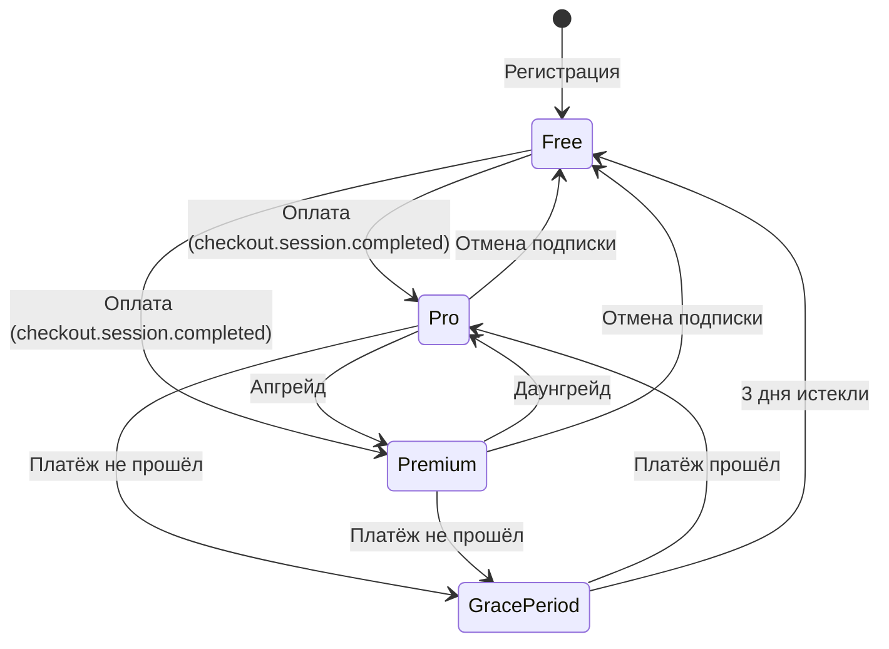
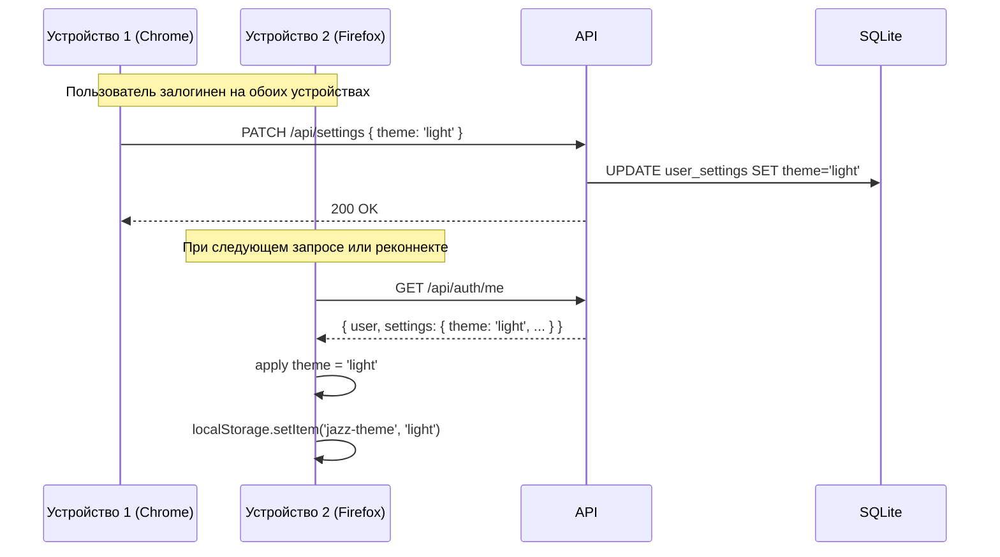
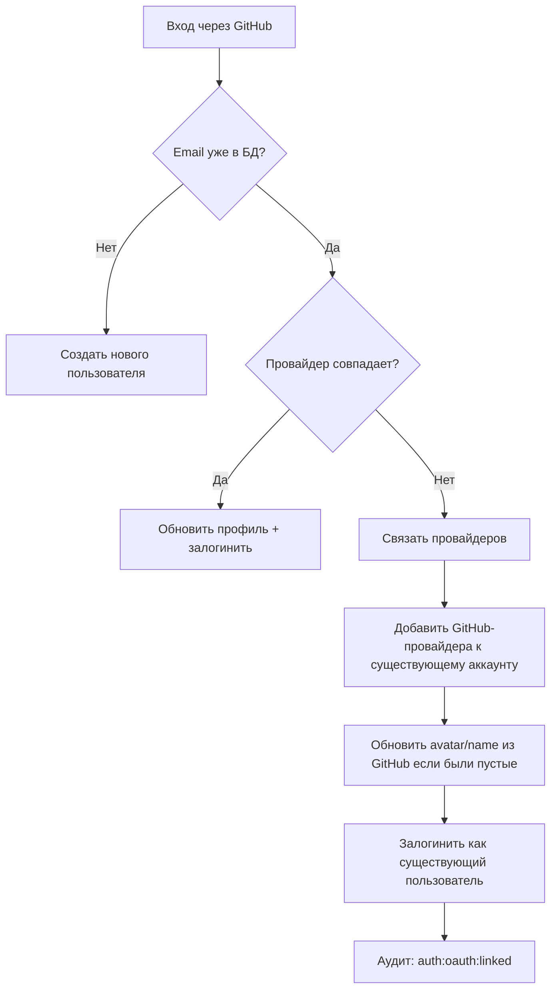
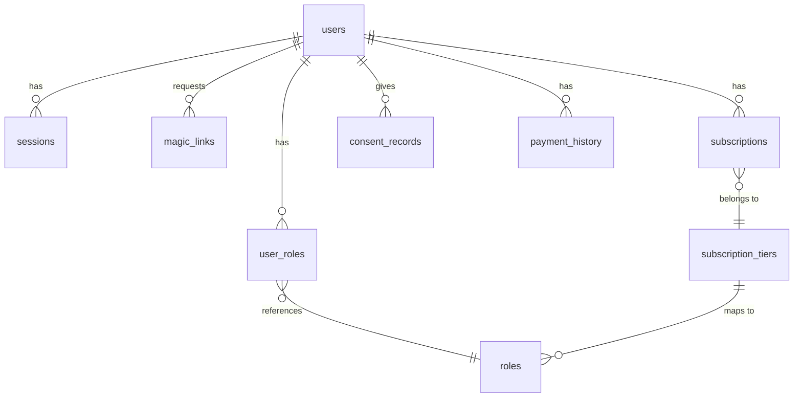

# AUTH — Целевое решение: регистрация, аутентификация, авторизация

> **Версия:** v1.0 от 2026-07-20
> **Статус:** Целевое видение (🔴 не реализовано)
> **Охват:** OAuth-провайдеры, Magic Link, сессии, Stripe-подписки, RBAC, GDPR, аудит
> **Автор:** software-architect AI agent

---

## 1. Принципы проектирования

| Принцип | Реализация |
|---|---|
| **Passwordless** | Никаких пользовательских паролей. OAuth (Google, GitHub) + Magic Link. Нет хранения хешей → нет brute-force, нет утечки паролей. |
| **Email как идентификатор** | Email — первичный идентификатор пользователя. OAuth-аккаунты связываются по email (link accounts). |
| **Безопасность zero-trust** | Все мутации — через аутентифицированные сессии. Rate limiting на все auth-эндпоинты. CSRF-защита через OAuth state + SameSite cookies. |
| **Сервер — источник истины** | Все проверки прав — на сервере. Фронт — UX (скрытие/показ UI). Наследуем текущий подход. |
| **GDPR by design** | Минимизация сбора данных. Consent tracking. Data export + right to deletion. Retention policy. |
| **Оплата → доступ** | Stripe-подписка → роль подписчика → permissions → доступ к контенту. Автоматическая деградация при отмене. |

---

## 2. Регистрация и аутентификация

### 2.1. Способы входа

```
Пользователь → Экран логина → Выбор способа:
  ├── Google OAuth (✅ реализован)
  ├── GitHub OAuth (🔴 новый)
  └── Magic Link (🔴 новый)
```

**Dev-login** (`AUTH_DEV_MODE=true`) сохраняется только для разработки и e2e-тестов. Отключён в production.

### 2.2. Google OAuth (✅ → доработка)

Текущая реализация — `apps/api/src/routes/auth.routes.ts`. Что доработать:

- **PKCE** (Proof Key for Code Exchange) вместо plain `state` — защита от authorization code interception
- **Nonce** в ID Token — защита от replay-атак
- **Верификация `hd`** (hosted domain) — опционально, для корпоративных клиентов
- **Связывание аккаунтов** — если email уже существует (через GitHub или Magic Link), объединить провайдеров

### 2.3. GitHub OAuth (🔴 новый)

Аналогичен Google OAuth, с теми же мерами безопасности (PKCE, state, CSRF).

**Эндпоинты:**
```
GET  /api/auth/github           → редирект на GitHub OAuth
GET  /api/auth/github/callback  → обработка callback
```

**Scopes:** `user:email` (read-only) — достаточно для получения email и имени.

**Конфигурация:**
```env
GITHUB_CLIENT_ID=...
GITHUB_CLIENT_SECRET=...
GITHUB_CALLBACK_URL=https://jazz-trainer.com/api/auth/github/callback
```

### 2.4. Magic Link (🔴 новый)

Passwordless-аутентификация через одноразовую ссылку, отправляемую на email.

#### 2.4.1. UX-поток

```
1. Пользователь вводит email → нажимает «Отправить ссылку»
2. API:
   - Проверяет rate limit (≤ 3 запроса в 5 мин с одного IP/email)
   - Генерирует одноразовый токен (JWT, 15 мин TTL)
   - Сохраняет токен в БД (таблица magic_links)
   - Отправляет email через Resend/SendGrid/AWS SES
3. Пользователь получает email → кликает ссылку
4. API:
   - Валидирует JWT-токен (подпись, срок, не использован)
   - Если пользователь с таким email уже существует → логинит
   - Если нет → создаёт нового (provider: 'magic_link')
   - Помечает токен как использованный (одноразовость)
   - Создаёт сессию → ставит cookie → редирект в приложение
```

#### 2.4.2. Эндпоинты

```
POST /api/auth/magic-link/send    ← body: { email }
GET  /api/auth/magic-link/verify  ← query: ?token=<jwt>
```

#### 2.4.3. Почтовый шаблон

```
Subject: Your Jazz Trainer login link

Hi {{name}},

Click the link below to sign in to Jazz Trainer:

{{magicLinkUrl}}

This link expires in 15 minutes and can only be used once.

If you didn't request this, you can safely ignore it.

— Jazz Trainer
```

#### 2.4.4. Безопасность Magic Link

| Угроза | Защита |
|---|---|
| Brute-force отправки | Rate limit: 3 запроса / 5 мин / IP + email |
| Перехват токена | JWT подписан `SESSION_SECRET`, HTTPS-only |
| Повторное использование | Токен одноразовый: флаг `used` в БД |
| Утечка через referrer | Ссылка ведёт на API-endpoint, редирект без sensitive-параметров в URL |
| Подделка токена | JWT-подпись проверяется на каждом запросе |

### 2.5. Стратегия верификации email

| Способ регистрации | Email верифицирован? | Механизм |
|---|---|---|
| Google OAuth | ✅ Автоматически | Google верифицирует email на своей стороне |
| GitHub OAuth | ✅ Автоматически | GitHub верифицирует primary email |
| Magic Link | ✅ Самим фактом получения ссылки | Токен доставлен на email → email подтверждён |

**Поле `email_verified`** в таблице `users` (`BOOLEAN`, default `false`). Выставляется в `true`:
- При OAuth-логине (провайдер гарантирует)
- При первом успешном Magic Link

Нет отдельного flow «verify your email» — он не нужен при выбранных методах.

---

## 3. Сессии и управление доступом

### 3.1. Модель сессий

**Улучшения относительно текущей реализации:**

| Аспект | Текущее состояние | Целевое состояние |
|---|---|---|
| Cookie-флаги | `httpOnly`, `sameSite: 'lax'` | + `secure: true` (production), `sameSite: 'strict'` |
| Длительность | 30 дней, фиксированная | Sliding expiration: продлевается при активности, но не более 7 дней от последнего продления |
| Fingerprint | Нет | Хеш user-agent + /24 IP-префикс. При смене → перелогин |
| Device tracking | Нет | Список активных сессий в профиле, возможность завершить удалённо |
| Принудительный logout | Нет | При смене роли/прав администратором — все сессии пользователя инвалидируются |
| Re-authentication | Нет | Для sensitive-операций (удаление аккаунта, смена email) — повторный запрос Magic Link |

### 3.2. Sliding expiration

```
При каждом запросе:
  1. Извлекаем сессию по sid
  2. Если (now - created_at) < maxAbsoluteTtl (7 дней):
     expiresAt = now + sessionTtl (24 часа)
  3. Иначе: удаляем сессию → 401
```

### 3.3. Устройства и активные сессии

Эндпоинт `GET /api/auth/sessions` (требует auth):

```json
[
  {
    "id": "sess_abc123",
    "device": "Chrome / macOS",
    "ip": "192.168.1.1",
    "createdAt": "2026-07-20T10:00:00Z",
    "lastUsedAt": "2026-07-20T14:30:00Z",
    "current": true
  }
]
```

Эндпоинт `DELETE /api/auth/sessions/:id` — завершить конкретную сессию.
Эндпоинт `DELETE /api/auth/sessions` — завершить все сессии кроме текущей.

---

## 4. Платёжная модель и подписки

### 4.1. Stripe-интеграция

```
Stripe (внешний сервис)
  │
  ├── Checkout Session ← создаётся API по запросу пользователя
  │
  ├── Webhook Events → API (верификация через signing secret)
  │   ├── checkout.session.completed → активация подписки
  │   ├── customer.subscription.updated → изменение tier
  │   ├── customer.subscription.deleted → отмена/просрочка
  │   └── invoice.payment_failed → уведомление + grace period
  │
  └── Customer Portal → пользователь управляет подпиской
```

**Конфигурация:**
```env
STRIPE_SECRET_KEY=sk_live_...
STRIPE_WEBHOOK_SECRET=whsec_...
STRIPE_PRICE_PRO=price_...
STRIPE_PRICE_PREMIUM=price_...
```

### 4.2. Модель подписки

| Tier | Роль | Цена (пример) | Ключевые permissions |
|---|---|---|---|
| **Free** | `subscriber_free` | 0 € | catalog:read, compositions:read, profile:*, базовый плеер, базовые упражнения |
| **Pro** | `subscriber_pro` | 9 €/мес | Все упражнения (exercises:*), вся теория (theory:*), compositions:write, earTraining |
| **Premium** | `subscriber_premium` | 19 €/мес | Всё из Pro + MIDI-оценка, rhythmDrills, персональный план практики, приоритетная поддержка |

### 4.3. Привязка подписки к доступу

Используем существующий RBAC-механизм (роль → permissions). Подписка добавляет пользователю роль `subscriber_{tier}`:

```
Пользователь user_123:
  ├── Роль: user             → базовые permissions (всегда)
  └── Роль: subscriber_pro   → расширенные permissions (пока подписка активна)
```

При отмене/просрочке подписки — роль `subscriber_pro` удаляется, остаётся только `subscriber_free`. Это автоматически сокращает набор permissions через `resolvePermissions()`.

### 4.4. Жизненный цикл подписки



**Grace period:** 3 дня после неудачного платежа. Пользователь сохраняет доступ. На 1-й и 3-й день — email-уведомление. После 3-х дней — деградация до Free.

### 4.5. Платёжные эндпоинты

```
POST   /api/billing/checkout      ← body: { tier: 'pro' } → редирект на Stripe Checkout
GET    /api/billing/portal        ← редирект на Stripe Customer Portal
GET    /api/billing/subscription  ← текущая подписка пользователя
POST   /api/billing/webhook       ← Stripe webhook (проверка подписи)
```

### 4.6. Структура БД для платежей

```sql
-- Тарифные планы
subscription_tiers (
  id TEXT PK,
  name TEXT NOT NULL UNIQUE,        -- 'free', 'pro', 'premium'
  stripe_price_id TEXT,             -- Stripe Price ID
  role_name TEXT NOT NULL,          -- 'subscriber_free', 'subscriber_pro', etc.
  permissions TEXT NOT NULL,        -- JSON-массив permission-кодов
  monthly_price_cents INTEGER,
  features TEXT NOT NULL            -- JSON-массив строк (для UI)
)

-- Подписки пользователей
subscriptions (
  id TEXT PK,
  user_id TEXT NOT NULL REFERENCES users(id),
  stripe_subscription_id TEXT UNIQUE,
  stripe_customer_id TEXT,
  tier_id TEXT NOT NULL REFERENCES subscription_tiers(id),
  status TEXT NOT NULL,             -- 'active' | 'past_due' | 'canceled' | 'incomplete'
  current_period_start INTEGER NOT NULL,
  current_period_end INTEGER NOT NULL,
  grace_period_ends INTEGER,        -- когда закончится grace period (null если не в нём)
  canceled_at INTEGER,
  created_at INTEGER NOT NULL,
  updated_at INTEGER NOT NULL
)

-- История платежей (для аудита)
payment_history (
  id TEXT PK,
  user_id TEXT NOT NULL REFERENCES users(id),
  stripe_event_id TEXT UNIQUE,
  event_type TEXT NOT NULL,
  amount_cents INTEGER,
  currency TEXT,
  status TEXT,
  metadata TEXT,                    -- JSON
  created_at INTEGER NOT NULL
)
```

---

## 5. Авторизация (RBAC) — расширение

Текущая система RBAC (`apps/api/src/services/rbac.service.ts`) полностью сохраняется и расширяется.

### 5.1. Новые роли

Добавляются к существующим `RBAC_ROLES`:

```ts
export const RBAC_ROLES = {
  // ... существующие ...
  SUBSCRIBER_FREE: 'subscriber_free',
  SUBSCRIBER_PRO: 'subscriber_pro',
  SUBSCRIBER_PREMIUM: 'subscriber_premium',
};
```

### 5.2. Новые permissions

```ts
export const RBAC_PERMISSIONS = {
  // ... существующие ...
  BILLING_READ: 'billing:read',
  BILLING_MANAGE: 'billing:manage',    // админ: просмотр/изменение подписок
};
```

### 5.3. Матрица «роль подписчика → permissions»

| Permission | Free | Pro | Premium |
|---|---|---|
| catalog:read | ✅ | ✅ | ✅ |
| compositions:read | ✅ | ✅ | ✅ |
| compositions:write | ❌ | ✅ | ✅ |
| exercises:read | ограничено (3/day) | ✅ | ✅ |
| exercises:earTraining | ❌ | ✅ | ✅ |
| exercises:rhythmDrills | ❌ | ❌ | ✅ |
| theory:read | ограничено (1/day) | ✅ | ✅ |
| theory:* (все) | ❌ | ✅ | ✅ |
| profile:* | ✅ | ✅ | ✅ |

Полная матрица — в `ROLES.md` (будет обновлена при реализации).

---

## 6. Разделение данных между аккаунтами

### 6.1. Принцип изоляции

Все пользовательские данные жёстко привязаны к `user_id`. Никакие данные одного пользователя не видны другому, если только они явно не опубликованы (публичные композиции в каталоге).

**Правило:** каждый запрос к API проверяет `request.user.id` и фильтрует данные. Нет понятия «гостевой сессии с данными» — неаутентифицированный пользователь не создаёт персистентных данных.

### 6.2. Инвентаризация пользовательских данных

#### 6.2.1. Данные, уже привязанные к аккаунту

| Категория | Где хранится | Таблица/ключ | Синхронизация между устройствами |
|---|---|---|---|
| **Профиль** | БД (сервер) | `users` (email, name, avatar, role, status, provider) | ✅ Всегда (источник — сервер) |
| **Настройки звука** | БД (сервер) | `user_settings` (bpm, стиль, громкости, выбор китов, voicing density, tension, humanize, per-style overrides) | ✅ Сохраняются на сервере, применяются на любом устройстве |
| **Последняя конфигурация упражнений** | БД (сервер) | `user_settings.practice_cards` (JSON: lastExerciseType, lastKeys, lastTempo, cardMode, backing-инструменты, …) | ✅ Pick up where you left off на любом устройстве |
| **MIDI-настройки** | БД (сервер) | `user_settings` (midiDeviceId, midiChannel, soloToneId, soloVolume, duckingEnabled) | ✅ |
| **Композиции** | БД (сервер) | `harmony_compositions` (user_id, name, content, visibility, …) | ✅ |
| **Лайки композиций** | БД (сервер) | `composition_likes` | ✅ |
| **Лайки лекций** | БД (сервер) | `lecture_likes` | ✅ |
| **Сессии** | БД (сервер) | `sessions` | ✅ (список устройств) |
| **Роли и права** | БД (сервер) | `user_roles`, `user_permissions` | ✅ |
| **Аудит-записи** | БД (сервер) | `audit_log` (actor_user_id) | ✅ (только чтение админом) |

#### 6.2.2. Данные, которые нужно поднять на сервер

| Категория | Где хранится **сейчас** | Проблема | Где **должно** храниться |
|---|---|---|---|
| **Тема (dark/light)** | `localStorage` (`jazz-theme`) | Не синхронизируется между устройствами. При сбросе кеша браузера — сбрасывается на дефолт. | `user_settings.theme` (новое поле) + localStorage как кеш для мгновенного применения |

#### 6.2.3. Данные, которые нужно создать (прогресс и статистика)

| Категория | Где должно храниться | Описание |
|---|---|---|
| **Прогресс по упражнениям** | Новая таблица `exercise_progress` | Тип упражнения, последний результат, количество попыток, лучший счёт, дата последней практики |
| **Прогресс по теории** | Новая таблица `theory_progress` | ID лекции/урока, статус: `not_started` / `in_progress` / `completed`, прогресс в %, дата завершения |
| **История результатов** | Новая таблица `exercise_results` | Конкретная попытка: тип упражнения, параметры, score, длительность, timestamp |
| **Статистика (агрегаты)** | Новая таблица `user_stats` | streak (дней подряд), total practice time, exercises completed, theory completed — обновляется триггерами или cron |

### 6.3. Схема таблиц прогресса

```sql
-- Прогресс по упражнениям (одна запись на комбинацию «пользователь + тип + подтип»)
CREATE TABLE exercise_progress (
  id TEXT PRIMARY KEY,
  user_id TEXT NOT NULL REFERENCES users(id) ON DELETE CASCADE,
  exercise_type TEXT NOT NULL,       -- 'chords' | 'scales' | 'enclosures' | 'sequences' | 'earTraining' | 'rhythmDrills'
  sub_type TEXT,                     -- конкретный подтип (например 'diatonic-upper' для enclosures)
  attempts INTEGER NOT NULL DEFAULT 0,
  best_score REAL,                   -- 0..1
  last_score REAL,                   -- 0..1
  last_practiced_at INTEGER,
  created_at INTEGER NOT NULL,
  updated_at INTEGER NOT NULL,

  UNIQUE(user_id, exercise_type, sub_type)
);

CREATE INDEX idx_exercise_progress_user ON exercise_progress(user_id);

-- История конкретных попыток (для графиков и анализа)
CREATE TABLE exercise_results (
  id TEXT PRIMARY KEY,
  user_id TEXT NOT NULL REFERENCES users(id) ON DELETE CASCADE,
  exercise_type TEXT NOT NULL,
  sub_type TEXT,
  config TEXT NOT NULL,              -- JSON: параметры упражнения (key, tempo, pattern, …)
  score REAL,                        -- 0..1 (null если без MIDI-оценки)
  completed INTEGER NOT NULL DEFAULT 1,  -- 0 = прервано, 1 = завершено
  duration_ms INTEGER,               -- длительность попытки
  created_at INTEGER NOT NULL
);

CREATE INDEX idx_exercise_results_user ON exercise_results(user_id);
CREATE INDEX idx_exercise_results_user_type ON exercise_results(user_id, exercise_type);

-- Прогресс по теории
CREATE TABLE theory_progress (
  id TEXT PRIMARY KEY,
  user_id TEXT NOT NULL REFERENCES users(id) ON DELETE CASCADE,
  lecture_id TEXT NOT NULL,          -- ID лекции/урока из плагинов theory-*
  status TEXT NOT NULL DEFAULT 'not_started',  -- 'not_started' | 'in_progress' | 'completed'
  progress_percent INTEGER NOT NULL DEFAULT 0,  -- 0..100
  completed_at INTEGER,
  created_at INTEGER NOT NULL,
  updated_at INTEGER NOT NULL,

  UNIQUE(user_id, lecture_id)
);

CREATE INDEX idx_theory_progress_user ON theory_progress(user_id);

-- Агрегированная статистика
CREATE TABLE user_stats (
  user_id TEXT PRIMARY KEY REFERENCES users(id) ON DELETE CASCADE,
  current_streak INTEGER NOT NULL DEFAULT 0,      -- дней подряд с практикой
  longest_streak INTEGER NOT NULL DEFAULT 0,
  last_practice_date TEXT,                        -- 'YYYY-MM-DD'
  total_practice_time_ms INTEGER NOT NULL DEFAULT 0,
  total_exercises_completed INTEGER NOT NULL DEFAULT 0,
  total_theory_completed INTEGER NOT NULL DEFAULT 0,
  updated_at INTEGER NOT NULL
);
```

### 6.4. Тема оформления: поднимаем на сервер

Текущая реализация (`apps/web/src/hooks/useTheme.ts`) хранит тему только в `localStorage`.

**Целевая реализация:**

```
┌─ Применение темы ──────────────────────────────────────┐
│                                                        │
│  1. При загрузке:                                      │
│     localStorage (мгновенно) → apply                   │
│     API /api/auth/me → user.settings.theme → apply     │
│     (если отличается от localStorage — обновить оба)   │
│                                                        │
│  2. При переключении:                                  │
│     localStorage.setItem('jazz-theme', newTheme)        │
│     → apply мгновенно                                  │
│     PATCH /api/settings { theme: newTheme }             │
│     → сохранить на сервер (фоновый запрос)             │
│                                                        │
│  3. На новом устройстве:                               │
│     localStorage — нет                                  │
│     API → user.settings.theme = 'dark' → apply          │
│     localStorage.setItem (кешируем)                    │
└────────────────────────────────────────────────────────┘
```

**Изменения в схеме:**

```sql
-- Новое поле в user_settings
ALTER TABLE user_settings ADD COLUMN theme TEXT NOT NULL DEFAULT 'dark';
-- theme ∈ ('dark', 'light')
```

**DTO-изменение** (`packages/shared/src/dto.ts`):

```ts
export const UserSettingsDTOSchema = z.object({
  // ... существующие поля ...
  theme: z.enum(['dark', 'light']).optional(),
});
```

### 6.5. Синхронизация настроек между устройствами

Архитектура синхронизации:



**Стратегия:** optimistic local + server source of truth. Настройки применяются мгновенно на устройстве, сервер обновляется в фоне. При расхождении (например, настройка менялась на другом устройстве) — сервер побеждает при следующем `/api/auth/me`.

### 6.6. Связывание аккаунтов (Account Linking)

Когда пользователь впервые входит через нового провайдера (например, GitHub), а email уже существует (от Google-логина):



**Правила связывания:**

- **Email — первичный ключ связывания.** Если email совпадает — это один и тот же пользователь.
- **Настройки и прогресс сохраняются.** При связывании данные не теряются — используется существующий аккаунт.
- **Аватар и имя:** если у существующего пользователя нет аватара/имени, они заполняются из нового провайдера.
- **Конфликт providerId:** невозможен — разные провайдеры имеют разные пространства ID.

**Схема `users` после миграции:** поле `provider` хранит **первичного** провайдера. Новое поле `providers` (JSON-массив) — все связанные провайдеры:

```sql
ALTER TABLE users ADD COLUMN providers TEXT NOT NULL DEFAULT '[]';
-- Пример: '["google", "github"]'
```

### 6.7. Что происходит при удалении аккаунта

При hard-delete (через 30 дней после запроса):

| Данные | Действие |
|---|---|
| `users` | Полное удаление строки |
| `user_settings` | Каскадное удаление (`ON DELETE CASCADE`) |
| `sessions` | Каскадное удаление |
| `user_roles`, `user_permissions` | Каскадное удаление |
| `exercise_progress`, `exercise_results` | Каскадное удаление |
| `theory_progress` | Каскадное удаление |
| `user_stats` | Каскадное удаление |
| `harmony_compositions` | **Анонимизация:** `user_id = null`, `author = 'Deleted User'`, `visibility = 'public'` → не ломаем каталог |
| `composition_likes` | Каскадное удаление (like-count пересчитывается) |
| `subscriptions`, `payment_history` | Каскадное удаление (после отмены в Stripe) |
| `consent_records` | Каскадное удаление |
| `audit_log` | **Частичное:** `actor_user_id` остаётся (для целостности лога), но `targetType='user'` записи удаляются |

### 6.8. Что видит админ

Администратор **не видит** персональные данные пользователей в полном объёме:

- **Видит:** user ID, email (маскированный: `o***@gmail.com`), name, role, статус подписки, дата регистрации, количество композиций, общее время практики (статистика)
- **Не видит:** содержимое пользовательских композиций (только свои), результаты упражнений, прогресс по теории, настройки звука
- **Полный доступ:** только `super_admin` для диагностики и поддержки (с аудит-логом каждого просмотра)

---

## 7. Защита персональных данных (GDPR)

### 7.1. Data Export

Эндпоинт `POST /api/gdpr/export` (требует re-authentication):

- Собирает все данные пользователя: профиль, настройки (включая тему), сессии, композиции, лайки, прогресс упражнений, прогресс теории, статистика, платёжная история, аудит-записи
- Формирует JSON-файл
- Отдаёт на скачивание (одноразовая ссылка, 24 часа)
- Пишет аудит-запись: `action: 'gdpr:export'`

### 7.2. Account Deletion (двухфазное)

**Фаза 1 — Soft delete:**
- Пользователь запрашивает удаление (`POST /api/gdpr/delete`, требует re-authentication)
- Статус меняется на `deletion_requested`
- Re-authentication через Magic Link для подтверждения
- После подтверждения: `status = 'deleted'`, данные сохраняются ещё 30 дней
- Все сессии инвалидируются
- Пишется аудит: `action: 'gdpr:delete:requested'`

**Фаза 2 — Hard delete (автоматически через 30 дней):**
- Cron-задача или отложенная задача
- Полное удаление из БД: `users`, `user_settings`, `sessions`, `subscriptions`, `payment_history`, `audit_log` (частично), `user_permissions`, `user_roles`
- Композиции пользователя: либо удаляются, либо анонимизируются (`user_id = null, author = 'Deleted User'`)
- Stripe: удаление customer через API
- Пишется финальный аудит (отдельное хранилище, без привязки к пользователю): `action: 'gdpr:delete:completed'`
- **Право на восстановление:** в течение 30 дней пользователь может отменить удаление, залогинившись (Magic Link)

### 7.3. Consent Tracking

Таблица `consent_records`:

```sql
consent_records (
  id TEXT PK,
  user_id TEXT NOT NULL REFERENCES users(id),
  consent_type TEXT NOT NULL,     -- 'marketing_email', 'analytics', 'data_processing'
  granted BOOLEAN NOT NULL,
  ip TEXT,
  user_agent TEXT,
  created_at INTEGER NOT NULL
)
```

Запрос согласия — при регистрации и в настройках профиля. Изменение согласия пишется новой записью (audit trail).

### 7.4. Data Retention Policy

| Данные | Срок хранения | После окончания |
|---|---|---|
| Профиль пользователя | Пока аккаунт активен + 30 дней после удаления | Полное удаление |
| Сессии | До истечения (7 дней max) | Автоудаление |
| Аудит-лог | 1 год | Автоочистка (cron) |
| Платёжная история | 5 лет (налоговое требование) | Автоочистка |
| Magic Link токены | 15 минут | Автоудаление после использования |
| Consent-записи | Пока аккаунт активен + 30 дней | Удаление вместе с аккаунтом |

### 7.5. Минимизация данных

- **Не храним:** пароли, номера телефонов, адреса, пол, возраст
- **Храним минимально:** email, имя, аватар (из OAuth), настройки звука
- **Email:** только для отправки Magic Link и уведомлений о подписке. Не используется для маркетинга без явного consent.
- **IP и User-Agent:** только в аудит-логе и consent-записях. Хешируются в сессиях (fingerprint).

---

## 8. Аудит

Текущая система (`apps/api/src/services/audit.service.ts`, `audit_log`) сохраняется. Добавляются новые типы событий:

### 8.1. Новые audit actions

| Action | Target Type | Описание |
|---|---|---|
| `auth:magic_link:sent` | `user` | Отправлен Magic Link |
| `auth:magic_link:verified` | `user` | Успешный вход по Magic Link |
| `auth:oauth:linked` | `user` | Привязан новый OAuth-провайдер |
| `auth:session:terminated` | `session` | Сессия завершена (пользователем или админом) |
| `auth:sessions:terminated_all` | `user` | Все сессии завершены (смена роли) |
| `billing:subscription:created` | `subscription` | Создана подписка |
| `billing:subscription:updated` | `subscription` | Изменён tier/статус |
| `billing:subscription:canceled` | `subscription` | Отмена подписки |
| `billing:payment:succeeded` | `payment` | Успешный платёж |
| `billing:payment:failed` | `payment` | Неудачный платёж |
| `gdpr:export` | `user` | Запрошен экспорт данных |
| `gdpr:delete:requested` | `user` | Запрошено удаление |
| `gdpr:delete:confirmed` | `user` | Удаление подтверждено |
| `gdpr:delete:canceled` | `user` | Удаление отменено (восстановление) |
| `gdpr:consent:changed` | `consent` | Изменено согласие |
| `admin:role:changed` | `user` | Админ изменил роль пользователя |

### 8.2. Аудит в Stripe webhook

Webhook-обработчик пишет в `payment_history` и `audit_log` атомарно:

```ts
// Код будет в billing.service.ts
await withAudit(db, request,
  'billing:subscription:updated',
  'subscription',
  subscription.id,
  { before: oldSubscription, reason: 'stripe_webhook' },
  async () => {
    // обновить subscription в БД
    // обновить user_roles
    return updatedSubscription;
  }
);
```

---

## 9. Security Hardening

### 9.1. Rate Limiting

Добавить `@fastify/rate-limit` на все auth-эндпоинты:

| Эндпоинт | Лимит | Окно |
|---|---|---|
| `POST /api/auth/magic-link/send` | 3 запроса | 5 минут (per IP + email) |
| `GET /api/auth/magic-link/verify` | 5 запросов | 1 минута (per IP) |
| `POST /api/auth/google` | 10 запросов | 1 минута (per IP) |
| `POST /api/auth/github` | 10 запросов | 1 минута (per IP) |
| `POST /api/auth/dev-login` | 5 запросов | 1 минута (per IP) |

### 9.2. Security Headers

Рекомендуемые заголовки для Fastify (через `@fastify/helmet`):

```
Strict-Transport-Security: max-age=31536000; includeSubDomains
Content-Security-Policy: default-src 'self'; ...
X-Content-Type-Options: nosniff
X-Frame-Options: DENY
Referrer-Policy: strict-origin-when-cross-origin
```

### 9.3. Cookie Security

```ts
const COOKIE_OPTS = {
  httpOnly: true,
  secure: process.env.NODE_ENV === 'production',  // 🔴 добавить
  sameSite: 'strict',                              // 🔴 изменить с 'lax'
  path: '/',
  // maxAge вычисляется динамически (sliding expiration)
};
```

### 9.4. CORS

Уже настроен. Убедиться, что `webOrigin` в production — точное значение (не `*`).

### 9.5. Secrets Management

- **Production:** Все секреты через env-переменные (не в коде)
- **Ротация `SESSION_SECRET`:** При ротации все сессии инвалидируются (приемлемо)
- **Stripe webhook secret:** Проверяется на каждом webhook-запросе для предотвращения подделки

---

## 10. Схема БД — новые и изменённые таблицы

### 10.1. Изменения существующих таблиц

```sql
-- users: новые поля
ALTER TABLE users ADD COLUMN email_verified INTEGER NOT NULL DEFAULT 0;
ALTER TABLE users ADD COLUMN deleted_at INTEGER;  -- soft delete timestamp

-- users: расширение provider
-- было:  provider TEXT CHECK(provider IN ('google','dev','system'))
-- стало: provider TEXT CHECK(provider IN ('google','github','magic_link','dev','system'))

-- sessions: новые поля
ALTER TABLE sessions ADD COLUMN device_name TEXT;
ALTER TABLE sessions ADD COLUMN ip TEXT;
ALTER TABLE sessions ADD COLUMN fingerprint TEXT;
ALTER TABLE sessions ADD COLUMN last_used_at INTEGER;
```

### 10.2. Новые таблицы

```sql
-- Magic Link токены
CREATE TABLE magic_links (
  id TEXT PRIMARY KEY,
  email TEXT NOT NULL,
  token_hash TEXT NOT NULL UNIQUE,  -- SHA-256(JWT)
  used INTEGER NOT NULL DEFAULT 0,
  expires_at INTEGER NOT NULL,
  created_at INTEGER NOT NULL
);

-- Тарифные планы
CREATE TABLE subscription_tiers (
  id TEXT PRIMARY KEY,
  name TEXT NOT NULL UNIQUE,
  stripe_price_id TEXT,
  role_name TEXT NOT NULL UNIQUE,
  permissions TEXT NOT NULL,  -- JSON array
  monthly_price_cents INTEGER,
  features TEXT NOT NULL,     -- JSON array
  created_at INTEGER NOT NULL
);

-- Подписки пользователей
CREATE TABLE subscriptions (
  id TEXT PRIMARY KEY,
  user_id TEXT NOT NULL REFERENCES users(id) ON DELETE CASCADE,
  stripe_subscription_id TEXT UNIQUE,
  stripe_customer_id TEXT,
  tier_id TEXT NOT NULL REFERENCES subscription_tiers(id),
  status TEXT NOT NULL CHECK(status IN ('active','past_due','canceled','incomplete')),
  current_period_start INTEGER NOT NULL,
  current_period_end INTEGER NOT NULL,
  grace_period_ends INTEGER,
  canceled_at INTEGER,
  created_at INTEGER NOT NULL,
  updated_at INTEGER NOT NULL
);

CREATE INDEX idx_subscriptions_user_id ON subscriptions(user_id);
CREATE INDEX idx_subscriptions_stripe_subscription_id ON subscriptions(stripe_subscription_id);

-- История платежей
CREATE TABLE payment_history (
  id TEXT PRIMARY KEY,
  user_id TEXT NOT NULL REFERENCES users(id) ON DELETE CASCADE,
  stripe_event_id TEXT UNIQUE,
  event_type TEXT NOT NULL,
  amount_cents INTEGER,
  currency TEXT,
  status TEXT,
  metadata TEXT,  -- JSON
  created_at INTEGER NOT NULL
);

CREATE INDEX idx_payment_history_user_id ON payment_history(user_id);

-- Consent tracking (GDPR)
CREATE TABLE consent_records (
  id TEXT PRIMARY KEY,
  user_id TEXT NOT NULL REFERENCES users(id) ON DELETE CASCADE,
  consent_type TEXT NOT NULL CHECK(consent_type IN ('marketing_email','analytics','data_processing','terms_of_service','privacy_policy')),
  granted INTEGER NOT NULL,
  ip TEXT,
  user_agent TEXT,
  created_at INTEGER NOT NULL
);

CREATE INDEX idx_consent_records_user_id ON consent_records(user_id);

-- Прогресс по упражнениям (§6.3)
CREATE TABLE exercise_progress (
  id TEXT PRIMARY KEY,
  user_id TEXT NOT NULL REFERENCES users(id) ON DELETE CASCADE,
  exercise_type TEXT NOT NULL,
  sub_type TEXT,
  attempts INTEGER NOT NULL DEFAULT 0,
  best_score REAL,
  last_score REAL,
  last_practiced_at INTEGER,
  created_at INTEGER NOT NULL,
  updated_at INTEGER NOT NULL,
  UNIQUE(user_id, exercise_type, sub_type)
);

CREATE INDEX idx_exercise_progress_user ON exercise_progress(user_id);

-- История попыток упражнений (§6.3)
CREATE TABLE exercise_results (
  id TEXT PRIMARY KEY,
  user_id TEXT NOT NULL REFERENCES users(id) ON DELETE CASCADE,
  exercise_type TEXT NOT NULL,
  sub_type TEXT,
  config TEXT NOT NULL,
  score REAL,
  completed INTEGER NOT NULL DEFAULT 1,
  duration_ms INTEGER,
  created_at INTEGER NOT NULL
);

CREATE INDEX idx_exercise_results_user ON exercise_results(user_id);
CREATE INDEX idx_exercise_results_user_type ON exercise_results(user_id, exercise_type);

-- Прогресс по теории (§6.3)
CREATE TABLE theory_progress (
  id TEXT PRIMARY KEY,
  user_id TEXT NOT NULL REFERENCES users(id) ON DELETE CASCADE,
  lecture_id TEXT NOT NULL,
  status TEXT NOT NULL DEFAULT 'not_started',
  progress_percent INTEGER NOT NULL DEFAULT 0,
  completed_at INTEGER,
  created_at INTEGER NOT NULL,
  updated_at INTEGER NOT NULL,
  UNIQUE(user_id, lecture_id)
);

CREATE INDEX idx_theory_progress_user ON theory_progress(user_id);

-- Агрегированная статистика (§6.3)
CREATE TABLE user_stats (
  user_id TEXT PRIMARY KEY REFERENCES users(id) ON DELETE CASCADE,
  current_streak INTEGER NOT NULL DEFAULT 0,
  longest_streak INTEGER NOT NULL DEFAULT 0,
  last_practice_date TEXT,
  total_practice_time_ms INTEGER NOT NULL DEFAULT 0,
  total_exercises_completed INTEGER NOT NULL DEFAULT 0,
  total_theory_completed INTEGER NOT NULL DEFAULT 0,
  updated_at INTEGER NOT NULL
);
```

### 10.3. Entity-Relationship (ключевые связи)



---

## 11. Email-сервис

Для отправки Magic Link и уведомлений о подписке:

**Рекомендация: Resend** (простой API, бесплатный тир 100 писем/день, React-шаблоны).

Альтернативы: SendGrid, AWS SES, Postmark.

Конфигурация:
```env
EMAIL_FROM="Jazz Trainer <noreply@jazz-trainer.com>"
EMAIL_PROVIDER=resend
RESEND_API_KEY=re_...
```

Сервисный слой в API:
```ts
// apps/api/src/services/email.service.ts
export async function sendMagicLink(email: string, token: string, name?: string): Promise<void>
export async function sendSubscriptionNotification(email: string, type: 'payment_failed' | 'canceled' | 'grace_period'): Promise<void>
```

---

## 12. План миграции

| Фаза | Содержание | Оценка | Зависит от |
|---|---|---|---|
| **1. Security hardening** | Rate limiting, Secure-флаг cookie, Helmet-заголовки, SameSite strict | 4 ч | — |
| **2. Schema migration** | Новые поля в users/sessions, theme в user_settings, новые таблицы (magic_links, subscription_tiers, subscriptions, payment_history, consent_records, exercise_progress, exercise_results, theory_progress, user_stats) | 8 ч | Фаза 1 |
| **3. GitHub OAuth** | Новые эндпоинты, PKCE, конфигурация | 6 ч | Фаза 2 |
| **4. Magic Link** | Эндпоинты, email-сервис, JWT-токены, почтовый шаблон | 12 ч | Фаза 2 |
| **5. Тема и настройки на сервере** | Миграция темы из localStorage → user_settings.theme, стратегия optimistic local + server, кросс-устройственная синхронизация | 4 ч | Фаза 2 |
| **6. Прогресс и статистика** | API для exercise_progress, exercise_results, theory_progress, user_stats. Сохранение результатов из плагинов (practice-cards, ear-training, rhythm-drills, theory-*). Streak-логика. | 12 ч | Фаза 2 |
| **7. Stripe интеграция** | Checkout, Customer Portal, Webhook, subscription lifecycle | 16 ч | Фаза 2 |
| **8. Subscription → RBAC** | Привязка tier → роль → permissions, деградация при отмене | 8 ч | Фаза 7 |
| **9. GDPR compliance** | Data export (включая прогресс), soft/hard delete, consent tracking, retention cron | 14 ч | Фаза 2 |
| **10. Device tracking** | Список сессий, завершение, fingerprint | 6 ч | Фаза 2 |
| **11. Account linking** | Связывание OAuth-провайдеров по email, providers JSON, merge-логика | 6 ч | Фазы 3+4 |
| **12. Тестирование** | Юнит + интеграционные тесты на все новые эндпоинты | 14 ч | Все фазы |
| **13. Документация** | Обновление ROLES.md, FUNCTIONS.md, README, ARCHITECTURE_BASE.md (ADR) | 4 ч | Все фазы |

**Суммарная оценка:** ~114 часов (~3 недели одним разработчиком).

---

## 13. Архитектурные решения (ADR) — предлагаемые

Эти решения должны быть добавлены в `ARCHITECTURE_BASE.md` §9:

| ADR | Решение | Обоснование |
|---|---|---|
| **ADR-018** | Magic Link как основной email-метод | Passwordless. Без хранения паролей — меньше уязвимостей. Self-verifying email. |
| **ADR-019** | Multi-Provider OAuth (Google + GitHub) | Расширение user base. PKCE + state для безопасности. Связывание аккаунтов по email. |
| **ADR-020** | Stripe как платёжный провайдер | Индустриальный стандарт. PCI-DSS на стороне Stripe. Webhook-архитектура для синхронизации статуса. |
| **ADR-021** | Subscription-tier RBAC | Подписка → роль → permissions. Переиспользование существующего RBAC без дублирования логики доступа. |
| **ADR-022** | GDPR: Data Export + двухфазное удаление | Soft delete (30 дней на восстановление) + hard delete. Consent tracking. Retention policy. |
| **ADR-023** | Session security hardening | Sliding expiration, device fingerprint, force logout, Secure/Strict cookies, rate limiting. |
| **ADR-024** | Серверное хранение темы и настроек | Тема и настройки — на сервере (user_settings). localStorage — кеш для мгновенного применения. Сервер — источник истины при расхождении. |
| **ADR-025** | Прогресс и статистика как per-user таблицы | exercise_progress + exercise_results + theory_progress + user_stats. Жёсткая привязка к user_id с CASCADE DELETE. Streak-логика на основе last_practice_date. |
| **ADR-026** | Account Linking по email | Email — первичный ключ связывания OAuth-провайдеров. При совпадении email аккаунты объединяются, данные не теряются. Поле providers (JSON) хранит все привязанные провайдеры. |

---

## 14. Конфигурация (новые env-переменные)

```env
# ── Auth ───────────────────────────────────────────────────
AUTH_DEV_MODE=false                           # production: false
SESSION_SECRET=<random-64-chars>              # ротируется при компрометации
SESSION_MAX_ABSOLUTE_TTL_MS=604800000         # 7 дней в мс

# ── OAuth ──────────────────────────────────────────────────
# Google (уже существует)
GOOGLE_CLIENT_ID=...
GOOGLE_CLIENT_SECRET=...
GOOGLE_CALLBACK_URL=https://jazz-trainer.com/api/auth/google/callback

# GitHub (новое)
GITHUB_CLIENT_ID=...
GITHUB_CLIENT_SECRET=...
GITHUB_CALLBACK_URL=https://jazz-trainer.com/api/auth/github/callback

# ── Email ──────────────────────────────────────────────────
EMAIL_FROM="Jazz Trainer <noreply@jazz-trainer.com>"
EMAIL_PROVIDER=resend
RESEND_API_KEY=...

# ── Stripe ─────────────────────────────────────────────────
STRIPE_SECRET_KEY=sk_live_...
STRIPE_WEBHOOK_SECRET=whsec_...
STRIPE_PRICE_PRO=price_...
STRIPE_PRICE_PREMIUM=price_...
```

---

## 15. Вопросы безопасности: самопроверка

- [x] Пароли не хранятся (passwordless)
- [x] OAuth — PKCE + state (CSRF-защита)
- [x] Magic Link — JWT с подписью + одноразовость + rate limit
- [x] Сессии — httpOnly + Secure + SameSite strict + fingerprint
- [x] Rate limiting — все auth-эндпоинты
- [x] Stripe webhook — проверка подписи
- [x] GDPR — export + deletion + consent + retention
- [x] Аудит — все мутации (auth, billing, gdpr, admin)
- [x] Secrets — только env-переменные, не в коде
- [x] CORS — точный origin, не wildcard
- [x] Security headers — Helmet

---

_Документ подготовлен агентом `software-architect`. Версия v1.0 от 2026-07-20. Описывает целевое решение. Требует реализации: Фазы 1–10 (см. §11). После реализации обновить `ARCHITECTURE_BASE.md` (ADR-018–023) и `ROLES.md`._
