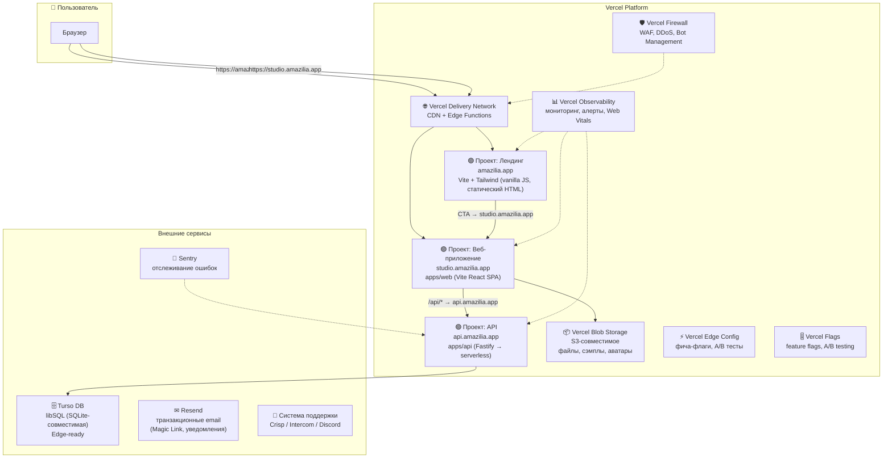
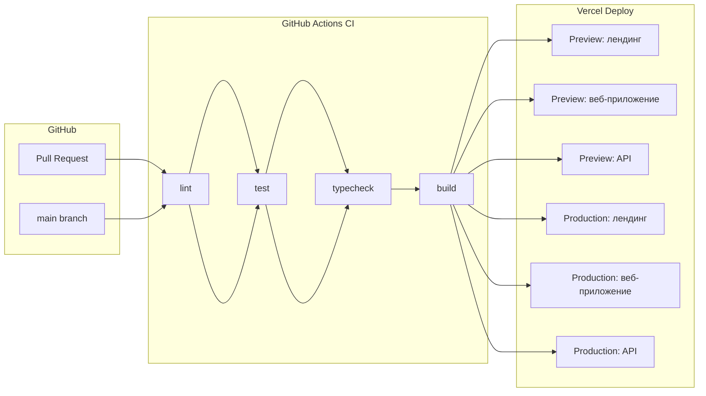

# DEPLOYMENT — Размещение Amazilia на мощностях Vercel

## 1. Архитектура размещения

### 1.1. Общая схема



### 1.2. Компоненты и их размещение

| Компонент | Хостинг | Технология | Комментарий |
|-----------|---------|-----------|-------------|
| **Веб-приложение + лендинг** (`studio.amazilia.app`, лендинг на `/landing`) | Vercel (отдельный проект) | Vite + React SPA (`apps/web`) | Сборка из монорепо. Прокси `/api` → API-сервер. Лендинг — React-роут `/landing` внутри приложения (не отдельный проект). |
| **API-сервер** (`api.amazilia.app`) | Vercel (отдельный проект) | Fastify (`apps/api`) | Stateless REST, завернут в Vercel Serverless Function через `@fastify/vercel`. Подробнее: §1.2.1. |
| **База данных** | Turso | libSQL (SQLite-совместимая) | Нативная Vercel-интеграция. edge-ready. |
| **Файловое хранилище** | Vercel Blob Storage | S3-совместимое API | Ассеты, сэмплы, аватары пользователей. |
| **Email** | Resend | Транзакционные письма | Magic Link, уведомления, welcome-письма. Vercel-интеграция. |

> **ADR-008 (отменён): Лендинг — статический HTML без JS-фреймворка.** Ранее лендинг был отдельным Vite-проектом (`apps/landing`, vanilla JS). Решение отменено: лендинг реализован как React-роут `/landing` внутри Studio (`apps/web/src/routes/landing/`) — единый деплой, переиспользование UI-примитивов и i18n приложения, общий домен. Отдельный проект `amazilia-landing` удалён.

#### 1.2.1. API на Railway (нативный Fastify)

`apps/api` — **long-lived** Fastify-сервер на Railway: cron-задачи (`setInterval`), in-memory rate-limit, SQLite на диске. В отличие от serverless — нет холодных стартов, нет ограничений на длительность запроса.

> **Причина выбора Railway вместо Vercel Serverless:** serverless-подход требовал миграции rate-limit на внешний стор (Upstash), переноса cron в Vercel Cron Jobs, и обязательной миграции SQLite → Turso. Railway позволяет оставить текущую архитектуру без изменений.

**Реализация:**

- **Dockerfile:** `Dockerfile.api` — двухстадийная сборка (builder + runtime)
- **CI/CD:** GitHub Actions → `railway up` при push в `main`
- **Конфигурация:** `.railwayignore`, `infra/railway/README.md`

### 1.3. Доменная структура

```
amazilia.app           → Лендинг (Vercel Project #1)
studio.amazilia.app    → Веб-приложение (Vercel Project #2)
api.amazilia.app       → API-сервер (Vercel Project #3)
```

**Первый этап (бесплатные домены Vercel):**

```
<проект>.vercel.app          → Лендинг
<проект>-studio.vercel.app   → Веб-приложение
<проект>-api.vercel.app      → API
```

После покупки `amazilia.app` — перенастройка DNS через Vercel Domains.

---

## 2. Окружения (Environments)

### 2.1. Типы окружений

Vercel предоставляет три встроенных типа окружений:

| Окружение | Назначение | Триггер деплоя | Домен |
|-----------|-----------|-----------------|-------|
| **Production** | Боевой трафик | Push в `main` | `amazilia.app`, `studio.amazilia.app` |
| **Preview** | Ревью изменений | Pull Request | `<hash>.vercel.app` (автоматически) |
| **Development** | Локальная разработка | `vercel dev` | `localhost:3000` |

### 2.2. Переменные окружения (Environment Variables)

Каждое окружение имеет свой набор переменных. Управление через Vercel CLI (рекомендовано) или Dashboard:

```bash
# Аутентификация
vercel login

# Привязать директорию к проекту
cd apps/landing && vercel link --project amazilia-landing --yes

# Просмотр всех проектов и их production-URL
vercel projects ls

# Добавить переменную для production
vercel env add VITE_STUDIO_URL production
# → ввести значение и Enter

# Просмотр всех переменных проекта
vercel env ls

# Скачать локально
vercel env pull .env.local
```

> **Важно:** Vite-переменные (`VITE_*`) подставляются на этапе сборки. После изменения — обязательный редеплой (`git push` или `vercel --prod`).

**Критические переменные (каждое окружение — свои значения):**

| Переменная | Назначение | Окружение |
|-----------|-----------|-----------|
| `VITE_API_BASE_URL` | URL API-сервера для веб-приложения | Production: `https://api.amazilia.app`<br/>Preview: `https://api-preview.amazilia.app` |
| `DATABASE_URL` | URL подключения к Turso | Production: prod-БД<br/>Preview: preview-БД |
| `DATABASE_AUTH_TOKEN` | Токен Turso | Все (разные значения) |
| `VITE_STUDIO_URL` | URL студии для ссылок с лендинга (вход, CTA) | Проект `amazilia-landing`: Production = `https://<studio>.vercel.app` |
| `VITE_AMPLITUDE_API_KEY` | Ключ Amplitude (продуктовая аналитика) | Все (разные для prod/preview) |


### 2.3. Конфигурационные файлы Vercel

#### Лендинг: `vercel.json` (в `apps/landing/`)

Лендинг — отдельный Vite + React проект в монорепо.

```json
{
  "framework": null,
  "buildCommand": "cd ../.. && npm install --no-package-lock && npm run build -w @jazz/landing",
  "outputDirectory": "dist",
  "devCommand": "cd ../.. && npm run dev -w @jazz/landing",
  "git": {
    "deploymentEnabled": {
      "main": true
    }
  }
}
```

#### Веб-приложение: `vercel.json` (в `apps/web/`)

```json
{
  "framework": null,
  "buildCommand": "cd ../.. && npm run build -- --filter=@jazz/web",
  "outputDirectory": "dist",
  "installCommand": "cd ../.. && npm ci",
  "devCommand": "cd ../.. && npm run dev -- --filter=@jazz/web",
  "rewrites": [
    {
      "source": "/api/:path*",
      "destination": "https://api.amazilia.app/api/:path*"
    }
  ],
  "headers": [
    {
      "source": "/assets/(.*)",
      "headers": [
        { "key": "Cache-Control", "value": "public, max-age=31536000, immutable" }
      ]
    }
  ],
  "git": {
    "deploymentEnabled": {
      "main": true
    }
  }
}
```

---

## 3. Пайплайн релизов (CI/CD)

### 3.1. Общая схема



### 3.2. GitHub Actions — этапы

Файл: `.github/workflows/ci.yml`

```yaml
name: CI

on:
  pull_request:
  push:
    branches: [main]

jobs:
  # 1. Статический анализ
  verify:
    runs-on: ubuntu-latest
    steps:
      - uses: actions/checkout@v4
      - uses: actions/setup-node@v4
        with:
          node-version: 22
          cache: npm
      - run: npm ci
      - run: npm rebuild better-sqlite3
      - run: npm run typecheck
      - run: npm run lint
      - run: npm run test

  # 2. Деплой лендинга — выполняет Vercel (автоматически при push/PR)
  # Настройка: Vercel Git Integration → проект лендинга → auto-deploy

  # 3. Деплой веб-приложения — выполняет Vercel (автоматически)
  # Настройка: Vercel Git Integration → проект веб-приложения → auto-deploy

  # 4. Деплой API — выполняет Vercel (автоматически)
  # Настройка: Vercel Git Integration → проект API → auto-deploy
  # API деплоится вместе с фронтом — Preview для каждого PR.
```

### 3.3. Стратегия деплоя

| Событие | Действие |
|---------|----------|
| **Pull Request открыт** | Vercel: автоматический Preview-деплой лендинга + веб-приложения + API. GitHub Actions: lint/typecheck/test. |
| **Push в feature-ветку** | Vercel: Preview-деплой. GitHub Actions: lint/typecheck/test. |
| **Push в `main`** | Vercel: Production-деплой лендинга + веб-приложения + API. GitHub Actions: lint/typecheck/test. |
| **Rollback** | `vercel rollback` (мгновенный откат к предыдущему деплою) |

### 3.4. Preview Deployments (тестирование на проде)

Каждый Pull Request автоматически получает уникальный Preview URL:

```
my-feature-g1a2b.vercel.app          ← лендинг
my-feature-g1a2b-studio.vercel.app   ← веб-приложение
my-feature-g1a2b-api.vercel.app      ← API
```

**Использование:**
- Ручное тестирование перед мержем
- Демонстрация заказчику
- E2E-тесты на Preview-окружении
- Vercel Toolbar → комментарии прямо на Preview-деплое

### 3.5. Vercel Toolbar

Встроенная панель разработчика для Preview и Production:

- **Комментарии:** оставлять замечания прямо на странице (не нужен скриншот)
- **Feature Flags:** переключать фича-флаги для тестирования
- **Draft Mode:** просмотр черновиков контента
- **Performance:** замер Web Vitals на лету

---

## 4. Инфраструктура как код (IaC)

### 4.1. Структура `infra/` в монорепо

```
infra/
├── README.md                    # описание инфраструктуры и процедур
├── vercel/
│   ├── landing.json            # конфиг проекта лендинга (Vercel CLI)
│   ├── studio.json             # конфиг проекта веб-приложения
│   ├── api.json                # конфиг проекта API
│   └── env/
│       ├── production.env      # production переменные (зашифрованы SOPS)
│       ├── preview.env         # preview переменные (зашифрованы SOPS)
│       └── development.env     # development переменные (не секретные)
├── turso/
│   └── databases.tf            # Terraform: Turso БД
├── resend/
│   └── domains.tf              # Terraform: верификация доменов Resend
├── .sops.yaml                  # конфиг шифрования SOPS
└── keys.txt                    # публичные age-ключи команды
```

### 4.2. Подход: Configuration over Terraform

- **Vercel** — через Vercel CLI (`vercel link`, `vercel env`), конфиги версионируются в `infra/vercel/`.
- **Turso** — Terraform-провайдер Turso.
- **Секреты** — SOPS + age (шифруются перед коммитом в git).

---

## 5. Хранение данных и бэкапирование

### 5.1. База данных: Turso

### 5.2. Файловое хранилище: Vercel Blob

```ts
const url = 'https://blob.vercel-storage.com/...';
const access = 'public';
const blobs = await list({ prefix: 'samples/' });
```

---

## 6. Безопасность сервиса и защита от взлома

### 6.1. Vercel Firewall (WAF)

```json
{
  "firewall": {
    "rules": [
      {
        "action": "block",
        "condition": {
          "ip": "0.0.0.0/0",
          "path": "/wp-admin"
        }
      }
    ],
    "managedRulesets": {
      "owasp": "paranoid"
    }
  }
}
```

### 6.2. Дополнительные меры безопасности

### 6.3. Защита переменных окружения

---

## 7. CDN и доставка контента

### 7.1. Vercel Delivery Network

```json
{
  "headers": [
    {
      "source": "/assets/(.*)",
      "headers": [
        { "key": "Cache-Control", "value": "public, max-age=31536000, immutable" }
      ]
    }
  ]
}
```

### 7.2. Оптимизация для аудио-файлов

---

## 8. Мониторинг и наблюдаемость (Observability)

### 8.1. Vercel Observability

| Возможность | Тариф | Что даёт |
|------------|-------|----------|
| **Web Vitals** | Все планы | LCP, CLS, FID, INP — метрики реальных пользователей |
| **Vercel Functions** | Все планы | Latency, ошибки, холодные старты |
| **Edge Requests** | Все планы | RPS, статус-коды, география |
| **Observability Plus** | Pro | P50/P95/P99, retention 30 дней, алерты |
| **Monitoring** | Pro | Кастомные дашборды, алерты на метрики |

### 8.2. Sentry (Error Tracking)

На уровне приложения подключаем Sentry:

```typescript
// apps/web/src/sentry.ts
import * as Sentry from '@sentry/react';

Sentry.init({
  dsn: import.meta.env.VITE_SENTRY_DSN,
  environment: import.meta.env.VERCEL_ENV, // 'production' | 'preview' | 'development'
  integrations: [Sentry.browserTracingIntegration()],
  tracesSampleRate: 0.1,
});
```

**Что отслеживаем:**
- Необработанные ошибки React
- Ошибки API-запросов
- Performance traces (медленные загрузки)
- Source maps загружаются при деплое (Vercel-плагин Sentry)

### 8.3. Мониторинг API

API на Vercel Serverless — мониторинг встроен в Vercel Observability:
- Статистика функций — латентность, ошибки, холодные старты
- Логи — `console.log` → Vercel Logs (стриминг в реальном времени)
- Алерты — Vercel Monitoring (Pro-план)

---

## 9. Аналитика

### 9.1. Vercel Analytics

Встроенная аналитика Vercel для базовых метрик:

```bash
npm install @vercel/analytics
```

```typescript
// apps/web/src/main.tsx
import { Analytics } from '@vercel/analytics/react';
root.render(<><App /><Analytics /></>);
```

**Что даёт:**
- Web Vitals (LCP, CLS, FID, INP)
- Page views, уникальные посетители
- География, устройства, источники трафика

### 9.2. Amplitude — продуктовая аналитика

Amplitude используется для глубокой продуктовой аналитики: воронки, когорты, ретеншен, A/B-эксперименты.

**Установка:**

```bash
npm install @amplitude/analytics-browser
```

**Инициализация:**

```typescript
// apps/web/src/amplitude.ts
import * as amplitude from '@amplitude/analytics-browser';

amplitude.init(import.meta.env.VITE_AMPLITUDE_API_KEY, {
  defaultTracking: {
    pageViews: true,      // авто-трекинг просмотров страниц
    sessions: true,       // авто-трекинг сессий
    formInteractions: false,
    fileDownloads: false,
  },
});
```

**Импорт в `main.tsx`:**

```typescript
// apps/web/src/main.tsx
import './amplitude';     // инициализация Amplitude
import { Analytics } from '@vercel/analytics/react';
root.render(<><App /><Analytics /></>);
```

**Отслеживание событий:**

```typescript
import { track } from '@amplitude/analytics-browser';

// Событие с параметрами
track('exercise_completed', {
  exerciseId: 'ii-V-I-major',
  bpm: 120,
  score: 85,
  duration: 120,
});

// Идентификация пользователя (после логина)
import { setUserId } from '@amplitude/analytics-browser';
setUserId(user.id);
```

**Ключевые события для отслеживания (MVP):**

| Событие | Параметры | Зачем |
|---------|----------|-------|
| `landing_visit` | `source`, `utm_*` | Анализ источников трафика |
| `signup_started` | `provider` (google/github/email) | Воронка регистрации |
| `signup_completed` | `provider` | Конверсия регистрации |
| `exercise_started` | `exerciseId`, `style`, `bpm` | Популярность упражнений |
| `exercise_completed` | `exerciseId`, `score`, `duration` | Вовлечённость |
| `feature_used` | `feature` | Использование фич |
| `subscription_viewed` | — | Интерес к платному |
| `subscription_started` | `tier` | Конверсия в подписку |

**Amplitude Experiment (A/B-тесты):** для продвинутых A/B-тестов, требующих статзначимости (в дополнение к Vercel Flags для быстрых тоглов).

### 9.3. UTM-разметка (лендинг → приложение)


---

## 10. Повышение конверсии лендинга

### 10.1. A/B-тестирование через Vercel Flags

```ts
const showPricingVariant = await flag({
  key: 'pricing-variant',
  decide: () => Math.random() > 0.5 ? 'a' : 'b',
});
```

### 10.2. Инструменты анализа конверсии

### 10.3. Быстрые итерации лендинга

---

## 11. Feature Flags (Фича-флаги)

### 11.1. Два уровня фича-флагов

### 11.2. Vercel Flags — настройка

```ts
const flag = await getFlags();
const requireAuth = flag({
  key: 'require-auth',
  defaultValue: false,
});
```

### 11.3. Vercel Edge Config

```ts
const isAuthRequired = await edgeConfig.get('require-auth');
```

### 11.4. Взаимодействие с внутренними флагами

---

## 12. Рассылки и уведомления

### 12.1. Resend — транзакционные email

```ts
const resend = new Resend(process.env.RESEND_API_KEY);

async function sendMagicLink(email: string, link: string) {
  await resend.emails.send({
    from: 'Amazilia <noreply@amazilia.app>',
    subject: 'Magic Link для входа',
    html: `<a href="${link}">Войти</a>`,
  });
}
```

### 12.2. Другие виды уведомлений

---

## 13. Управление доменами и субдоменами

### 13.1. Регистрация и настройка доменов

### 13.2. SSL-сертификаты

### 13.3. Редиректы

```json
{
  "redirects": [
    { "source": "/old-page", "destination": "/new-page", "permanent": true },
    {
      "source": "/:path*",
      "destination": "https://studio.amazilia.app/:path*",
      "permanent": true,
      "has": { "type": "host", "value": "app.amazilia.app" }
    }
  ]
}
```

---

## 14. Система поддержки и тикетов

### 14.1. Варианты реализации

### 14.2. Рекомендованная связка

### 14.3. Интеграция Crisp в лендинг и приложение

```html
<script>
  const d = document;
  const s = d.createElement('script');
  s.src = 'https://client.crisp.chat/l.js';
  s.async = 1;
  d.getElementsByTagName('head')[0].appendChild(s);
</script>
```

---

## 15. Двухстадийная стратегия доступа к сервису

### 15.1. Стадия 1: Открытый доступ (MVP)

### 15.2. Стадия 2: Доступ по регистрации

### 15.3. Переключение между стадиями

---

## 16. Управление переменными (Environment Variables)

### 16.1. Иерархия переменных

### 16.2. Жизненный цикл переменной

### 16.3. Каталог переменных

---

## 17. План действий (Roadmap)

### Фаза 1: Подготовка инфраструктуры (1–2 дня)

| Шаг | Задача | Исполнитель |
|-----|--------|-------------|
| 1.1 | Создать проект лендинга на Vercel (бесплатный домен) | devops |
| 1.2 | Создать проект веб-приложения на Vercel (бесплатный домен) | devops |
| 1.3 | Создать проект API на Vercel (бесплатный домен) | devops |
| 1.4 | Создать Turso-БД для production и preview | devops |
| 1.5 | Настроить Vercel Blob Storage | devops |
| 1.6 | Создать `infra/` структуру в репозитории | devops |
| 1.7 | Настроить GitHub Actions CI/CD (обновить `.github/workflows/ci.yml`) | devops |
| 1.8 | Настроить SOPS + age для секретов | devops |

### Фаза 2: Миграция БД (1 день)

| Шаг | Задача | Исполнитель |
|-----|--------|-------------|
| 2.1 | Сменить драйвер `better-sqlite3` → `@libsql/client` | software-engineer |
| 2.2 | Обновить `drizzle.config.ts` | software-engineer |
| 2.3 | Запустить миграции на Turso | devops |
| 2.4 | Настроить бэкапы Turso | devops |

### Фаза 3: Настройка observability и безопасности (1 день)

| Шаг | Задача | Исполнитель |
|-----|--------|-------------|
| 3.1 | Подключить Vercel Analytics (лендинг + приложение) | devops |
| 3.2 | Подключить Sentry (приложение + API) | devops |
| 3.3 | Настроить WAF и Bot Management | devops |
| 3.4 | Настроить Vercel Flags + Edge Config | devops |
| 3.5 | Настроить Resend для email | devops |

### Фаза 4: Деплой и настройка API (1 день)

| Шаг | Задача | Исполнитель |
|-----|--------|-------------|
| 4.1 | Собрать и задеплоить лендинг (Стадия 1) | devops |
| 4.2 | Собрать и задеплоить веб-приложение (Стадия 1) | devops |
| 4.3 | Обернуть Fastify в serverless-функцию (`@fastify/vercel`), настроить `vercel.json` для `apps/api/` | software-engineer |
| 4.4 | Переключить rate-limit на внешний стор (Upstash или Turso) | software-engineer |
| 4.5 | Задеплоить API через `vercel --prod` | devops |
| 4.6 | Настроить прокси `/api` → API-сервер в `vercel.json` веб-приложения | devops |
| 4.7 | Проверить сквозную работу | devops |

### Фаза 5: Стадия 2 (аутентификация)

| Шаг | Задача | Исполнитель |
|-----|--------|-------------|
| 5.1 | Переключить Vercel Flag `require-auth` → `true` | devops |
| 5.2 | Проверить редиректы неавторизованных пользователей | QA |

---

## 18. Документация Vercel для devops-агента

Devops-агент должен изучить следующие разделы документации Vercel:

| Тема | URL |
|------|-----|
| Getting Started | https://vercel.com/docs/getting-started-with-vercel |
| Projects | https://vercel.com/docs/projects |
| Deployments | https://vercel.com/docs/deployments |
| Environments | https://vercel.com/docs/environments |
| Environment Variables | https://vercel.com/docs/environment-variables |
| Domains | https://vercel.com/docs/domains |
| CLI | https://vercel.com/docs/cli |
| Vercel Blob | https://vercel.com/docs/storage/vercel-blob |
| Edge Config | https://vercel.com/docs/storage/edge-config |
| Flags (Feature Flags) | https://vercel.com/docs/flags |
| Firewall | https://vercel.com/docs/vercel-firewall |
| Observability | https://vercel.com/docs/observability |
| Analytics | https://vercel.com/docs/analytics |
| Security | https://vercel.com/docs/security |
| MCP | https://vercel.com/docs/mcp |
| Integrations (Turso, Resend) | https://vercel.com/docs/integrations |
| Git Integration | https://vercel.com/docs/deployments/git |
| Preview Deployments | https://vercel.com/docs/deployments/preview |
| Toolbar | https://vercel.com/docs/vercel-toolbar |
| Builds | https://vercel.com/docs/builds |

Devops-агент также должен использовать **Vercel MCP** (Model Context Protocol) для автоматизации управления инфраструктурой через AI-агента. См. https://vercel.com/docs/mcp.

---

## 19. Чек-лист готовности к запуску

- [ ] Лендинг деплоится на `amazilia.app` (или бесплатный Vercel-домен)
- [ ] Веб-приложение деплоится на `studio.amazilia.app`
- [ ] API деплоится на `api.amazilia.app`
- [ ] Turso БД доступна из API
- [ ] Vercel Blob работает (загрузка/скачивание файлов)
- [ ] HTTPS включен для всех доменов
- [ ] Environment Variables настроены для production
- [ ] CI/CD проходит (lint → test → typecheck → build)
- [ ] Preview Deployments создаются для PR (включая API)
- [ ] Vercel Analytics показывает данные
- [ ] Amplitude принимает события
- [ ] Sentry принимает ошибки
- [ ] WAF активен
- [ ] Feature Flags работают (Edge Config)
- [ ] Resend отправляет письма
- [ ] Документация `infra/README.md` актуальна
- [ ] `DEPLOYMENT.md` закоммичен в репо

---

_Документ описывает требования к размещению Amazilia на Vercel. Создан 2026-07-26. Обновлён 2026-07-27: API на Vercel Serverless, Fly.io в бэклог, добавлен Amplitude (v2.1). Исполнитель: devops AI agent._
