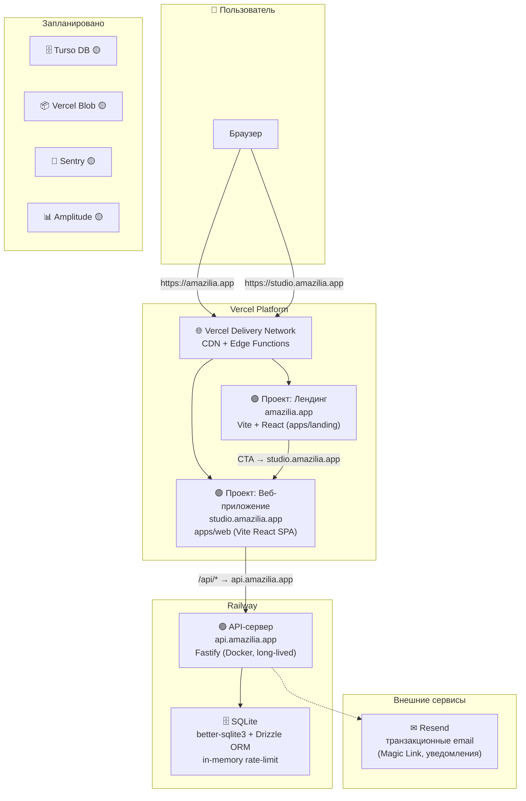
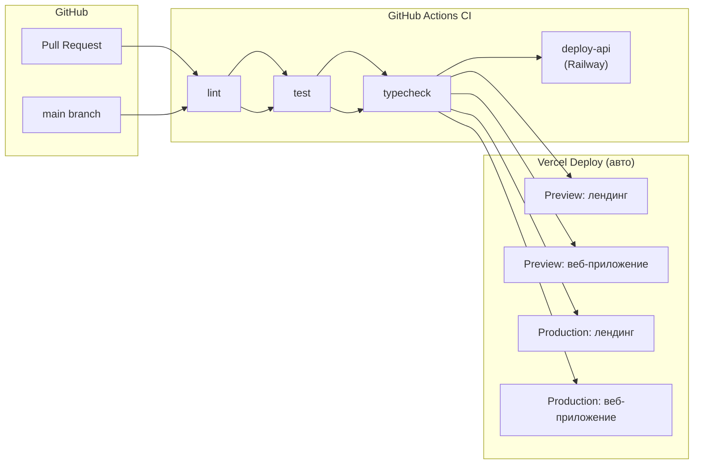

# DEPLOYMENT — Размещение Amazilia на мощностях Vercel

## 1. Архитектура размещения

### 1.1. Общая схема



### 1.2. Компоненты и их размещение

| Компонент | Хостинг | Технология | Статус |
|-----------|---------|-----------|--------|
| **Лендинг** (`amazilia.app`) | Vercel (проект `amazilia-landing`) | Vite + React (`apps/landing`) | 🟢 |
| **Веб-приложение** (`studio.amazilia.app`) | Vercel (проект `amazilia-studio`) | Vite + React SPA (`apps/web`) | 🟢 |
| **API-сервер** (`api.amazilia.app`) | Railway (Docker) | Fastify (`apps/api`) | 🟢 |
| **База данных** | Локальный диск Railway | SQLite (`better-sqlite3`) + Drizzle ORM | 🟢 |
| **Email** | Resend | Транзакционные письма | 🟢 |
| **Аутентификация** | OAuth + Magic Link + TOTP | Google, GitHub, email | 🟢 |
| **База данных (план)** | Turso | libSQL (SQLite-совместимая) | 🟡 |
| **Файловое хранилище (план)** | Vercel Blob Storage | S3-совместимое API | 🟡 |

> **ADR-008 (отменён): Лендинг как роут внутри Studio.** Предполагалось объединить лендинг и студию в один проект Vercel с лендингом на `/landing`. Решение отменено: лендинг остаётся отдельным Vite-проектом (`apps/landing/`) — независимый деплой, изолированные ресурсы, собственный `vercel.json`.

#### 1.2.1. API на Railway (нативный Fastify) 🟢

`apps/api` — **long-lived** Fastify-сервер на Railway: cron-задачи (`setInterval`), in-memory rate-limit, SQLite на диске (`/app/data/`). В отличие от serverless — нет холодных стартов, нет ограничений на длительность запроса, не нужно переписывать синхронный код `better-sqlite3` на async.

> **Причина выбора Railway вместо Vercel Serverless:** serverless-подход требовал миграции rate-limit на внешний стор (Upstash), переноса cron в Vercel Cron Jobs, и обязательной миграции SQLite → Turso (переход на async-драйвер). Railway позволяет оставить текущую архитектуру без изменений.

**Реализация (всё готово ✅):**

- **Dockerfile:** `Dockerfile.api` — двухстадийная сборка (builder + runtime), Node 22 Alpine
- **CI/CD:** GitHub Actions → `railway up` при push в `main` (job `deploy-api`)
- **Конфигурация:** `.railwayignore`, `infra/railway/README.md`
- **Railway Project ID:** `29a9e3e1-2d04-46c3-b10e-2136f9f1546e`
- **База:** SQLite в `/app/data/jazz-trainer.sqlite`

> **Примечание:** `apps/api/vercel.json` с serverless-конфигурацией сохранён для возможной будущей миграции на Vercel Serverless + Turso.

### 1.3. Доменная структура

**Целевые домены (после покупки `amazilia.app`):**

```
amazilia.app           → Лендинг (Vercel)
studio.amazilia.app    → Веб-приложение (Vercel)
api.amazilia.app       → API-сервер (Railway, CNAME → Railway)
```

**Текущие домены (бесплатные):**

| Проект | Домен | Платформа |
|--------|-------|-----------|
| Лендинг | `<landing>.vercel.app` | Vercel |
| Studio | `<studio>.vercel.app` | Vercel |
| API | `<project>.up.railway.app` | Railway |

После покупки `amazilia.app` — Vercel-домены через Vercel Domains, API через Railway Custom Domain.

---

## 2. Окружения (Environments)

### 2.1. Типы окружений

Vercel предоставляет три встроенных типа окружений:

| Окружение | Назначение | Триггер деплоя | Домен |
|-----------|-----------|-----------------|-------|
| **Production** | Боевой трафик | Push в `main` | `amazilia.app`, `studio.amazilia.app` |
| **Preview** | Ревью изменений | Pull Request | `<hash>.vercel.app` (автоматически) |
| **Development** | Локальная разработка | `vercel dev` | `localhost:3000` |

### 2.2. Переменные окружения (Environment Variables)

Каждое окружение имеет свой набор переменных. Управление через Vercel CLI (рекомендовано) или Dashboard:

```bash
# Аутентификация
vercel login

# Привязать директорию к проекту
cd apps/landing && vercel link --project amazilia-landing --yes

# Просмотр всех проектов и их production-URL
vercel projects ls

# Добавить переменную для production
vercel env add VITE_STUDIO_URL production
# → ввести значение и Enter

# Просмотр всех переменных проекта
vercel env ls

# Скачать локально
vercel env pull .env.local
```

> **Важно:** Vite-переменные (`VITE_*`) подставляются на этапе сборки. После изменения — обязательный редеплой (`git push` или `vercel --prod`).

**Критические переменные (каждое окружение — свои значения):**

| Переменная | Назначение | Окружение |
|-----------|-----------|-----------|
| `VITE_API_BASE_URL` | URL API-сервера для веб-приложения | Production: `https://amazilia-api-production.up.railway.app`<br/>Preview: `https://amazilia-api-production.up.railway.app` |
| `DATABASE_URL` | URL подключения к Turso | Production: prod-БД<br/>Preview: preview-БД |
| `DATABASE_AUTH_TOKEN` | Токен Turso | Все (разные значения) |
| `VITE_STUDIO_URL` | URL студии для ссылок с лендинга (вход, CTA) | Проект `amazilia-landing`: Production = `https://<studio>.vercel.app` |
| `VITE_AMPLITUDE_API_KEY` | Ключ Amplitude (продуктовая аналитика) | Все (разные для prod/preview) |


### 2.3. Конфигурационные файлы Vercel

#### Лендинг: `vercel.json` (в `apps/landing/`)

Лендинг — отдельный Vite + React проект в монорепо.

```json
{
  "framework": null,
  "buildCommand": "cd ../.. && npm install --no-package-lock && npm run build -w @jazz/landing",
  "outputDirectory": "dist",
  "devCommand": "cd ../.. && npm run dev -w @jazz/landing",
  "git": {
    "deploymentEnabled": {
      "main": true
    }
  }
}
```

#### Веб-приложение: `vercel.json` (в `apps/web/`)

```json
{
  "framework": null,
  "buildCommand": "cd ../.. && npm run build -- --filter=@jazz/web",
  "outputDirectory": "dist",
  "installCommand": "cd ../.. && npm ci",
  "devCommand": "cd ../.. && npm run dev -- --filter=@jazz/web",
  "rewrites": [
    {
      "source": "/api/:path*",
      "destination": "https://amazilia-api-production.up.railway.app/api/:path*"
    }
  ],
  "headers": [
    {
      "source": "/assets/(.*)",
      "headers": [
        { "key": "Cache-Control", "value": "public, max-age=31536000, immutable" }
      ]
    }
  ],
  "git": {
    "deploymentEnabled": {
      "main": true
    }
  }
}
```

---

## 3. Пайплайн релизов (CI/CD) 🟢

### 3.1. Общая схема



### 3.2. GitHub Actions — этапы

Файл: `.github/workflows/ci.yml`

```yaml
name: CI

on:
  pull_request:
  push:
    branches: [main]

jobs:
  verify:
    runs-on: ubuntu-latest
    steps:
      - uses: actions/checkout@v4
      - uses: actions/setup-node@v4
        with:
          node-version: 22
      - name: Install dependencies
        run: |
          rm -rf node_modules package-lock.json
          npm install --no-audit --no-fund
      - name: Typecheck
        run: npm run typecheck
      - name: Lint
        run: npm run lint
      - name: Tests
        run: npm run test

  deploy-api:
    needs: verify
    if: github.ref == 'refs/heads/main'
    runs-on: ubuntu-latest
    steps:
      - uses: actions/checkout@v4
      - name: Install Railway CLI
        run: npm i -g @railway/cli
      - name: Deploy API to Railway
        run: railway up --service amazilia-api
        env:
          RAILWAY_TOKEN: ${{ secrets.RAILWAY_TOKEN }}
```

### 3.3. Стратегия деплоя

| Событие | Действие |
|---------|----------|
| **Pull Request** | GitHub Actions: lint/typecheck/test. Vercel: авто-Preview деплой лендинга + веб-приложения. |
| **Push в `main`** | GitHub Actions: lint/typecheck/test → `deploy-api` (Railway). Vercel: авто-Production деплой лендинга + веб-приложения. |
| **Rollback (Vercel)** | `vercel rollback` (мгновенный откат лендинга/студии) |
| **Rollback (Railway)** | `railway rollback` или редеплой предыдущего коммита |

### 3.4. Preview Deployments (тестирование на проде)

Каждый Pull Request автоматически получает уникальный Preview URL от Vercel:

```
my-feature-g1a2b.vercel.app          ← лендинг
my-feature-g1a2b-studio.vercel.app   ← веб-приложение
```

API на Railway — общий для всех preview (in-memory rate-limit, общая SQLite).

**Использование:**
- Ручное тестирование перед мержем
- Демонстрация заказчику
- E2E-тесты на Preview-окружении

### 3.5. Vercel Toolbar 🟡

Встроенная панель разработчика для Preview и Production (требует настройки):
- **Комментарии:** оставлять замечания прямо на странице
- **Feature Flags:** переключать фича-флаги для тестирования
- **Performance:** замер Web Vitals на лету

---

## 4. Инфраструктура как код (IaC) 🟢

### 4.1. Структура `infra/` в монорепо (актуальная)

```
infra/
├── README.md                     ← обзорная документация
├── ci/
│   └── pipeline.yml              ← копия .github/workflows/ci.yml
├── railway/
│   └── README.md                 ← Railway-проект, деплой, переменные
├── scripts/
│   └── backup-blob.sh            ← заглушка бэкапа (не реализовано)
├── secrets/
│   └── .sops.yaml                ← SOPS-конфиг (ключ не настроен)
├── turso/
│   └── schema.sql                ← дамп схемы (заглушка)
└── vercel/
    ├── landing.json              ← IaC-копия apps/landing/vercel.json
    ├── studio.json               ← IaC-копия apps/web/vercel.json
    ├── api.json                  ← IaC-копия apps/api/vercel.json
    ├── project-settings.md       ← ручное воспроизведение настроек
    └── env/                      ← (пусто)
```

### 4.2. Подход: Configuration over Terraform

- **Vercel** — через Vercel CLI + Git Integration. Конфиги в `infra/vercel/`.
- **Railway** — через GitHub Actions `railway up`. Документировано в `infra/railway/README.md`.
- **Turso** — план: Terraform-провайдер (пока заглушка `infra/turso/schema.sql`).
- **Секреты** — SOPS + age (`.sops.yaml` создан, ключ не настроен 🟡).

---

## 5. Хранение данных и бэкапирование

### 5.1. База данных: SQLite (текущая) 🟢

Текущее состояние: API на Railway использует SQLite через `better-sqlite3` + Drizzle ORM.

| Характеристика | Значение |
|----------------|----------|
| Драйвер | `better-sqlite3` (нативный C-модуль) |
| ORM | Drizzle (`drizzle-orm/better-sqlite3`) |
| Файл БД | `/app/data/jazz-trainer.sqlite` (Railway), `./data/jazz-trainer.sqlite` (локально) |
| WAL | Включён |
| Миграции | `drizzle-kit` → `apps/api/drizzle/` |

Бэкапирование: Railway не предоставляет встроенных бэкапов диска. Рекомендовано периодическое копирование SQLite-файла в Vercel Blob (после его настройки).

### 5.2. База данных: Turso (план) 🟡

Целевая БД после миграции — Turso (libSQL, edge-ready, встроенные бэкапы). Требует замены драйвера и перевода синхронного кода на async.

### 5.3. Файловое хранилище: Vercel Blob (план) 🟡

```ts
const url = 'https://blob.vercel-storage.com/...';
const access = 'public';
const blobs = await list({ prefix: 'samples/' });
```

---

## 6. Безопасность сервиса и защита от взлома

### 6.1. Middleware API (Fastify-плагины) 🟢

| Плагин | Назначение |
|--------|------------|
| `@fastify/helmet` | HTTP-заголовки безопасности |
| `@fastify/cors` | CORS между доменами |
| `@fastify/rate-limit` | Защита от перебора (in-memory) |
| `authPlugin` | Аутентификация (сессии) |
| `rbacPlugin` | Авторизация (RBAC) |
| `adminIpFilterPlugin` | IP-фильтр super_admin |

### 6.2. Vercel Firewall (WAF) 🟡

```json
{
  "firewall": {
    "rules": [
      {
        "action": "block",
        "condition": { "ip": "0.0.0.0/0", "path": "/wp-admin" }
      }
    ],
    "managedRulesets": { "owasp": "paranoid" }
  }
}
```

### 6.3. Защита переменных окружения 🟡

- CI/CD: `RAILWAY_TOKEN` в GitHub Secrets ✅
- SOPS + age: `.sops.yaml` создан, ключ не настроен 🟡
- Railway/Vercel env vars: через Dashboard

---

## 7. CDN и доставка контента

### 7.1. Vercel Delivery Network 🟢

Заголовки кеширования в `vercel.json`:

```json
{
  "headers": [
    {
      "source": "/assets/(.*)",
      "headers": [
        { "key": "Cache-Control", "value": "public, max-age=31536000, immutable" }
      ]
    }
  ]
}
```

### 7.2. Оптимизация для аудио-файлов 🟡

---

## 8. Мониторинг и наблюдаемость (Observability)

### 8.1. Vercel Observability 🟡

| Возможность | Тариф | Что даёт |
|------------|-------|----------|
| **Web Vitals** | Все планы | LCP, CLS, FID, INP |
| **Observability Plus** | Pro | P50/P95/P99, retention 30 дней, алерты |

### 8.2. Sentry (Error Tracking) 🟡

```typescript
Sentry.init({
  dsn: import.meta.env.VITE_SENTRY_DSN,
  environment: import.meta.env.VERCEL_ENV,
  integrations: [Sentry.browserTracingIntegration()],
  tracesSampleRate: 0.1,
});
```

### 8.3. Мониторинг API 🟢/🟡

- Текущий: Railway показывает статус деплоя, логи контейнера ✅
- План: Sentry для ошибок 🟡

---

## 9. Аналитика

### 9.1. Vercel Analytics 🟡

```bash
npm install @vercel/analytics
```

```typescript
import { Analytics } from '@vercel/analytics/react';
root.render(<><App /><Analytics /></>);
```

### 9.2. Amplitude — продуктовая аналитика 🟡

```bash
npm install @amplitude/analytics-browser
```

```typescript
amplitude.init(import.meta.env.VITE_AMPLITUDE_API_KEY, {
  defaultTracking: { pageViews: true, sessions: true },
});
```

**Ключевые события (MVP):**

| Событие | Параметры | Зачем |
|---------|----------|-------|
| `landing_visit` | `source`, `utm_*` | Анализ источников трафика |
| `signup_started` | `provider` | Воронка регистрации |
| `exercise_started` | `exerciseId`, `style`, `bpm` | Популярность упражнений |
| `exercise_completed` | `exerciseId`, `score`, `duration` | Вовлечённость |

### 9.3. UTM-разметка (лендинг → приложение) 🟡

---

## 10. Повышение конверсии лендинга 🟡

### 10.1. A/B-тестирование через Vercel Flags

```ts
const showPricingVariant = await flag({
  key: 'pricing-variant',
  decide: () => Math.random() > 0.5 ? 'a' : 'b',
});
```

### 10.2. Инструменты анализа конверсии

### 10.3. Быстрые итерации лендинга

---

## 11. Feature Flags (Фича-флаги)

### 11.1. Два уровня фича-флагов

- **Vercel Flags** — A/B-тесты, UI-эксперименты 🟡
- **Внутренние БД-флаги** (`useFlag()` из `@jazz/plugin-sdk`) — RBAC-доступ 🟢

### 11.2. Vercel Flags — настройка 🟡

```ts
const flag = await getFlags();
const requireAuth = flag({ key: 'require-auth', defaultValue: false });
```

### 11.3. Vercel Edge Config 🟡

```ts
const isAuthRequired = await edgeConfig.get('require-auth');
```

### 11.4. Взаимодействие с внутренними флагами 🟢

Внутренние флаги работают через БД и `useFlag()` / `usePermission()` на фронте.

---

## 12. Рассылки и уведомления

### 12.1. Resend — транзакционные email 🟢

Реализовано: `apps/api/src/services/email.service.ts`

```ts
const resend = new Resend(process.env.RESEND_API_KEY);

async function sendMagicLink(email: string, link: string) {
  await resend.emails.send({
    from: 'Amazilia <noreply@amazilia.app>',
    subject: 'Magic Link для входа',
    html: `<a href="${link}">Войти</a>`,
  });
}
```

Dev-режим: если `RESEND_API_KEY` не задан — ссылка печатается в консоль.

### 12.2. Другие виды уведомлений 🟡

---

## 13. Управление доменами и субдоменами

### 13.1. Регистрация и настройка доменов ⏳

Домен `amazilia.app` ещё не куплен. Используются бесплатные домены Vercel и Railway.

### 13.2. SSL-сертификаты 🟢

Vercel и Railway автоматически выпускают SSL через Let's Encrypt.

### 13.3. Редиректы 🟡

```json
{
  "redirects": [
    { "source": "/old-page", "destination": "/new-page", "permanent": true },
    {
      "source": "/:path*",
      "destination": "https://studio.amazilia.app/:path*",
      "permanent": true,
      "has": { "type": "host", "value": "app.amazilia.app" }
    }
  ]
}
```

---

## 14. Система поддержки и тикетов 🟡

### 14.1. Рекомендованная связка

- **Crisp** — live chat + тикеты
- **GitHub Issues** — баг-репорты, фича-реквесты

### 14.2. Интеграция Crisp

```html
<script>
  const d = document;
  const s = d.createElement('script');
  s.src = 'https://client.crisp.chat/l.js';
  s.async = 1;
  d.getElementsByTagName('head')[0].appendChild(s);
</script>
```

---

## 15. Двухстадийная стратегия доступа к сервису

### 15.1. Стадия 1: Открытый доступ (MVP) 🟢

Приложение доступно без регистрации (`AUTH_DEV_MODE=true`).

### 15.2. Стадия 2: Доступ по регистрации 🟢

OAuth (Google, GitHub) + Magic Link + TOTP 2FA реализованы. Включение — `AUTH_DEV_MODE=false`.

### 15.3. Переключение между стадиями 🟢

Переключение — через переменную `AUTH_DEV_MODE` на Railway. Требуется редеплой. Vercel Flags (план) позволят переключать мгновенно.

---

## 16. Управление переменными (Environment Variables)

### 16.1. Иерархия переменных 🟢

- **Локально:** `.env` файл (корень проекта)
- **Railway:** Dashboard → Variables (для API)
- **Vercel:** Dashboard/CLI (для лендинга и студии)
- **GitHub Secrets:** `RAILWAY_TOKEN` (для CI/CD)
- Приоритет: shell/платформа > `.env` файл

### 16.2. Жизненный цикл переменной

### 16.3. Каталог переменных

Полный актуальный каталог: [DEPLOYMENT-BASIS.md §8](DEPLOYMENT-BASIS.md#8-переменные-окружения).

---

## 17. План действий (Roadmap)

> **Актуализировано 2026-07-28.** Учтён выбор Railway для API вместо Vercel Serverless.

### Фаза 1: Подготовка инфраструктуры ✅ ВЫПОЛНЕНО

| Шаг | Задача | Статус |
|-----|--------|--------|
| 1.1 | Проект лендинга на Vercel (`amazilia-landing`) | ✅ |
| 1.2 | Проект веб-приложения на Vercel (`amazilia-studio`) | ✅ |
| 1.3 | Проект API на Railway (`amazilia-api`) | ✅ |
| 1.4 | Создать `infra/` структуру в репозитории | ✅ |
| 1.5 | Настроить GitHub Actions CI/CD (verify + deploy-api) | ✅ |
| 1.6 | Настроить Railway-деплой (Dockerfile.api + railway up) | ✅ |
| 1.7 | Создать `vercel.json` для всех трёх проектов | ✅ |

### Фаза 2: Миграция БД 🟡 ОТЛОЖЕНО

| Шаг | Задача | Статус |
|-----|--------|--------|
| 2.1 | Сменить драйвер `better-sqlite3` → `@libsql/client` | 🟡 |
| 2.2 | Создать Turso БД | 🟡 |
| 2.3 | Накатить миграции на Turso | 🟡 |
| 2.4 | Настроить бэкапы Turso | 🟡 |

> **Причина отсрочки:** Railway позволяет использовать SQLite/better-sqlite3 без изменений. Миграция на Turso нужна при переходе на Vercel Serverless или для edge-ready БД.

### Фаза 3: Observability, безопасность, аналитика 🟡

| Шаг | Задача | Статус |
|-----|--------|--------|
| 3.1 | Подключить Vercel Analytics | 🟡 |
| 3.2 | Подключить Sentry | 🟡 |
| 3.3 | Настроить Vercel Firewall (WAF) | 🟡 |
| 3.4 | Настроить Vercel Flags + Edge Config | 🟡 |
| 3.5 | Подключить Amplitude | 🟡 |
| 3.6 | Настроить SOPS + age (ключ) | 🟡 |
| 3.7 | Настроить Vercel Blob Storage | 🟡 |

### Фаза 4: Деплой и настройка ✅ ВЫПОЛНЕНО (Railway)

| Шаг | Задача | Статус |
|-----|--------|--------|
| 4.1 | Деплой лендинга на Vercel | ✅ |
| 4.2 | Деплой веб-приложения на Vercel | ✅ |
| 4.3 | Деплой API на Railway (Docker) | ✅ |
| 4.4 | Настроить прокси `/api` → Railway API | ✅ |
| 4.5 | Проверить сквозную работу | ✅ |

### Фаза 5: Продакшен-фичи

| Шаг | Задача | Статус |
|-----|--------|--------|
| 5.1 | Аутентификация (OAuth + Magic Link + TOTP) | ✅ |
| 5.2 | Resend email-рассылка | ✅ |
| 5.3 | RBAC и аудит | ✅ |
| 5.4 | Покупка домена `amazilia.app` | ⏳ |
| 5.5 | Настройка собственных доменов | ⏳ |
| 5.6 | Система поддержки (Crisp) | 🟡 |

---

## 18. Документация Vercel для devops-агента

Devops-агент должен изучить следующие разделы документации Vercel:

| Тема | URL |
|------|-----|
| Getting Started | https://vercel.com/docs/getting-started-with-vercel |
| Projects | https://vercel.com/docs/projects |
| Deployments | https://vercel.com/docs/deployments |
| Environments | https://vercel.com/docs/environments |
| Environment Variables | https://vercel.com/docs/environment-variables |
| Domains | https://vercel.com/docs/domains |
| CLI | https://vercel.com/docs/cli |
| Vercel Blob | https://vercel.com/docs/storage/vercel-blob |
| Edge Config | https://vercel.com/docs/storage/edge-config |
| Flags (Feature Flags) | https://vercel.com/docs/flags |
| Firewall | https://vercel.com/docs/vercel-firewall |
| Observability | https://vercel.com/docs/observability |
| Analytics | https://vercel.com/docs/analytics |
| Security | https://vercel.com/docs/security |
| MCP | https://vercel.com/docs/mcp |
| Integrations (Turso, Resend) | https://vercel.com/docs/integrations |
| Git Integration | https://vercel.com/docs/deployments/git |
| Preview Deployments | https://vercel.com/docs/deployments/preview |
| Toolbar | https://vercel.com/docs/vercel-toolbar |
| Builds | https://vercel.com/docs/builds |

Devops-агент также должен использовать **Vercel MCP** (Model Context Protocol) для автоматизации управления инфраструктурой через AI-агента. См. https://vercel.com/docs/mcp.

---

## 19. Чек-лист готовности к запуску

- [x] Лендинг деплоится на бесплатный Vercel-домен
- [x] Веб-приложение деплоится на бесплатный Vercel-домен
- [x] API деплоится на Railway (бесплатный домен `.up.railway.app`)
- [ ] Turso БД доступна из API (пока SQLite на Railway)
- [ ] Vercel Blob работает
- [x] HTTPS включен для всех доменов (Vercel + Railway автоматически)
- [x] Environment Variables настроены (Railway + Vercel)
- [x] CI/CD проходит (lint → typecheck → test → deploy-api)
- [x] Preview Deployments создаются для PR (лендинг + студия)
- [ ] Vercel Analytics показывает данные
- [ ] Amplitude принимает события
- [ ] Sentry принимает ошибки
- [ ] WAF активен
- [ ] Feature Flags работают (Edge Config)
- [x] Resend отправляет письма (dev-mode fallback)
- [x] Аутентификация работает (OAuth + Magic Link + TOTP)
- [x] Документация `infra/README.md` актуален
- [x] `DEPLOYMENT.md` закоммичен в репо

---

_Документ описывает требования к размещению Amazilia. Создан 2026-07-26. Актуализирован 2026-07-28: отражён выбор Railway для API, добавлены статус-маркеры 🟢/🟡/⏳, обновлены Roadmap и чек-лист (v3.0). Исполнитель: devops AI agent._
