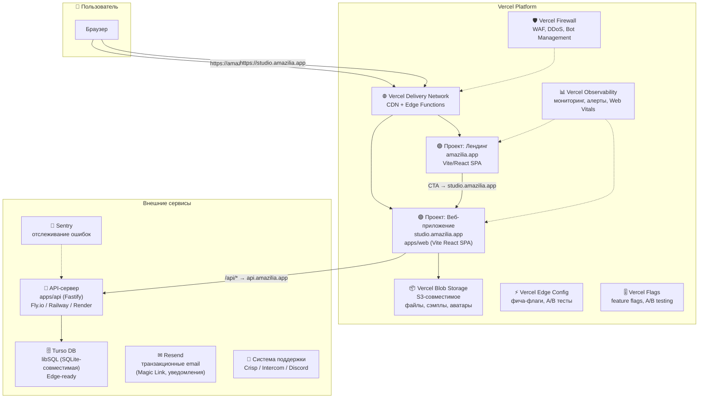
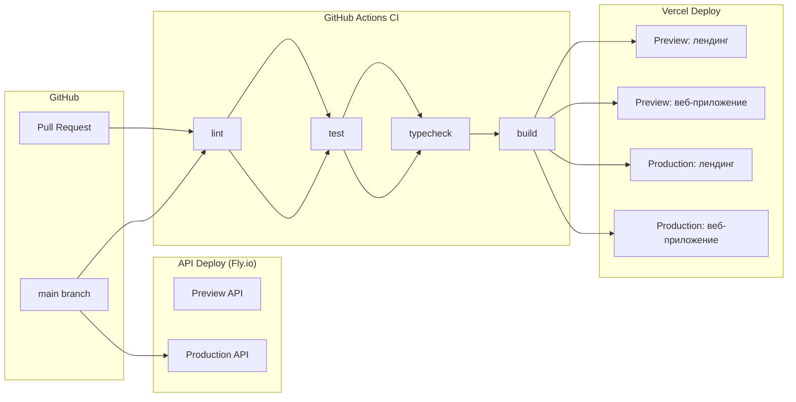

# DEPLOYMENT — Размещение Jazz Trainer на мощностях Vercel

> **Версия:** v1.0 от 2026-07-26
> **Статус:** Спецификация требований (🔴 не реализовано)
> **Охват:** Лендинг-сайт, веб-приложение (SPA), API-сервер, база данных, CI/CD, безопасность, наблюдаемость
> **Автор:** software-architect AI agent
> **Исполнитель:** devops AI agent (`.agents/skills/devops/SKILL.md`)
> **Целевая платформа:** Vercel (Hobby → Pro)
> **Документация Vercel:** https://vercel.com/docs
> **MCP-интеграция:** Vercel MCP (https://vercel.com/docs/mcp)

---

## 1. Архитектура размещения

### 1.1. Общая схема



### 1.2. Компоненты и их размещение

| Компонент | Хостинг | Технология | Комментарий |
|-----------|---------|-----------|-------------|
| **Лендинг** (`amazilia.app`) | Vercel (отдельный проект) | Выбор за devops: Astro / чистый HTML / Next.js static | Не зависит от монорепо. Деплоится независимо. |
| **Веб-приложение** (`studio.amazilia.app`) | Vercel (отдельный проект) | Vite + React SPA (`apps/web`) | Сборка из монорепо. Прокси `/api` → API-сервер. |
| **API-сервер** (`api.amazilia.app`) | Fly.io / Railway / Render | Fastify (`apps/api`) | Long-lived сервер. **Не на Vercel** — несовместимо с serverless. |
| **База данных** | Turso | libSQL (SQLite-совместимая) | Нативная Vercel-интеграция. edge-ready. |
| **Файловое хранилище** | Vercel Blob Storage | S3-совместимое API | Ассеты, сэмплы, аватары пользователей. |
| **Email** | Resend | Транзакционные письма | Magic Link, уведомления, welcome-письма. Vercel-интеграция. |

### 1.3. Доменная структура

```
amazilia.app           → Лендинг (Vercel Project #1)
studio.amazilia.app    → Веб-приложение (Vercel Project #2)
api.amazilia.app       → API-сервер (Fly.io / Railway)
```

**Первый этап (бесплатные домены Vercel):**

```
<проект>.vercel.app          → Лендинг
<проект>-studio.vercel.app   → Веб-приложение
```

После покупки `amazilia.app` — перенастройка DNS через Vercel Domains.

---

## 2. Окружения (Environments)

### 2.1. Типы окружений

Vercel предоставляет три встроенных типа окружений:

| Окружение | Назначение | Триггер деплоя | Домен |
|-----------|-----------|-----------------|-------|
| **Production** | Боевой трафик | Push в `main` | `amazilia.app`, `studio.amazilia.app` |
| **Preview** | Ревью изменений | Pull Request | `<hash>.vercel.app` (автоматически) |
| **Development** | Локальная разработка | `vercel dev` | `localhost:3000` |

### 2.2. Переменные окружения (Environment Variables)

Каждое окружение имеет свой набор переменных. Управление через Vercel Dashboard или CLI:

```bash
# Пример: установка переменной для production
vercel env add DATABASE_URL production

# Для preview
vercel env add DATABASE_URL preview

# Для development (локально)
vercel env pull .env.local
```

**Критические переменные (каждое окружение — свои значения):**

| Переменная | Назначение | Окружение |
|-----------|-----------|-----------|
| `VITE_API_BASE_URL` | URL API-сервера для веб-приложения | Production: `https://api.amazilia.app`<br/>Preview: `https://api-preview.amazilia.app` |
| `DATABASE_URL` | URL подключения к Turso | Production: prod-БД<br/>Preview: preview-БД |
| `DATABASE_AUTH_TOKEN` | Токен Turso | Все (разные значения) |
| `GOOGLE_CLIENT_ID` | Google OAuth client ID | Все (разные приложения) |
| `GOOGLE_CLIENT_SECRET` | Google OAuth secret | Все (разные значения) |
| `GITHUB_CLIENT_ID` | GitHub OAuth client ID | Все |
| `GITHUB_CLIENT_SECRET` | GitHub OAuth secret | Все |
| `RESEND_API_KEY` | API-ключ Resend (email) | Все |
| `SESSION_SECRET` | Секрет для подписи сессий | Все (разные значения) |
| `BLOB_READ_WRITE_TOKEN` | Токен Vercel Blob | Все |
| `SENTRY_DSN` | Sentry DSN для error tracking | Все |
| `AUTH_DEV_MODE` | Dev-login (только для разработки) | `true` (dev/preview), `false` (production) |

### 2.3. Конфигурационные файлы Vercel

#### Лендинг: `vercel.json` (в корне лендинг-проекта)

```json
{
  "framework": null,
  "buildCommand": "npm run build",
  "outputDirectory": "dist",
  "installCommand": "npm install",
  "devCommand": "npm run dev",
  "git": {
    "deploymentEnabled": {
      "main": true
    }
  }
}
```

#### Веб-приложение: `vercel.json` (в `apps/web/`)

```json
{
  "framework": "vite",
  "buildCommand": "npm run build -w @jazz/web",
  "outputDirectory": "dist",
  "installCommand": "npm ci",
  "devCommand": "npm run dev -w @jazz/web",
  "rewrites": [
    {
      "source": "/api/:path*",
      "destination": "https://api.amazilia.app/:path*"
    }
  ],
  "headers": [
    {
      "source": "/assets/(.*)",
      "headers": [
        {
          "key": "Cache-Control",
          "value": "public, max-age=31536000, immutable"
        }
      ]
    }
  ],
  "git": {
    "deploymentEnabled": {
      "main": true
    }
  }
}
```

---

## 3. Пайплайн релизов (CI/CD)

### 3.1. Общая схема



### 3.2. GitHub Actions — этапы

Файл: `.github/workflows/ci.yml`

```yaml
name: CI

on:
  pull_request:
  push:
    branches: [main]

jobs:
  # 1. Статический анализ
  verify:
    runs-on: ubuntu-latest
    steps:
      - uses: actions/checkout@v4
      - uses: actions/setup-node@v4
        with:
          node-version: 22
          cache: npm
      - run: npm ci
      - run: npm rebuild better-sqlite3
      - run: npm run typecheck
      - run: npm run lint
      - run: npm run test

  # 2. Деплой лендинга — выполняет Vercel (автоматически при push/PR)
  # Настройка: Vercel Git Integration → проект лендинга → auto-deploy

  # 3. Деплой веб-приложения — выполняет Vercel (автоматически)
  # Настройка: Vercel Git Integration → проект веб-приложения → auto-deploy

  # 4. Деплой API — ручной или автоматический через flyctl
  deploy-api:
    if: github.ref == 'refs/heads/main'
    needs: verify
    runs-on: ubuntu-latest
    steps:
      - uses: actions/checkout@v4
      - uses: superfly/flyctl-actions/setup-flyctl@master
      - run: |
          cd apps/api
          flyctl deploy --remote-only
        env:
          FLY_API_TOKEN: ${{ secrets.FLY_API_TOKEN }}
```

### 3.3. Стратегия деплоя

| Событие | Действие |
|---------|----------|
| **Pull Request открыт** | Vercel: автоматический Preview-деплой лендинга + веб-приложения. GitHub Actions: lint/typecheck/test. |
| **Push в feature-ветку** | Vercel: Preview-деплой. GitHub Actions: lint/typecheck/test. |
| **Push в `main`** | Vercel: Production-деплой лендинга + веб-приложения. GitHub Actions: lint/typecheck/test + деплой API. |
| **Rollback** | `vercel rollback` (мгновенный откат к предыдущему деплою) |

### 3.4. Preview Deployments (тестирование на проде)

Каждый Pull Request автоматически получает уникальный Preview URL:

```
my-feature-g1a2b.vercel.app          ← лендинг
my-feature-g1a2b-studio.vercel.app   ← веб-приложение
```

**Использование:**
- Ручное тестирование перед мержем
- Демонстрация заказчику
- E2E-тесты на Preview-окружении
- Vercel Toolbar → комментарии прямо на Preview-деплое

### 3.5. Vercel Toolbar

Встроенная панель разработчика для Preview и Production:

- **Комментарии:** оставлять замечания прямо на странице (не нужен скриншот)
- **Feature Flags:** переключать фича-флаги для тестирования
- **Draft Mode:** просмотр черновиков контента
- **Performance:** замер Web Vitals на лету

---

## 4. Инфраструктура как код (IaC)

### 4.1. Структура `infra/` в монорепо

```
infra/
├── vercel/
│   ├── landing/
│   │   └── vercel.json           # Конфигурация проекта лендинга
│   ├── studio/
│   │   └── vercel.json           # Конфигурация проекта веб-приложения
│   └── project-settings.md       # Описание настроек проектов для ручного воспроизведения
├── ci/
│   └── pipeline.yml              # GitHub Actions workflow
├── api/
│   ├── fly.toml                  # Конфигурация Fly.io (или railway.toml / render.yaml)
│   └── Dockerfile                # Dockerfile для API (если Railway/Render)
├── turso/
│   └── schema.sql                # Дамп схемы (для восстановления)
├── observability/
│   └── sentry.ts                 # Конфигурация Sentry SDK
├── secrets/
│   ├── .sops.yaml                # SOPS-конфигурация шифрования
│   └── .env.example              # Шаблон переменных (без значений!)
└── README.md                     # Инструкции по развёртыванию инфраструктуры
```

### 4.2. Подход: Terraform over Configuration

Для Vercel-инфраструктуры используем:

1. **`vercel.json`** — конфигурация проекта (build, routes, rewrites, headers) — коммитится в репо.
2. **Vercel CLI** — создание проектов, привязка доменов, установка переменных — выполняется devops-агентом через MCP Vercel.
3. **`vercel env pull`** — локальная синхронизация переменных окружения.

> **Примечание:** Vercel не имеет полноценного Terraform-провайдера для всех ресурсов. Настройка проектов (создание, линковка Git) выполняется однократно через CLI/Vercel Dashboard и фиксируется в `infra/vercel/project-settings.md`.

---

## 5. Хранение данных и бэкапирование

### 5.1. База данных: Turso

**Turso** — edge-ready SQLite (libSQL) с нативной Vercel-интеграцией.

| Характеристика | Значение |
|---------------|----------|
| **Тип БД** | libSQL (SQLite-совместимая) |
| **Гео-репликация** | Автоматическая (выбор регионов) |
| **Point-in-time recovery** | Встроено (до 30 дней) |
| **Бэкапы** | Автоматические ежедневные |
| **Миграции** | Drizzle ORM (существующие), без изменений в коде схемы |
| **Подключение** | HTTP (не требует TCP) через `@libsql/client` |

**Миграция с SQLite на Turso:**

```bash
# 1. Установить интеграцию Turso в Vercel
vercel install turso

# 2. Создать БД для каждого окружения
turso db create jazz-trainer-prod
turso db create jazz-trainer-preview

# 3. Сменить драйвер в apps/api
npm install @libsql/client
# Заменить better-sqlite3 → @libsql/client в drizzle.config.ts

# 4. Запустить миграции
npm run db:migrate
```

**Стратегия бэкапирования:**

| Частота | Метод | Хранение |
|---------|-------|----------|
| Автоматически (каждый час) | Turso встроенные бэкапы | 30 дней |
| Еженедельно | `turso db dump` → Vercel Blob | 12 месяцев |
| Перед миграцией | `turso db dump` → Vercel Blob + локально | Бессрочно |

**Восстановление:**

```bash
# Из point-in-time recovery (Turso Dashboard)
turso db restore jazz-trainer-prod --timestamp 2026-07-26T12:00:00Z

# Из дампа в Blob
turso db dump jazz-trainer-prod | turso db shell jazz-trainer-restored
```

### 5.2. Файловое хранилище: Vercel Blob

**Vercel Blob Storage** — S3-совместимое хранилище для статических файлов.

**Использование:**
- Пользовательские аватары
- MIDI-файлы (загрузка/скачивание)
- Экспорт/импорт гармонических сеток
- Сэмплы и звуковые файлы (пресеты инструментов)
- Бэкапы БД

**API (пример):**

```typescript
import { put, list } from '@vercel/blob';

// Загрузка
const { url } = await put('avatars/user-123.png', file, {
  access: 'public',
});

// Список
const { blobs } = await list({ prefix: 'avatars/' });
```

**Бэкапирование Blob:** Vercel Blob хранит данные избыточно. Для дополнительной защиты — периодическое копирование в AWS S3 Glacier (скрипт в `infra/scripts/backup-blob.sh`).

---

## 6. Безопасность сервиса и защита от взлома

### 6.1. Vercel Firewall (WAF)

Vercel предоставляет enterprise-grade Web Application Firewall **бесплатно для всех тарифов**:

| Возможность | Статус | Описание |
|------------|--------|----------|
| **Automatic DDoS Mitigation** | ✅ Включено по умолчанию | Защита от DDoS на уровне платформы |
| **Custom WAF Rules** | 🔴 Настроить | Блокировка по IP, гео, user-agent, path |
| **Managed Rulesets** | 🔴 Настроить | OWASP Top 10, защита от инъекций |
| **Bot Management** | 🔴 Включить | Защита от скрапинга, зловредных ботов |
| **BotID** | 🔴 Включить | Невидимая CAPTCHA без пользовательского взаимодействия |

**Конфигурация WAF (проектный уровень):**

```json
// vercel.json — секция firewall
{
  "firewall": {
    "rules": [
      {
        "action": "challenge",
        "condition": {
          "ip": ["192.168.0.0/16"],
          "path": "/api/*"
        }
      }
    ],
    "managedRulesets": {
      "owasp": "paranoid"
    }
  }
}
```

### 6.2. Дополнительные меры безопасности

| Уровень | Мера | Инструмент |
|---------|------|------------|
| **Транспорт** | HTTPS (автоматический SSL) | Vercel Edge Network |
| **Аутентификация** | OAuth (Google, GitHub) + Magic Link | `apps/api` |
| **CORS** | Настроен в Fastify (`@fastify/cors`) | `apps/api` |
| **Rate Limiting** | Настроен в Fastify (`@fastify/rate-limit`) | `apps/api` |
| **CSRF** | OAuth state + SameSite cookies | `apps/api` |
| **Заголовки безопасности** | Helmet (`@fastify/helmet`) | `apps/api` |
| **Secrets** | Vercel Environment Variables + SOPS | Vercel + `infra/secrets/` |
| **Deployment Protection** | Vercel Password Protection для Preview | Vercel Dashboard |
| **GitGuardian** | Сканирование секретов в коммитах | GitHub Actions (🔴 добавить) |

### 6.3. Защита переменных окружения

- **Production-секреты** — только через Vercel Environment Variables (зашифрованы at rest).
- **Локальная разработка** — `.env.local` (в `.gitignore`).
- **CI/CD** — GitHub Secrets → Vercel Environment Variables (пробрасываются при деплое).
- **Шифрование в репо** — SOPS + age для `infra/secrets/.env.encrypted`.

---

## 7. CDN и доставка контента

### 7.1. Vercel Delivery Network

Встроенная CDN с 100+ точками присутствия по миру. Автоматически для всех проектов.

**Что кешируется автоматически:**
- Статические ассеты (`/assets/*`) — immutable, 1 год
- Vercel Blob файлы — через CDN
- HTML страницы — с учётом cache-control заголовков

**Настройка кастомных заголовков кеширования:**

```json
// vercel.json
{
  "headers": [
    {
      "source": "/assets/(.*)",
      "headers": [
        { "key": "Cache-Control", "value": "public, max-age=31536000, immutable" }
      ]
    }
  ]
}
```

### 7.2. Оптимизация для аудио-файлов

Учитывая специфику Jazz Trainer (сэмплы инструментов):

- Сэмплы загружаются через Vercel Blob → CDN
- Аудио-файлы кешируются на 7 дней
- Использовать Range-запросы для частичной загрузки сэмплов (Tone.js streaming)

---

## 8. Мониторинг и наблюдаемость (Observability)

### 8.1. Vercel Observability

| Возможность | Тариф | Что даёт |
|------------|-------|----------|
| **Web Vitals** | Все планы | LCP, CLS, FID, INP — метрики реальных пользователей |
| **Vercel Functions** | Все планы | Latency, ошибки, холодные старты |
| **Edge Requests** | Все планы | RPS, статус-коды, география |
| **Observability Plus** | Pro | P50/P95/P99, retention 30 дней, алерты |
| **Monitoring** | Pro | Кастомные дашборды, алерты на метрики |

### 8.2. Sentry (Error Tracking)

На уровне приложения подключаем Sentry:

```typescript
// apps/web/src/sentry.ts
import * as Sentry from '@sentry/react';

Sentry.init({
  dsn: import.meta.env.VITE_SENTRY_DSN,
  environment: import.meta.env.VERCEL_ENV, // 'production' | 'preview' | 'development'
  integrations: [Sentry.browserTracingIntegration()],
  tracesSampleRate: 0.1,
});
```

**Что отслеживаем:**
- Необработанные ошибки React
- Ошибки API-запросов
- Performance traces (медленные загрузки)
- Source maps загружаются при деплое (Vercel-плагин Sentry)

### 8.3. Мониторинг API

На уровне API-сервера (вне Vercel):

- **Health-check:** `GET /api/health` (возвращает статус БД)
- **Метрики:** через OTEL или Prometheus endpoint
- **Логи:** структурированные JSON-логи → Loki / Papertrail
- **Алерты:** UptimeRobot на `/api/health`

---

## 9. Аналитика

### 9.1. Vercel Analytics

**Web Analytics (бесплатно, все планы):**

| Метрика | Описание |
|---------|----------|
| **Посетители** | Уникальные посетители |
| **Просмотры страниц** | Общее количество |
| **Источники трафика** | Referrer, UTM, поиск |
| **География** | Страны, города |
| **Устройства** | Desktop/Mobile/Tablet, OS, браузер |
| **Web Vitals** | LCP, CLS, FID, INP |

Подключение: `npm install @vercel/analytics`

```typescript
// apps/web/src/main.tsx
import { Analytics } from '@vercel/analytics/react';

root.render(
  <>
    <App />
    <Analytics />
  </>
);
```

### 9.2. Custom Analytics (опционально)

Для углублённой аналитики поведения пользователей в приложении:

- **PostHog** (self-hosted или cloud) — product analytics, session recording
- **Plausible** — privacy-friendly, легковесная

### 9.3. UTM-разметка (лендинг → приложение)

Для отслеживания конверсии:

```
amazilia.app → studio.amazilia.app?utm_source=landing&utm_medium=cta&utm_campaign=hero
```

Аналитика покажет воронку: посетители лендинга → клики CTA → регистрации.

---

## 10. Повышение конверсии лендинга

### 10.1. A/B-тестирование через Vercel Flags

Vercel Flags SDK позволяет проводить A/B-тесты и эксперименты:

```typescript
// На лендинге
import { flag } from '@vercel/flags/next'; // или универсальный SDK

const showPricingVariant = await flag({
  key: 'landing-pricing-variant',
  decide: () => Math.random() > 0.5, // 50/50 split
});

// Вариант A: стандартный pricing
// Вариант B: экспериментальный pricing
```

### 10.2. Инструменты анализа конверсии

| Инструмент | Назначение |
|-----------|-----------|
| **Vercel Web Analytics** | Базовая воронка (страницы → CTA-клики) |
| **Vercel Flags** | A/B-тесты, постепенные раскатки |
| **PostHog** (опционально) | Session recording, воронки, когорты |
| **Microsoft Clarity** (бесплатно) | Heatmaps, session recording |

### 10.3. Быстрые итерации лендинга

- Лендинг — отдельный проект, деплоится за секунды
- Preview-деплой для каждого PR
- Возможность мгновенного отката (`vercel rollback`)

---

## 11. Feature Flags (Фича-флаги)

### 11.1. Два уровня фича-флагов

| Источник | Где используется | Для чего |
|----------|-----------------|----------|
| **Vercel Flags** (`@vercel/flags`) | Лендинг, фронтенд (React) | A/B-тесты, постепенные раскатки, UI-эксперименты |
| **Внутренние фича-флаги (БД)** | `apps/api`, `useFlag()` | Доступ к функциональности по роли/подписке (существующий механизм) |

### 11.2. Vercel Flags — настройка

```typescript
// vercel.flags.ts — в корне проекта
import { createFlagsSDK } from '@vercel/flags';

export const { flag, getFlags } = createFlagsSDK({
  // Используем Edge Config для сверхбыстрого чтения (< 1ms)
  // или Vercel Flags Platform
});
```

**Пример: управление доступом к приложению (стадия 1 → стадия 2):**

```typescript
// На веб-приложении
const requireAuth = await flag({
  key: 'require-auth',
  defaultValue: false, // Стадия 1: false (открытый доступ)
  // Стадия 2: переключаем в true (только для зарегистрированных)
});
```

### 11.3. Vercel Edge Config

Хранилище для фича-флагов с временем чтения < 10ms в любом регионе мира.

```bash
vercel install edge-config
```

```typescript
import { get } from '@vercel/edge-config';

const isAuthRequired = await get<boolean>('require-auth') ?? false;
```

### 11.4. Взаимодействие с внутренними флагами

Существующий механизм `useFlag()` (из `@jazz/plugin-sdk`, БД-based) остаётся для RBAC-флагов (доступ к теории, упражнениям по роли). Vercel Flags — для инфраструктурных и продуктовых экспериментов.

---

## 12. Рассылки и уведомления

### 12.1. Resend — транзакционные email

Resend — нативная Vercel-интеграция для отправки писем.

**Типы писем:**

| Тип | Триггер | Отправитель |
|-----|---------|-------------|
| Magic Link | Запрос входа | `noreply@amazilia.app` |
| Welcome | После регистрации | `hello@amazilia.app` |
| Passwordless Login | OAuth не использован | `noreply@amazilia.app` |
| Уведомление о новой фиче | Массовая рассылка (🔴 будущее) | `news@amazilia.app` |

**Интеграция:**

```bash
vercel install resend
```

```typescript
// apps/api/src/services/email.service.ts
import { Resend } from 'resend';

const resend = new Resend(process.env.RESEND_API_KEY);

export async function sendMagicLink(email: string, link: string) {
  await resend.emails.send({
    from: 'Jazz Trainer <noreply@amazilia.app>',
    to: email,
    subject: 'Вход в Jazz Trainer',
    html: `<a href="${link}">Войти</a>`,
  });
}
```

### 12.2. Другие виды уведомлений

| Канал | Инструмент | Назначение |
|-------|-----------|-----------|
| Email | Resend | Транзакционные, маркетинговые |
| In-app | React-компонент (toast) | Системные уведомления |
| Push (будущее) | Web Push API | Напоминания о тренировках |
| Telegram (будущее) | Telegram Bot API | Уведомления для администраторов |

---

## 13. Управление доменами и субдоменами

### 13.1. Регистрация и настройка доменов

**Этап 1: бесплатные домены Vercel (старт)**
- `jazz-trainer.vercel.app` — лендинг
- `jazz-trainer-studio.vercel.app` — веб-приложение

**Этап 2: покупка `amazilia.app` (кастомный домен)**

```bash
# 1. Купить домен (любой регистратор: Namecheap, Cloudflare, Vercel Domains)
# 2. Добавить в Vercel:
#    Vercel Dashboard → проект лендинга → Settings → Domains → Add: amazilia.app
#    Vercel Dashboard → проект веб-приложения → Settings → Domains → Add: studio.amazilia.app

# 3. Настроить DNS (вариант A: Vercel Nameservers)
#    В регистраторе указать NS: ns1.vercel-dns.com, ns2.vercel-dns.com
#    Vercel автоматически управляет всеми DNS-записями

# 4. Альтернативно (вариант B: CNAME)
#    В регистраторе создать CNAME:
#    amazilia.app       → cname.vercel-dns.com
#    studio.amazilia.app → cname.vercel-dns.com
```

### 13.2. SSL-сертификаты

Vercel автоматически выпускает и обновляет SSL-сертификаты через Let's Encrypt. Никаких ручных действий.

### 13.3. Редиректы

```json
// vercel.json — для веб-приложения
{
  "redirects": [
    {
      "source": "/login",
      "destination": "/",
      "permanent": false
    },
    {
      "source": "/:path*",
      "destination": "https://amazilia.app/:path*",
      "permanent": true,
      "has": [
        {
          "type": "host",
          "value": "jazz-trainer-studio.vercel.app"
        }
      ]
    }
  ]
}
```

---

## 14. Система поддержки и тикетов

### 14.1. Варианты реализации

| Инструмент | Тип | Бесплатный план | Интеграция с Vercel |
|-----------|-----|-----------------|---------------------|
| **Crisp** | Live chat + тикеты | Да (базовый) | Нет прямой, внедряется через `<script>` |
| **Intercom** | Чат + Help Center | Нет | Нет |
| **Discord-сервер** | Community support | Да | Нет |
| **GitHub Issues** | Баг-репорты + фича-реквесты | Да | Есть (Git Integration) |
| **Vercel Toolbar Comments** | Обратная связь на Preview | Да | Встроено |

### 14.2. Рекомендованная связка

```
Пользователи → Crisp-чат (live support) → тикет
              ↓
Разработчики  → GitHub Issues (баг-репорты, фича-реквесты)
              ↓
Команда       → Vercel Toolbar Comments (ревью Preview-деплоев)
```

### 14.3. Интеграция Crisp в лендинг и приложение

```html
<!-- Добавить в <head> лендинга и веб-приложения -->
<script type="text/javascript">
  window.$crisp = [];
  window.CRISP_WEBSITE_ID = "<YOUR_CRISP_ID>";
  (function () {
    const d = document;
    const s = d.createElement("script");
    s.src = "https://client.crisp.chat/l.js";
    s.async = 1;
    d.getElementsByTagName("head")[0].appendChild(s);
  })();
</script>
```

---

## 15. Двухстадийная стратегия доступа к сервису

### 15.1. Стадия 1: Открытый доступ (MVP)

```
Пользователь → Лендинг (amazilia.app)
                 ↓
              CTA «Попробовать бесплатно»
                 ↓
              Студия (studio.amazilia.app) — полный доступ без регистрации
```

**Техническая реализация:**
- Vercel Flag `require-auth` = `false`
- React Router не проверяет авторизацию
- Пользователь работает анонимно (guest-сессия)
- Данные сохраняются в localStorage (временные)

### 15.2. Стадия 2: Доступ по регистрации

```
Пользователь → Лендинг (amazilia.app)
                 ↓
              CTA «Зарегистрироваться»
                 ↓
              studio.amazilia.app/signup (регистрация)
                 ↓
              studio.amazilia.app/login (вход)
                 ↓
              Студия (studio.amazilia.app) — полный доступ
```

**Техническая реализация:**
- Vercel Flag `require-auth` = `true` (переключается через Vercel Dashboard)
- React Router: все маршруты кроме `/login`, `/signup` защищены
- `useAuth()` из `@jazz/plugin-sdk` проверяет сессию
- Неаутентифицированный пользователь → редирект на `/login`

### 15.3. Переключение между стадиями

Переключение — одной кнопкой в Vercel Dashboard (Flags → `require-auth` → toggle). Без передеплоя, мгновенно.

---

## 16. Управление переменными (Environment Variables)

### 16.1. Иерархия переменных

```
Vercel Environment Variables (зашифрованы)
  ├── Production  ← значения для prod
  ├── Preview     ← значения для PR-деплоев
  └── Development ← значения для локальной разработки
```

### 16.2. Жизненный цикл переменной

```bash
# 1. Добавить в production
vercel env add DATABASE_URL production
# → вводим значение

# 2. Добавить в preview (другое значение)
vercel env add DATABASE_URL preview

# 3. Добавить в development (для vercel dev)
vercel env add DATABASE_URL development

# 4. Выгрузить для локальной разработки
vercel env pull .env.local

# 5. Просмотреть все переменные
vercel env ls

# 6. Удалить
vercel env rm DATABASE_URL production
```

### 16.3. Каталог переменных

Полный список в §2.2. Дополнительные переменные для инфраструктуры:

| Переменная | Назначение | Где используется |
|-----------|-----------|-----------------|
| `VERCEL_TOKEN` | Токен для Vercel CLI (CI/CD) | GitHub Actions |
| `VERCEL_ORG_ID` | ID организации в Vercel | GitHub Actions |
| `VERCEL_PROJECT_ID` | ID проекта | GitHub Actions, CLI |
| `FLY_API_TOKEN` | Токен Fly.io | GitHub Actions (деплой API) |
| `TURSO_API_TOKEN` | Токен управления Turso | CI/CD, скрипты миграций |
| `SENTRY_AUTH_TOKEN` | Токен Sentry (загрузка source maps) | CI/CD |
| `SOPS_AGE_KEY` | Приватный ключ age (расшифровка секретов) | CI/CD, локально |

---

## 17. План действий (Roadmap)

### Фаза 1: Подготовка инфраструктуры (1–2 дня)

| Шаг | Задача | Исполнитель |
|-----|--------|-------------|
| 1.1 | Создать проект лендинга на Vercel (бесплатный домен) | devops |
| 1.2 | Создать проект веб-приложения на Vercel (бесплатный домен) | devops |
| 1.3 | Создать Turso-БД для production и preview | devops |
| 1.4 | Настроить Vercel Blob Storage | devops |
| 1.5 | Создать `infra/` структуру в репозитории | devops |
| 1.6 | Настроить GitHub Actions CI/CD (обновить `.github/workflows/ci.yml`) | devops |
| 1.7 | Настроить SOPS + age для секретов | devops |

### Фаза 2: Миграция БД (1 день)

| Шаг | Задача | Исполнитель |
|-----|--------|-------------|
| 2.1 | Сменить драйвер `better-sqlite3` → `@libsql/client` | software-engineer |
| 2.2 | Обновить `drizzle.config.ts` | software-engineer |
| 2.3 | Запустить миграции на Turso | devops |
| 2.4 | Настроить бэкапы Turso | devops |

### Фаза 3: Настройка observability и безопасности (1 день)

| Шаг | Задача | Исполнитель |
|-----|--------|-------------|
| 3.1 | Подключить Vercel Analytics (лендинг + приложение) | devops |
| 3.2 | Подключить Sentry (приложение + API) | devops |
| 3.3 | Настроить WAF и Bot Management | devops |
| 3.4 | Настроить Vercel Flags + Edge Config | devops |
| 3.5 | Настроить Resend для email | devops |

### Фаза 4: Деплой лендинга и приложения (1 день)

| Шаг | Задача | Исполнитель |
|-----|--------|-------------|
| 4.1 | Собрать и задеплоить лендинг (Стадия 1) | devops |
| 4.2 | Собрать и задеплоить веб-приложение (Стадия 1) | devops |
| 4.3 | Настроить прокси `/api` → API-сервер | devops |
| 4.4 | Проверить сквозную работу | devops |

### Фаза 5: Стадия 2 (аутентификация)

| Шаг | Задача | Исполнитель |
|-----|--------|-------------|
| 5.1 | Переключить Vercel Flag `require-auth` → `true` | devops |
| 5.2 | Проверить редиректы неавторизованных пользователей | QA |

---

## 18. Документация Vercel для devops-агента

Devops-агент должен изучить следующие разделы документации Vercel:

| Тема | URL |
|------|-----|
| Getting Started | https://vercel.com/docs/getting-started-with-vercel |
| Projects | https://vercel.com/docs/projects |
| Deployments | https://vercel.com/docs/deployments |
| Environments | https://vercel.com/docs/environments |
| Environment Variables | https://vercel.com/docs/environment-variables |
| Domains | https://vercel.com/docs/domains |
| CLI | https://vercel.com/docs/cli |
| Vercel Blob | https://vercel.com/docs/storage/vercel-blob |
| Edge Config | https://vercel.com/docs/storage/edge-config |
| Flags (Feature Flags) | https://vercel.com/docs/flags |
| Firewall | https://vercel.com/docs/vercel-firewall |
| Observability | https://vercel.com/docs/observability |
| Analytics | https://vercel.com/docs/analytics |
| Security | https://vercel.com/docs/security |
| MCP | https://vercel.com/docs/mcp |
| Integrations (Turso, Resend) | https://vercel.com/docs/integrations |
| Git Integration | https://vercel.com/docs/deployments/git |
| Preview Deployments | https://vercel.com/docs/deployments/preview |
| Toolbar | https://vercel.com/docs/vercel-toolbar |
| Builds | https://vercel.com/docs/builds |

Devops-агент также должен использовать **Vercel MCP** (Model Context Protocol) для автоматизации управления инфраструктурой через AI-агента. См. https://vercel.com/docs/mcp.

---

## 19. Чек-лист готовности к запуску

- [ ] Лендинг деплоится на `amazilia.app` (или бесплатный Vercel-домен)
- [ ] Веб-приложение деплоится на `studio.amazilia.app`
- [ ] API деплоится на `api.amazilia.app` (или аналог)
- [ ] Turso БД доступна из API
- [ ] Vercel Blob работает (загрузка/скачивание файлов)
- [ ] HTTPS включен для всех доменов
- [ ] Environment Variables настроены для production
- [ ] CI/CD проходит (lint → test → typecheck → build)
- [ ] Preview Deployments создаются для PR
- [ ] Vercel Analytics показывает данные
- [ ] Sentry принимает ошибки
- [ ] WAF активен
- [ ] Feature Flags работают (Edge Config)
- [ ] Resend отправляет письма
- [ ] Документация `infra/README.md` актуальна
- [ ] `DEPLOYMENT.md` закоммичен в репо

---

_Документ описывает требования к размещению Jazz Trainer на Vercel. Создан 2026-07-26. Версия v1.0. Исполнитель: devops AI agent._