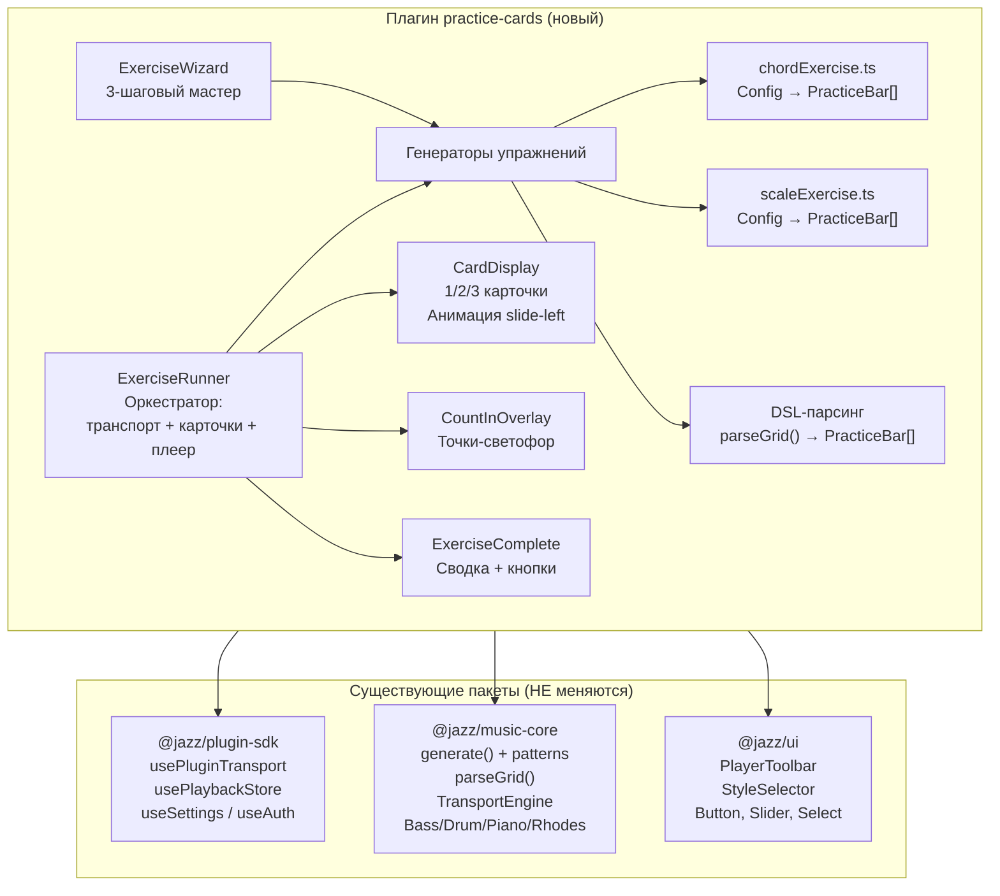
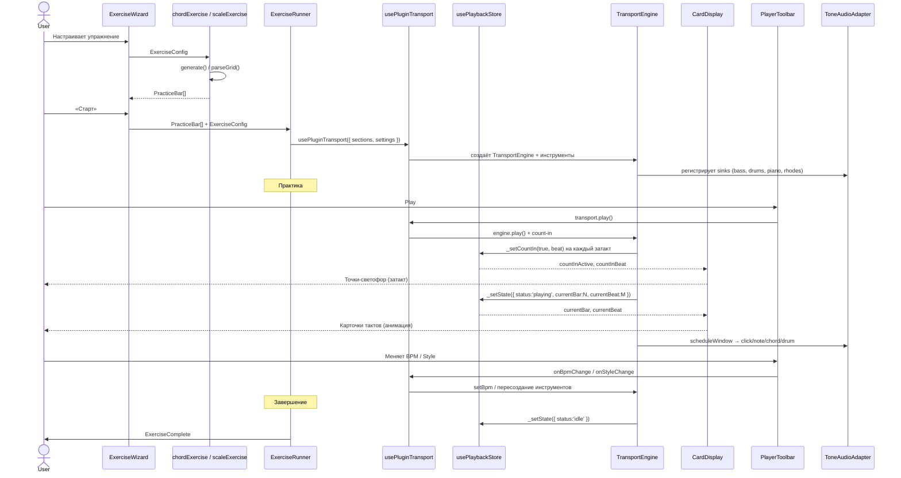

# EXERCISE ARCHITECTURE — Техническая архитектура модуля «Карточки»

**Дата:** 2026-06-15
**На основе:** `docs/EXERSISE-VISION.md` (принято)
**Статус:** 🟡 Черновик

---

## 1. Резюме

Модуль `practice-cards` — новый плагин в категории `practice`, реализующий визуальную практику джазовых прогрессий и гамм с аккомпанементом. Ключевая архитектурная задача: **максимально переиспользовать существующую инфраструктуру** (транспорт, инструменты, генератор, UI-компоненты), добавив только слой визуальных карточек и логику конфигурации упражнений.

**Главное архитектурное решение:** плагин является **потребителем** трёх существующих пакетов без их модификации:

- `@jazz/music-core` — генератор прогрессий, DSL-парсер, TransportEngine
- `@jazz/plugin-sdk` — `usePluginTransport`, `usePlaybackStore`, `useSettings`
- `@jazz/ui` — `PlayerToolbar` (готовая панель плеера: BPM, Key, Style, Transport, Beat dots)

Единственный новый код — **CardDisplay** (визуальный «телесуфлёр»), **ExerciseWizard** (конфигурация) и **генераторы упражнений** (преобразование конфигурации в `PracticeBar[]`). Всё остальное — проводка существующих компонентов.

## 2. Принципы проектирования

| Принцип                | Реализация                                                                                                                                                                            |
| ---------------------- | ------------------------------------------------------------------------------------------------------------------------------------------------------------------------------------- |
| **Слабая связанность** | Плагин импортирует только контракты из `plugin-sdk`, `music-core`, `ui`. Не модифицирует существующие пакеты. Не знает о других плагинах.                                             |
| **Переиспользование**  | `usePluginTransport` + `PlayerToolbar` = готовая панель плеера. `generate()` / `parseGrid()` = готовый источник контента. `usePlaybackStore` = готовый источник позиции транспорта.   |
| **Модульность**        | Генераторы упражнений (`chordExercise`, `scaleExercise`) — чистые функции `Config → PracticeBar[]`, заменяемые и тестируемые независимо. CardDisplay — pure presentational компонент. |
| **Расширяемость**      | Добавление нового типа упражнения (секвенции, опевания) = новый генератор + новый UI-шаг в wizard'е. CardDisplay и транспорт не меняются.                                             |
| **Co-location**        | Весь код плагина — в `packages/plugins/practice-cards/`. Никакого кода в `apps/web/` или других пакетах.                                                                              |

## 3. Диаграмма компонентов



## 4. Поток данных



## 5. Модель данных

### 5.1. Конфигурация упражнения

```ts
// Источник контента для аккордовых прогрессий
type ChordSource =
  | { type: 'pattern'; patternId: string } // встроенный паттерн из generator/patterns.ts
  | { type: 'random'; key: Key; bars?: number } // произвольная генерация
  | { type: 'dsl'; dsl: string }; // ручной DSL-ввод

// Режим отображения карточек
type CardMode = 'current' | 'prev-current' | 'prev-current-next';

// Общая конфигурация (для всех типов)
interface BaseExerciseConfig {
  keys: Key[]; // одна или несколько тональностей
  repetitions: number; // 1–10 или -1 (бесконечно)
  infinite: boolean;
  countInBars: number; // 0, 1, 2, 4
  cardMode: CardMode;
  backingBass: boolean;
  backingDrums: boolean;
  backingPiano: boolean;
  backingRhodes: boolean;
  metronomeEnabled: boolean;
  metronomeVolume: number;
  tempo: number;
}

// Аккордовые прогрессии
interface ChordExerciseConfig extends BaseExerciseConfig {
  type: 'chords';
  source: ChordSource;
}

// Гаммы
type ScaleType =
  | 'major'
  | 'natural-minor'
  | 'harmonic-minor'
  | 'melodic-minor'
  | 'dorian'
  | 'mixolydian'
  | 'phrygian'
  | 'lydian'
  | 'locrian';

type ScaleDirection = 'up' | 'down' | 'both';

interface ScaleExerciseConfig extends BaseExerciseConfig {
  type: 'scales';
  mode: 'standalone' | 'over-chords'; // отдельно или по прогрессии
  scaleType: ScaleType;
  direction: ScaleDirection;
  octaves: 1 | 2;
  // При mode='over-chords':
  source?: ChordSource; // прогрессия, по которой играются лады
}

type ExerciseConfig = ChordExerciseConfig | ScaleExerciseConfig;
```

### 5.2. Такт практики (PracticeBar)

```ts
/**
 * Один такт упражнения — данные, которые отображаются на карточке.
 * Генерируется из ExerciseConfig + результатов generate()/parseGrid().
 */
interface PracticeBar {
  /** Индекс такта (0-based) */
  index: number;
  /** Символы аккордов: ["Dm7"] или ["Dm7", "G7"] */
  chords: string[];
  /** Название лада (только для scale-over-chords): "D дорийский" */
  scaleLabel?: string;
  /** Направление гаммы (только для standalone scales) */
  direction?: 'up' | 'down';
}
```

### 5.3. Расширение UserSettingsDTO

```ts
// В shared/src/dto.ts — новые поля (опционально для MVP)
practiceCards?: {
  lastExerciseType?: 'chords' | 'scales';
  lastSource?: 'pattern' | 'random' | 'dsl';
  lastPatternId?: string;
  lastKeys?: Key[];
  lastTempo?: number;
  lastRepetitions?: number;
  lastInfinite?: boolean;
  cardMode?: CardMode;
  countInBars?: number;
  backingBass?: boolean;
  backingDrums?: boolean;
  backingPiano?: boolean;
  backingRhodes?: boolean;
  metronomeEnabled?: boolean;
  metronomeVolume?: number;
};
```

## 6. Структура директорий

```
packages/plugins/practice-cards/
├── package.json
├── tsconfig.json
├── src/
│   ├── index.ts                       # definePlugin: manifest + contributes
│   ├── PracticeCardsPage.tsx          # Entry-point: управляет wizard/practice/complete
│   │
│   ├── components/
│   │   ├── ExerciseWizard.tsx         # Контейнер: stepper + шаги 1-3
│   │   ├── StepTypeSelect.tsx         # Шаг 1: выбор типа упражнения (плитки)
│   │   ├── StepChordConfig.tsx        # Шаг 2а: параметры аккордов
│   │   ├── StepScaleConfig.tsx        # Шаг 2б: параметры гамм
│   │   ├── StepPreview.tsx            # Шаг 3: инструкция / превью
│   │   ├── CardDisplay.tsx            # Карточки: 1/2/3 + анимация
│   │   ├── CountInOverlay.tsx         # Точки-светофор для затакта
│   │   ├── ExerciseRunner.tsx         # Оркестратор: транспорт + карточки + плеер
│   │   └── ExerciseComplete.tsx       # Экран завершения
│   │
│   ├── generators/
│   │   ├── types.ts                   # PracticeBar, ExerciseConfig, CardMode и др.
│   │   ├── chordExercise.ts           # ChordExerciseConfig → PracticeBar[]
│   │   └── scaleExercise.ts           # ScaleExerciseConfig → PracticeBar[]
│   │
│   └── __tests__/
│       ├── CardDisplay.test.tsx
│       ├── ExerciseWizard.test.tsx
│       ├── chordExercise.test.ts
│       └── scaleExercise.test.ts
```

## 7. Компоненты: детали реализации

### 7.1. ExerciseWizard

**Ответственность:** управление состоянием конфигурации, навигация по шагам.

**Состояние:** `{ step: 1|2|3, config: Partial<ExerciseConfig>, preview: PracticeBar[] | null }`.

**API:** внутренний компонент, не экспортируется.

**Зависимости:** `StepTypeSelect`, `StepChordConfig`, `StepScaleConfig`, `StepPreview`, `chordExercise.generate()`, `scaleExercise.generate()`.

### 7.2. ExerciseRunner

**Ответственность:** оркестрация практики — связывает транспорт, карточки и плеер.

```ts
interface ExerciseRunnerProps {
  bars: PracticeBar[];
  config: ExerciseConfig;
  onComplete: () => void;
  onReconfigure: () => void;
}
```

**Внутренняя логика:**

1. Преобразует `PracticeBar[]` → `Section[]` (для `usePluginTransport`)
2. Вызывает `usePluginTransport({ settings, timeSignature, totalBars, sections })`
3. Подписывается на `usePlaybackStore` для `status`, `currentBar`, `countInActive`
4. Рендерит `PlayerToolbar` (передаёт `onPlay/onStop/onBpmChange/onStyleChange/...`)
5. Рендерит `CardDisplay` (передаёт `bars`, `currentIndex`, `mode`)
6. При `status === 'idle'` после playing → `onComplete()`

**Зависимости:** `CardDisplay`, `CountInOverlay`, `PlayerToolbar` (из `@jazz/ui`), `usePluginTransport` + `usePlaybackStore` (из `@jazz/plugin-sdk`).

**Особенность:** `usePluginTransport` автоматически управляет инструментами согласно `settings`. Чтобы отключить отдельные инструменты, нужно передать соответствующие настройки громкости = 0. Если все инструменты отключены — играет только метроном.

### 7.3. CardDisplay

**Ответственность:** чисто визуальный компонент — отображает 1/2/3 карточки с анимацией.

```ts
interface CardDisplayProps {
  bars: PracticeBar[];
  currentIndex: number;
  mode: CardMode;
}
```

**Логика отображения:**

- `mode='current'` → только `bars[currentIndex]`
- `mode='prev-current'` → `bars[currentIndex-1]` (полупрозрачный) + `bars[currentIndex]` (яркий)
- `mode='prev-current-next'` → три карточки: prev (opacity 0.4), current (opacity 1.0, рамка accent), next (opacity 0.6)
- При смене `currentIndex`: CSS-анимация `translateX` + `opacity`, длительность ~300ms
- Граничные случаи: currentIndex=0 (нет prev), currentIndex=последний (нет next) — отсутствующие карточки не рендерятся
- Multi-chord: символы разделены пробелом, при >2 аккордах — шрифт уменьшается

**Зависимости:** только React + CSS. Нет импортов из других пакетов.

### 7.4. CountInOverlay

**Ответственность:** визуализация затакта — крупные точки по центру экрана.

**Состояние:** читает `usePlaybackStore`: `countInActive`, `countInBeat`, `totalBeats` (из time signature).

**Визуал:** точки `● ● ● ●` — текущая доля подсвечена цветом темы, остальные — muted. Расположены по центру экрана, поверх карточек (z-index выше).

### 7.5. Генераторы упражнений

#### chordExercise.ts

```ts
export function generateChordExercise(config: ChordExerciseConfig): PracticeBar[] {
  // 1. Получить GridContent через generate() или parseGrid()
  // 2. Для каждой выбранной тональности — транспонировать и добавить в результат
  // 3. Преобразовать GridBar[] → PracticeBar[]
  // 4. Повторить N раз (repetitions) или вернуть как есть (для infinite — runner сам зациклит)
}
```

**Использует:** `generate()` + `listPatterns()` из `@jazz/music-core`, `parseGrid()` из `@jazz/music-core`.

#### scaleExercise.ts

```ts
export function generateScaleExercise(config: ScaleExerciseConfig): PracticeBar[] {
  if (config.mode === 'standalone') {
    // 1. Создать PracticeBar[] с метками направления:
    //    [{ chords: [], scaleLabel: "C мажор", direction: "up" }, ...]
    // 2. Количество тактов = octaves * (direction === 'both' ? 2 : 1)
  } else {
    // 1. Получить прогрессию (как chordExercise)
    // 2. Для каждого аккорда определить лад через chordDegreeToScale()
    // 3. PracticeBar: chords=["Dm7"], scaleLabel="D дорийский"
  }
}
```

**Функция `chordDegreeToScale`** — кандидат на вынос в `music-core`:

```ts
// Предлагаемое дополнение в music-core/src/chords/ (или в самом плагине для MVP)
function chordDegreeToScale(degree: number, quality: string): ScaleType {
  // Imaj7 → major, iim7 → dorian, iiim7 → phrygian,
  // IVmaj7 → lydian, V7 → mixolydian, vim7 → natural-minor, viim7b5 → locrian
}
```

## 8. Интеграция с существующими пакетами (таблица)

| Пакет              | Что использует practice-cards                                                                   | Статус    |
| ------------------ | ----------------------------------------------------------------------------------------------- | --------- |
| `@jazz/plugin-sdk` | `usePluginTransport` — создание транспорта с инструментами                                      | 🟢 Готово |
| `@jazz/plugin-sdk` | `usePlaybackStore` — чтение `currentBar`, `currentBeat`, `countIn*`                             | 🟢 Готово |
| `@jazz/plugin-sdk` | `useSettings`, `useUpdateSettings` — сохранение настроек                                        | 🟢 Готово |
| `@jazz/plugin-sdk` | `useAuth` — проверка авторизации (для сохранения настроек)                                      | 🟢 Готово |
| `@jazz/plugin-sdk` | `apiClient` — запросы к API (если понадобится)                                                  | 🟢 Готово |
| `@jazz/music-core` | `generate()`, `listPatterns()` — генерация прогрессий                                           | 🟢 Готово |
| `@jazz/music-core` | `parseGrid()` — парсинг DSL                                                                     | 🟢 Готово |
| `@jazz/music-core` | `parseChord()` — для валидации / отображения нот                                                | 🟢 Готово |
| `@jazz/music-core` | `TransportEngine`, `*Instrument` — типы (используются опосредованно через `usePluginTransport`) | 🟢 Готово |
| `@jazz/shared`     | `Key`, `Style`, `GridContent`, `Section`, `UserSettingsDTO` — типы                              | 🟢 Готово |
| `@jazz/ui`         | `PlayerToolbar` — готовая панель плеера                                                         | 🟢 Готово |
| `@jazz/ui`         | `Button`, `Slider`, `Select`, `StyleSelector` — UI-кирпичики                                    | 🟢 Готово |

**Ни один существующий пакет не требует изменений для MVP.**

## 9. Что нового (гринфилд)

| Компонент           | Размер | Описание                                                         |
| ------------------- | ------ | ---------------------------------------------------------------- |
| `PracticeCardsPage` | M      | Entry-point, управление состоянием wizard/practice/complete      |
| `ExerciseWizard`    | M      | 3-шаговый мастер со stepper'ом                                   |
| `StepTypeSelect`    | S      | Плитки выбора типа упражнения                                    |
| `StepChordConfig`   | M      | Форма параметров аккордов (источник, тональности, аккомпанемент) |
| `StepScaleConfig`   | S      | Форма параметров гамм                                            |
| `StepPreview`       | S      | Превью упражнения перед стартом                                  |
| `CardDisplay`       | M      | Карточки с анимацией (1/2/3 режима)                              |
| `CountInOverlay`    | S      | Точки-светофор для затакта                                       |
| `ExerciseRunner`    | M      | Оркестратор (связка транспорт + карточки + плеер)                |
| `ExerciseComplete`  | S      | Экран завершения                                                 |
| `chordExercise.ts`  | M      | Генератор аккордовых упражнений                                  |
| `scaleExercise.ts`  | M      | Генератор гамм-упражнений                                        |
| `types.ts`          | S      | Типы: `PracticeBar`, `ExerciseConfig`, `CardMode`, `ChordSource` |

## 10. Расширяемость: добавление нового типа упражнения

Чтобы добавить «Секвенции» (будущая версия), потребуется:

1. `generators/sequenceExercise.ts` — новый генератор `SequenceExerciseConfig → PracticeBar[]`
2. `components/StepSequenceConfig.tsx` — новый UI-шаг в wizard'е
3. Обновить `types.ts`: добавить `SequenceExerciseConfig` в `ExerciseConfig`
4. Обновить `StepTypeSelect.tsx`: активировать плитку «Секвенции»
5. Обновить `ExerciseWizard.tsx`: добавить роутинг на `StepSequenceConfig`

**Ни CardDisplay, ни ExerciseRunner, ни транспорт не меняются.**

## 11. Тестирование

| Уровень        | Что тестируем                                                   | Инструмент                     |
| -------------- | --------------------------------------------------------------- | ------------------------------ |
| **Юнит**       | `chordExercise.ts`, `scaleExercise.ts` — чистые функции         | Vitest                         |
| **Юнит**       | `CardDisplay` — рендеринг 1/2/3 карточек, граничные случаи      | Vitest + React Testing Library |
| **Интеграция** | `ExerciseWizard` — переходы по шагам, валидация                 | Vitest + RTL                   |
| **Интеграция** | `ExerciseRunner` — связка транспорт + карточки (мок транспорта) | Vitest + RTL                   |
| **Контракт**   | Плагин корректно регистрируется, маршрут доступен               | Vitest                         |

Моки для TransportEngine: `usePluginTransport` можно замокать на уровне теста, возвращая контролируемый `TransportControls`. `usePlaybackStore` — Zustand-стор, можно напрямую устанавливать состояние в тестах.

## 12. Ограничения и компромиссы

| Ограничение                                      | Обоснование                                                                                                        |
| ------------------------------------------------ | ------------------------------------------------------------------------------------------------------------------ |
| Multi-chord бары только через DSL                | Генератор (`patterns.ts`) производит 1 аккорд на такт. Расширение генератора — отдельная задача, не блокирует MVP. |
| Нет визуализации нот на нотоносце                | Только текст (символы аккордов). P2 на будущее.                                                                    |
| Транспорт — собственный экземпляр для упражнения | Не шарится с плеером сеток (`core-player`). Это плюс: изоляция, нет конфликтов.                                    |
| `usePluginTransport` требует `Section[]`         | Приходится преобразовывать `PracticeBar[]` → `GridBar[]` → `GridContent` → `Section[]`. Можно написать утилиту.    |
| Зависимость от Tone.js (непрямая)                | Через `usePluginTransport` → `apps/web/src/hooks/useTransport.ts`. Плагин сам не импортирует Tone.js.              |

## 13. План интеграции (checklist)

- [ ] Создать пакет `packages/plugins/practice-cards/` (скопировать `_template`)
- [ ] Реализовать `types.ts` (PracticeBar, ExerciseConfig, etc.)
- [ ] Реализовать `generators/chordExercise.ts`
- [ ] Реализовать `generators/scaleExercise.ts`
- [ ] Реализовать `CardDisplay` + `CountInOverlay`
- [ ] Реализовать `ExerciseWizard` + шаги (StepTypeSelect, StepChordConfig, StepScaleConfig, StepPreview)
- [ ] Реализовать `ExerciseRunner` (оркестратор)
- [ ] Реализовать `ExerciseComplete`
- [ ] Реализовать `PracticeCardsPage` (entry-point)
- [ ] Зарегистрировать плагин в `plugin-registry/src/index.ts`
- [ ] Добавить алиасы в `vite.config.ts`, `tsconfig.base.json`, `vitest.config.ts`
- [ ] Написать тесты (`CardDisplay`, `chordExercise`, `scaleExercise`, `ExerciseWizard`)
- [ ] Проверить: `typecheck` + `lint` (boundaries) + `test`

---

_Документ подготовлен `software-architect` агентом. Описывает техническую архитектуру модуля practice-cards. Используется для формирования `PLAN.md`._
