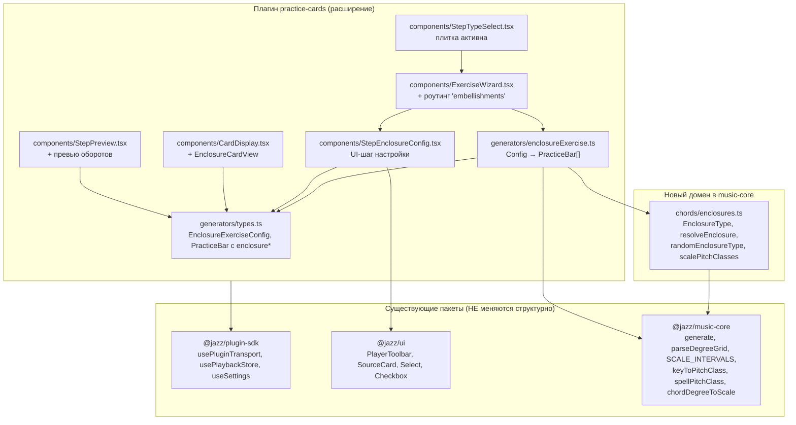
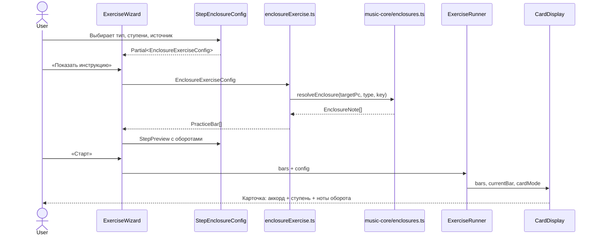

# EXERCISE ENCLOSURES ARCHITECTURE — Техническая архитектура упражнения «Опевания"

**Дата:** 2026-07-19
**На основе:** [`docs/EXERSISE-ENCLOSURES-VISION.md`](./EXERSISE-ENCLOSURES-VISION.md) (принято)
**Статус:** 🟡 Черновик

---

## 1. Резюме

Упражнение «Опевания» расширяет существующий плагин `practice-cards` третьим типом (`embellishments`), повторяя архитектурную модель гамм. Главная задача — добавить **доменный модуль опеваний** в `music-core`, **генератор** в `practice-cards` и **UI-шаг** в wizard, максимально переиспользуя существующие компоненты (`CardDisplay`, `ExerciseRunner`, `PlayerToolbar`, `SourceCard`, `usePluginTransport`).

**Ключевое архитектурное решение:** опевания — это **мелодическая надстройка над аккордовой прогрессией**, аналогичная гаммам. Поэтому:

- Используется тот же `ChordSource` для определения гармонии.
- Используются те же утилиты генерации (`extractChordsFromSource`, `repeatBars`, `expandBarsPerChord`, `shuffle`).
- `PracticeBar` расширяется полями `enclosureDegree`, `enclosureType`, `enclosureNotes` — карточка рендерит их вместо `scaleLabel`.
- Транспорт, аккомпанемент, панель плеера, экран завершения — не меняются.

---

## 2. Принципы проектирования

| Принцип | Реализация |
| --- | --- |
| **Повторение модели гамм** | Тот же `ExerciseConfig`, те же источники, те же утилиты. Разница только в генераторе и UI-шаге. |
| **Домен в `music-core`** | Расчёт нот оборота — чистая теория, переиспользуемая в `theory.approach-notes` и будущей MIDI-оценке. |
| **Слабая связанность** | Плагин не модифицирует `music-core` кроме добавления нового модуля; не трогает другие плагины. |
| **Расширяемость** | Добавление нового типа опевания = одна строка в `ENclosureType` + одна ветка в `resolveEnclosure`. |
| **Co-location** | Весь новый UI — в `practice-cards`; весь новый домен — в `music-core/src/chords/`. |

---

## 3. Диаграмма компонентов



---

## 4. Поток данных



---

## 5. Модель данных

### 5.1. Типы опеваний

```ts
// packages/music-core/src/chords/enclosures.ts

export type EnclosureType =
  | 'diatonic-upper'
  | 'diatonic-lower'
  | 'chromatic-upper'
  | 'chromatic-lower'
  | 'full-diatonic'
  | 'full-chromatic'
  | 'all';

export type ConcreteEnclosureType = Exclude<EnclosureType, 'all'>;

export type TargetDegree = 1 | 3 | 5 | 7;

export type EnclosureNoteRole = 'approach' | 'target';

export interface EnclosureNote {
  /** Имя ноты для отображения, например "Eb" или "F#". */
  name: string;
  /** Pitch class 0–11. */
  pc: number;
  /** Роль ноты в обороте. */
  role: EnclosureNoteRole;
}
```

### 5.2. Конфигурация упражнения

```ts
// packages/plugins/practice-cards/src/generators/types.ts

export interface EnclosureExerciseConfig extends BaseExerciseConfig {
  type: 'embellishments';
  /** Источник гармонии (как у гамм):
   *  - 'unified' — отдельно на тоническом аккорде;
   *  - 'pattern' / 'random' / 'dsl' — по прогрессии.
   */
  source: ChordSource;
  /** Тип опевания. 'all' — случайный тип на каждый такт. */
  enclosureType: EnclosureType;
  /** Выбранные целевые ступени (минимум одна). */
  targetDegrees: TargetDegree[];
  /** Диапазон оборотов: 1 или 2 октавы. */
  octaves: 1 | 2;
}

export type ExerciseConfig =
  | ChordExerciseConfig
  | ScaleExerciseConfig
  | EnclosureExerciseConfig;
```

### 5.3. Такт практики

```ts
export interface PracticeBar {
  index: number;
  chords: string[];
  scaleLabel?: string;
  direction?: 'up' | 'down';
  /** Целевая ступень аккорда (только для опеваний). */
  enclosureDegree?: TargetDegree;
  /** Конкретный тип оборота (после раскрытия 'all'). */
  enclosureType?: ConcreteEnclosureType;
  /** Ноты оборота, последняя — target. */
  enclosureNotes?: EnclosureNote[];
}

export interface ExerciseSession {
  type: 'chords' | 'scales' | 'embellishments';
  bars: PracticeBar[];
  config: ExerciseConfig;
}
```

### 5.4. Сохранение настроек

```ts
// packages/shared/src/dto.ts — practiceCards slice

practiceCards: z.object({
  // ... существующие поля ...
  lastExerciseType: z.enum(['chords', 'scales', 'embellishments']).optional(),
  lastEnclosureType: z.enum([
    'diatonic-upper',
    'diatonic-lower',
    'chromatic-upper',
    'chromatic-lower',
    'full-diatonic',
    'full-chromatic',
    'all',
  ]).optional(),
  lastEnclosureDegrees: z.array(
    z.union([z.literal(1), z.literal(3), z.literal(5), z.literal(7)]),
  ).optional(),
  lastEnclosureOctaves: z.union([z.literal(1), z.literal(2)]).optional(),
}).optional()
```

---

## 6. Доменный модуль `music-core/src/chords/enclosures.ts`

### 6.1. API

```ts
/** Построить оборот вокруг целевой pitch class. */
export function resolveEnclosure(
  targetPc: number,
  type: ConcreteEnclosureType,
  key: Key,
  chordSymbol?: string,
): EnclosureNote[];

/** Случайный ConcreteEnclosureType (без 'all'). */
export function randomEnclosureType(rng: Rng): ConcreteEnclosureType;

/** Pitch classes лада по типу шкалы. */
export function scalePitchClasses(tonicPc: number, scaleType: ScaleType): number[];
```

### 6.2. Алгоритм `resolveEnclosure`

1. **Определить лад** для диатонических оборотов:
   - Если передан `chordSymbol` — через `chordDegreeToScale(degree, quality)` относительно тональности `key`.
   - Иначе (режим `unified`) — использовать `major` для мажорных тональностей, `natural-minor` для минорных.
2. **Получить pitch classes лада** через `scalePitchClasses(tonicPc, scaleType)`.
3. **Вычислить соседей:**
   - `diatonic-upper` — ближайшая ступень лада выше `targetPc`.
   - `diatonic-lower` — ближайшая ступень лада ниже `targetPc`.
   - `chromatic-upper` — `(targetPc + 1) % 12`.
   - `chromatic-lower` — `(targetPc - 1 + 12) % 12`.
   - `full-diatonic` — `diatonic-upper` → `diatonic-lower` → target.
   - `full-chromatic` — `chromatic-upper` → `chromatic-lower` → target.
4. **Преобразовать pitch classes в имена нот** через `spellPitchClass(pc, key)`.
5. **Вернуть массив** `EnclosureNote[]`, где последняя нота имеет `role: 'target'`, остальные — `'approach'`.

### 6.3. Пример

```ts
// Cmaj7, ступень 3 (E), full-chromatic, key = 'C'
resolveEnclosure(4, 'full-chromatic', 'C');
// → [
//   { name: 'F',  pc: 5, role: 'approach' },  // chromatic upper
//   { name: 'Eb', pc: 3, role: 'approach' },  // chromatic lower
//   { name: 'E',  pc: 4, role: 'target'   }
// ]
```

### 6.4. Реэкспорт

```ts
// packages/music-core/src/chords/index.ts
export {
  EnclosureType,
  ConcreteEnclosureType,
  TargetDegree,
  EnclosureNoteRole,
  EnclosureNote,
  resolveEnclosure,
  randomEnclosureType,
  scalePitchClasses,
} from './enclosures.js';
export type {
  EnclosureType,
  ConcreteEnclosureType,
  TargetDegree,
  EnclosureNoteRole,
  EnclosureNote,
} from './enclosures.js';
```

---

## 7. Генератор `practice-cards/src/generators/enclosureExercise.ts`

### 7.1. API

```ts
export function generateEnclosureExercise(
  config: EnclosureExerciseConfig,
  rng: Rng = Math.random,
): PracticeBar[];
```

### 7.2. Структура

```ts
export function generateEnclosureExercise(config, rng) {
  const { source, enclosureType, targetDegrees, keys, repetitions, infinite, playRandomly, octaves } = config;
  const barsPerChord = config.barsPerChord ?? 1;

  if (keys.length === 0 || targetDegrees.length === 0) return [];

  const concreteType = enclosureType === 'all'
    ? () => randomEnclosureType(rng)
    : () => enclosureType as ConcreteEnclosureType;

  if (source.type === 'unified') {
    const units = buildUnifiedUnits(keys, targetDegrees, octaves, concreteType, rng);
    return finalize(units, barsPerChord, infinite, repetitions, playRandomly, rng);
  }

  const units = buildOverChordUnits(source, keys, targetDegrees, concreteType, rng);
  return finalize(units, barsPerChord, infinite, repetitions, playRandomly, rng);
}
```

### 7.3. Режим `unified`

Для каждой тональности `key`:

1. Определить `scaleType` для тоники (`major` / `natural-minor`).
2. Построить тонический аккорд: `buildTonicChord(key, scaleType)`.
3. Для каждой `targetDegree`:
   - Вычислить pitch class ступени относительно тоники.
   - Построить оборот через `resolveEnclosure`.
   - Создать `PracticeBar` с `chords=[tonicChord]`, `enclosureDegree`, `enclosureType`, `enclosureNotes`.
4. При `octaves === 2` — повторить набор, транспонируя целевую ноту на +12 полутонов (имя ноты то же, но регистр выше; в MVP регистр не хранится, отображается имя в исходной октаве).

### 7.4. Режим `over-chords`

Для каждой тональности `key`:

1. Получить чанки аккордов через `extractChordsFromSource(source, key)`.
2. Для каждого чанка:
   - Случайно выбрать ступень из `targetDegrees`.
   - Определить pitch class целевой ступени:
     - Распарсить символ аккорда через `parseChord`.
     - Вычислить ступени `1, 3, 5, 7` относительно корня по `quality`.
   - Построить оборот через `resolveEnclosure(targetPc, concreteType(), key, chordSymbol)`.
   - Создать `PracticeBar`.

### 7.5. Рандомизация и повторы

Используются готовые утилиты из `core.ts`:

- `expandBarsPerChord(bars, barsPerChord)` — размножить каждый оборот.
- `repeatBars(bars, infinite, repetitions)` — повторить фиксированный буфер.
- `shuffle(arr, rng)` + `buildRandomized(...)` — для `playRandomly`.

---

## 8. UI-компоненты

### 8.1. `StepEnclosureConfig.tsx`

Структура повторяет `StepScaleConfig.tsx`:

```tsx
export interface StepEnclosureConfigProps {
  config: Partial<EnclosureExerciseConfig>;
  onChange: (patch: Partial<EnclosureExerciseConfig>) => void;
  settings: UserSettingsDTO | undefined;
}
```

Секции формы:

1. **Тип опевания** — `Select` с 7 значениями.
2. **Целевые ступени** — 4 `Checkbox`: `1, 3, 5, 7`.
3. **Октавы** — кнопки `1` / `2`.
4. **Источник** — `SourceCard` + `useSourceConfig` (как у гамм).
5. **Тактов на оборот** — `BarsPerUnitCard`.
6. **Тональности** — `KeysCard`.
7. **Затакт** — `CountInCard`.
8. **Режим карточек** — `CardModeCard`.
9. **Аккомпанемент** — `BackingCard`.
10. **Метроном + темп** — `MetronomeTempoCard`.
11. **Повторы** — `RepetitionsCard`.
12. **Рандомизация** — checkbox (общий для всех типов, уже есть в `ExerciseWizard`).

### 8.2. `CardDisplay.tsx` — ветка опеваний

Приоритет отображения в `CardContent`:

1. `bar.enclosureNotes` → отобразить опевание.
2. `bar.scaleLabel` → отобразить гамму (существующая логика).
3. Иначе — аккорды.

Лейаут опевания:

```tsx
<div className="flex flex-col items-center gap-1">
  <span className="text-7xl font-bold text-foreground">{bar.chords[0]}</span>
  <span className="text-2xl font-semibold text-foreground">Ступень {bar.enclosureDegree}</span>
  <span className="text-3xl font-medium">
    {bar.enclosureNotes.map((n, i) => (
      <span
        key={i}
        className={n.role === 'target' ? 'text-primary font-bold' : 'text-muted-foreground'}
      >
        {n.name}
        {i < bar.enclosureNotes!.length - 1 && <span className="mx-1">·</span>}
      </span>
    ))}
  </span>
</div>
```

### 8.3. `ExerciseWizard.tsx`

Изменения:

- `type ExerciseKind = 'chords' | 'scales' | 'embellishments'`.
- При выборе `'embellishments'` инициализировать config:
  ```ts
  {
    type: 'embellishments',
    source: { type: 'unified', symbols: [] },
    enclosureType: 'full-chromatic',
    targetDegrees: [3, 7],
    octaves: 1,
    keys: [],
    ...defaults,
  }
  ```
- Добавить ветку `StepEnclosureConfig` на шаге 2.
- В `handlePreview` / `handleQuickStart` добавить `generateEnclosureExercise`.
- В `buildConfig` собирать `EnclosureExerciseConfig`.
- В `buildPracticeCardsSettings` сохранять `lastEnclosureType`, `lastEnclosureDegrees`, `lastEnclosureOctaves`.

### 8.4. `StepPreview.tsx` и `degreeFunctions.ts`

- Добавить `enclosure-standalone` и `enclosure-over-chords` в `FunctionPreview`.
- В `BarChip` отображать `enclosureDegree` и ноты оборота.
- В `explainPlayback` добавить пояснение для `embellishments`.

### 8.5. `ExerciseComplete.tsx`

```ts
const TYPE_LABEL: Record<string, string> = {
  chords: 'Аккорды',
  scales: 'Гаммы',
  embellishments: 'Опевания',
};
```

---

## 9. Структура директорий (дельта)

```
packages/music-core/src/chords/
├── enclosures.ts              # новый
├── enclosures.test.ts         # новый
└── index.ts                   # + re-export

packages/plugins/practice-cards/src/
├── generators/
│   ├── types.ts               # + EnclosureExerciseConfig, enclosure* поля
│   ├── enclosureExercise.ts   # новый
│   ├── enclosureExercise.test.ts # новый
│   └── core.ts                # без изменений (переиспользуется)
├── components/
│   ├── StepTypeSelect.tsx     # + 'embellishments' активна
│   ├── StepEnclosureConfig.tsx # новый
│   ├── ExerciseWizard.tsx     # + роутинг, defaults, settings
│   ├── CardDisplay.tsx        # + EnclosureCardView
│   ├── StepPreview.tsx        # + превью оборотов
│   ├── degreeFunctions.ts     # + enclosure previews
│   └── ExerciseComplete.tsx   # + label
├── defaults.ts                # + enclosure defaults
└── index.ts                   # без изменений

packages/shared/src/dto.ts     # + lastEnclosure* fields
```

---

## 10. Интеграция с существующими пакетами

| Пакет | Что использует practice-cards | Статус |
| --- | --- | --- |
| `@jazz/music-core` | `resolveEnclosure`, `randomEnclosureType`, `buildTonicChord`, `chordDegreeToScale`, `getChordQualitySuffix`, `keyToPitchClass`, `spellPitchClass`, `parseChord`, `generate`, `parseDegreeGrid`, `listPatterns` | 🟢 Готово |
| `@jazz/plugin-sdk` | `usePluginTransport`, `usePlaybackStore`, `useSettings`, `useUpdateSettings` | 🟢 Готово |
| `@jazz/ui` | `Select`, `Checkbox`, `Card*`, `SourceCard`, `KeysCard`, и т.д. | 🟢 Готово |
| `@jazz/shared` | `Key`, `UserSettingsDTO`, `ChordSymbol` | 🟢 Готово |

**Ни один существующий пакет не требует ломающих изменений.**

---

## 11. Расчёт целевых ступеней аккорда

Для режима `over-chords` нужно уметь вычислять pitch class ступеней `1, 3, 5, 7` по символу аккорда.

```ts
function chordDegreeToPitchClass(symbol: string, degree: TargetDegree, key: Key): number {
  const parsed = parseChord(symbol);
  if (!parsed.ok || !parsed.value) throw new Error(`Invalid chord ${symbol}`);

  const rootPc = keyToPitchClass(parsed.value.root + parsed.value.rootAccidental);
  const quality = parsed.value.quality;

  // Ступени относительно корня в полутонах
  const DEGREE_OFFSETS: Record<TargetDegree, number> = {
    1: 0,
    3: quality.includes('min') ? 3 : 4,   // m/m7 → minor 3rd
    5: 7,
    7: quality === 'major' ? 11 : 10,      // maj7 → major 7th, else dominant/minor 7th
  };

  return (rootPc + DEGREE_OFFSETS[degree]) % 12;
}
```

> **Примечание:** для `m7b5` ступень 5 — уменьшенная квинта (6 полутонов). Для `dim` — тоже. Для `maj7` — большая септима (11). Для `dominant` / `m7` — малая септима (10). Уточнения реализуются в `enclosureExercise.ts`.

---

## 12. Тестирование

| Уровень | Что тестируем | Модуль | Инструмент |
| --- | --- | --- | --- |
| Юнит | `resolveEnclosure` для всех типов и тональностей | `music-core/src/chords/enclosures.test.ts` | Vitest |
| Юнит | `generateEnclosureExercise`: unified, over-chords, random, all | `practice-cards/src/generators/enclosureExercise.test.ts` | Vitest |
| Компонентный | `CardDisplay` рендерит enclosure-ноты | `practice-cards/src/components/__tests__/CardDisplay.test.tsx` | Vitest + RTL |
| Компонентный | `StepTypeSelect` активна плитка | `practice-cards/src/components/__tests__/StepTypeSelect.test.tsx` | Vitest + RTL |
| Интеграционный | Wizard → EnclosureConfig → Preview | `practice-cards/src/components/__tests__/ExerciseWizard.test.tsx` | Vitest + RTL |
| Контракт | `UserSettingsDTO` принимает новые поля | `packages/shared/src/dto.ts` | Zod + Vitest |

---

## 13. Ограничения и компромиссы

| Ограничение | Обоснование |
| --- | --- |
| Только ступени `1, 3, 5, 7` | `parseChord` не возвращает chord tones; вычисление `9/11/13` требует доработки парсера. |
| Один тип оборота на такт | Упрощает генератор и карточку; смешанные комбинации — P2. |
| В режиме `over-chords` одна случайная ступень на аккорд | Соответствует модели гамм; систематическая отработка всех ступеней под прогрессией — P1. |
| Регистр нот не отображается | В карточке показываются имена pitch class; октавная привязка — для будущей клавиатурной визуализации. |
| `enclosures.ts` в `music-core`, а не в плагине | Переиспользование в лекции и MIDI-оценке; avoids миграцию. |

---

## 14. План интеграции (checklist)

- [ ] Создать `packages/music-core/src/chords/enclosures.ts` + тесты.
- [ ] Добавить реэкспорт в `packages/music-core/src/chords/index.ts`.
- [ ] Расширить `practice-cards/src/generators/types.ts` (`EnclosureExerciseConfig`, `PracticeBar`).
- [ ] Создать `practice-cards/src/generators/enclosureExercise.ts` + тесты.
- [ ] Создать `practice-cards/src/components/StepEnclosureConfig.tsx`.
- [ ] Расширить `practice-cards/src/components/StepTypeSelect.tsx` (активировать плитку).
- [ ] Расширить `practice-cards/src/components/ExerciseWizard.tsx` (роутинг, defaults, settings).
- [ ] Расширить `practice-cards/src/components/CardDisplay.tsx` (EnclosureCardView).
- [ ] Расширить `practice-cards/src/components/StepPreview.tsx` + `degreeFunctions.ts`.
- [ ] Расширить `practice-cards/src/components/ExerciseComplete.tsx`.
- [ ] Расширить `practice-cards/src/defaults.ts`.
- [ ] Расширить `packages/shared/src/dto.ts` (`lastEnclosure*`).
- [ ] Написать компонентные тесты.
- [ ] Проверить: `typecheck` + `lint` (boundaries) + `test`.

---

_Документ создан 2026-07-19. Описывает техническую архитектуру упражнения «Опевания» в плагине practice-cards. Используется для формирования EXERSISE-ENCLOSURES-PLAN.md._
