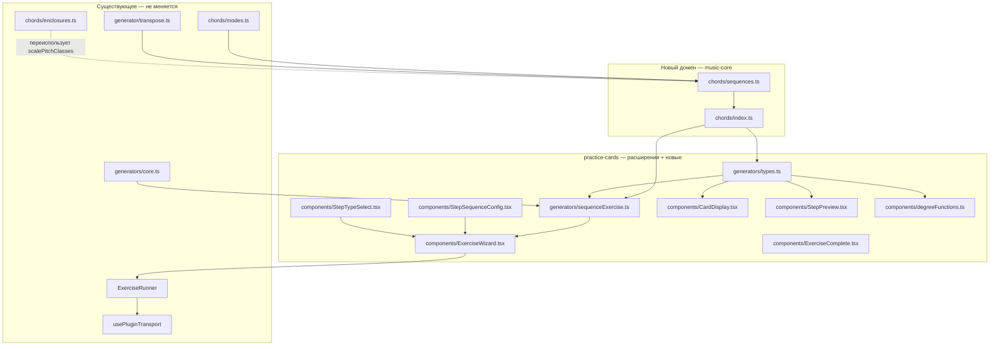
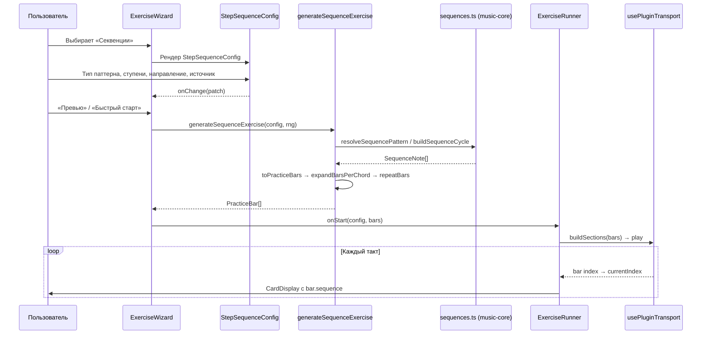

# EXERCISE SEQUENCES ARCHITECTURE — Секвенции (Melodic Sequences)

**Дата:** 2026-07-19
**Статус:** 🟡 Черновик — ожидает подтверждения
**На основе:** [`docs/EXERSISE-VISION.md`](./EXERSISE-VISION.md), [`docs/EXERSISE-ARCHITECTURE.md`](./EXERSISE-ARCHITECTURE.md), [`docs/EXERSISE-SEQUENCES-VISION.md`](./EXERSISE-SEQUENCES-VISION.md)

---

## 1. Резюме

Архитектура упражнения «Секвенции» **повторяет модель гамм и опеваний**: тот же discriminated union `ExerciseConfig`, та же базовая конфигурация `BaseExerciseConfig`, тот же конвейер генерации (`toPracticeBars` → `expandBarsPerChord` → `repeatBars`), те же режимы `unified` / `over-chords`.

Ключевое архитектурное решение: **новый доменный модуль `music-core/src/chords/sequences.ts`** — чистая музыкальная теория, вынесенная из плагина для переиспользования (будущая MIDI-оценка, лекции, другие упражнения). Плагин лишь потребляет его функции через генератор `sequenceExercise.ts`.

**Границы изменений:**
- 🟢 Не меняются: `ExerciseRunner`, `usePluginTransport`, `core.ts`, `Step2Shell`, `PracticeCardsPage`.
- 🟡 Расширяются: `types.ts`, `ExerciseWizard.tsx`, `StepTypeSelect.tsx`, `CardDisplay.tsx`, `degreeFunctions.ts`, `StepPreview.tsx`, `ExerciseComplete.tsx`, `defaults.ts`, `dto.ts`, `chords/index.ts`.
- 🔴 Новые: `sequences.ts`, `sequenceExercise.ts`, `StepSequenceConfig.tsx` (+ 2 тест-файла).

---

## 2. Принципы проектирования

| Принцип | Применение |
| --- | --- |
| **Повторение модели гамм/опеваний** | `SequenceExerciseConfig extends BaseExerciseConfig`; генератор копирует скелет `scaleExercise.ts`/`enclosureExercise.ts`; никаких новых концепций в плагине. |
| **Слабая связанность** | Доменная логика (расчёт паттернов) живёт в `music-core`, плагин лишь вызывает функции. Генератор не знает про React/транспорт. |
| **Переиспользование** | `extractChordsFromSource`, `toPracticeBars`, `repeatBars`, `expandBarsPerChord`, `shuffle`, `buildTonicChord`, `resolveChordTonePitchClass`, `scalePitchClasses` — всё берётся готовое. |
| **Модульность** | Каждый тип упражнения = отдельный генератор + отдельный UI-шаг. Карточка и раннер — generic. |
| **Co-location** | Тест `sequences.test.ts` рядом с `sequences.ts`; `sequenceExercise.test.ts` рядом с генератором. |

---

## 3. Диаграмма компонентов



---

## 4. Поток данных



---

## 5. Модель данных

### 5.1. Доменные типы (в `music-core/src/chords/sequences.ts`)

```ts
/** Тип паттерна секвенции. 'all' означает случайный выбор на каждый такт. */
export type SequenceType =
  | '1235'
  | '1234'
  | '1357'
  | '1531'
  | 'pentatonic'
  | 'all';

/** Конкретный тип паттерна (без 'all'). */
export type ConcreteSequenceType = Exclude<SequenceType, 'all'>;

/** Роль ноты в паттерне. */
export type SequenceNoteRole = 'pattern' | 'root';

/** Одна нота паттерна. */
export interface SequenceNote {
  /** Имя ноты для отображения (например "Eb"). */
  name: string;
  /** Pitch class 0–11. */
  pc: number;
  /** Роль: 'pattern' — нота паттерна, 'root' — стартовая ступень. */
  role: SequenceNoteRole;
}

/** Генератор случайных чисел. */
export type Rng = () => number;

/**
 * Индексы ступеней лада (0-based) для каждого паттерна.
 * Используются для извлечения pitch class из SCALE_INTERVALS.
 */
export const SEQUENCE_PATTERNS: Record<ConcreteSequenceType, readonly number[]> = {
  '1235': [0, 1, 2, 4],
  '1234': [0, 1, 2, 3],
  '1357': [0, 2, 4, 6],
  '1531': [0, 4, 2, 0],
  pentatonic: [0, 1, 2, 4, 5],
};

export const CONCRETE_SEQUENCE_TYPES: ConcreteSequenceType[] = [
  '1235',
  '1234',
  '1357',
  '1531',
  'pentatonic',
];
```

### 5.2. Конфигурация упражнения

```ts
// packages/plugins/practice-cards/src/generators/types.ts
import type {
  ScaleType,
  SequenceType,
  ConcreteSequenceType,
  SequenceNote,
  TargetDegree,
} from '@jazz/music-core';

export type SequenceDirection = 'up' | 'down' | 'both';

export interface SequenceExerciseConfig extends BaseExerciseConfig {
  type: 'sequences';
  /**
   * Источник определяет режим:
   * - `unified` — секвенции отдельно (standalone), на тонике выбранной тональности.
   * - `pattern` / `dsl` / `random` — секвенции поверх каждого аккорда прогрессии.
   */
  source: ChordSource;
  /** Тип паттерна. 'all' означает случайный выбор на каждый такт. */
  sequenceType: SequenceType;
  /** Стартовые ступени лада (1-7), с которых стартует паттерн. */
  startDegrees: TargetDegree[];
  /** Лад для расчёта диатонических ступеней. */
  scaleType: ScaleType;
  /** Направление обхода стартовых ступеней. */
  direction: SequenceDirection;
}

export type ExerciseConfig =
  | ChordExerciseConfig
  | ScaleExerciseConfig
  | EnclosureExerciseConfig
  | SequenceExerciseConfig;
```

### 5.3. Такт практики

```ts
export interface PracticeBar {
  index: number;
  chords: string[];
  scaleLabel?: string;
  direction?: 'up' | 'down';
  enclosure?: {
    type: ConcreteEnclosureType;
    targetDegree: TargetDegree;
    notes: EnclosureNote[];
  };
  /** Данные секвенции (если упражнение типа 'sequences'). */
  sequence?: {
    type: ConcreteSequenceType;
    startDegree: number;
    notes: SequenceNote[];
    direction: 'up' | 'down';
  };
}

export interface ExerciseSession {
  type: 'chords' | 'scales' | 'enclosures' | 'sequences';
  bars: PracticeBar[];
  config: ExerciseConfig;
}
```

### 5.4. Сохранение настроек (Zod-схема)

```ts
// packages/shared/src/dto.ts — блок practiceCards
practiceCards: z.object({
  lastExerciseType: z.enum(['chords', 'scales', 'enclosures', 'sequences']).optional(),
  // ...существующие поля...
  lastSequenceType: z
    .enum(['1235', '1234', '1357', '1531', 'pentatonic', 'all'])
    .optional(),
  lastSequenceStartDegrees: z
    .array(z.enum(['1', '2', '3', '4', '5', '6', '7']))
    .optional(),
  lastSequenceScaleType: z
    .enum([
      'major', 'natural-minor', 'harmonic-minor', 'melodic-minor',
      'dorian', 'mixolydian', 'phrygian', 'lydian', 'locrian',
    ])
    .optional(),
})
```

---

## 6. Доменный модуль `music-core/src/chords/sequences.ts`

### 6.1. API

```ts
/** Выбрать случайный ConcreteSequenceType. */
export function randomSequenceType(rng: Rng): ConcreteSequenceType;

/**
 * Построить ноты паттерна от стартовой pitch class.
 *
 * @param startPc — pitch class стартовой ступени.
 * @param type — конкретный тип паттерна.
 * @param key — тональность для выбора диезной/бемольной записи.
 * @param scaleType — лад для расчёта диатонических ступеней.
 * @returns массив SequenceNote: первая нота помечена role='root', остальные role='pattern'.
 */
export function resolveSequencePattern(
  startPc: number,
  type: ConcreteSequenceType,
  key: Key,
  scaleType: ScaleType,
): SequenceNote[];

/**
 * Построить один цикл секвенции: для каждой стартовой ступени — свой паттерн.
 *
 * @param tonicPc — pitch class тоники лада.
 * @param type — конкретный тип паттерна.
 * @param key — тональность для записи нот.
 * @param scaleType — лад.
 * @param startDegrees — стартовые ступени (1-7).
 * @returns массив массивов нот (по одному на стартовую ступень).
 */
export function buildSequenceCycle(
  tonicPc: number,
  type: ConcreteSequenceType,
  key: Key,
  scaleType: ScaleType,
  startDegrees: TargetDegree[],
): SequenceNote[][];
```

### 6.2. Алгоритм `resolveSequencePattern`

1. Получить `scalePcs = scalePitchClasses(tonicPc, scaleType)` — 7 pitch classes лада.
2. Найти индекс стартовой ступени в ладу: `startIdx = scalePcs.indexOf(normalizePc(startPc))`. Если не найдена (стартовая pc не входит в лад) — fallback на ближайшую диатоническую снизу.
3. Для каждого индекса `idx` в `SEQUENCE_PATTERNS[type]`:
   - Вычислить целевой индекс в ладу: `targetIdx = (startIdx + idx) % 7` (с переносом в октаву через `+12`, если `startIdx + idx >= 7`).
   - Взять pc: `pc = normalizePc(scalePcs[targetIdx] + (startIdx + idx >= 7 ? 12 : 0))`.
   - Имя: `name = spellPitchClass(pc, key)`.
   - Роль: `idx === 0 ? 'root' : 'pattern'`.
4. Вернуть массив `SequenceNote[]`.

### 6.3. Пример

```ts
// C мажор, паттерн 1235, стартовая ступень 1 (C)
const notes = resolveSequencePattern(0, '1235', 'C', 'major');
// Ожидаемый результат:
// [
//   { name: 'C', pc: 0, role: 'root' },
//   { name: 'D', pc: 2, role: 'pattern' },
//   { name: 'E', pc: 4, role: 'pattern' },
//   { name: 'G', pc: 7, role: 'pattern' },
// ]

// C мажор, паттерн 1235, стартовая ступень 2 (D) — звено секвенции поднимается
const notes2 = resolveSequencePattern(2, '1235', 'C', 'major');
// [
//   { name: 'D', pc: 2, role: 'root' },
//   { name: 'E', pc: 4, role: 'pattern' },
//   { name: 'F', pc: 5, role: 'pattern' },
//   { name: 'A', pc: 9, role: 'pattern' },
// ]

// Полный цикл по ступеням 1-5
const cycle = buildSequenceCycle(0, '1235', 'C', 'major', [1, 2, 3, 4, 5]);
// cycle.length === 5, каждый элемент — массив из 4 нот
```

### 6.4. Реэкспорт

```ts
// packages/music-core/src/chords/index.ts — добавить
export {
  CONCRETE_SEQUENCE_TYPES,
  SEQUENCE_PATTERNS,
  randomSequenceType,
  resolveSequencePattern,
  buildSequenceCycle,
} from './sequences.js';
export type {
  SequenceType,
  ConcreteSequenceType,
  SequenceNote,
  SequenceNoteRole,
} from './sequences.js';
```

---

## 7. Генератор `sequenceExercise.ts`

### 7.1. API

```ts
export function generateSequenceExercise(
  config: SequenceExerciseConfig,
  rng: Rng = Math.random,
): PracticeBar[];
```

### 7.2. Структура

Копия скелета `enclosureExercise.ts` — 4 функции по режимам:

```
generateSequenceExercise
├── source.type === 'unified'
│   ├── playRandomly → generateStandaloneRandomized
│   └── else         → generateStandalone
└── source.type !== 'unified'
    ├── playRandomly → generateOverChordsRandomized
    └── else         → generateOverChords
```

### 7.3. Режим `unified` (standalone)

- Для каждой выбранной тональности `key`:
  - Построить тонический аккорд: `buildTonicChord(key, scaleType)`.
  - Определить `tonicPc = keyToPitchClass(key)`.
  - Для каждой стартовой ступени из `startDegrees` (с учётом `direction`):
    - `concreteType = sequenceType === 'all' ? randomSequenceType(rng) : sequenceType`.
    - Стартовая pc = `scalePitchClasses(tonicPc, scaleType)[startDegree - 1]`.
    - `notes = resolveSequencePattern(startPc, concreteType, key, scaleType)`.
    - Создать такт: `{ chords: [tonicChord], sequence: { type, startDegree, notes, direction } }`.
- `direction: 'both'` → сначала обход вверх (1→7), затем вниз (7→1).
- Конвейер: `expandBarsPerChord → repeatBars`.

### 7.4. Режим `over-chords`

- `chunks = keys.flatMap(key => extractChordsFromSource(source, key))`.
- Для каждого чанка `i`:
  - `symbol = chunk.chords[0]`, `resolvedScaleType = scaleTypeForSymbol(symbol, key, fallback)`.
  - `concreteType = sequenceType === 'all' ? randomSequenceType(rng) : sequenceType`.
  - `startDegree = startDegrees[i % startDegrees.length]`.
  - Стартовая pc = `resolveChordTonePitchClass(symbol, startDegree, resolvedScaleType)`.
  - `notes = resolveSequencePattern(startPc, concreteType, key, resolvedScaleType)`.
  - Такт: `{ chords: chunk.chords, sequence: { type, startDegree, notes, direction } }`.
- Конвейер: `toPracticeBars → expandBarsPerChord → repeatBars`.

### 7.5. Рандомизация (`playRandomly`)

- `rounds = infinite ? INFINITE_ROUNDS : Math.max(1, repetitions)`.
- На каждый раунд: построить юниты, `shuffle(round, rng)`, переиндексировать `index`.
- В `over-chords` варианте: на каждый раунд новая прогрессия из случайной тональности.

---

## 8. UI-компоненты

### 8.1. `StepSequenceConfig.tsx`

Копия `StepEnclosureConfig.tsx` с заменами:
- `ENCLOSURE_TYPE_OPTIONS` → `SEQUENCE_TYPE_OPTIONS` (5 паттернов + «Случайная»).
- `TARGET_DEGREES` → `START_DEGREES` (только 1–7).
- Карточка «Тип опевания» → «Тип секвенции».
- Карточка «Целевые ступени» → «Стартовые ступени».
- Карточка «Лад для опеваний» → «Лад для секвенций».
- Добавить карточку «Направление» (radio: вверх / вниз / оба).
- `BarsPerUnitCard` лейбл: «Тактов на секвенцию».

```tsx
const SEQUENCE_TYPE_OPTIONS: { value: SequenceType; label: string }[] = [
  { value: '1235', label: '1-2-3-5 (бибоп)' },
  { value: '1234', label: '1-2-3-4' },
  { value: '1357', label: '1-3-5-7 (арпеджио)' },
  { value: '1531', label: '1-5-3-1' },
  { value: 'pentatonic', label: 'Пентатоника' },
  { value: 'all', label: 'Случайная' },
];

const START_DEGREES: { value: TargetDegree; label: string }[] = [
  { value: 1, label: '1' }, { value: 2, label: '2' }, { value: 3, label: '3' },
  { value: 4, label: '4' }, { value: 5, label: '5' }, { value: 6, label: '6' },
  { value: 7, label: '7' },
];
```

### 8.2. Ветка в `CardDisplay.tsx`

Добавляется **перед** веткой `bar.scaleLabel`:

```tsx
if (bar.sequence) {
  const patternNotes = bar.sequence.notes
    .filter((n) => n.role === 'pattern')
    .map((n) => n.name);
  const root = bar.sequence.notes.find((n) => n.role === 'root');
  return (
    <div className="flex flex-col items-center gap-1">
      <span className="text-xl font-semibold text-muted-foreground">
        Ступень {bar.sequence.startDegree}
      </span>
      {bar.chords[0] && (
        <span className="text-6xl font-bold text-foreground">{bar.chords[0]}</span>
      )}
      <span className="text-3xl font-semibold text-foreground">
        {root && <span className="text-primary">{root.name}</span>}
        {patternNotes.length > 0 && ` ${patternNotes.join(' ')}`}
      </span>
    </div>
  );
}
```

### 8.3. `ExerciseWizard.tsx`

8 точек расширения (см. план интеграции §13).

### 8.4. `StepTypeSelect.tsx`

Убрать `disabled: true` с плитки «Секвенции», заменить иконку, добавить ветку `onClick`.

### 8.5. `StepPreview.tsx`

Добавить ветку `config.type === 'sequences'` в `explainPlayback`, расширить `typeLabel`, добавить компакт-рендер.

### 8.6. `ExerciseComplete.tsx`

`TYPE_LABEL.sequences = 'Секвенции'`.

---

## 9. Структура директорий (дельта)

```
packages/
├── music-core/src/chords/
│   ├── index.ts              # + re-export sequences
│   ├── sequences.ts          # новый
│   └── sequences.test.ts     # новый
├── plugins/practice-cards/src/
│   ├── generators/
│   │   ├── types.ts          # + SequenceExerciseConfig, PracticeBar.sequence, ExerciseSession
│   │   ├── sequenceExercise.ts       # новый
│   │   └── sequenceExercise.test.ts  # новый
│   ├── components/
│   │   ├── StepSequenceConfig.tsx    # новый
│   │   ├── StepTypeSelect.tsx        # активация плитки
│   │   ├── ExerciseWizard.tsx        # + роутинг
│   │   ├── CardDisplay.tsx           # + ветка bar.sequence
│   │   ├── StepPreview.tsx           # + ветка sequences
│   │   ├── degreeFunctions.ts        # + kind: 'sequences'
│   │   └── ExerciseComplete.tsx      # + TYPE_LABEL
│   ├── defaults.ts           # + DEF_SEQUENCE_*
│   └── index.ts              # + export generateSequenceExercise
└── shared/src/
    └── dto.ts                # + lastSequence* fields
```

---

## 10. Интеграция с существующими пакетами

| Пакет | Что используется | Статус |
| --- | --- | --- |
| `music-core` → `SCALE_INTERVALS`, `SCALE_TYPES`, `SCALE_LABELS` | Базовые таблицы ладов | 🟢 Готово |
| `music-core` → `scalePitchClasses` (из `enclosures.ts`) | Pitch classes лада | 🟢 Готово |
| `music-core` → `keyToPitchClass`, `spellPitchClass` | Запись нот | 🟢 Готово |
| `music-core` → `buildTonicChord`, `chordDegreeToScale`, `getChordQualitySuffix` | Тонический аккорд, лады по качеству | 🟢 Готово |
| `music-core` → `resolveChordTonePitchClass` | Стартовая pc в over-chords | 🟢 Готово |
| `practice-cards` → `core.ts` хелперы | Конвейер генерации | 🟢 Готово |
| `shared` → `Key`, `TimeSignatureString` | Типы | 🟢 Готово |
| `ui` → Card, Select, Checkbox, cn | UI-примитивы | 🟢 Готово |

---

## 11. Тестирование

| Уровень | Что тестируем | Модуль | Инструмент |
| --- | --- | --- | --- |
| Unit (домен) | `resolveSequencePattern` для всех 5 паттернов в C мажоре | `music-core/sequences.test.ts` | vitest |
| Unit (домен) | `resolveSequencePattern` в миноре/дориане | `music-core/sequences.test.ts` | vitest |
| Unit (домен) | `buildSequenceCycle` для ступеней 1–5 | `music-core/sequences.test.ts` | vitest |
| Unit (домен) | `randomSequenceType` покрытие всех типов | `music-core/sequences.test.ts` | vitest |
| Unit (генератор) | `unified` режим: тонический аккорд + паттерн на каждую ступень | `sequenceExercise.test.ts` | vitest |
| Unit (генератор) | `over-chords`: стартовая ступень циклически | `sequenceExercise.test.ts` | vitest |
| Unit (генератор) | `sequenceType === 'all'`: тип меняется случайно | `sequenceExercise.test.ts` | vitest |
| Unit (генератор) | `playRandomly`: перемешивание и переиндексация | `sequenceExercise.test.ts` | vitest |
| Unit (генератор) | `direction: 'both'`: вверх + вниз | `sequenceExercise.test.ts` | vitest |
| Type | Discriminated union корректно сужает тип | `types.ts` | tsc |

---

## 12. Ограничения и компромиссы

| Компромисс | Обоснование |
| --- | --- |
| Пентатоника берётся как подмножество текущего лада `[0,1,2,4,5]`, а не отдельный лад | Упрощает MVP; для мажора/минора звучит корректно. Отдельные пентатонные лады — P2. |
| Паттерн всегда укладывается в 1 такт | Соответствует гаммам/опеваниям; ритм выбирает пользователь. Звенья > 1 такта — P2. |
| Стартовая pc для не-диатонической ступени берётся через `resolveChordTonePitchClass` (как в опеваниях) | Переиспользование существующей логики; консистентность между типами упражнений. |
| Хроматические секвенции не поддерживаются | MVP фокусируется на диатоническом словаре; хроматика — отдельная итерация. |
| Каскад тернарников в `ExerciseWizard` сохраняется (доп. ветка вместо switch) | Минимум изменений в существующем коде; стиль уже устоялся. |

---

## 13. План интеграции (checklist)

### music-core
- [ ] Создать `packages/music-core/src/chords/sequences.ts` (типы, `SEQUENCE_PATTERNS`, `CONCRETE_SEQUENCE_TYPES`, `randomSequenceType`, `resolveSequencePattern`, `buildSequenceCycle`).
- [ ] Создать `packages/music-core/src/chords/sequences.test.ts` (все 5 паттернов, минор/дориан, `buildSequenceCycle`, `randomSequenceType`).
- [ ] Расширить `packages/music-core/src/chords/index.ts` реэкспортом sequences.

### shared
- [ ] Расширить `packages/shared/src/dto.ts`: `lastExerciseType` += `'sequences'`, добавить `lastSequenceType`, `lastSequenceStartDegrees`, `lastSequenceScaleType`.

### practice-cards — типы и генератор
- [ ] Расширить `generators/types.ts`: `SequenceExerciseConfig`, `SequenceDirection`, добавить в `ExerciseConfig` union, `PracticeBar.sequence`, `ExerciseSession.type`.
- [ ] Создать `generators/sequenceExercise.ts` (4 функции по образцу `enclosureExercise.ts`).
- [ ] Создать `generators/sequenceExercise.test.ts`.
- [ ] Расширить `src/index.ts` реэкспортом `generateSequenceExercise`.

### practice-cards — UI
- [ ] Создать `components/StepSequenceConfig.tsx` (копия `StepEnclosureConfig.tsx` с заменами).
- [ ] Расширить `components/StepTypeSelect.tsx`: убрать `disabled`, заменить иконку, добавить ветку `onClick`.
- [ ] Расширить `components/ExerciseWizard.tsx` (8 точек: тип, импорты, `buildDefaults`, `buildInitialConfig`, `buildConfig`, `buildPracticeCardsSettings`, `isValidSource`, `handleTypeSelect`, `handlePreview`/`handleQuickStart`, `step2Label`, рендер step 2).
- [ ] Расширить `components/CardDisplay.tsx`: ветка `bar.sequence` перед `bar.scaleLabel`.
- [ ] Расширить `components/degreeFunctions.ts`: `kind: 'sequences'` в `FunctionPreview`, ветка в `buildFunctionPreview`.
- [ ] Расширить `components/StepPreview.tsx`: `explainPlayback`, `typeLabel`, compact-рендер, `BarChip`.
- [ ] Расширить `components/ExerciseComplete.tsx`: `TYPE_LABEL.sequences`.
- [ ] Расширить `defaults.ts`: `DEF_SEQUENCE_TYPE`, `DEF_SEQUENCE_START_DEGREES`, `DEF_SEQUENCE_DIRECTION`.

### Верификация
- [ ] `pnpm typecheck` — зелёный.
- [ ] `pnpm lint` — зелёный.
- [ ] `pnpm test` — все тесты зелёные, новые тесты добавлены.
- [ ] Проверить `plugin-contract.test.ts` / `CardDisplay.test.tsx` на исчерпывающие ассерты.

---

_Документ создан 2026-07-19. Техническая детализация упражнения «Секвенции». Декомпозиция на задачи — в [`EXERSISE-SEQUENCES-PLAN.md`](./EXERSISE-SEQUENCES-PLAN.md)._
