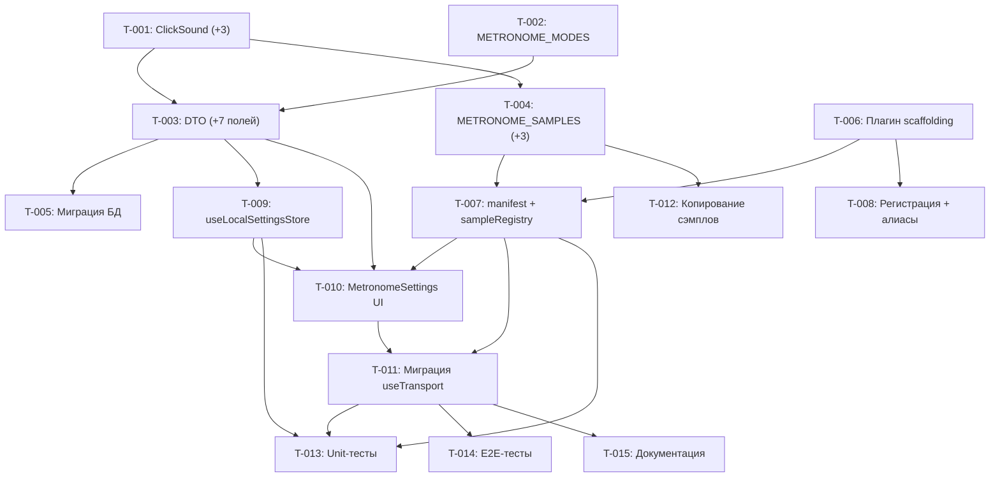

# METRONOME PLAN — План реализации метронома как плагина

**На основе:** [`docs/METRONOME-VISION.md`](./METRONOME-VISION.md) (🟢 Принято)
**Дата:** 2026-07-09
**Статус:** 🟢 Готово (15/15 задач)

---

## 1. Задачи (Tasks)

### T-001. Расширение `ClickSound` в `shared/constants.ts`

- **Родительская функция:** 3.3 Расширение палитры звуков
- **Приоритет:** P0
- **Сложность:** XS (<1d)
- **Слой:** core (shared)
- **Плагин / Модуль:** `packages/shared/src/constants.ts`
- **Описание:**
  1. Добавить 3 новых значения в массив `CLICK_SOUNDS`: `'cross-stick'`, `'hh-chick'`, `'hh-closed'`
  2. Порядок: после `'switch'`
  3. `type ClickSound` выведется автоматически из `as const`
- **Критерий готовности (DoD):**
  - `CLICK_SOUNDS` содержит 8 элементов
  - `npm run typecheck` проходит
  - Авто-дополнение `ClickSound` в IDE показывает 8 опций
- **Зависит от задач:** —
- **Статус:** 🔴 Запланировано

### T-002. Новые константы `METRONOME_MODES` в `shared/constants.ts`

- **Родительская функция:** 3.4 Новый параметр `metronomeMode`
- **Приоритет:** P0
- **Сложность:** XS (<1d)
- **Слой:** core (shared)
- **Плагин / Модуль:** `packages/shared/src/constants.ts`
- **Описание:**
  1. Добавить `METRONOME_MODES` массив: `['both', 'pickup-only', 'main-only'] as const`
  2. Экспортировать тип `MetronomeMode`
- **Критерий готовности (DoD):**
  - `METRONOME_MODES` и `MetronomeMode` доступны из `@jazz/shared`
  - `npm run typecheck` проходит
- **Зависит от задач:** —
- **Статус:** 🔴 Запланировано

### T-003. Расширение `UserSettingsDTOSchema` в `shared/dto.ts`

- **Родительская функция:** 3.4 `metronomeMode`, 3.8 per-beat настройки
- **Приоритет:** P0
- **Сложность:** S (1–2d)
- **Слой:** core (shared)
- **Плагин / Модуль:** `packages/shared/src/dto.ts`
- **Описание:**
  1. Импортировать `METRONOME_MODES` из `constants.ts`
  2. Добавить поля в `UserSettingsDTOSchema`:
     - `metronomeMode: z.enum(METRONOME_MODES).default('both')`
     - `metronomeStrongEnabled: z.boolean().default(true)`
     - `metronomeStrongVolume: z.number().min(0).max(1).default(0.8)`
     - `metronomeStrong2Enabled: z.boolean().default(true)`
     - `metronomeStrong2Volume: z.number().min(0).max(1).default(0.8)`
     - `metronomeWeakEnabled: z.boolean().default(true)`
     - `metronomeWeakVolume: z.number().min(0).max(1).default(0.8)`
  3. Обновить `UserSettingsDTO` тип (выводится из схемы)
  4. Проверить, что `ClickSoundSchema` всё ещё корректен (8 значений)
- **Критерий готовности (DoD):**
  - Схема валидна: все поля с дефолтами
  - `npm run typecheck` проходит
  - `UserSettingsDTO` содержит все 7 новых полей
- **Зависит от задач:** T-001, T-002
- **Статус:** 🔴 Запланировано

### T-004. Расширение `METRONOME_SAMPLES` в `music-core/sampleRegistry.ts`

- **Родительская функция:** 3.3 Расширение палитры звуков
- **Приоритет:** P0
- **Сложность:** XS (<1d)
- **Слой:** core (music-core)
- **Плагин / Модуль:** `packages/music-core/src/audio/sampleRegistry.ts`
- **Описание:**
  1. Добавить 3 новых записи в `METRONOME_SAMPLES`:
     - `{ id: 'cross-stick', label: 'Cross-Stick (Rim Click)', url: '/samples/aac/drums/funk/cross-stick.m4a' }`
     - `{ id: 'hh-chick', label: 'Hi-Hat Foot Chick', url: '/samples/aac/drums/funk/hh-chick.m4a' }`
     - `{ id: 'hh-closed', label: 'Hi-Hat Closed', url: '/samples/aac/drums/funk/hh-closed.m4a' }`
  2. URL указаны как **заглушки** — точные имена файлов зависят от результата DRUMS-VISION
  3. `METRONOME_SAMPLE_BY_ID` обновится автоматически (строится из `METRONOME_SAMPLES`)
  4. При необходимости — добавить временные копии нужных сэмплов funk-drum-kit в `apps/web/public/samples/aac/metronome/`
- **Критерий готовности (DoD):**
  - `METRONOME_SAMPLES` содержит 8 записей
  - `METRONOME_SAMPLE_BY_ID` резолвит все 8 ключей
  - `npm run typecheck` + `npm run test` проходят
- **Зависит от задач:** T-001
- **Статус:** 🔴 Запланировано

### T-005. Миграция БД (API) — новые поля `user_settings`

- **Родительская функция:** 3.4, 3.8
- **Приоритет:** P0
- **Сложность:** S (1–2d)
- **Слой:** api
- **Плагин / Модуль:** `apps/api/src/db/schema.ts`, `apps/api/src/db/migrations/`
- **Описание:**
  1. Добавить колонки в таблицу `user_settings`:
     - `metronome_mode TEXT NOT NULL DEFAULT 'both'`
     - `metronome_strong_enabled INTEGER NOT NULL DEFAULT 1`
     - `metronome_strong_volume REAL NOT NULL DEFAULT 0.8`
     - `metronome_strong2_enabled INTEGER NOT NULL DEFAULT 1`
     - `metronome_strong2_volume REAL NOT NULL DEFAULT 0.8`
     - `metronome_weak_enabled INTEGER NOT NULL DEFAULT 1`
     - `metronome_weak_volume REAL NOT NULL DEFAULT 0.8`
  2. Создать SQL-миграцию (новая или ALTER TABLE)
  3. Обновить seed-данные
  4. Обновить API-роуты `settings.routes.ts`: маппинг snake_case ↔ camelCase
  5. Обновить `UserSettingsService`: read/write новых полей
- **Критерий готовности (DoD):**
  - `npm run test` в `apps/api` проходит
  - GET `/api/settings` возвращает все новые поля с дефолтами
  - PATCH `/api/settings` принимает и сохраняет новые поля
  - Миграция применяется без ошибок
- **Зависит от задач:** T-003
- **Статус:** 🔴 Запланировано

### T-006. Создание плагина `metronome` (scaffolding)

- **Родительская функция:** 3.2 Новый плагин
- **Приоритет:** P0
- **Сложность:** XS (<1d)
- **Слой:** plugins
- **Плагин / Модуль:** `packages/plugins/instruments/metronome/`
- **Описание:**
  1. Скопировать `packages/plugins/instruments/jazz-drum-kit/` как основу (ближайший аналог)
  2. `package.json`:
     - `name`: `@jazz/plugin-metronome`
     - `dependencies`: `@jazz/music-core`, `@jazz/plugin-sdk`, `@jazz/shared`
  3. `tsconfig.json`: наследует `tsconfig.base.json`, `composite: true`
  4. `src/index.ts`: заглушка `definePlugin()` с манифестом (без реального контента)
     - `id: 'instruments.metronome'`
     - `name: 'Метроном'`
     - `category: 'technique'`
     - `description: 'Метроном с настраиваемыми звуками и режимами затакта'`
  5. Оставить `contributes` пустым или с заглушкой `instruments: []` — заполнится в T-007
- **Критерий готовности (DoD):**
  - `npm run typecheck` проходит в пакете
  - `package.json` корректен
- **Зависит от задач:** —
- **Статус:** 🔴 Запланировано

### T-007. `manifest.ts` + `sampleRegistry.ts` плагина

- **Родительская функция:** 3.6, 3.7
- **Приоритет:** P0
- **Сложность:** S (1–2d)
- **Слой:** plugins
- **Плагин / Модуль:** `packages/plugins/instruments/metronome/src/`
- **Описание:**
  1. `sampleRegistry.ts`:
     - Экспортировать `metronomeSampleManifest: SampleManifest`
     - `type: 'unpitched'`, `oneshots` с 8 звуками, `rrCount: 1`
     - URL для 5 штатных звуков: `/samples/aac/metronome/<id>.m4a`
     - URL для 3 новых звуков: временно скопировать нужные файлы из funk-drum-kit в `apps/web/public/samples/aac/metronome/`
  2. `manifest.ts`:
     - Экспортировать `metronomeManifest: InstrumentManifest`
     - `id: 'metronome'`, `name: 'Метроном'`
     - `createInstrument: () => new MetronomeInstrument()`
     - `sampleManifest: metronomeSampleManifest`
     - `defaultSettings` со всеми 13 полями (см. METRONOME-VISION §3.7)
  3. `src/index.ts`: подключить `contributes.instruments: [{ manifest: metronomeManifest }]`
  4. Если нужен `articulationMap` — `{}` (метроном не использует артикуляции)
- **Критерий готовности (DoD):**
  - `npm run typecheck` в пакете проходит
  - `metronomeManifest.id === 'metronome'`
  - `metronomeManifest.createInstrument()` возвращает `MetronomeInstrument`
  - `sampleManifest.oneshots` содержит 8 ключей
- **Зависит от задач:** T-004, T-006
- **Статус:** 🔴 Запланировано

### T-008. Регистрация плагина + алиасы

- **Родительская функция:** 4.4 Регистрация плагина
- **Приоритет:** P0
- **Сложность:** XS (<1d)
- **Слой:** конфиг
- **Плагин / Модуль:** `plugin-registry`, `vite.config.ts`, `tsconfig.base.json`, `vitest.config.ts`
- **Описание:**
  1. `packages/plugin-registry/src/index.ts`: добавить `import metronomePlugin from '@jazz/plugin-metronome'` и в массив `PLUGINS`
  2. `apps/web/vite.config.ts`: alias `'@jazz/plugin-metronome': resolve('packages/plugins/instruments/metronome/src')`
  3. `tsconfig.base.json`: path `"@jazz/plugin-metronome": ["./packages/plugins/instruments/metronome/src"]`
  4. `vitest.config.ts`: alias по аналогии
- **Критерий готовности (DoD):**
  - `import metronomePlugin from '@jazz/plugin-metronome'` резолвится во всех контекстах
  - `npm run typecheck` + `npm run lint` проходят
  - ESLint boundaries не нарушены
- **Зависит от задач:** T-006
- **Статус:** 🔴 Запланировано

### T-009. Обновление `useLocalSettingsStore` (plugin-sdk)

- **Родительская функция:** 3.4, 3.8
- **Приоритет:** P0
- **Сложность:** XS (<1d)
- **Слой:** plugin-sdk
- **Плагин / Модуль:** `packages/plugin-sdk/src/stores/useLocalSettingsStore.ts`
- **Описание:**
  1. Добавить 7 новых полей в `DEFAULT_SETTINGS`:
     - `metronomeMode: 'both'`
     - `metronomeStrongEnabled: true`
     - `metronomeStrongVolume: 0.8`
     - `metronomeStrong2Enabled: true`
     - `metronomeStrong2Volume: 0.8`
     - `metronomeWeakEnabled: true`
     - `metronomeWeakVolume: 0.8`
  2. Обновить `LocalSettings` тип (должен совпадать с `UserSettingsDTO`)
  3. Проверить `migrate()` — при v2→v3 добавить дефолты новых полей (или bump version до 3)
- **Критерий готовности (DoD):**
  - `DEFAULT_SETTINGS` содержит все 7 новых полей
  - `npm run typecheck` + `npm run test` в plugin-sdk проходят
  - Существующие persisted-данные не ломаются (миграция v2→v3)
- **Зависит от задач:** T-003
- **Статус:** 🔴 Запланировано

### T-010. UI-компонент `MetronomeSettings.tsx`

- **Родительская функция:** 3.8 UI: компонент настроек
- **Приоритет:** P0
- **Сложность:** M (3–5d)
- **Слой:** plugins
- **Плагин / Модуль:** `packages/plugins/instruments/metronome/src/settings/MetronomeSettings.tsx`
- **Описание:**
  Реализовать компонент настроек метронома:
  1. **Режим:** `<select>` с опциями `both` / `pickup-only` / `main-only`, чтение/запись через `useSettings()` → `metronomeMode`
  2. **Для каждой доли (strong/strong2/weak):**
     - Toggle: вкл/выкл (`metronome{Type}Enabled`)
     - Select: выбор звука из 8 опций (`click{Type}`) — получить список из `METRONOME_SAMPLE_BY_ID`
     - Slider: громкость 0–1 (`metronome{Type}Volume`)
  3. **Общая громкость:** Slider 0–1 (`metronomeVolume`)
  4. **Предпрослушивание:** при изменении звука в select'е — проиграть сэмпл через `Tone.Player` (создать временный плеер, `player.start()` без Transport)
  5. **Сохранение:** через `useUpdateSettings()` (debounce 300ms на слайдерах)
  6. Подключить маршрут в `src/index.ts`:
     - `routes: [{ path: '/settings/metronome', element: () => import('./settings/MetronomeSettings'), requires: 'settings:write' }]`
  7. Добавить `navItems` при необходимости (или оставить доступ только через `/settings`)
- **Критерий готовности (DoD):**
  - Все контролы отображаются и изменяют настройки
  - Предпрослушивание работает (слышен звук при выборе)
  - `npm run typecheck` + `npm run lint` проходят
  - Визуально соответствует стилю существующих настроек (`core-settings`)
- **Зависит от задач:** T-003, T-007, T-009
- **Статус:** 🔴 Запланировано

### T-011. Миграция `useTransport.ts`

- **Родительская функция:** 3.5, 3.9
- **Приоритет:** P0
- **Сложность:** M (3–5d)
- **Слой:** web (apps/web)
- **Плагин / Модуль:** `apps/web/src/hooks/useTransport.ts`
- **Описание:**
  1. **Импорт манифеста:** `import { metronomeManifest } from '@jazz/plugin-metronome'`
  2. **Создание инструмента:** заменить `new MetronomeInstrument()` на `metronomeManifest.createInstrument()`
  3. **Новый Player map:** заменить 3 `useRef<Tone.Player | null>` на `useRef<Map<ClickSound, Tone.Player>>` (8 записей)
     - При инициализации: создать `Tone.Player` для каждого из 8 `ClickSound`
     - При изменении `audioFormat`: пересоздать все 8 плееров
  4. **Новый ClickSink:** реализовать логику из METRONOME-VISION §3.8:
     - Фильтр по `metronomeMode` (pickup-only / main-only)
     - Фильтр по per-beat `Enabled` (strong / strong2 / weak)
     - Выбор `ClickSound` по `beatType`
     - Громкость = `Tone.gainToDb(metronomeVolume × metronome{Beat}Volume)`
     - `player.start(time)` с динамической громкостью
  5. **Count-in:** при `metronomeMode === 'main-only'` — пропускать клики затакта
  6. **Удалить:** старые `useEffect` для перезагрузки strong/strong2/weak плееров (больше не нужны — заменены map'ом)
  7. **Удалить:** хардкодные −3dB/−6dB offsets (громкость теперь из настроек)
- **Критерий готовности (DoD):**
  - Все 3 режима (`both`, `pickup-only`, `main-only`) работают корректно
  - Per-beat toggle'ы отключают соответствующие доли
  - Громкость корректно пересчитывается при изменении `metronomeVolume` и per-beat volume
  - `npm run typecheck` + `npm run lint` проходят
  - Ручное тестирование: play с разными режимами, звуки слышны/не слышны соответственно
- **Зависит от задач:** T-007, T-010
- **Статус:** 🔴 Запланировано

### T-012. Копирование сэмплов funk-drum-kit для метронома

- **Родительская функция:** 3.3 Расширение палитры звуков
- **Приоритет:** P0
- **Сложность:** XS (<1d)
- **Слой:** статические ассеты
- **Плагин / Модуль:** `apps/web/public/samples/aac/metronome/`
- **Описание:**
  1. Выбрать по одному репрезентативному сэмплу из funk-drum-kit:
     - Cross-stick: `mid_snare_crossstick_vl8_rr1.m4a` → `cross-stick.m4a`
     - Hi-hat chick: `mid_hh_pedal_vl2_rr1.m4a` → `hh-chick.m4a`
     - Hi-hat closed: `mid_hh_closed_vl3_rr1.m4a` → `hh-closed.m4a`
  2. Скопировать в `apps/web/public/samples/aac/metronome/` с новыми именами
  3. При необходимости — конвертировать в AAC (если исходники в WAV/FLAC)
  4. Проверить, что файлы доступны по URL `/samples/aac/metronome/cross-stick.m4a` и т.д.
- **Критерий готовности (DoD):**
  - 3 новых файла в `public/samples/aac/metronome/`
  - `curl http://localhost:5173/samples/aac/metronome/cross-stick.m4a` → 200 OK
  - Прослушать — звук чистый, без клиппинга
- **Зависит от задач:** T-004
- **Статус:** 🔴 Запланировано

### T-013. Unit-тесты

- **Родительская функция:** все
- **Приоритет:** P1
- **Сложность:** S (1–2d)
- **Слой:** mixed
- **Плагин / Модуль:** различные
- **Описание:**
  1. **`manifest.test.ts`** (в плагине):
     - `resolveInstrumentDefaults` для манифеста метронома
     - Проверка, что `createInstrument()` возвращает `MetronomeInstrument`
     - Проверка, что `sampleManifest.oneshots` содержит 8 ключей
  2. **`useLocalSettingsStore.test.ts`** (plugin-sdk):
     - DEFAULT_SETTINGS содержит все новые поля с корректными дефолтами
     - Миграция v2→v3 добавляет недостающие поля
  3. **`metronomeMode.test.ts`** (новый в `music-core` или `apps/web`):
     - `MetronomeInstrument` с разными `activeBeats` — логика не изменилась
     - ClickSink: unit-тест логики фильтрации (mode + per-beat enabled)
  4. **DTO-валидация** (shared):
     - `UserSettingsDTOSchema.parse()` с новыми полями
     - Дефолты применяются корректно
- **Критерий готовности (DoD):**
  - ≥ 5 новых тестов
  - `npm run test` проходит
  - Покрыты: manifest, store-миграция, ClickSink-логика, DTO-валидация
- **Зависит от задач:** T-007, T-009, T-011
- **Статус:** 🔴 Запланировано

### T-014. E2E-тесты (Playwright)

- **Родительская функция:** 3.4, 3.8
- **Приоритет:** P2
- **Сложность:** M (3–5d)
- **Слой:** web (e2e)
- **Плагин / Модуль:** `apps/web/e2e/`
- **Описание:**
  1. Тест: режим `pickup-only` — слышны клики в затакте, тишина в основных тактах
  2. Тест: режим `main-only` — тишина в затакте, слышны клики в основных тактах
  3. Тест: режим `both` — клики везде
  4. Тест: переключение per-beat toggle'ей — соответствующие доли исчезают/появляются
  5. Тест: изменение звука — предпрослушивание работает
- **Критерий готовности (DoD):**
  - ≥ 3 e2e-теста проходят в headless Chromium
  - `npm run e2e` проходит
- **Зависит от задач:** T-011
- **Статус:** 🔴 Запланировано

### T-015. Документация

- **Родительская функция:** 4.5 Обновление документации
- **Приоритет:** P2
- **Сложность:** XS (<1d)
- **Слой:** docs
- **Плагин / Модуль:** `docs/`
- **Описание:**
  1. **`FUNCTIONS.md` §6.4:** обновить описание метронома — новые режимы, 8 звуков, per-beat настройки
  2. **`ARCHITECTURE_BASE.md` §4.1:** в таблице инструментов обновить строку Metronome: добавить ссылку на плагин `@jazz/plugin-metronome`
  3. **`CLAUDE.md`:** добавить `metronome` в карту «Где что лежит»
  4. **`INSTRUMENT-PLUGIN.md`:** упомянуть metronome как ещё один пример инструмента-плагина
- **Критерий готовности (DoD):**
  - Все 4 файла обновлены
  - Информация актуальна и не противоречит реализации
- **Зависит от задач:** T-011
- **Статус:** 🔴 Запланировано

---

## 2. Последовательность выполнения

### Рекомендуемый порядок выполнения (по дням)

| День | Задачи | Суммарная сложность |
|------|--------|-------------------|
| **День 1** | T-001, T-002, T-003, T-004, T-006, T-008, T-012 | ~2 XS + 1 S + инфра |
| **День 2** | T-005, T-007, T-009 | ~2 S + 1 XS |
| **День 3–4** | T-010 (UI) | 1 M |
| **День 5–6** | T-011 (useTransport) | 1 M |
| **День 7** | T-013, T-015 | 1 S + 1 XS |
| **День 8–9** (опционально) | T-014 (E2E) | 1 M |

---

## 3. Оценка трудоёмкости

| Сложность | Количество задач | Часы (оценка) |
|-----------|-----------------|---------------|
| XS (<1d) | 7 (T-001, T-002, T-004, T-006, T-008, T-009, T-012, T-015) | ~8 × 3h = 24h |
| S (1–2d) | 4 (T-003, T-005, T-007, T-013) | ~4 × 8h = 32h |
| M (3–5d) | 3 (T-010, T-011, T-014) | ~3 × 24h = 72h |
| **Итого** | **15 задач** | **~128 часов (~16 рабочих дней)** |

> **Примечание:** T-014 (E2E) — P2, опционально. Без него: ~104 часа (~13 дней).

---

## 4. Критические пути

1. **T-001 → T-003 → T-005 / T-009 / T-010** — цепочка типов: без расширения `ClickSound` нельзя обновить DTO, без DTO — БД и UI.
2. **T-006 → T-007 → T-011** — цепочка плагина: без манифеста нельзя мигрировать `useTransport`.
3. **T-010 → T-011** — UI должен быть готов до финальной интеграции (можно временно мокать).

### Блокирующие внешние зависимости

| Задача | Блокирует | Что делать |
|--------|-----------|------------|
| T-004, T-012 | Имена файлов funk-drum-kit после DRUMS-VISION | Использовать временные URL/копии сэмплов; обновить после миграции funk |
| T-011 | Параллельные изменения в `useTransport.ts` | Координировать с командой; файл меняется редко |

---

## 5. Статус-трекер

| Задача | Приоритет | Сложность | Статус |
|--------|-----------|-----------|--------|
| T-001 | P0 | XS | 🟢 Готово |
| T-002 | P0 | XS | 🟢 Готово |
| T-003 | P0 | S | 🟢 Готово |
| T-004 | P0 | XS | 🟢 Готово |
| T-005 | P0 | S | 🟢 Готово |
| T-006 | P0 | XS | 🟢 Готово |
| T-007 | P0 | S | 🟢 Готово |
| T-008 | P0 | XS | 🟢 Готово |
| T-009 | P0 | XS | 🟢 Готово |
| T-010 | P0 | M | 🟢 Готово |
| T-011 | P0 | M | 🟢 Готово |
| T-012 | P0 | XS | 🟢 Готово |
| T-013 | P1 | S | 🟢 Готово |
| T-014 | P2 | M | 🟢 Готово |
| T-015 | P2 | XS | 🟢 Готово |

---

*План создан 2026-07-09 на основе METRONOME-VISION.md v1.0. Статус: 🟡 Черновик. Требует ревью и подтверждения перед началом реализации.*
