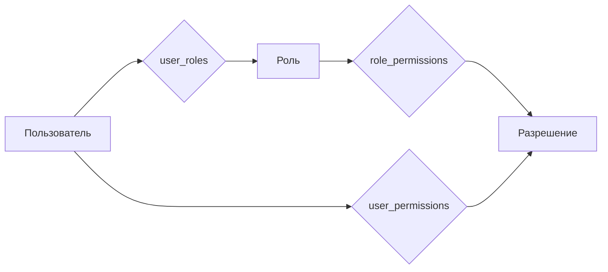

# Роли и права доступа — Jazz Trainer

Подробный справочник по ролям, разрешениям (permissions) и модели доступа в Jazz Trainer.

---

## 1. Обзор модели доступа

**Сервер — источник истины.** Все проверки прав выполняются на бэкенде через middleware `rbac.plugin.ts`. На фронте разрешения используются только для UX (скрытие/показ элементов интерфейса).

**Модель:** роль → разрешения (many-to-many, таблица `role_permissions`). Пользователь может иметь несколько ролей (many-to-many, таблица `user_roles`). Дополнительно поддерживаются пользовательские переопределения (grant/revoke) через таблицу `user_permissions`.



**Ссылки на код:**
- Константы разрешений и ролей: `apps/api/src/services/rbac.service.ts`
- Middleware проверки прав: `apps/api/src/plugins/rbac.plugin.ts`
- Хук фронта: `packages/plugin-sdk/src/hooks/usePermission.ts`

---

## 2. Каталог разрешений (permissions)

Всего **27 разрешений**, сгруппированных по доменам. Каждое разрешение — строка вида `domain:action`.

### 2.1. Администрирование

| Код | Название | Описание |
| --- | --- | --- |
| `admin` | Доступ к админке | Вход в административную панель (`/admin/*`) |

### 2.2. Пользователи

| Код | Название | Описание |
| --- | --- | --- |
| `users:read` | Чтение пользователей | Просмотр списка пользователей и их профилей |
| `users:write` | Редактирование пользователей | Изменение данных, ролей, статусов пользователей |

### 2.3. Роли и доступ

| Код | Название | Описание |
| --- | --- | --- |
| `roles:read` | Чтение ролей | Просмотр списка ролей и их разрешений |
| `roles:write` | Редактирование ролей | Создание, изменение, удаление ролей и их разрешений |

### 2.4. Аудит и диагностика

| Код | Название | Описание |
| --- | --- | --- |
| `audit:read` | Чтение аудита | Просмотр журнала аудита (`audit_log`) |
| `diagnostics:read` | Диагностика | Доступ к диагностической информации системы |

### 2.5. Контент

| Код | Название | Описание |
| --- | --- | --- |
| `content:read` | Чтение контента | Просмотр системного контента (упражнения, уроки, статьи) |
| `content:write` | Редактирование контента | Создание и изменение системного контента |

### 2.6. Feature-флаги

| Код | Название | Описание |
| --- | --- | --- |
| `flags:read` | Чтение флагов | Просмотр списка feature-флагов |
| `flags:write` | Редактирование флагов | Включение/выключение и настройка feature-флагов |

### 2.7. Ассеты

| Код | Название | Описание |
| --- | --- | --- |
| `assets:read` | Чтение ассетов | Просмотр загруженных файлов, семплов, изображений |
| `assets:write` | Запись ассетов | Загрузка, изменение, удаление ассетов |

### 2.8. Каталог упражнений

| Код | Название | Описание |
| --- | --- | --- |
| `catalog:read` | Чтение каталога | Просмотр каталога публичных упражнений |
| `catalog:publish` | Публикация в каталог | Публикация упражнения в общий каталог |
| `catalog:moderate` | Модерация каталога | Подтверждение, отклонение, скрытие записей каталога |
| `catalog:feature` | Избранное каталога | Управление блоком «избранное/рекомендуемое» |
| `catalog:tags:write` | Редактирование тегов | Назначение и изменение тегов в каталоге |
| `catalog:stats:read` | Статистика каталога | Просмотр статистики использования каталога |

### 2.9. Упражнения и теория

| Код | Название | Описание |
| --- | --- | --- |
| `exercises:read` | Упражнения | Доступ к разделу упражнений (`/exercises/*`) |
| `theory:read` | Теория | Доступ к теоретическим материалам (`/theory/*`) |

### 2.10. Композиции

| Код | Название | Описание |
| --- | --- | --- |
| `compositions:read` | Чтение композиций | Просмотр гармонических сеток и композиций |
| `compositions:write` | Создание композиций | Создание и редактирование собственных композиций |

### 2.11. Профиль

| Код | Название | Описание |
| --- | --- | --- |
| `profile:read` | Чтение профиля | Просмотр своего профиля |
| `profile:write` | Редактирование профиля | Изменение настроек и данных своего профиля |

### 2.12. Системные настройки

| Код | Название | Описание |
| --- | --- | --- |
| `system:settings:read` | Чтение настроек | Просмотр системных настроек |
| `system:settings:write` | Редактирование настроек | Изменение системных настроек |

---

## 3. Роли

В системе **4 роли**. Каждая роль — набор разрешений, определённый в `SEED_ROLES` (`apps/api/src/db/seed.ts`).

### 3.1. `super_admin` — Суперадминистратор

**Имеет все 27 разрешений.** Полный доступ ко всей системе, включая управление ролями, пользователями, системными настройками и аудитом.

**Разрешения:** `ALL_PERMISSIONS` (все 27).

**Особенности:**
- Роль нельзя удалить
- Имя роли нельзя изменить
- Только `super_admin` может назначать роль `super_admin` другим пользователям

### 3.2. `admin` — Администратор

**Имеет 24 разрешения.** Административный доступ к большинству разделов, но без права на критические операции.

**Разрешения:**
- `admin` — доступ к админке
- `users:read` — просмотр пользователей
- `content:read`, `content:write` — управление контентом
- `flags:read`, `flags:write` — управление флагами
- `assets:read`, `assets:write` — управление ассетами
- `diagnostics:read` — диагностика
- `audit:read` — просмотр аудита
- `catalog:read`, `catalog:publish`, `catalog:moderate`, `catalog:feature`, `catalog:tags:write`, `catalog:stats:read` — полное управление каталогом
- `roles:read` — просмотр ролей
- `exercises:read`, `theory:read` — доступ к обучению
- `compositions:read`, `compositions:write` — работа с композициями
- `profile:read`, `profile:write` — управление профилем
- `system:settings:read` — просмотр системных настроек

**Не имеет:**
- ❌ `users:write` — не может изменять других пользователей
- ❌ `roles:write` — не может создавать/изменять роли
- ❌ `system:settings:write` — не может менять системные настройки

### 3.3. `catalog_editor` — Редактор каталога

**Имеет 13 разрешений.** Наследует все права обычного пользователя (`user`) и добавляет административный доступ к каталогу.

**Разрешения:**
- `admin` — доступ к админке (только для управления каталогом)
- Все разрешения роли `user`
- `catalog:read`, `catalog:publish`, `catalog:moderate`, `catalog:feature`, `catalog:tags:write`, `catalog:stats:read` — полное управление каталогом

**Не имеет:**
- ❌ `users:read`, `users:write` — нет доступа к управлению пользователями
- ❌ `roles:read`, `roles:write` — нет доступа к ролям
- ❌ `content:read`, `content:write` — нет доступа к системному контенту
- ❌ `flags:read`, `flags:write` — нет доступа к флагам
- ❌ `assets:read`, `assets:write` — нет доступа к ассетам
- ❌ `diagnostics:read`, `audit:read` — нет доступа к диагностике и аудиту
- ❌ `system:settings:read`, `system:settings:write` — нет доступа к системным настройкам

### 3.4. `user` — Обычный пользователь

**Имеет 7 разрешений.** Базовый набор для использования тренажёра.

**Разрешения:**
- `catalog:read` — просмотр каталога
- `exercises:read` — доступ к упражнениям
- `compositions:read`, `compositions:write` — создание и просмотр композиций
- `theory:read` — доступ к теории
- `profile:read`, `profile:write` — управление своим профилем

**Не имеет:**
- ❌ `admin` — нет доступа к админке
- ❌ Все остальные разрешения

---

## 4. Матрица разрешений

Сводная таблица: какая роль какие разрешения имеет.

| Разрешение | `super_admin` | `admin` | `catalog_editor` | `user` |
| --- | :-: | :-: | :-: | :-: |
| **Администрирование** | | | | |
| `admin` | ✅ | ✅ | ✅ | ❌ |
| **Пользователи** | | | | |
| `users:read` | ✅ | ✅ | ❌ | ❌ |
| `users:write` | ✅ | ❌ | ❌ | ❌ |
| **Роли** | | | | |
| `roles:read` | ✅ | ✅ | ❌ | ❌ |
| `roles:write` | ✅ | ❌ | ❌ | ❌ |
| **Аудит и диагностика** | | | | |
| `audit:read` | ✅ | ✅ | ❌ | ❌ |
| `diagnostics:read` | ✅ | ✅ | ❌ | ❌ |
| **Контент** | | | | |
| `content:read` | ✅ | ✅ | ❌ | ❌ |
| `content:write` | ✅ | ✅ | ❌ | ❌ |
| **Флаги** | | | | |
| `flags:read` | ✅ | ✅ | ❌ | ❌ |
| `flags:write` | ✅ | ✅ | ❌ | ❌ |
| **Ассеты** | | | | |
| `assets:read` | ✅ | ✅ | ❌ | ❌ |
| `assets:write` | ✅ | ✅ | ❌ | ❌ |
| **Каталог** | | | | |
| `catalog:read` | ✅ | ✅ | ✅ | ✅ |
| `catalog:publish` | ✅ | ✅ | ✅ | ❌ |
| `catalog:moderate` | ✅ | ✅ | ✅ | ❌ |
| `catalog:feature` | ✅ | ✅ | ✅ | ❌ |
| `catalog:tags:write` | ✅ | ✅ | ✅ | ❌ |
| `catalog:stats:read` | ✅ | ✅ | ✅ | ❌ |
| **Упражнения и теория** | | | | |
| `exercises:read` | ✅ | ✅ | ✅ | ✅ |
| `theory:read` | ✅ | ✅ | ✅ | ✅ |
| **Композиции** | | | | |
| `compositions:read` | ✅ | ✅ | ✅ | ✅ |
| `compositions:write` | ✅ | ✅ | ✅ | ✅ |
| **Профиль** | | | | |
| `profile:read` | ✅ | ✅ | ✅ | ✅ |
| `profile:write` | ✅ | ✅ | ✅ | ✅ |
| **Системные настройки** | | | | |
| `system:settings:read` | ✅ | ✅ | ❌ | ❌ |
| `system:settings:write` | ✅ | ❌ | ❌ | ❌ |

---

## 5. Использование в коде

### 5.1. Бэкенд: защита маршрута

```ts
// apps/api/src/plugins/rbac.plugin.ts
import { requirePermission } from '../plugins/rbac.plugin.js';

// Требуется permission 'users:read'
app.get('/api/admin/users', { preHandler: [requirePermission('users:read')] }, handler);
```

### 5.2. Фронт: проверка прав

```tsx
// packages/plugin-sdk/src/hooks/usePermission.ts
import { usePermission } from '@jazz/plugin-sdk';

function AdminButton() {
  const canWrite = usePermission('content:write');
  if (!canWrite) return null;
  return <button>Создать урок</button>;
}
```

### 5.3. Фронт: проверка feature-флагов

```tsx
// packages/plugin-sdk/src/hooks/useFlag.ts
import { useFlag } from '@jazz/plugin-sdk';

function NewFeaturePanel() {
  const enabled = useFlag('new-feature');
  if (!enabled) return null;
  return <Panel />;
}
```

### 5.4. Плагины: декларативная защита маршрутов

```ts
// В манифесте плагина (src/index.ts)
{
  contributes: {
    routes: [
      {
        path: '/admin/users',
        element: () => import('./AdminUsersPage'),
        requires: 'users:read',  // ← проверка на бэкенде
      },
    ],
  },
}
```

---

## 6. Как добавить роль или разрешение

### 6.1. Добавить новое разрешение

1. В `apps/api/src/services/rbac.service.ts` в `RBAC_PERMISSIONS` добавить константу:

   ```ts
   export const RBAC_PERMISSIONS = {
     // ...существующие...
     NEW_FEATURE_READ: 'new-feature:read',
   } as const;
   ```

2. В `apps/api/src/db/seed.ts` в `SEED_PERMISSIONS` добавить код:

   ```ts
   const SEED_PERMISSIONS = [
     // ...существующие...
     RBAC_PERMISSIONS.NEW_FEATURE_READ,
   ];
   ```

3. Добавить в нужные наборы ролей (`ADMIN_PERMISSIONS`, `USER_PERMISSIONS` или индивидуально).

4. Запустить сид при следующем деплое — `seedRbac()` идемпотентен, добавит только новые разрешения.

### 6.2. Создать новую роль

1. В `apps/api/src/services/rbac.service.ts` в `RBAC_ROLES` добавить константу:

   ```ts
   export const RBAC_ROLES = {
     // ...существующие...
     CONTENT_MANAGER: 'content_manager',
   } as const;
   ```

2. В `apps/api/src/db/seed.ts` добавить описание роли в `SEED_ROLES`:

   ```ts
   {
     id: 'role-content-manager',
     name: RBAC_ROLES.CONTENT_MANAGER,
     permissions: [
       ...USER_PERMISSIONS,
       RBAC_PERMISSIONS.ADMIN,
       RBAC_PERMISSIONS.CONTENT_READ,
       RBAC_PERMISSIONS.CONTENT_WRITE,
     ],
   },
   ```

3. Если роль должна быть защищена от удаления — добавить проверку в `admin-roles.routes.ts`.

---

## 7. Аудит действий

Все операции, затрагивающие безопасность, записываются в таблицу `audit_log` через `withAudit()`. Состав записи:

| Поле | Описание |
| --- | --- |
| `actor_id` | Кто совершил действие |
| `action` | Тип действия (`create`, `update`, `delete`, `login`, etc.) |
| `entity_type` | Тип сущности (`user`, `role`, `composition`, etc.) |
| `entity_id` | ID сущности |
| `old_values` | Состояние до изменения (JSON) |
| `new_values` | Состояние после изменения (JSON) |

---

## 8. Feature-флаги

Feature-флаги управляются через таблицу `feature_flags` и позволяют включать/выключать функциональность без деплоя.

**Резолюция:** серверная функция `resolveFlags()`, фронтовый хук `useFlag()`.

Флаг может быть ограничен:
- **Ролями** — поле `roles` (JSON-массив имён ролей)
- **Пользователями** — поле `userIds` (JSON-массив ID пользователей)
- **Всеми** — если `roles` и `userIds` не заданы

Флаг активируется для пользователя, если: `flag.enabled = true` **И** (нет фильтров **ИЛИ** роль совпадает **ИЛИ** ID пользователя в списке).

---

## 9. Механизм разрешения прав

Алгоритм `resolvePermissions()` (`apps/api/src/services/rbac.service.ts`):

1. Получить пользователя из БД. Если `status = 'disabled'` — вернуть пустой набор.
2. Собрать все роли пользователя: из `user_roles` (new) + `users.role` (legacy fallback).
3. Агрегировать разрешения всех ролей из `role_permissions`.
4. Применить пользовательские переопределения из `user_permissions`: grant добавляет, revoke удаляет.
5. Вернуть итоговый набор разрешений.

---

*Документ основан на коде: `rbac.service.ts` v.2026-07, `seed.ts` v.2026-07. Обновлено 2026-07-19.*
