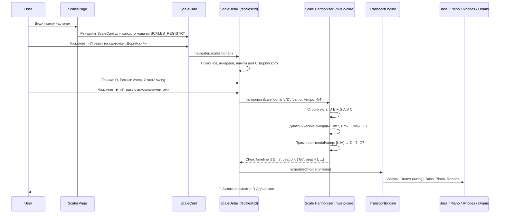

# SCALES-VISION — Каталог ладов и аккомпанемент для тренировки

**Дата:** 2026-06-16
**Статус:** 🟡 Черновик
**Горизонт:** 1–2 версии
**Назначение:** Продуктовый документ — классификация ладов, приоритеты и механика привязки к аккордам для аккомпанемента.

---

## 1. Резюме (Executive Summary)

**Проблема:** Сейчас в плагине `theory-scales` реализован базовый справочник ладов (визуализация гамм на клавиатуре). Однако при выборе лада и попытке практики **аккомпанемент молчит** — играет только метроном. Это логично: в системе нет связки «лад → аккорды» — неизвестно, какие аккорды должен играть Bass, Piano, Rhodes под выбранный пользователем лад.

**Решение:** Создать в `music-core` **словарь ладов (Scale Dictionary)** — исчерпывающий реестр из ~50+ ладов с их ступенями, характерными аккордами и типовыми прогрессиями. Добавить **движок гармонизации (Scale Harmonizer)** — алгоритм, который по выбранному ладу и тонике строит диатоническую сетку аккордов и генерирует ChordTimeline для подачи в существующий TransportEngine. Тогда аккомпанемент (Bass, Piano, Rhodes, Drums) автоматически заиграет гармонию, соответствующую выбранному ладу.

**Ключевая ценность:** Пользователь выбирает лад (например, «D Дорийский») → нажимает Play → слышит полноценный аккомпанемент с басом, фортепиано и барабанами, построенный на аккордах этого лада. Это превращает Jazz Trainer из «справочника ладов» в **тренажёр импровизации под ладовый аккомпанемент** — уникальную нишу, не покрытую конкурентами.

---

## 2. Текущее состояние и проблема

### 2.1. Что есть сейчас

| Компонент               | Статус | Что делает                                                                                                                         |
| ----------------------- | ------ | ---------------------------------------------------------------------------------------------------------------------------------- |
| Плагин `theory-scales`  | 🟡     | Справочник: показывает ноты лада на клавиатуре, без звука и практики                                                               |
| `music-core/chords/`    | 🟢     | `parseChord` — парсинг символов аккордов (C, Dm7, G7 и т.д.)                                                                       |
| `music-core/generator/` | 🟡     | Генераторы прогрессий реализованы, но не интегрированы через PluginContext                                                         |
| `music-core/audio/`     | 🟢     | `TransportEngine`, `ChordTimeline`, 6 инструментов (Bass, Piano, Rhodes, Drums, Guitar, Metronome) — готовый движок аккомпанемента |
| DSL гридов              | 🟢     | `parseGrid` — парсинг текстовых гармонических сеток: `\| Cmaj7 \| Dm7 G7 \|`                                                       |

### 2.2. Разрыв

Аккомпанемент работает **только с явно заданной гармонической сеткой** (DSL или программно построенный `ChordTimeline`). Лады не имеют представления в виде аккордов → аккомпанемент нечего играть.

**Что нужно:** слой, который по запросу «лад X в тональности Y» строит `ChordTimeline` — последовательность аккордов, ритмически оформленную, и передаёт её в `TransportEngine` наравне с обычной гармонической сеткой.

---

## 3. Каталог ладов: классификация и приоритеты

Лады сгруппированы по происхождению и музыкальной функции. Для каждого указаны: **ступени** (полутоновый паттерн от тоники), **характерные аккорды** (какие качества аккордов получаются на ступенях), **приоритет** внедрения.

### 3.1. Натуральные лады (Diatonic Modes) — 7 ладов

> Производные от мажорной гаммы. Фундамент всей ладовой теории.
> Паттерн ступеней для всех 7: берётся мажорная гамма, сдвигается тоника.

| #   | Лад                                     | Ступени (полутоны) | Характерные аккорды (септаккорды на ступенях)        | Тип         | Приоритет |
| --- | --------------------------------------- | ------------------ | ---------------------------------------------------- | ----------- | --------- |
| 1   | **Ионийский** (Ionian / Major)          | 2-2-1-2-2-2-1      | Imaj7, iim7, iiim7, IVmaj7, V7, vim7, viim7b5        | Мажор       | P0        |
| 2   | **Дорийский** (Dorian)                  | 2-1-2-2-2-1-2      | im7, iim7, bIIImaj7, IV7, vm7, vim7b5, bVIImaj7      | Минор       | P0        |
| 3   | **Фригийский** (Phrygian)               | 1-2-2-2-1-2-2      | im7, bIImaj7, bIIImaj7, ivm7, vm7b5, bVImaj7, bviim7 | Минор       | P0        |
| 4   | **Лидийский** (Lydian)                  | 2-2-2-1-2-2-1      | Imaj7, II7, iiim7, #ivm7b5, Vmaj7, vim7, viim7       | Мажор       | P0        |
| 5   | **Миксолидийский** (Mixolydian)         | 2-2-1-2-2-1-2      | I7, iim7, iiim7b5, IVmaj7, vm7, vim7, bVIImaj7       | Доминанта   | P0        |
| 6   | **Эолийский** (Aeolian / Natural Minor) | 2-1-2-2-1-2-2      | im7, iim7b5, bIIImaj7, ivm7, vm7, bVImaj7, bVII7     | Минор       | P0        |
| 7   | **Локрийский** (Locrian)                | 1-2-2-1-2-2-2      | im7b5, bIImaj7, biiim7, ivm7, bVmaj7, bVI7, bviim7   | Полууменьш. | P1        |

> **Примечание:** P0 — фундамент, без которого остальные группы не имеют смысла. Должны быть в первом релизе.

### 3.2. Лады мелодического минора (Melodic Minor Modes) — 7 ладов

> Производные от мелодического минора (Jazz Minor: 2-1-2-2-2-2-1). **Критически важны для джаза** — охватывают альтерированные доминанты, лидийско-доминантовые звучания и полууменьшённые аккорды.

| #   | Лад                                          | Ступени       | Характерный джазовый аккорд | Где применяется                                                       | Приоритет |
| --- | -------------------------------------------- | ------------- | --------------------------- | --------------------------------------------------------------------- | --------- |
| 8   | **Мелодический минор** (Jazz Minor)          | 2-1-2-2-2-2-1 | im(maj7)                    | Минорные тоники с большой септимой (Nica's Dream, Solar)              | P0        |
| 9   | **Дорийский b2** (Phrygian #6)               | 1-2-2-2-2-1-2 | im7 (с b9)                  | Sus-звучание над минором                                              | P2        |
| 10  | **Лидийский увеличенный** (Lydian Augmented) | 2-2-2-2-1-2-1 | Imaj7#5                     | Над мажорным аккордом с #5                                            | P1        |
| 11  | **Лидийский доминантовый** (Lydian Dominant) | 2-2-2-1-2-1-2 | I9#11                       | **Важнейший:** над доминантсептаккордами с #11 (все non-resolving V7) | P0        |
| 12  | **Миксолидийский b6** (Hindu Scale)          | 2-2-1-2-1-2-2 | I7b13                       | Над V7b13 (доминанта, разрешающаяся в минор)                          | P1        |
| 13  | **Локрийский #2** (Half-Diminished)          | 2-1-2-2-1-2-2 | im7b5 (с нат. 9)            | Стандартный лад для m7b5 аккорда в мажоре (viim7b5)                   | P0        |
| 14  | **Суперлокрийский** (Altered Scale)          | 1-2-1-2-2-2-2 | I7alt (b9, #9, #11, b13)    | **Важнейший:** над альтерированными доминантами (V7alt → I)           | P0        |

### 3.3. Лады гармонического минора (Harmonic Minor Modes) — 7 ладов

> Производные от гармонического минора (2-1-2-2-1-3-1). Характерный интервал — увеличенная секунда (3 полутона между VI и VII ступенями) — даёт восточное, испанское, цыганское звучание.

| #   | Лад                                             | Ступени       | Характерный аккорд | Применение                                                                  | Приоритет |
| --- | ----------------------------------------------- | ------------- | ------------------ | --------------------------------------------------------------------------- | --------- |
| 15  | **Гармонический минор**                         | 2-1-2-2-1-3-1 | im(maj7)           | Классический минор с V7 (доминанта из гарм. минора)                         | P1        |
| 16  | **Локрийский нат. 6**                           | 1-2-2-1-3-1-2 | im7b5 (с нат. 13)  | Над m7b5 в гармоническом контексте                                          | P2        |
| 17  | **Ионийский увеличенный**                       | 2-2-1-3-1-2-1 | Imaj7#5            | Редкий                                                                      | P3        |
| 18  | **Дорийский #4** (Ukrainian Dorian)             | 2-1-3-1-2-1-2 | im7#11             | Восточноевропейский колорит                                                 | P2        |
| 19  | **Фригийский доминантовый** (Phrygian Dominant) | 1-3-1-2-1-2-2 | I7b9b13            | **Важный:** «испанский» лад (Flamenco, еврейская музыка), над V7b9 в миноре | P1        |
| 20  | **Лидийский #2**                                | 3-1-2-1-2-2-1 | Imaj7#9            | Редкий джазовый лад                                                         | P3        |
| 21  | **Суперлокрийский bb7** (Diminished 7th)        | 1-2-1-3-1-2-2 | idim7              | Над уменьшёнными аккордами                                                  | P2        |

### 3.4. Симметричные лады (Symmetric Scales) — 4 лада

> Построены на симметричном делении октавы. Не имеют тонального центра в традиционном смысле — создают напряжение и нестабильность.

| #   | Лад                                                | Ступени (полутоны)      | Кол-во нот | Характерный аккорд   | Применение                                            | Приоритет |
| --- | -------------------------------------------------- | ----------------------- | ---------- | -------------------- | ----------------------------------------------------- | --------- |
| 22  | **Целотонный** (Whole Tone)                        | 2-2-2-2-2-2             | 6          | I7#5 (augmented)     | Над V7#5, переходные пассажи, импрессионизм (Debussy) | P1        |
| 23  | **Уменьшённый (W-H)** (Diminished WH)              | 2-1-2-1-2-1-2-1         | 8          | idim7                | Над dim7 аккордами                                    | P1        |
| 24  | **Доминантовый уменьшённый (H-W)** (Diminished HW) | 1-2-1-2-1-2-1-2         | 8          | I7b9 (с #9, #11, 13) | Над V7b9 (доминанта с напряжениями)                   | P0        |
| 25  | **Хроматический** (Chromatic)                      | 1-1-1-1-1-1-1-1-1-1-1-1 | 12         | Любой                | Пассажи, подходы                                      | P1        |

### 3.5. Пентатонические и блюзовые лады (Pentatonic & Blues) — 6 ладов

> Основа блюза, рока, фанка и поп-музыки. Критичны для построения мелодических линий в импровизации.

| #   | Лад                                        | Ступени     | Кол-во нот | Характерный аккорд | Применение                                                       | Приоритет |
| --- | ------------------------------------------ | ----------- | ---------- | ------------------ | ---------------------------------------------------------------- | --------- |
| 26  | **Мажорная пентатоника**                   | 2-2-3-2-3   | 5          | Imaj7, I7          | Универсальный лад для мажора и доминанты                         | P0        |
| 27  | **Минорная пентатоника**                   | 3-2-2-3-2   | 5          | im7, i7            | Универсальный лад для минора и блюза                             | P0        |
| 28  | **Блюзовый минорный** (Minor Blues)        | 3-2-1-1-3-2 | 6          | i7, i7#9           | **Основной блюзовый лад:** минорная пентатоника + b5 (blue note) | P0        |
| 29  | **Блюзовый мажорный** (Major Blues)        | 2-1-1-3-2-3 | 6          | I7, I7#9           | Мажорная пентатоника + b3 (blue note)                            | P1        |
| 30  | **Композитный блюзовый** (Composite Blues) | —           | 7+         | I7                 | Комбинация маж. и мин. блюза — «настоящий» блюзовый звук         | P1        |
| 31  | **Госпел-блюз** (Gospel Blues)             | —           | 6          | I7                 | Маж. пентатоника с добавленной b3 и b7 — госпел-звучание         | P2        |

### 3.6. Бибоп-лады (Bebop Scales) — 4 лада

> 8-нотные лады с добавленным хроматическим проходящим звуком. Позволяют играть ровные восьмые без смещения гармонических акцентов.

| #   | Лад                                                | Ступени                 | Добавленная нота | Применение                                     | Приоритет |
| --- | -------------------------------------------------- | ----------------------- | ---------------- | ---------------------------------------------- | --------- |
| 32  | **Бибоп-мажор** (Bebop Major)                      | Ионийский + #5          | #5 (G#)          | Над Imaj7, Imaj6 — ровные восьмые без смещения | P1        |
| 33  | **Бибоп-доминантовый** (Bebop Dominant)            | Миксолидийский + нат. 7 | Натуральная 7-я  | Над V7 — самый распространённый бибоп-лад      | P0        |
| 34  | **Бибоп-дорийский** (Bebop Dorian)                 | Дорийский + нат. 3      | Натуральная 3-я  | Над im7 — для минорных ii-V                    | P1        |
| 35  | **Бибоп-мелодический минор** (Bebop Melodic Minor) | Мел. минор + #5         | #5               | Над im(maj7)                                   | P2        |

### 3.7. Экзотические лады (Exotic Scales) — 12 ладов

> Лады с нестандартными интервальными структурами. Дают национальный колорит и уникальные краски для импровизации.

| #   | Лад                                    | Ступени       | Происхождение    | Характерный аккорд                                   | Приоритет |
| --- | -------------------------------------- | ------------- | ---------------- | ---------------------------------------------------- | --------- |
| 36  | **Венгерский минор** (Hungarian Minor) | 2-1-3-1-1-3-1 | Восточная Европа | im(maj7)                                             | P2        |
| 37  | **Венгерский мажор** (Hungarian Major) | 3-1-2-1-2-1-2 | Восточная Европа | I7b9b13                                              | P2        |
| 38  | **Неаполитанский минор**               | 1-2-2-2-1-3-1 | Италия           | im(maj7)                                             | P3        |
| 39  | **Неаполитанский мажор**               | 1-2-2-2-2-2-1 | Италия           | Imaj7                                                | P3        |
| 40  | **Энигматический** (Enigmatic)         | 1-3-2-2-2-1-1 | Verdi            | I7#9#11                                              | P3        |
| 41  | **Хирадзёси** (Hirajoshi)              | 2-1-4-1-4     | Япония           | im7 (без 3-й и 7-й)                                  | P2        |
| 42  | **Ивато** (Iwato)                      | 1-4-1-4-2     | Япония           | im7b5                                                | P3        |
| 43  | **Ин Сен** (In Sen)                    | 1-4-2-3-2     | Япония           | im7                                                  | P3        |
| 44  | **Хиджаз** (Hijaz / Arabic)            | 1-3-1-2-1-3-1 | Ближний Восток   | I7b9b13 (= Фригийский доминантовый)                  | P1        |
| 45  | **Макам Раст** (Maqam Rast)            | 2-2-1-2-2-2-1 | Арабская         | Imaj7 (= Ионийский с четверть-тонами, аппроксимация) | P3        |
| 46  | **Макам Баяти** (Maqam Bayati)         | 1-2-2-2-1-2-2 | Арабская         | im7                                                  | P3        |
| 47  | **Алжирский** (Algerian)               | 2-1-3-1-1-3-1 | Северная Африка  | im(maj7)                                             | P3        |

### 3.8. Современные джазовые и гибридные (Modern Jazz & Hybrid) — 4 лада

| #   | Лад                                        | Ступени        | Описание           | Приоритет |
| --- | ------------------------------------------ | -------------- | ------------------ | --------- |
| 48  | **Лидийский #5 #9**                        | Из мел. минора | Редкий             | P3        |
| 49  | **Прометеев** (Prometheus / Mystic)        | 2-2-2-1-2-1-2  | Скрябин            | P3        |
| 50  | **Доминантовый пентатонический**           | 2-2-1-2-3      | 5 нот, над V7      | P2        |
| 51  | **Сус-пентатоника** (Suspended Pentatonic) | 2-3-2-2-3      | Над sus4 аккордами | P2        |

---

### 3.9. Сводная таблица приоритетов

| Приоритет             | Кол-во | Категории                                                                                                                                                                                                           | Когда внедрять |
| --------------------- | ------ | ------------------------------------------------------------------------------------------------------------------------------------------------------------------------------------------------------------------- | -------------- |
| **P0** (MVP)          | 15     | Все 7 натуральных, ключевые мел. минора (Jazz Minor, Lydian Dominant, Altered, Locrian #2), Symmetric (H-W Diminished), все пентатонические + Blues, Bebop Dominant                                                 | Первый релиз   |
| **P1** (Важно)        | 14     | Оставшиеся мел. минора (Lydian Aug, Mixolydian b6), ключевые гарм. минора (Harmonic Minor, Phrygian Dominant), Whole Tone, Diminished WH, Chromatic, Major Blues, Composite Blues, Bebop Major, Bebop Dorian, Hijaz | Второй релиз   |
| **P2** (Усиливает)    | 12     | Остальные гарм. минора, Gospel Blues, Bebop Melodic Minor, Hungarian Minor/Major, Hirajoshi, Dominant Pentatonic, Sus Pentatonic                                                                                    | Третий релиз   |
| **P3** (Nice-to-have) | 10     | Экзотика: Neapolitan, Enigmatic, Iwato, In Sen, Maqam, Algerian, Lydian #2, Lydian #5#9, Prometheus                                                                                                                 | По запросу     |

**Итого: 51 лад. P0+P1 = 29 ладов — покрывают 95% джазовых сценариев.**

---

## 4. Механика: как лад ложится на аккорды

### 4.1. Принцип диатонической гармонизации

Каждый лад — это набор нот (ступеней). На каждой ступени можно построить аккорд, используя **только ноты лада**:

```
D Дорийский: D E F G A B C D

Септаккорды по ступеням:
  I:   D F A C   → Dm7
  II:  E G B D   → Em7
  III: F A C E   → Fmaj7
  IV:  G B D F   → G7
  V:   A C E G   → Am7
  VI:  B D F A   → Bm7b5
  VII: C E G B   → Cmaj7
```

> **Формула качеств для любого лада:** алгоритм проходит все ступени, строит терцовую структуру из нот лада, определяет качество аккорда (maj7, m7, 7, m7b5, dim7, aug7, sus и т.д.).

### 4.2. Уровни аккомпанемента (3 режима)

Для тренировки пользователю нужны разные уровни гармонической поддержки:

#### Уровень 1: Pedal / Drone — только тоника

Бас и Rhodes/Piano держат тонику (или тонику + квинту). Поверх — только метроном и барабаны.

- **Когда:** начальное знакомство с ладом, чистый звук лада без отвлечения на смену гармонии.
- **Аккорды:** один аккорд — `Im7` или `Imaj7` (в зависимости от лада), держится весь цикл.
- **Пример для D Дорийского:** `| Dm7 | Dm7 | Dm7 | Dm7 |` (loop 4 или 8 тактов).

#### Уровень 2: Modal Vamp — характерная каденция лада

Для каждого лада определена **модальная вампа** (modal vamp) — 2–4 аккорда, которые подчёркивают уникальные черты лада без ощущения «тонального разрешения».

- **Когда:** основная практика — пользователь играет лад, а аккомпанемент создаёт гармонический контекст, в котором лад звучит характерно.
- **Аккорды:** 2–4 аккорда, циклично повторяющиеся. **Ключевое правило:** избегать V7→I разрешения (это уводит в тональность, а не в лад).

| Лад                             | Характерная вампа                   | Почему                                                                                                                                         |
| ------------------------------- | ----------------------------------- | ---------------------------------------------------------------------------------------------------------------------------------------------- |
| **Дорийский** (Dm)              | `Dm7 — G7` (i — IV)                 | IV7 (мажорный аккорд на IV ст.) — уникальная черта дорийского (в натуральном миноре iv минорный). Вампа i–IV — классика (So What, Impressions) |
| **Фригийский** (Em)             | `Em7 — Fmaj7` (i — bII)             | bIImaj7 — фригийский «сосед» сверху. Движение i–bII — испанское/фламенко звучание                                                              |
| **Лидийский** (F)               | `Fmaj7 — G7` (I — II)               | II7 (мажорный аккорд на II ст.) — уникальная черта лидийского (#4 ступень = B натуральная, в отличие от Bb в ионийском)                        |
| **Миксолидийский** (G)          | `G7 — Fmaj7` (I — bVII)             | bVII — главная черта миксолидийского. Вампа I–bVII — фанк/рок (G7–F)                                                                           |
| **Эолийский** (Am)              | `Am7 — Fmaj7 — G7` (i — bVI — bVII) | Натуральный минор без V7→i тяготения                                                                                                           |
| **Локрийский** (B)              | `Bm7b5 — Cmaj7` (i — bII)           | Крайне нестабильный лад, вампа минимальная                                                                                                     |
| **Фригийский доминантовый** (E) | `E7 — Fmaj7 — E7 — Am7`             | Испанская каденция: I7 → bII → I7 → iv                                                                                                         |

#### Уровень 3: Full Progression — расширенная гармоническая сетка

Полноценная прогрессия на 4–8 тактов, использующая несколько аккордов лада, с ритмическим разнообразием.

- **Когда:** продвинутая практика — пользователь играет лад, слышит полноценную гармонию, вынужден «обыгрывать» смены аккордов.
- **Аккорды:** генерируются по шаблонам (ii–V, iii–vi–ii–V, turnaround), но **перестраиваются под конкретный лад**: аккорды выбираются из диатонической сетки лада, их качества соответствуют формуле.

**Пример для D Дорийского (4 такта):**

```
| Dm7    | Em7  A7 | Dm7  G7 | Dm7    |
  i       ii   V    i    IV   i
```

Здесь A7 — V7 из D дорийского (не D гармонического минора!). Это подчёркивает именно дорийское звучание.

### 4.3. Данные лада: структура ScaleDefinition

```ts
// music-core/src/scales/types.ts

interface ScaleDefinition {
  /** Уникальный ID: 'dorian', 'phrygian-dominant' */
  id: string;
  /** Читаемое имя: 'Дорийский', 'Dorian' */
  name: string;
  /** Категория: 'diatonic' | 'melodic-minor' | 'harmonic-minor' | 'symmetric' | 'pentatonic-blues' | 'bebop' | 'exotic' */
  category: ScaleCategory;
  /** Полутоновый паттерн от тоники: [2,1,2,2,2,1,2] */
  intervals: number[];
  /** Количество нот в ладу */
  noteCount: number;
  /** Базовое качество тонического аккорда: 'maj7' | 'm7' | '7' | 'm7b5' | 'dim7' */
  tonicQuality: ChordQuality;
  /** Характерная вампа (modal vamp): массив ступеней с качествами ['i', 'IV'] → аккорды генерируются для конкретной тоники */
  modalVamp: ScaleDegreeRef[];
  /** Расширенная прогрессия (8 тактов) — опционально */
  fullProgression?: ScaleDegreeRef[];
  /** Приоритет: P0-P3 */
  priority: 'P0' | 'P1' | 'P2' | 'P3';
  /** Теги для поиска/фильтрации: ['minor', 'jazz', 'modal'] */
  tags: string[];
}

interface ScaleDegreeRef {
  /** Ступень: 1–7, где 1 = тоника */
  degree: number;
  /** Качество аккорда: 'maj7' | 'm7' | '7' | 'm7b5' | 'dim7' | 'aug7' */
  quality: ChordQuality;
  /** Длительность в тактах (для fullProgression) */
  duration?: number; // default = 1
}
```

### 4.4. Алгоритм Scale Harmonizer

```ts
// music-core/src/scales/harmonizer.ts

function harmonizeScale(
  scale: ScaleDefinition,
  tonic: NoteName, // 'C', 'D', 'Eb', ...
  mode: 'pedal' | 'vamp' | 'progression',
  tempo: number,
  timeSignature: TimeSignature,
): ChordTimeline;
```

**Шаги алгоритма:**

1. По `scale.intervals` и `tonic` → вычислить массив нот лада (12 нот на октаву, MIDI-номера).
2. Построить диатонические септаккорды на каждой ступени: для каждой ноты взять терцию, квинту и септиму из нот лада, определить качество.
3. В зависимости от `mode`:
   - `pedal` → один аккорд (тоника) на всю длительность.
   - `vamp` → взять `scale.modalVamp`, для каждой `ScaleDegreeRef` взять соответствующий диатонический аккорд, расставить по тактам.
   - `progression` → взять `scale.fullProgression` или сгенерировать по типовым шаблонам.
4. Сформировать `ChordTimeline` — массив `{ chord, startBeat, durationBeats }`.
5. Передать в `TransportEngine.scheduleChords(timeline)`.

**Ключевой момент:** `ChordTimeline` — уже существующая абстракция (см. `docs/ARCHITECTURE_BASE.md` §4.3, `docs/CHORDS.md`). Все 6 инструментов уже умеют читать из неё. Никаких изменений в инструментах не требуется.

### 4.5. Генератор ритмического оформления

Просто последовательность аккордов недостаточно — нужен ритмический паттерн их смены. Аккорды в `ChordTimeline` размещаются с учётом:

- **Длительность аккорда:** по умолчанию 1 такт на аккорд (для vamp) или варьируется (для progression).
- **Стиль:** глобальный стиль (`swing`, `bossa`, `funk`) влияет на ритмическую сетку — но это уже зона ответственности `TransportEngine` и инструментов. Гармонизатор только расставляет аккорды, ритмику делают Piano/Rhodes/Bass через свои профили.
- **Multi-chord бары:** поддерживаются через существующий механизм sub-bar разрешения.

---

## 5. Пользовательский интерфейс: карточки ладов

### 5.1. Обзор: от заглушки к карточному браузеру

Плагин `theory-scales` сейчас — заглушка:

```tsx
// packages/plugins/theory-scales/src/ScalesPage.tsx (ТЕКУЩЕЕ)
export default function ScalesPage() {
  return (
    <div className="p-6">
      <h1 className="text-2xl font-bold mb-4">Scales</h1>
      <p className="text-muted-foreground">Interactive scale reference...</p>
    </div>
  );
}
```

Цель — превратить в **карточный браузер ладов**, построенный по тому же паттерну, что и `catalog` (каталог сеток):

| Компонент-образец (catalog) | Аналог для theory-scales | Назначение                                                                        |
| --------------------------- | ------------------------ | --------------------------------------------------------------------------------- |
| `CatalogPage.tsx`           | `ScalesPage.tsx`         | Страница: header, поиск, фильтры, сетка карточек, состояния (loading/empty/error) |
| `PublicGridCard.tsx`        | `ScaleCard.tsx`          | Карточка одного лада: название, теги, кнопка «Играть»                             |
| `SearchBar.tsx`             | `ScaleSearchBar.tsx`     | Поиск + сортировка                                                                |

Ключевое отличие: данные каталога приходят с API (`usePublicGrids`), а данные ладов — **локальный реестр** `SCALES_REGISTRY` из `@jazz/music-core`. Никакого API, чисто клиентский рендеринг.

---

### 5.2. ScaleCard — компонент карточки лада

Полный аналог `PublicGridCard`. Те же Tailwind-классы, та же структура `flex flex-col rounded-lg border border-border bg-card`, та же кнопка «Играть» в футере.

```tsx
// packages/plugins/theory-scales/src/components/ScaleCard.tsx

import { Play, Music2 } from 'lucide-react';
import type { ScaleDefinition } from '@jazz/music-core/scales';
import { Button, Badge } from '@jazz/ui';
import { useNavigate } from 'react-router-dom';

interface Props {
  scale: ScaleDefinition;
}

/** Маленький тег как в PublicGridCard (GridTag) */
function ScaleTag({ children }: { children: React.ReactNode }) {
  return (
    <span className="rounded-sm bg-secondary px-1.5 py-0.5 text-[11px] font-medium uppercase tracking-wide text-secondary-foreground">
      {children}
    </span>
  );
}

/** Тип лада → лейбл для тега */
const TYPE_LABELS: Record<string, string> = {
  maj7: 'Мажор',
  m7: 'Минор',
  '7': 'Доминанта',
  m7b5: 'Полууменьш.',
  dim7: 'Уменьш.',
  aug7: 'Увелич.',
};

export function ScaleCard({ scale }: Props) {
  const navigate = useNavigate();
  const vampLabel = scale.modalVamp
    .map((d) => `${d.degree}${d.quality === 'm7' ? 'm' : d.quality === '7' ? '' : d.quality}`)
    .join(' — ');

  return (
    <div className="group flex flex-col rounded-lg border border-border bg-card transition-colors hover:border-primary/40">
      {/* Верхняя часть: название + теги */}
      <div className="flex-1 p-5">
        <h3 className="truncate font-semibold leading-snug">{scale.name}</h3>
        <div className="mt-3 flex flex-wrap items-center gap-1.5">
          <ScaleTag>
            <Music2 className="mr-0.5 inline size-2.5" />
            {TYPE_LABELS[scale.tonicQuality] ?? scale.tonicQuality}
          </ScaleTag>
          <ScaleTag>{scale.noteCount} нот</ScaleTag>
          <ScaleTag>{scale.category === 'diatonic' ? 'Натур.' : scale.category}</ScaleTag>
        </div>
        <p className="mt-2 text-xs text-muted-foreground">Вампа: {vampLabel}</p>
      </div>

      {/* Нижняя часть: теги + кнопка «Играть» */}
      <div className="flex items-center justify-between border-t border-border px-5 py-3">
        <div className="flex flex-wrap gap-1">
          {scale.tags.slice(0, 3).map((tag) => (
            <Badge key={tag} variant="secondary" className="text-[10px] px-1.5 py-0">
              {tag}
            </Badge>
          ))}
        </div>
        <Button asChild size="sm" className="gap-1.5">
          <button onClick={() => navigate(`/scales/${scale.id}`)}>
            <Play className="size-3.5" /> Играть
          </button>
        </Button>
      </div>
    </div>
  );
}
```

**Что показывает карточка:**

- **Название** — `scale.name` («Дорийский (Dorian)»)
- **Теги-лейблы** — тип лада (мажор/минор/доминанта), количество нот (7), категория (Натур.)
- **Вампа** — формула характерной вампы (i — IV)
- **Badge-теги** — до 3 тегов из `scale.tags` (`#minor`, `#modal`, `#jazz`)
- **Кнопка «Играть»** — переход на детальный вид `/scales/${scale.id}`

---

### 5.3. ScaleSearchBar — поиск и фильтры

Аналог `SearchBar` из каталога, но с дополнительным фильтром по категории (через `Select`).

```tsx
// packages/plugins/theory-scales/src/components/ScaleSearchBar.tsx

import { Search } from 'lucide-react';
import { Input, Select, SelectContent, SelectItem, SelectTrigger, SelectValue } from '@jazz/ui';

type SortMode = 'priority' | 'name' | 'noteCount';

interface Props {
  query: string;
  onQueryChange: (v: string) => void;
  category: string;
  onCategoryChange: (v: string) => void;
  sort: SortMode;
  onSortChange: (v: SortMode) => void;
}

const CATEGORIES = [
  { value: 'all', label: 'Все категории' },
  { value: 'diatonic', label: 'Натуральные' },
  { value: 'melodic-minor', label: 'Мел. минора' },
  { value: 'harmonic-minor', label: 'Гарм. минора' },
  { value: 'symmetric', label: 'Симметричные' },
  { value: 'pentatonic-blues', label: 'Пентатоника и блюз' },
  { value: 'bebop', label: 'Бибоп' },
  { value: 'exotic', label: 'Экзотические' },
];

export function ScaleSearchBar({
  query,
  onQueryChange,
  category,
  onCategoryChange,
  sort,
  onSortChange,
}: Props) {
  return (
    <div className="flex flex-col gap-2 sm:flex-row">
      <div className="relative flex-1">
        <Search className="absolute left-2.5 top-1/2 size-4 -translate-y-1/2 text-muted-foreground" />
        <Input
          placeholder="Поиск по названию..."
          value={query}
          onChange={(e) => onQueryChange(e.target.value)}
          className="pl-9"
        />
      </div>
      <Select value={category} onValueChange={onCategoryChange}>
        <SelectTrigger className="w-full sm:w-44">
          <SelectValue />
        </SelectTrigger>
        <SelectContent>
          {CATEGORIES.map((c) => (
            <SelectItem key={c.value} value={c.value}>
              {c.label}
            </SelectItem>
          ))}
        </SelectContent>
      </Select>
      <Select value={sort} onValueChange={(v) => onSortChange(v as SortMode)}>
        <SelectTrigger className="w-full sm:w-40">
          <SelectValue />
        </SelectTrigger>
        <SelectContent>
          <SelectItem value="priority">По приоритету</SelectItem>
          <SelectItem value="name">По названию</SelectItem>
          <SelectItem value="noteCount">По числу нот</SelectItem>
        </SelectContent>
      </Select>
    </div>
  );
}
```

---

### 5.4. ScalesPage — страница с сеткой карточек

Полный аналог `CatalogPage`: header → search bar → grid (3 колонки на десктопе). Данные — из `SCALES_REGISTRY` (локально), фильтрация и сортировка — на клиенте.

```tsx
// packages/plugins/theory-scales/src/ScalesPage.tsx (ЦЕЛЕВОЕ)

import { useState, useMemo, useCallback } from 'react';
import { useDebounce } from '@jazz/ui';
import { SCALES_REGISTRY } from '@jazz/music-core/scales';
import type { ScaleDefinition } from '@jazz/music-core/scales';
import { ScaleSearchBar } from './components/ScaleSearchBar';
import { ScaleCard } from './components/ScaleCard';

type SortMode = 'priority' | 'name' | 'noteCount';

const PRIORITY_ORDER = { P0: 0, P1: 1, P2: 2, P3: 3 };

function filterAndSort(
  scales: ScaleDefinition[],
  query: string,
  category: string,
  sort: SortMode,
): ScaleDefinition[] {
  let result = scales;

  // Фильтр по категории
  if (category !== 'all') {
    result = result.filter((s) => s.category === category);
  }

  // Поиск по названию (рус/eng)
  if (query) {
    const q = query.toLowerCase();
    result = result.filter(
      (s) => s.name.toLowerCase().includes(q) || s.id.toLowerCase().includes(q),
    );
  }

  // Сортировка
  switch (sort) {
    case 'priority':
      result.sort((a, b) => PRIORITY_ORDER[a.priority] - PRIORITY_ORDER[b.priority]);
      break;
    case 'name':
      result.sort((a, b) => a.name.localeCompare(b.name));
      break;
    case 'noteCount':
      result.sort((a, b) => a.noteCount - b.noteCount);
      break;
  }

  return result;
}

export default function ScalesPage() {
  const [query, setQuery] = useState('');
  const [category, setCategory] = useState('all');
  const [sort, setSort] = useState<SortMode>('priority');
  const debouncedQuery = useDebounce(query, 300);

  const handleQueryChange = useCallback((v: string) => setQuery(v), []);

  const filtered = useMemo(
    () => filterAndSort(SCALES_REGISTRY, debouncedQuery, category, sort),
    [debouncedQuery, category, sort],
  );

  return (
    <div className="space-y-6">
      {/* Header */}
      <div className="flex items-end justify-between gap-4">
        <div>
          <h1 className="text-2xl font-semibold tracking-tight">Лады и гаммы</h1>
          <p className="mt-1 text-sm text-muted-foreground">
            Каталог музыкальных ладов для изучения и практики под аккомпанемент
          </p>
        </div>
        <span className="shrink-0 text-sm text-muted-foreground">
          {filtered.length} {filtered.length === 1 ? 'лад' : filtered.length < 5 ? 'лада' : 'ладов'}
        </span>
      </div>

      {/* Search + Filters */}
      <ScaleSearchBar
        query={query}
        onQueryChange={handleQueryChange}
        category={category}
        onCategoryChange={setCategory}
        sort={sort}
        onSortChange={setSort}
      />

      {/* Empty state */}
      {filtered.length === 0 && (
        <div className="rounded-lg border border-dashed border-border py-16 text-center text-sm text-muted-foreground">
          {debouncedQuery
            ? `Ничего не найдено по запросу «${debouncedQuery}»`
            : 'Нет ладов в выбранной категории'}
        </div>
      )}

      {/* Card grid */}
      {filtered.length > 0 && (
        <div className="grid gap-4 sm:grid-cols-2 lg:grid-cols-3">
          {filtered.map((scale) => (
            <ScaleCard key={scale.id} scale={scale} />
          ))}
        </div>
      )}
    </div>
  );
}
```

**Ключевые моменты реализации:**

- Данные — `SCALES_REGISTRY` (массив `ScaleDefinition[]`, экспортируется из `music-core/src/scales/`).
- Фильтрация и сортировка — `useMemo`, чистая функция `filterAndSort` (легко тестируется).
- Дебаунс поиска — `useDebounce(query, 300)` (как в CatalogPage).
- Состояния: **empty** (нет результатов), **normal** (сетка карточек). Состояния loading/error не нужны — данные локальные.
- Сетка: `grid gap-4 sm:grid-cols-2 lg:grid-cols-3` — идентично CatalogPage.

---

### 5.5. Детальный вид лада и панель практики

При клике на «Играть» в карточке — переход на `/scales/:id`. Это отдельный вид (не overlay), со своей структурой:

```
/scales/dorian
┌──────────────────────────────────────────────────────────┐
│  ← Назад к списку                                        │
│                                                          │
│  Дорийский (Dorian)                        P0 · Минорный │
│                                                          │
│  Ноты в C:  C  D  Eb  F  G  A  Bb  C                    │
│  Ступени:   1  2  ♭3  4  5  6  ♭7    (7 нот)            │
│  Интервалы: 2-1-2-2-2-1-2                               │
│                                                          │
│  ┌─ Диатонические аккорды ────────────────────────────┐  │
│  │ I: Cm7  II: Dm7  III: Ebmaj7  IV: F7               │  │
│  │ V: Gm7  VI: Am7b5  VII: Bbmaj7                     │  │
│  └────────────────────────────────────────────────────┘  │
│                                                          │
│  ┌─ Характерная вампа ────────────────────────────────┐  │
│  │ i — IV  →  Cm7 — F7                                 │  │
│  │ Классика: So What (Miles Davis), Impressions        │  │
│  └────────────────────────────────────────────────────┘  │
│                                                          │
│  ┌─ Практика ─────────────────────────────────────────┐  │
│  │ Тональность:  [C ▾]                                 │  │
│  │ Режим:        [Modal Vamp ▾]                        │  │
│  │ Стиль:        [Swing ▾]                             │  │
│  │                                                    │  │
│  │ [▶ Играть с аккомпанементом]  [🎹 Только метроном]  │  │
│  └────────────────────────────────────────────────────┘  │
└──────────────────────────────────────────────────────────┘
```

**Компоненты:**

- `ScaleDetail.tsx` — заголовок, ноты, диатонические аккорды, вампа
- `ScalePractice.tsx` — селекторы тоники/режима/стиля + кнопки Play

**Режимы аккомпанемента (селект «Режим»):**

- `pedal` — только тоника (держит один аккорд)
- `vamp` — характерная вампа лада (2–4 аккорда, циклично)
- `progression` — расширенная прогрессия (8 тактов)

---

### 5.6. Что происходит при нажатии «Играть»



---

### 5.7. MIDI-тренировка (следующий шаг)

После того как аккомпанемент играет, следующий логический шаг — пользователь играет лад на MIDI-клавиатуре, а система оценивает попадание в ноты лада (через существующий `midiEval`). Это отдельная функция, выходящая за рамки данного видения, но архитектурно подготовленная текущим решением.

---

## 6. Архитектурное решение

### 6.1. Где что живёт

| Компонент                              | Расположение                                                       | Ответственность                                                                                    |
| -------------------------------------- | ------------------------------------------------------------------ | -------------------------------------------------------------------------------------------------- |
| **Scale Definitions** (данные 51 лада) | `music-core/src/scales/definitions/`                               | Чистые данные: массив `ScaleDefinition[]`                                                          |
| **Scale Harmonizer** (алгоритм)        | `music-core/src/scales/harmonizer.ts`                              | `harmonizeScale()` → `ChordTimeline`                                                               |
| **Scale Utils** (ступени → ноты)       | `music-core/src/scales/utils.ts`                                   | `getScaleNotes(scale, tonic)`, `buildDiatonicChords(...)`                                          |
| **ScaleCard** (карточка лада)          | `packages/plugins/theory-scales/src/components/ScaleCard.tsx`      | Компактная карточка: название, теги (ScaleTag), вампа, Badge-теги, кнопка «Играть» → `/scales/:id` |
| **ScaleSearchBar** (поиск + фильтры)   | `packages/plugins/theory-scales/src/components/ScaleSearchBar.tsx` | `Input` + `Select` (категория) + `Select` (сортировка)                                             |
| **ScalesPage** (страница-сетка)        | `packages/plugins/theory-scales/src/ScalesPage.tsx`                | `CatalogPage`-подобная: header, ScaleSearchBar, сетка `ScaleCard[]`, empty state                   |
| **ScaleDetail** (детальный вид)        | `packages/plugins/theory-scales/src/components/ScaleDetail.tsx`    | Маршрут `/scales/:id`: ноты лада, диатонические аккорды, вампа                                     |
| **ScalePractice** (панель практики)    | `packages/plugins/theory-scales/src/components/ScalePractice.tsx`  | Селекторы тоники/режима/стиля + кнопка Play → TransportEngine                                      |

### 6.2. Интеграция с существующей системой

```
music-core/src/scales/       ← НОВЫЙ МОДУЛЬ
  ├── types.ts               ← ScaleDefinition, ScaleDegreeRef, ScaleCategory
  ├── definitions/
  │   ├── diatonic.ts        ← 7 натуральных ладов
  │   ├── melodic-minor.ts   ← 7 ладов мелодического минора
  │   ├── harmonic-minor.ts  ← 7 ладов гармонического минора
  │   ├── symmetric.ts       ← 4 симметричных
  │   ├── pentatonic-blues.ts← 6 пентатонических и блюзовых
  │   ├── bebop.ts           ← 4 бибоп-лада
  │   ├── exotic.ts          ← 12 экзотических
  │   └── modern.ts          ← 4 гибридных
  ├── harmonizer.ts          ← harmonizeScale()
  ├── utils.ts               ← getScaleNotes, buildDiatonicChords
  └── index.ts               ← реэкспорт + SCALES_REGISTRY: ScaleDefinition[]
```

**Границы слоёв (линтер):**

- `music-core/src/scales/` → только stdlib (чистая логика, без браузерных API, без Tone.js) ✅
- `theory-scales` → `@jazz/music-core` (scales, transportEngine), `@jazz/plugin-sdk` ✅
- Запрет: `theory-scales` → другие плагины ✅ (уже соблюдается)

### 6.3. Обновлённый манифест theory-scales

Плагин получает второй маршрут /scales/:id для компонента ScaleDetail. Манифест расширяется: routes добавляется { path: '/scales/:id', element: () => import('./components/ScaleDetail') }. navItems остаётся без изменений.

### 6.4. Почему не нужен новый плагин

Добавление /scales/:id и компонентов практики укладывается в существующий плагин theory-scales. Новый плагин scale-practice может быть создан позже, если объём UI разрастётся.

### 6.5. Контракт с PluginContext

В долгосрочной перспективе (Фаза 2, AudioPort wiring) `harmonizeScale` может быть зарегистрирован как `theoryProvider` в `PluginContext`, чтобы любые плагины могли запрашивать гармонизацию лада. Но для MVP прямой импорт из `music-core` в плагин достаточен.

---

## 7. Roadmap внедрения

| Этап             | Содержание                                                                                                                                                                                                                                                              | Приоритет | Сложность |
| ---------------- | ----------------------------------------------------------------------------------------------------------------------------------------------------------------------------------------------------------------------------------------------------------------------- | --------- | --------- |
| **Этап 1 (MVP)** | 15 ладов P0 в `music-core`, `ScaleDefinition` + `SCALES_REGISTRY`, `harmonizeScale` (pedal/vamp), **ScaleCard + ScaleGrid** (сетка карточек с фильтрами), **ScaleDetail** (ноты, аккорды, вампа), кнопка Play из карточки запускает аккомпанемент через TransportEngine | P0        | M (3–5d)  |
| **Этап 2**       | +14 ладов P1, Full Progression режим, ритмические шаблоны, доработка ScaleDetail (применение в джазе для каждого лада), выбор стиля на панели практики                                                                                                                  | P1        | M (3–5d)  |
| **Этап 3**       | +12 ладов P2, MIDI-тренировка (ScalePractice + midiEval), визуализация нот лада на клавиатуре в реальном времени, избранные/недавние лады                                                                                                                               | P2        | L (1–2w)  |
| **Этап 4**       | +10 ладов P3, пользовательские вампи/прогрессии, экспорт/импорт, комьюнити-каталог ладовых сеток                                                                                                                                                                        | P3        | L (1–2w)  |

---

## 8. Конкурентный контекст

| Продукт                 | Справочник ладов        | Аккомпанемент под лад                                   | MIDI-тренировка под лад  | Джазовые лады (мел. минор, альтерированные)    |
| ----------------------- | ----------------------- | ------------------------------------------------------- | ------------------------ | ---------------------------------------------- |
| **EarMaster**           | Базовые гаммы           | Нет                                                     | Есть (ноты на нотоносце) | Нет                                            |
| **Tenuto**              | Гаммы визуально         | Нет                                                     | Нет (только визуально)   | Нет                                            |
| **musictheory.net**     | Базовые гаммы           | Нет                                                     | Нет                      | Нет                                            |
| **Teoria**              | Базовые гаммы           | Нет                                                     | Нет                      | Нет                                            |
| **iReal Pro**           | Нет                     | Только готовые сетки                                    | Нет                      | Нет (нужно вручную создавать сетку)            |
| **Jazz Trainer (цель)** | **51 лад, 7 категорий** | **Автоматическая гармонизация: pedal/vamp/progression** | **Да (через midiEval)**  | **Да: все 7 мел. минора, altered, diminished** |

**Уникальная ниша:** Jazz Trainer — **единственный** инструмент, который автоматически генерирует аккомпанемент под выбранный лад. Конкуренты либо показывают лад визуально, либо играют готовые сетки, но никто не делает мост «лад → аккорды → живой аккомпанемент» в реальном времени.

---

## 9. Риски и допущения

| Риск                                                                                                 | Вероятность | Решение                                                                                                                                                       |
| ---------------------------------------------------------------------------------------------------- | ----------- | ------------------------------------------------------------------------------------------------------------------------------------------------------------- |
| Modal vamp звучит «неправильно» для некоторых ладов (субъективно)                                    | Средняя     | Дать пользователю ручную правку вампа (выбор аккордов из предложенных диатонических)                                                                          |
| Генерация Full Progression даёт скучные/повторяющиеся сетки                                          | Средняя     | Использовать существующий генератор прогрессий в `music-core/generator/`, адаптировав под ладовую диатонику                                                   |
| Пользователь путает «лад» и «тональность» — ожидает V7→I                                             | Высокая     | Добавить поясняющую подсказку в UI: «Это модальная вампа — она подчёркивает характер лада, а не тональное разрешение»                                         |
| Большой объём данных (51 лад × 12 тональностей = 612 записей)                                        | Низкая      | Данные хранятся как формулы (интервалы + качества), генерируются на лету для любой тоники. Никакого хранения 612 записей — только 51 `ScaleDefinition`        |
| Алгоритм гармонизации даёт неправильные качества для нестандартных ладов (пентатоника, симметричные) | Средняя     | Для ладов с неполным набором нот (пентатоника — 5 нот) вместо полных септаккордов используются трезвучия или «подразумеваемые» аккорды (имплицитная гармония) |

---

## 10. Метрики успеха

- Пользователь заходит на `/scales` → видит сетку карточек с 15 ладами P0, отсортированными по приоритету
- Фильтр по категории (натуральные / мел. минора / пентатоника) — сужает карточки до выбранной группы
- Клик по карточке → детальный вид: ноты лада в C, диатонические аккорды, характерная вампа с примером
- Из детального вида: выбор тоники (C → Eb) — диатонические аккорды пересчитываются мгновенно
- Нажатие Play из карточки → слышен аккомпанемент (Bass + Drums + Piano/Rhodes), соответствующий ладу
- Переключение режима (pedal → vamp → progression) меняет характер аккомпанемента
- Стиль (swing/bossa/funk) влияет на ритмическую интерпретацию аккордов
- `typecheck` + `lint` + `test` — зелёные
- Все 51 `ScaleDefinition` проходят валидацию: `intervals` суммируются в 12, `modalVamp` содержит корректные ступени
- Карточки и фильтры работают без ошибок при 51 ладе (рендеринг, поиск, пагинация)

---

_Документ создан 2026-06-16. Отражает видение подсистемы ладов и их аккордового аккомпанемента для Jazz Trainer. После принятия — станет основой для технической реализации в `music-core/src/scales/`._
