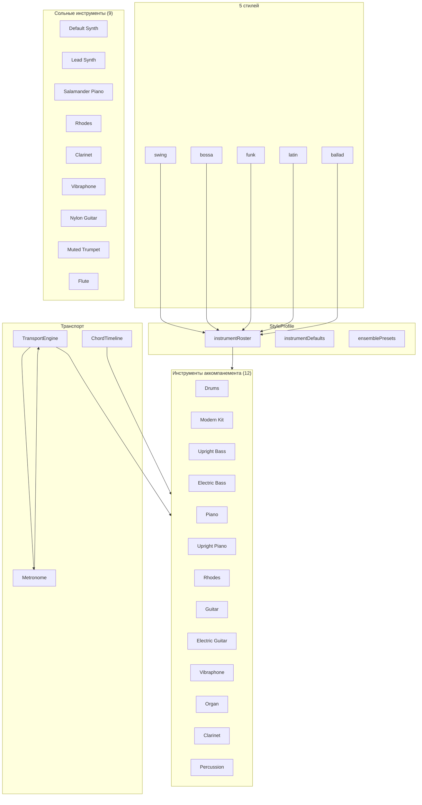

# Стили и инструменты Jazz Trainer

> Полный каталог музыкальных стилей, инструментов, паттернов, voicing'ов и ансамблей.
> Связанные документы: [ARCHITECTURE_BASE.md](ARCHITECTURE_BASE.md#4-звук-и-midi-порты-и-адаптеры), [FUNCTIONS.md](FUNCTIONS.md#6-аудио-и-midi).

---

## 1. Музыкальные стили (Style)

Глобальный `Style` управляет поведением всех инструментов согласованно: выбор стиля задаёт ростер, темп, swing-ratio, per-instrument дефолты и размеры.

```ts
type Style = 'swing' | 'bossa' | 'funk' | 'latin' | 'ballad';
```

Исходный код: `packages/shared/src/constants.ts`, полные профили — `packages/music-core/src/styleProfile.ts`.

| Стиль     | Название      | Темп (BPM) | Swing Ratio | Размеры          | Характер                                |
| --------- | ------------- | ---------- | ----------- | ---------------- | --------------------------------------- |
| `swing`   | Swing         | 140        | 0.67        | 4/4, 3/4         | Классический мейнстрим-джаз             |
| `bossa`   | Bossa Nova    | 120        | 0.5 (straight) | 2/4, 4/4     | Бразильская босса-нова, nylon-гитара    |
| `funk`    | Funk          | 100        | 0.5 (straight) | 4/4          | Синкопированный грув, electric bass     |
| `latin`   | Latin         | 160        | 0.5 (straight) | 4/4, 6/8     | Сальса/монтуно, cascara/clave           |
| `ballad`  | Ballad        | 60         | 0.58        | 4/4, 3/4         | Медленная баллада, brushes              |

### 1.1. Ростеры инструментов по стилям

Каждый стиль определяет, какие инструменты уместны (`required` / `recommended` / `optional`), а какие скрыты (`hidden`).

#### Swing

| Категория    | Инструменты                                          |
| ------------ | ---------------------------------------------------- |
| Required     | Drums (Swirly), Upright Bass, Piano                  |
| Recommended  | Rhodes                                               |
| Optional     | Trumpet (muted), Vibraphone, Clarinet                 |
| Hidden       | Modern Kit, Electric Bass, Upright Piano, Electric Guitar, Organ, Percussion, Flute, Nylon/Steel Guitar |

#### Bossa Nova

| Категория    | Инструменты                                          |
| ------------ | ---------------------------------------------------- |
| Required     | Drums (Swirly), Upright Bass, Piano                  |
| Recommended  | Guitar (nylon)                                       |
| Optional     | Rhodes, Flute, Percussion                            |
| Hidden       | Modern Kit, Electric Bass, Upright Piano, Electric Guitar, Trumpet (muted), Vibraphone, Organ, Clarinet |

#### Funk

| Категория    | Инструменты                                          |
| ------------ | ---------------------------------------------------- |
| Required     | Modern Kit, Electric Bass, Piano                     |
| Recommended  | Rhodes, Electric Guitar                              |
| Optional     | Organ, Trumpet (muted), Percussion                   |
| Hidden       | Drums (Swirly), Upright Bass, Upright Piano, Nylon/Steel Guitar, Vibraphone, Clarinet, Flute |

#### Latin

| Категория    | Инструменты                                          |
| ------------ | ---------------------------------------------------- |
| Required     | Drums (Swirly), Percussion, Upright Bass, Piano      |
| Recommended  | Trumpet (muted), Flute                               |
| Optional     | Vibraphone, Rhodes                                   |
| Hidden       | Modern Kit, Electric Bass, Upright Piano, Nylon/Steel Guitar, Electric Guitar, Organ, Clarinet |

#### Ballad

| Категория    | Инструменты                                          |
| ------------ | ---------------------------------------------------- |
| Required     | Drums (Swirly), Upright Bass, Piano                  |
| Recommended  | Rhodes                                               |
| Optional     | Flute, Vibraphone                                    |
| Hidden       | Modern Kit, Electric Bass, Upright Piano, Nylon/Steel Guitar, Electric Guitar, Organ, Clarinet, Percussion, Trumpet (muted) |

---

## 2. Инструменты аккомпанемента (Instrument)

Все инструменты реализуют интерфейс `Instrument` (`packages/music-core/src/audio/instrument.ts`), планируют ноты в будущее через `TransportEngine` и регистрируются через `InstrumentManifest`.

### 2.1. Bass — бас

| Параметр       | Значение                                              |
| -------------- | ----------------------------------------------------- |
| Класс          | `BassInstrument`                                      |
| Манифест       | `bassManifest.ts`                                     |
| ID             | `bass` (`upright-bass` в styleProfile)                |
| Сэмплы         | SneakyBass, pluck/mute ×4 round-robin                 |
| Сложность      | 1–7 (root-only → full walking)                        |

**Стиле-зависимые паттерны:**

| Стиль    | Паттерн            | Сложность | Стратегия                                     |
| -------- | ------------------ | --------- | --------------------------------------------- |
| `swing`  | `walking`          | 5         | Четверти + восьмые approach notes             |
| `bossa`  | `root-5th`         | 3         | Половинные: root на 1, 5-я на 3               |
| `funk`   | `syncopated`       | 5         | Восьмые с синкопами, пропуск сильных долей    |
| `latin`  | `montuno`          | 4         | Синкопированный паттерн: нота-пауза-нота      |
| `ballad` | `two-feel`         | 7         | Половинные, длинные ноты                      |

**Рандомайзер:** `BassRandomizer` — chromatc above/below, diatonic approach, sparse-режим, октавные прыжки.

Подробнее: [BASS.md](BASS.md).

### 2.2. Drums — акустические барабаны (Swirly Drums v2)

| Параметр       | Значение                                              |
| -------------- | ----------------------------------------------------- |
| Класс          | `DrumInstrument`                                      |
| Манифест       | `drumsManifest.ts`                                    |
| ID             | `drums`                                               |
| Сэмплы         | Swirly Drums v2, 8 звуков ×4 round-robin              |
| Тип            | Unpitched                                             |

**8 звуков:** bassDrum, snare, hihat (закрытый/полуоткрытый/открытый), ride, crash, rim.

**Стиле-зависимые паттерны:**

| Стиль    | Паттерн  | Характер                                          |
| -------- | -------- | ------------------------------------------------- |
| `swing`  | `swing`  | Ride + hi-hat swing pattern, snare на 2 и 4       |
| `bossa`  | `bossa`  | Rim/clave, snare отключён, rim включён            |
| `funk`   | `funk`   | 16-е синкопы, активный bass drum                  |
| `latin`  | `funk`   | Ближайший к латино groove из текущих паттернов    |
| `ballad` | `swing`  | Приглушённый (volume 0.55), brushes-стиль         |

**Особенности:** Humanization (±3–8 мс jitter), fills каждые 4/8/16 тактов, per-sound настройки включения/громкости.

Подробнее: [DRUMS.md](DRUMS.md).

### 2.3. Modern Kit — универсальная установка

| Параметр       | Значение                                              |
| -------------- | ----------------------------------------------------- |
| Класс          | `DrumInstrument` (тот же класс!)                      |
| Манифест       | `modernKitManifest.ts`                                |
| ID             | `modern-kit`                                          |
| Сэмплы         | Modern Kit, 10 звуков ×4 round-robin + stir          |
| Тип            | Unpitched                                             |

**10 звуков:** bassDrum, snare, hihat (закрытый/полуоткрытый/открытый), ride, crash, rim, tom, stir.

**Per-style defaults:** bossa → snare off, rim on; ballad → volume 0.6.

Подробнее: [DRUMS.md](DRUMS.md).

### 2.4. Piano — фортепиано (основной гармонический)

| Параметр       | Значение                                              |
| -------------- | ----------------------------------------------------- |
| Класс          | `PianoInstrument`                                     |
| Манифесты      | `pianoManifest.ts` (Upright KW), `salamanderManifest.ts` (Salamander Grand) |
| ID             | `piano` / `upright-piano`                             |
| Сэмплы         | Upright KW (2 vel-слоя) / Salamander Grand (3 vel-слоя) |

**5 составных 4-тактовых профилей компинга:**

| Профиль           | Описание                                                |
| ----------------- | ------------------------------------------------------- |
| `swing-sparse`    | Разреженный свинг: few attacks per bar                 |
| `swing-medium`    | Умеренный свинг: balanced density                      |
| `basie-light`     | Basie-стиль: light comping                             |
| `offbeat-push`    | Offbeat-акценты, anticipation                          |
| `beginner-safe`   | Простой, предсказуемый — для начинающих                |

**Адаптивный профиль для multi-chord баров:** автоматически переключается на `two-and-four` (2 аккорда) или `quarter-comp` (3–4 аккорда).

**4 типа voicing'ов:** `shell2`, `rootless3`, `rootless4`, `quartal` (см. §4).

**Рандомайзер:** off / subtle / moderate / high. Voice leading с минимальным движением.

Подробнее: [PIANO.md](PIANO.md).

### 2.5. Rhodes — электропиано (комплементарный слой)

| Параметр       | Значение                                              |
| -------------- | ----------------------------------------------------- |
| Класс          | `RhodesInstrument`                                    |
| Манифест       | `rhodesManifest.ts`                                   |
| ID             | `rhodes`                                              |
| Сэмплы         | jRhodes3c, 4 velocity-слоя (pp, p, mf, f)            |

**5 режимов комплементарного слоя (`RhodesLayerMode`):**

| Режим              | Описание                                      | Событий/такт | Velocity  |
| ------------------ | --------------------------------------------- | ------------ | --------- |
| `none`             | Отключён                                      | 0            | —         |
| `pads`             | Целые ноты — медленные гармонические подклады | 1            | 0.35      |
| `subtle-offbeats`  | Только 2& и 4& — лёгкие offbeat-акценты       | 2            | 0.35/0.32 |
| `high-comping`     | Половинные в верхнем регистре (+12 полутонов) | 2            | 0.34/0.30 |
| `ambient-swells`   | Половинные с длинным release                  | 2            | 0.30/0.28 |
| `stab-accents`     | Короткие акценты на 2 и 4                     | 2            | 0.38/0.35 |

**Взаимодействие с Piano:** избегание конфликтов через `pianoRhodesInteraction.ts` — сдвиг на 1/16, снижение громкости на 30%.

Подробнее: [RHODES.md](RHODES.md).

### 2.6. Guitar — акустическая гитара (nylon/steel)

| Параметр       | Значение                                              |
| -------------- | ----------------------------------------------------- |
| Класс          | `GuitarInstrument`                                    |
| Манифест       | `guitarManifest.ts`                                   |
| ID             | `guitar`                                              |
| Сэмплы         | Nylon (Spanish Classical) / Steel, E2–E5, 9 анкерных нот |

**2 режима (`GuitarMode`):**

| Режим         | Описание                                           |
| ------------- | -------------------------------------------------- |
| `comp`        | 4 удара/такт: downstroke (1, 3), upstroke (2, 4)  |
| `fingerstyle` | 2 ноты/такт (половинные), cycling через voicing    |

**Стиле-специфичные паттерны:**

| Стиль    | Паттерн          | Режим        | Струны   |
| -------- | ---------------- | ------------ | -------- |
| `swing`  | `freddie-green`  | comp         | steel    |
| `bossa`  | `bossa-comping`  | comp         | nylon    |
| `funk`   | `funk-chops`     | comp         | steel    |
| `latin`  | —                | fingerstyle  | nylon    |
| `ballad` | —                | fingerstyle  | nylon    |

Подробнее: [GUITAR.md](GUITAR.md).

### 2.7. Electric Guitar — электрогитара

| Параметр       | Значение                                              |
| -------------- | ----------------------------------------------------- |
| Класс          | `GuitarInstrument` (тот же класс!)                    |
| Манифест       | `electricGuitarManifest.ts`                           |
| ID             | `electric-guitar`                                     |
| Сэмплы         | Electric, 2 velocity-слоя (normal/soft), E2–C#6, 12 анкерных нот |

Использует `comp`-режим, jazz-voicing. Per-style defaults идентичны для всех стилей.

Подробнее: [GUITAR.md](GUITAR.md).

### 2.8. Vibraphone — вибрафон

| Параметр       | Значение                                              |
| -------------- | ----------------------------------------------------- |
| Класс          | `VibraphoneInstrument`                                |
| Манифест       | `vibraphoneManifest.ts`                               |
| ID             | `vibraphone`                                          |
| Сэмплы         | Vibraphone, 2 velocity-слоя, C3–C6, release 2.5s     |
| Тип            | Pitched, полифонический                               |

**2 паттерна:**

| Паттерн   | Описание                                               | Стили по умолчанию              |
| --------- | ------------------------------------------------------ | ------------------------------- |
| `pads`    | Целая нота на beat 1, 0.9 такта                        | swing, bossa, ballad            |
| `inserts` | Арпеджио: 4 ноты/такт на каждую долю, cycling          | funk, latin                     |

Humanization ±6 мс, velocity variation ±0.05.

Подробнее: [VIBRAPHONE.md](VIBRAPHONE.md).

### 2.9. Organ — орган (Hammond)

| Параметр       | Значение                                              |
| -------------- | ----------------------------------------------------- |
| Класс          | `OrganInstrument`                                     |
| Манифест       | `organManifest.ts`                                    |
| ID             | `organ`                                               |
| Сэмплы         | Hammond-style, 2 velocity-слоя, C2–C7, release 2.0s  |
| Тип            | Pitched, полифонический                               |

**3 паттерна:**

| Паттерн      | Описание                                                   | Стиль по умолчанию |
| ------------ | ---------------------------------------------------------- | ------------------ |
| `pads`       | Целая нота на beat 1, 0.92 такта, плотность rootless4      | swing, bossa, latin, ballad |
| `stabs`      | Короткие аккорды (0.15 длит.) на 2&, 3&, 4&                | —                  |
| `pads-stabs` | Pads на beat 1 + stabs на offbeat'ах                       | funk               |

Первая версия без Leslie-эмуляции.

Подробнее: [ORGAN.md](ORGAN.md).

### 2.10. Percussion — латиноамериканская перкуссия

| Параметр       | Значение                                              |
| -------------- | ----------------------------------------------------- |
| Класс          | `PercussionInstrument`                                |
| Манифест       | `percussionManifest.ts`                               |
| ID             | `percussion`                                          |
| Сэмплы         | Latin percussion, 16 звуков ×4 round-robin            |
| Тип            | Unpitched                                             |

**16 звуков (8 core + 8 extended):**

| Core (включены)    | Extended (отключены)   |
| ------------------- | ---------------------- |
| congaHigh, congaLow | bongoLow, tumba        |
| timbales, cowbell   | cabasa, tambourine     |
| clave, shaker       | vibraslap, belltree    |
| guiro, triangle     | whistle, sleighBells   |

**3 паттерна:**

| Паттерн          | Описание                                   | Стиль по умолчанию |
| ---------------- | ------------------------------------------ | ------------------ |
| `cascara-clave`  | Cascara + clave — кубинская основа         | latin, swing       |
| `bossa-texture`  | Бразильская текстурная перкуссия           | bossa, ballad      |
| `funk-accents`   | Синкопированные акценты                    | funk               |

Humanization ±2–6 мс, per-sound настройки.

Подробнее: [PERCUSSION.md](PERCUSSION.md).

### 2.11. Clarinet — кларнет

| Параметр       | Значение                                              |
| -------------- | ----------------------------------------------------- |
| Класс          | `ClarinetInstrument`                                  |
| Манифест       | `clarinetManifest.ts`                                 |
| ID             | `clarinet`                                            |
| Сэмплы         | Clarinet, 2 velocity-слоя, D3–C6, release 1.2s       |
| Тип            | Pitched, монофонический                               |

**2 паттерна:**

| Паттерн           | Описание                                                   | Стиль по умолчанию |
| ----------------- | ---------------------------------------------------------- | ------------------ |
| `counterpoint`    | 3 ноты/такт (beats 1, 2.5, 4), cycling, alternating       | swing, funk, ballad |
| `melodicPhrases`  | Мелодические фразы из chord tones + passing tones         | bossa, latin        |

Humanization ±6 мс, velocity variation ±0.05.

Подробнее: [CLARINET.md](CLARINET.md).

### 2.12. Metronome — метроном

| Параметр       | Значение                                              |
| -------------- | ----------------------------------------------------- |
| Класс          | `MetronomeInstrument`                                 |
| Сэмплы         | 5 звуков: analog, button, stick, retro, switch        |
| Тип            | Unpitched, особый (не в ростер-системе)               |

Метроном не участвует в ростер-системе стилей — он независим. Доступно 5 звуков метронома.

---

## 3. Сольные инструменты (SoloInstrument)

Отдельная подсистема для live MIDI-ввода. В отличие от `Instrument` (планирование нот в будущее), `SoloInstrument` реагирует на `noteOn`/`noteOff` в реальном времени.

Интерфейс: `packages/music-core/src/audio/soloInstrument.ts`.
Реестр: `packages/music-core/src/audio/soloInstrumentRegistry.ts`.

### 3.1. Доступные тембры (9 шт.)

| Категория | ID                    | Название              | Приоритет | Тип         |
| --------- | --------------------- | --------------------- | --------- | ----------- |
| synth     | `synth-default`       | Default Synth         | high      | Синтезатор  |
| synth     | `synth-lead`          | Lead Synth            | normal    | Синтезатор  |
| sampled   | `piano-salamander`    | Salamander Piano      | high      | Сэмплы      |
| sampled   | `rhodes-jrhodes3c`    | Rhodes                | high      | Сэмплы      |
| sampled   | `clarinet`            | Clarinet              | normal    | Сэмплы      |
| sampled   | `vibraphone`          | Vibraphone            | normal    | Сэмплы      |
| sampled   | `guitar-nylon`        | Nylon Guitar          | normal    | Сэмплы      |
| sampled   | `trumpet-muted`       | Muted Trumpet         | low       | Сэмплы      |
| sampled   | `flute`               | Flute                 | low       | Сэмплы      |

### 3.2. Категории SoloInstrument

| Категория | Класс                   | Описание                                           |
| --------- | ----------------------- | -------------------------------------------------- |
| `synth`   | `SynthSoloInstrument`   | Tone.js PolySynth — синтезаторные тембры           |
| `sampled` | `SamplerSoloInstrument` | Tone.js Sampler — сэмплированные инструменты       |
| `reuse`   | `ReuseSoloInstrument`   | Переиспользование сэмплера аккомпанирующего инструмента |

### 3.3. Жизненный цикл

`SoloInstrumentHost` управляет созданием, переключением и dispose. Каждый тембр — один экземпляр. Смена тембра = dispose старого + create нового.

Подробнее: [MIDI_INSTRUMENT_ARCHITECTURE.md](MIDI_INSTRUMENT_ARCHITECTURE.md), [MIDI_ARCHITECTURE.md](MIDI_ARCHITECTURE.md).

---

## 4. Voicing'и и паттерны

### 4.1. Типы voicing'ов (Piano, Rhodes, Vibraphone, Organ, Clarinet)

| Voicing       | Нот | Описание                                                 |
| ------------- | --- | -------------------------------------------------------- |
| `shell2`      | 2   | Root + 3rd или Root + 7th — минималистичный              |
| `rootless3`   | 3   | 3rd + 5th + 7th (без root) — джазовый стандарт           |
| `rootless4`   | 4   | 3rd + 5th + 7th + 9th — плотный                          |
| `quartal`     | 3–4 | Квартовые стопки (McCoy Tyner-style)                     |
| `open`        | 5–6 | Открытые гитарные voicing'и (только Guitar)              |
| `jazz`        | 3   | Shell: root + 3rd + 7th (только Guitar)                  |

### 4.2. Профили компинга Piano

| Профиль           | Описание                                                | Стили по умолчанию     |
| ----------------- | ------------------------------------------------------- | ---------------------- |
| `swing-sparse`    | Разреженный свинг                                       | swing, bossa           |
| `swing-medium`    | Умеренная плотность                                     | —                      |
| `basie-light`     | Basie-стиль, лёгкий компинг                             | latin                  |
| `offbeat-push`    | Offbeat-акценты, anticipation                          | funk                   |
| `beginner-safe`   | Простой, предсказуемый                                  | ballad                 |

Адаптивные профили для multi-chord баров: `two-and-four` (2 аккорда/такт), `quarter-comp` (3–4 аккорда/такт).

### 4.3. Режимы Rhodes (комплементарный слой)

| Режим              | Стиль по умолчанию |
| ------------------ | ------------------ |
| `subtle-offbeats`  | swing              |
| `ambient-swells`   | bossa              |
| `stab-accents`     | funk               |
| `high-comping`     | latin              |
| `pads`             | ballad             |

### 4.4. Режимы Guitar

| Режим         | Описание                                      |
| ------------- | --------------------------------------------- |
| `comp`        | 4 удара/такт: downstroke (1, 3), upstroke (2, 4) |
| `fingerstyle` | 2 ноты/такт, cycling через voicing             |

### 4.5. Паттерны барабанов

| Паттерн  | Описание                           |
| -------- | ---------------------------------- |
| `swing`  | Ride + hi-hat, snare на 2 и 4     |
| `bossa`  | Rim/clave, snare выкл             |
| `funk`   | 16-е синкопы, активный bass drum  |
| `latin`  | Ближайший groove                  |
| `ballad` | Приглушённый swing (brushes)      |

### 4.6. Паттерны перкуссии

| Паттерн          | Описание                                   |
| ---------------- | ------------------------------------------ |
| `cascara-clave`  | Cascara + clave — кубинская основа         |
| `bossa-texture`  | Бразильская текстурная перкуссия           |
| `funk-accents`   | Синкопированные акценты                    |

---

## 5. Ансамбли (Ensembles)

`StyleProfile` содержит предопределённые ансамбли — готовые комбинации включённых инструментов с уровнями громкости.

Типы ансамблей: `'duet' | 'trio' | 'quartet' | 'quintet' | 'full'`.

Исходный код: `packages/music-core/src/styleProfile.ts` (константы `SWING_ENSEMBLES`, `BOSSA_ENSEMBLES`, и т.д.; реестр `ENSEMBLE_PRESETS`).

### 5.1. Swing-ансамбли

| Ансамбль  | Инструменты                                                                                |
| --------- | ------------------------------------------------------------------------------------------ |
| **Duet**  | Piano + Upright Bass                                                                       |
| **Trio**  | Drums + Piano + Upright Bass                                                               |
| **Quartet** | Drums + Piano + Upright Bass + Rhodes                                                    |
| **Quintet** | Drums + Piano + Upright Bass + Rhodes + Guitar (steel)                                  |
| **Full**  | Drums + Upright Bass + Piano + Rhodes + Guitar + Trumpet (muted) + Vibraphone + Clarinet   |

### 5.2. Bossa Nova-ансамбли

| Ансамбль  | Инструменты                                                                       |
| --------- | --------------------------------------------------------------------------------- |
| **Duet**  | Guitar (nylon) + Upright Bass                                                     |
| **Trio**  | Drums + Piano + Upright Bass                                                      |
| **Quartet** | Drums + Piano + Upright Bass + Rhodes                                           |
| **Quintet** | Drums + Piano + Upright Bass + Guitar + Percussion                             |
| **Full**  | Drums + Upright Bass + Piano + Guitar + Rhodes + Flute + Percussion               |

### 5.3. Funk-ансамбли

| Ансамбль  | Инструменты                                                                       |
| --------- | --------------------------------------------------------------------------------- |
| **Duet**  | Electric Bass + Modern Kit                                                        |
| **Trio**  | Modern Kit + Electric Bass + Piano                                                |
| **Quartet** | Modern Kit + Electric Bass + Piano + Rhodes                                    |
| **Quintet** | Modern Kit + Electric Bass + Piano + Electric Guitar + Organ                   |
| **Full**  | Modern Kit + Electric Bass + Piano + Rhodes + Electric Guitar + Organ + Trumpet (muted) + Percussion |

### 5.4. Latin-ансамбли

| Ансамбль  | Инструменты                                                                       |
| --------- | --------------------------------------------------------------------------------- |
| **Duet**  | Percussion + Upright Bass                                                         |
| **Trio**  | Drums + Upright Bass + Piano                                                      |
| **Quartet** | Drums + Upright Bass + Piano + Rhodes                                          |
| **Quintet** | Drums + Percussion + Upright Bass + Piano + Trumpet (muted)                    |
| **Full**  | Drums + Percussion + Upright Bass + Piano + Trumpet (muted) + Flute + Vibraphone + Rhodes |

### 5.5. Ballad-ансамбли

| Ансамбль  | Инструменты                                                       |
| --------- | ----------------------------------------------------------------- |
| **Duet**  | Piano + Upright Bass                                              |
| **Trio**  | Drums + Piano + Upright Bass                                      |
| **Quartet** | Drums + Piano + Upright Bass + Rhodes                          |
| **Quintet** | Drums + Piano + Upright Bass + Rhodes + Vibraphone             |
| **Full**  | Drums + Upright Bass + Piano + Rhodes + Flute + Vibraphone        |

---

## 6. Полные идентификаторы инструментов

Сводная таблица всех `InstrumentId` (15 шт.), используемых в системе ростеров и ансамблей.

| ID                 | Класс                   | Тип         | Семплы                        |
| ------------------ | ----------------------- | ----------- | ----------------------------- |
| `drums`            | `DrumInstrument`        | Unpitched   | Swirly Drums v2               |
| `modern-kit`       | `DrumInstrument`        | Unpitched   | Modern Kit                    |
| `upright-bass`     | `BassInstrument`        | Pitched     | SneakyBass (pluck/mute)       |
| `electric-bass`    | `BassInstrument`        | Pitched     | SneakyBass (pluck/mute)       |
| `piano`            | `PianoInstrument`       | Pitched     | Upright KW / Salamander Grand |
| `upright-piano`    | `PianoInstrument`       | Pitched     | Upright KW                    |
| `rhodes`           | `RhodesInstrument`      | Pitched     | jRhodes3c                     |
| `guitar`           | `GuitarInstrument`      | Pitched     | Nylon / Steel                 |
| `electric-guitar`  | `GuitarInstrument`      | Pitched     | Electric (2 vel-слоя)         |
| `vibraphone`       | `VibraphoneInstrument`  | Pitched     | Vibraphone (2 vel-слоя)       |
| `organ`            | `OrganInstrument`       | Pitched     | Hammond-style (2 vel-слоя)    |
| `clarinet`         | `ClarinetInstrument`    | Pitched     | Clarinet (2 vel-слоя)         |
| `percussion`       | `PercussionInstrument`  | Unpitched   | Latin percussion              |
| `trumpet-muted`    | — (solo only)           | Pitched     | Muted Trumpet (solo)          |
| `flute`            | — (solo only)           | Pitched     | Flute (solo)                  |

> `trumpet-muted` и `flute` присутствуют в ростер-системе как `InstrumentId`, но на уровне аккомпанемента они помечены `OFF` во всех стилях. Их основные реализации — в подсистеме `SoloInstrument`.

---

## 7. StyleProfile: сводная таблица per-instrument defaults

| Инструмент       | Swing                    | Bossa                    | Funk                       | Latin                      | Ballad                    |
| ---------------- | ------------------------ | ------------------------ | -------------------------- | -------------------------- | ------------------------- |
| **Drums**        | on, 0.70, swing          | on, 0.60, bossa          | OFF                        | on, 0.70, latin            | on, 0.50, ballad          |
| **Modern Kit**   | OFF                      | OFF                      | on, 0.75, funk             | OFF                        | OFF                       |
| **Upright Bass** | on, 0.75, walking        | on, 0.70, root-5th       | OFF                        | on, 0.70, montuno          | on, 0.70, two-feel        |
| **Electric Bass** | OFF                     | OFF                      | on, 0.75, syncopated       | OFF                        | OFF                       |
| **Piano**        | on, 0.70, swing-sparse, rootless3 | on, 0.65, swing-sparse, shell2 | on, 0.70, offbeat-push, rootless4 | on, 0.70, basie-light, quartal | on, 0.65, beginner-safe, rootless4 |
| **Upright Piano**| OFF                      | OFF                      | OFF                        | OFF                        | OFF                       |
| **Rhodes**       | off, 0.55, subtle-offbeats, rootless3 | off, 0.50, ambient-swells, shell2 | off, 0.60, stab-accents, rootless4 | off, 0.55, high-comping, rootless3 | off, 0.50, pads, shell2 |
| **Guitar**       | off, 0.65, freddie-green, steel | off, 0.70, bossa-comping, nylon | OFF                | OFF                        | OFF                       |
| **Electric Guitar**| OFF                    | OFF                      | off, 0.70, funk-chops      | OFF                        | OFF                       |
| **Vibraphone**   | off, 0.60, pads          | OFF                      | OFF                        | off, 0.60, inserts         | off, 0.55, pads           |
| **Organ**        | OFF                      | OFF                      | off, 0.65, pads-stabs      | OFF                        | OFF                       |
| **Clarinet**     | off, 0.60, counterpoint  | OFF                      | OFF                        | OFF                        | OFF                       |
| **Percussion**   | OFF                      | off, 0.60, bossa         | off, 0.65, funk            | on, 0.70, latin            | OFF                       |
| **Trumpet (muted)**| off, 0.65, melodic     | OFF                      | off, 0.65, syncopated-accents | off, 0.65, melodic     | OFF                       |
| **Flute**        | OFF                      | off, 0.55, airy          | OFF                        | off, 0.60, latin           | off, 0.55, airy           |

Формат: `enabled, volume, pattern, [voicing]`. `OFF` = инструмент скрыт в данном стиле.

---

## 8. Схема взаимодействия



---

## 9. Связанные документы

| Документ                                                     | Что содержит                                       |
| ------------------------------------------------------------ | -------------------------------------------------- |
| [ARCHITECTURE_BASE.md](ARCHITECTURE_BASE.md#4-звук-и-midi-порты-и-адаптеры) | Архитектура звука: порты, адаптеры, инструменты    |
| [FUNCTIONS.md](FUNCTIONS.md#6-аудио-и-midi)                  | Каталог возможностей аудио/MIDI                    |
| [BASS.md](BASS.md)                                           | Детали баса: паттерны, рандомайзер, complexity     |
| [PIANO.md](PIANO.md)                                         | Детали фортепиано: профили, voicing'и, сэмплы      |
| [RHODES.md](RHODES.md)                                       | Детали Rhodes: комплементарный слой, режимы        |
| [DRUMS.md](DRUMS.md)                                         | Детали барабанов: звуки, паттерны, humanization    |
| [GUITAR.md](GUITAR.md)                                       | Детали гитары: nylon/steel/electric, режимы        |
| [VIBRAPHONE.md](VIBRAPHONE.md)                               | Детали вибрафона: pads, inserts                    |
| [ORGAN.md](ORGAN.md)                                         | Детали органа: pads, stabs, pads-stabs             |
| [PERCUSSION.md](PERCUSSION.md)                               | Детали перкуссии: 16 звуков, 3 паттерна            |
| [CLARINET.md](CLARINET.md)                                   | Детали кларнета: counterpoint, melodicPhrases      |
| [MIDI_INSTRUMENT_ARCHITECTURE.md](MIDI_INSTRUMENT_ARCHITECTURE.md) | Архитектура сольных инструментов               |
| [MIDI_ARCHITECTURE.md](MIDI_ARCHITECTURE.md)                 | Архитектура MIDI-ввода/вывода                      |
| [CHORDS.md](CHORDS.md)                                       | Multi-chord бары (ChordTimeline)                   |

---

_Последнее обновление: 2026-07-01. Актуально для состояния кодовой базы на эту дату._
