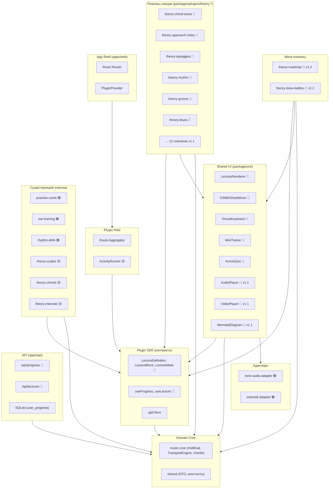
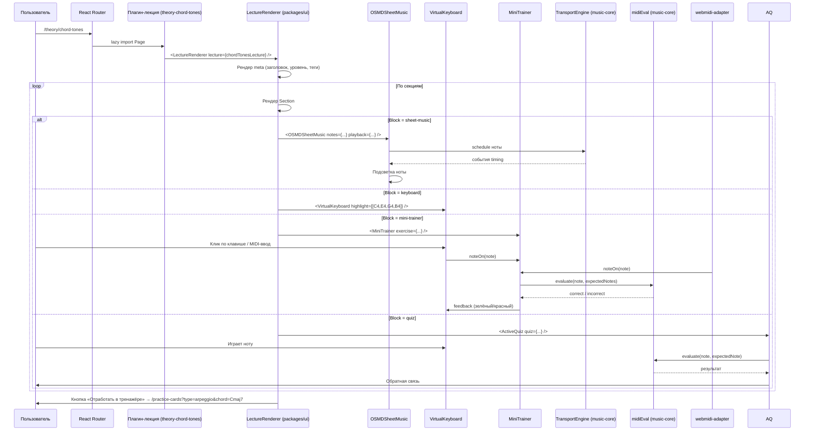

# THEORY ARCHITECTURE — Архитектура раздела теории Jazz Trainer

> **Назначение:** Архитектурная проработка подсистемы Theory на основе `docs/THEORY_VISION.md`.
> **Аудитория:** Разработчики (`software-engineer`), архитекторы (`software-architect`).
> **Родительский документ:** `docs/ARCHITECTURE_BASE.md` — каноническая архитектура всего проекта.
> **Продуктовое видение:** `docs/THEORY_VISION.md` — что строим и зачем.
>
> Статусы: 🟢 = реализовано, 🟡 = частично, 🔴 = запланировано, ⚪ = исключено.

---

## 1. Принципы (Theory-специфичные)

1. **Лекция = данные.** Лекция — это типизированная структура `LectureDefinition`, а не React-компонент. Рендеринг унифицирован через `LectureRenderer`. Это позволяет создавать десятки лекций без дублирования вёрстки.

2. **See → Hear → Do → Verify.** Каждая лекция строится по 6-шаговому циклу: Контекст → Теория → Звук → Практика → Проверка → Дальше. Архитектура не диктует контент, но шаблон секций (`LectureSection`) — стандартизован.

3. **Плагин-лекция ≠ плагин-тренажёр.** Лекции — статические определения в плагинах `theory-*`. Тренажёры — отдельные плагины (`practice-cards`, `ear-training`, `rhythm-drills`). Интеграция — через URL-параметры и `ActivityRunner` (ADR-012).

4. **UI-компоненты — общие.** `LectureRenderer`, `OSMDSheetMusic`, `VirtualKeyboard`, `MiniTrainer`, `ActiveQuiz` живут в `packages/ui/` и переиспользуются всеми плагинами-лекциями. Никакого дублирования вёрстки между лекциями.

5. **Прогресс — на сервере.** Состояние прохождения лекций (`user_progress`) хранится в API. Клиент — через хуки SDK (`useProgress`). Сервер — источник истины.

6. **MIDI-first, клавиатура — fallback.** Все мини-тренажёры и активные проверки поддерживают MIDI-ввод (через `webmidi-adapter`). Виртуальная клавиатура — основной способ ввода для пользователей без MIDI-устройств.

---

## 2. Компонентная архитектура

### 2.1. Диаграмма компонентов (v1.0–v1.2)



### 2.2. Поток рендеринга лекции



---

## 3. Размещение по слоям

### 3.1. Что и где живёт

| Артефакт                                                             | Слой            | Пакет                                     | Статус  |
| -------------------------------------------------------------------- | --------------- | ----------------------------------------- | ------- |
| `LectureDefinition`, `LectureMeta`, `LectureBlock`, `LectureSection` | SDK (контракты) | `packages/plugin-sdk/src/lecture-engine/` | 🔴      |
| `MiniExercise`, `ActiveQuiz`, `PlaybackConfig`                       | SDK (контракты) | `packages/plugin-sdk/src/lecture-engine/` | 🔴      |
| `useProgress()`, `useLecture()`                                      | SDK (хуки)      | `packages/plugin-sdk/src/hooks/`          | 🔴      |
| `LectureRenderer`                                                    | UI (общий)      | `packages/ui/src/LectureRenderer.tsx`     | 🔴      |
| `OSMDSheetMusic`                                                     | UI (общий)      | `packages/ui/src/OSMDSheetMusic.tsx`      | 🔴      |
| `VirtualKeyboard`                                                    | UI (общий)      | `packages/ui/src/VirtualKeyboard.tsx`     | 🔴      |
| `MiniTrainer`                                                        | UI (общий)      | `packages/ui/src/MiniTrainer.tsx`         | 🔴      |
| `ActiveQuiz`                                                         | UI (общий)      | `packages/ui/src/ActiveQuiz.tsx`          | 🔴      |
| `AudioPlayer`                                                        | UI (общий)      | `packages/ui/src/AudioPlayer.tsx`         | 🔴 v1.1 |
| `VideoPlayer`                                                        | UI (общий)      | `packages/ui/src/VideoPlayer.tsx`         | 🔴 v1.1 |
| `MermaidDiagram`                                                     | UI (общий)      | `packages/ui/src/MermaidDiagram.tsx`      | 🔴 v1.1 |
| Плагины-лекции (`theory-chord-tones` и др.)                          | Плагины         | `packages/plugins/theory-*/`              | 🔴      |
| `theory-roadmap`                                                     | Плагин          | `packages/plugins/theory-roadmap/`        | 🔴 v1.2 |
| `theory-boss-battles`                                                | Плагин          | `packages/plugins/theory-boss-battles/`   | 🔴 v1.2 |
| `user_progress` (таблица)                                            | API             | `apps/api/src/db/schema.ts`               | 🔴 v1.2 |
| `POST /api/progress`                                                 | API             | `apps/api/src/routes/progress.routes.ts`  | 🔴 v1.2 |
| `GET /api/lectures`                                                  | API             | `apps/api/src/routes/lectures.routes.ts`  | 🔴 v1.2 |

### 3.2. Границы слоёв (линтер)

| Пакет                            | Разрешённые импорты                                                                       |
| -------------------------------- | ----------------------------------------------------------------------------------------- |
| `plugin-sdk/src/lecture-engine/` | stdlib (чистые типы, без React, без Tone.js)                                              |
| `packages/ui/`                   | `plugin-sdk` (типы), `music-core` (midiEval, TransportEngine), `React`, `OSMD`, `Tone.js` |
| `plugins/theory-*`               | `plugin-sdk` (definePlugin, LectureDefinition), `ui` (LectureRenderer)                    |
| `plugins/theory-roadmap`         | `plugin-sdk` (useProgress), `ui`, `music-core`                                            |
| `plugins/theory-boss-battles`    | `plugin-sdk`, `ui`, `music-core`, `adapters` (через порты)                                |
| `apps/api`                       | `shared` (DTO), `music-core` (типы)                                                       |

**Запрещено:**

- `plugin-sdk/lecture-engine/` → React, Tone.js, OSMD (чистота контракта)
- `plugins/theory-*` → другие плагины (изоляция)
- `plugins/theory-*` → `apps/web/shell` (независимость от оболочки)

---

## 4. Лекционный движок (Lecture Engine)

### 4.1. Типы (в `plugin-sdk`)

```ts
// packages/plugin-sdk/src/lecture-engine/types.ts

// ── Метаданные лекции ────────────────────────────────────────────────

export interface LectureMeta {
  id: string; // 'theory.chord-tones'
  title: string; // 'Аккордовые звуки'
  topic: TopicId; // 'chord-tones' | 'approach-notes' | ...
  level: 1 | 2 | 3 | 4 | 5;
  duration: number; // минут
  prerequisites: string[]; // ID лекций-пререквизитов
  bonusPoints: number; // баллы за полное прохождение
  tags: string[]; // ['начинающий', 'гармония']
}

export type TopicId =
  | 'chord-tones'
  | 'approach-notes'
  | 'arpeggios'
  | 'rhythm'
  | 'groove'
  | 'blues'
  | 'scales-jazz'
  | 'voicings'
  | 'voice-leading'
  | 'ii-v-i'
  | 'turnarounds'
  | 'tritone-sub'
  | 'modal-interchange'
  | 'secondary-dominants'
  | 'diminished-harmony'
  | 'coltrane-changes'
  | 'blues-advanced'
  | 'rhythm-changes';

// ── Блоки лекции ─────────────────────────────────────────────────────

export type LectureBlock =
  | TextBlock
  | ImageBlock
  | DiagramBlock
  | SheetMusicBlock
  | KeyboardBlock
  | AudioBlock
  | VideoBlock
  | MiniTrainerBlock
  | QuizBlock
  | DividerBlock
  | CalloutBlock;

export interface TextBlock {
  type: 'text';
  content: string; // Markdown
}

export interface ImageBlock {
  type: 'image';
  src: string;
  caption?: string;
}

export interface DiagramBlock {
  type: 'diagram';
  mermaid: string; // Mermaid-синтаксис
}

export interface SheetMusicBlock {
  type: 'sheet-music';
  notes: string; // MusicXML или ABC-подобный формат
  playback: PlaybackConfig;
}

export interface PlaybackConfig {
  tempo: number; // BPM
  loop?: boolean;
  highlightNotes?: boolean; // Подсветка текущей ноты при проигрывании
  instrument?: 'piano' | 'rhodes' | 'guitar';
}

export interface KeyboardBlock {
  type: 'keyboard';
  highlight: string[]; // Note[], e.g. ['C4', 'E4', 'G4', 'B4']
  label?: string;
}

export interface AudioBlock {
  type: 'audio';
  src: string; // URL mp3/m4a
  waveform?: boolean;
}

export interface VideoBlock {
  type: 'video';
  src: string; // URL или YouTube ID
  poster?: string;
}

export interface MiniTrainerBlock {
  type: 'mini-trainer';
  exercise: MiniExercise;
}

export interface QuizBlock {
  type: 'quiz';
  quiz: ActiveQuiz;
}

export interface DividerBlock {
  type: 'divider';
}

export interface CalloutBlock {
  type: 'callout';
  kind: 'tip' | 'warning' | 'info';
  content: string; // Markdown
}

// ── Мини-тренажёры ────────────────────────────────────────────────────

export type MiniExercise =
  | PlayArpeggioExercise
  | PlayScaleExercise // v1.1
  | PlayChordExercise // v1.1
  | PlayProgressionExercise // v1.1
  | PlayRhythmExercise // v1.1
  | ImproviseExercise; // v1.2

export interface PlayArpeggioExercise {
  type: 'play-arpeggio';
  chords: string[]; // ['Cmaj7', 'Dm7', 'G7']
  input: 'midi' | 'keyboard' | 'both';
  feedback: 'note-by-note' | 'end-of-phrase';
}

export interface PlayScaleExercise {
  type: 'play-scale';
  scale: string; // 'C major', 'D dorian'
  octaves: 1 | 2;
  direction: 'ascending' | 'descending' | 'both';
  input: 'midi' | 'keyboard' | 'both';
}

export interface PlayChordExercise {
  type: 'play-chord';
  chords: string[];
  input: 'midi' | 'keyboard' | 'both';
}

export interface PlayProgressionExercise {
  type: 'play-progression';
  progression: string[]; // ['Dm7', 'G7', 'Cmaj7']
  tempo: number;
  input: 'midi' | 'keyboard' | 'both';
}

export interface PlayRhythmExercise {
  type: 'play-rhythm';
  pattern: string; // Ритмический паттерн (нотация)
  note: string; // Одна нота для повторения
  tempo: number;
  input: 'midi' | 'keyboard' | 'both';
}

export interface ImproviseExercise {
  type: 'improvise';
  progression: string[];
  allowedNotes: string[]; // Пул разрешённых нот (гамма/арпеджио)
  bars: number;
  tempo: number;
  input: 'midi' | 'keyboard' | 'both';
}

// ── Активные проверки ─────────────────────────────────────────────────

export type ActiveQuiz =
  | PlayTheNoteQuiz
  | PlayTheChordQuiz // v1.1
  | CompleteThePhraseQuiz // v1.2
  | TranscribeQuiz; // v1.2

export interface PlayTheNoteQuiz {
  type: 'play-the-note';
  questions: PlayNoteQuestion[];
  input: 'midi' | 'keyboard' | 'both';
}

export interface PlayNoteQuestion {
  prompt: string; // 'Сыграй терцию аккорда Cmaj7'
  expectedNote: string; // 'E4'
}

export interface PlayTheChordQuiz {
  type: 'play-the-chord';
  questions: PlayChordQuestion[];
  input: 'midi' | 'keyboard' | 'both';
}

export interface PlayChordQuestion {
  prompt: string; // 'Сыграй аккорд Cmaj7'
  expectedNotes: string[]; // ['C4', 'E4', 'G4', 'B4']
}

export interface CompleteThePhraseQuiz {
  type: 'complete-the-phrase';
  questions: CompletePhraseQuestion[];
  input: 'midi' | 'keyboard' | 'both';
}

export interface CompletePhraseQuestion {
  prompt: string;
  playback: PlaybackConfig; // Система играет 2 такта
  expectedNotes: string[]; // Ожидаемое завершение
}

export interface TranscribeQuiz {
  type: 'transcribe';
  questions: TranscribeQuestion[];
  input: 'midi' | 'keyboard' | 'both';
}

export interface TranscribeQuestion {
  prompt: string;
  playback: PlaybackConfig; // Прослушай
  expectedNotes: string[];
}

// ── Секция ────────────────────────────────────────────────────────────

export interface LectureSection {
  id: string; // 'context', 'theory', 'sound', 'practice', 'assessment', 'next'
  title: string; // '1. Контекст', '2. Теория', ...
  blocks: LectureBlock[];
}

// ── Полное определение лекции ─────────────────────────────────────────

export interface LectureDefinition {
  meta: LectureMeta;
  sections: LectureSection[];
}
```

### 4.2. LectureRenderer (в `packages/ui/`)

```tsx
// packages/ui/src/LectureRenderer.tsx

export interface LectureRendererProps {
  lecture: LectureDefinition;
  /** Предзаполненные ответы (для возобновления) */
  initialProgress?: LectureProgress;
  /** Коллбэк при изменении прогресса */
  onProgress?: (progress: LectureProgress) => void;
  /** Коллбэк завершения секции */
  onSectionComplete?: (sectionId: string) => void;
  /** Коллбэк завершения лекции */
  onComplete?: (result: LectureResult) => void;
}

export interface LectureProgress {
  lectureId: string;
  status: 'not_started' | 'in_progress' | 'completed';
  sectionsCompleted: string[];
  quizScores: Record<string, number>; // sectionId → 0.0–1.0
}

export interface LectureResult {
  lectureId: string;
  completed: boolean;
  quizScores: Record<string, number>;
  timeSpentSeconds: number;
}
```

**Рендеринг блоков (диспетчеризация):**

```
LectureRenderer
├─ LectureHeader          → meta: title, level, duration, tags
├─ forEach section:
│   └─ SectionRenderer
│       └─ forEach block:
│           ├─ text        → <ReactMarkdown />
│           ├─ image       →  (v1.1)
│           ├─ diagram     → <MermaidDiagram /> (v1.1)
│           ├─ sheet-music → <OSMDSheetMusic />
│           ├─ keyboard    → <VirtualKeyboard />
│           ├─ audio       → <AudioPlayer /> (v1.1)
│           ├─ video       → <VideoPlayer /> (v1.1)
│           ├─ mini-trainer→ <MiniTrainer />
│           ├─ quiz        → <ActiveQuiz />
│           ├─ divider     → <hr />
│           └─ callout     → <CalloutBlock kind={...} />
└─ LectureFooter          → Прогресс-бар, кнопки «Дальше»
```

### 4.3. OSMDSheetMusic — синхронизация нот и звука

```
OSMDSheetMusic
├─ Принимает: notes: string (MusicXML/ABC), playback: PlaybackConfig
├─ Рендерит: OSMD-нотоносец
├─ При playback.highlightNotes = true:
│   ├─ TransportEngine.schedule() — планирует ноты
│   ├─ Подписывается на события TransportEngine
│   └─ Подсвечивает текущую ноту через OSMD API (cursor + color)
└─ Использует Tone.js для синтеза звука (через tone-audio-adapter)
```

**Архитектурное решение:** OSMDSheetMusic не управляет транспортом напрямую. Он использует `TransportEngine` из `music-core`, который уже решает задачу детерминированного timing'а. Синхронизация достигается через `Transport.schedule()` (Tone.js), что гарантирует sample-точный timing.

### 4.4. VirtualKeyboard — переиспользуемый компонент

```
VirtualKeyboard
├─ Props:
│   ├─ highlight: Note[]       — подсветка указанных нот
│   ├─ labels?: boolean        — показывать подписи нот
│   ├─ octaves?: number        — количество октав (1–3)
│   ├─ onNoteOn?: (note) => void
│   ├─ onNoteOff?: (note) => void
│   └─ feedback?: Map<Note, 'correct'|'incorrect'>  — зелёный/красный
├─ Адаптивность:
│   ├─ Desktop: 2–3 октавы (CSS Grid)
│   ├─ Tablet: 2 октавы
│   └─ Phone: 1 октава + swipe для смены октавы
├─ Звук: Tone.js PolySynth (лёгкий, для обратной связи)
└─ Состояние: внутренний useState для нажатых клавиш
```

**Архитектурное решение:** VirtualKeyboard — «глупый» компонент. Он не знает о MIDI, не знает о `midiEval`. Он только отображает клавиши и эмитит события `onNoteOn`/`onNoteOff`. Всю логику оценки держат `MiniTrainer` и `ActiveQuiz`. Это SRP и позволяет переиспользовать клавиатуру в разных контекстах.

### 4.5. MiniTrainer — мини-тренажёр внутри лекции

```
MiniTrainer
├─ Принимает: exercise: MiniExercise
├─ Состояние:
│   ├─ currentExerciseIndex
│   ├─ expectedNotes: Note[]
│   ├─ playedNotes: Note[]
│   └─ feedback: 'correct' | 'incorrect' | 'pending'
├─ Вход:
│   ├─ VirtualKeyboard (onNoteOn → playedNotes)
│   └─ webmidi-adapter (MIDI-ввод → playedNotes)
├─ Оценка:
│   └─ midiEval.evaluate(playedNotes, expectedNotes)
├─ Обратная связь:
│   ├─ note-by-note: зелёный/красный на клавиатуре после каждой ноты
│   └─ end-of-phrase: общий результат после завершения фразы
└─ Автопереход: после успешного выполнения → следующий аккорд/упражнение
```

### 4.6. ActiveQuiz — активная проверка

```
ActiveQuiz
├─ Принимает: quiz: ActiveQuiz
├─ Состояние:
│   ├─ currentQuestionIndex
│   ├─ userAnswer: Note | Note[]
│   ├─ results: QuestionResult[]
│   └─ score: number
├─ Поток:
│   ├─ Показывает prompt
│   ├─ Ждёт ввод (MIDI/клавиатура)
│   ├─ Проверяет через midiEval
│   ├─ Показывает обратную связь
│   └─ Переходит к следующему вопросу
└─ Результат:
    └─ Суммарный счёт (доля правильных ответов)
```

---

## 5. Плагины-лекции

### 5.1. Структура плагина-лекции

```
packages/plugins/theory-chord-tones/
├── package.json
├── tsconfig.json
└── src/
    ├── index.ts          ← definePlugin() + маршрут
    ├── lecture.ts        ← export const lecture: LectureDefinition
    └── ChordTonesPage.tsx ← Страница-обёртка: <LectureRenderer lecture={lecture} />
```

**Пример `index.ts` (плагин):**

```ts
import { definePlugin } from '@jazz/plugin-sdk';

export default definePlugin({
  manifest: {
    id: 'theory.chord-tones',
    name: 'Аккордовые звуки',
    apiVersion: 1 as const,
    category: 'theory' as const,
    description: 'Лекция: аккордовые звуки — фундамент джазовой импровизации.',
  },
  contributes: {
    routes: [{ path: '/theory/chord-tones', element: () => import('./ChordTonesPage') }],
    navItems: [
      { section: 'learn', label: 'Аккордовые звуки', to: '/theory/chord-tones', icon: 'music' },
    ],
    // theoryProviders — для дорожной карты (v1.2)
    theoryProviders: [
      {
        id: 'theory.chord-tones',
        topic: 'chord-tones',
        level: 1,
        prerequisites: [],
        bonusPoints: 50,
      },
    ],
  },
});
```

**Пример `ChordTonesPage.tsx` (обёртка):**

```tsx
import { LectureRenderer } from '@jazz/ui';
import { useProgress, useUpdateProgress } from '@jazz/plugin-sdk';
import { lecture } from './lecture';

export default function ChordTonesPage() {
  const progress = useProgress('theory.chord-tones');
  const updateProgress = useUpdateProgress();

  return (
    <LectureRenderer
      lecture={lecture}
      initialProgress={progress}
      onProgress={(p) => updateProgress(p)}
    />
  );
}
```

### 5.2. Карта плагинов по фазам

| Фаза | Плагины                                                                                                                                                                                                                                                                                          | Кол-во |
| ---- | ------------------------------------------------------------------------------------------------------------------------------------------------------------------------------------------------------------------------------------------------------------------------------------------------ | ------ |
| v1.0 | `theory-chord-tones`, `theory-approach-notes`, `theory-arpeggios`, `theory-rhythm`, `theory-groove`, `theory-blues`                                                                                                                                                                              | 6      |
| v1.1 | `theory-scales-jazz`, `theory-voicings`, `theory-voice-leading`, `theory-ii-v-i`, `theory-turnarounds`, `theory-tritone-sub`, `theory-modal-interchange`, `theory-secondary-dominants`, `theory-diminished-harmony`, `theory-coltrane-changes`, `theory-blues-advanced`, `theory-rhythm-changes` | 12     |
| v1.2 | `theory-roadmap`, `theory-boss-battles`                                                                                                                                                                                                                                                          | 2      |

**Итого:** 20 плагинов (18 лекций + 2 мета-плагина).

**Регистрация:** Каждый плагин добавляется одной строкой в `packages/plugin-registry/src/index.ts`:

```ts
import theoryChordTones from '@jazz/plugin-theory-chord-tones';
// ... остальные 17 импортов

export const PLUGINS = [
  // ... существующие 17
  theoryChordTones,
  // ... остальные новые
];
```

### 5.3. Мета-плагин: theory-roadmap (v1.2)

```
theory-roadmap
├─ Маршрут: /theory (главная страница раздела)
├─ Компонент: RoadmapPage
│   ├─ Собирает theoryProviders из всех плагинов
│   ├─ Группирует по логическим блокам
│   ├─ Отображает дерево: 🟢 пройдено / 🟡 доступно / 🔒 заблокировано
│   └─ Клик по узлу → переход на /theory/:id
├─ Данные прогресса: useProgress() из SDK → API → user_progress
└─ Визуализация: Mermaid или собственный граф (React Flow / D3)
```

### 5.4. Мета-плагин: theory-boss-battles (v1.2)

```
theory-boss-battles
├─ Маршрут: /theory/boss/:id
├─ Компонент: BossBattlePage
│   ├─ Таймер (ограничение по времени)
│   ├─ Полоса здоровья (3 попытки = 3 сердца)
│   ├─ Аккомпанемент через TransportEngine
│   ├─ Оценка через midiEval (ноты, ритм, артикуляция)
│   ├─ Визуальные эффекты (CSS-анимации)
│   └─ Результат: 1–3 звезды, рейтинг
└─ Зависимости: VirtualKeyboard, OSMDSheetMusic, TransportEngine, midiEval
```

---

## 6. Модель данных (API)

### 6.1. Таблица `user_progress`

```sql
CREATE TABLE user_progress (
  id INTEGER PRIMARY KEY,
  user_id INTEGER NOT NULL REFERENCES users(id),
  lecture_id TEXT NOT NULL,          -- 'theory.chord-tones'
  status TEXT NOT NULL DEFAULT 'not_started',
                                     -- 'not_started' | 'in_progress' | 'completed'
  sections_completed TEXT,           -- JSON: ['context', 'theory', 'sound']
  quiz_score REAL,                   -- 0.0–1.0
  attempts INTEGER DEFAULT 0,
  time_spent_seconds INTEGER DEFAULT 0,
  completed_at TEXT,
  created_at TEXT DEFAULT (datetime('now')),
  updated_at TEXT DEFAULT (datetime('now')),
  UNIQUE(user_id, lecture_id)
);
```

### 6.2. API-эндпоинты

| Метод   | Путь                       | Назначение                                                       | Фаза |
| ------- | -------------------------- | ---------------------------------------------------------------- | ---- |
| `GET`   | `/api/progress`            | Список прогресса текущего пользователя (все лекции)              | v1.2 |
| `GET`   | `/api/progress/:lectureId` | Прогресс по конкретной лекции                                    | v1.2 |
| `PATCH` | `/api/progress/:lectureId` | Обновить прогресс (`sections_completed`, `quiz_score`, `status`) | v1.2 |
| `GET`   | `/api/lectures`            | Список всех доступных лекций (мета-информация)                   | v1.2 |
| `GET`   | `/api/lectures/:id`        | Мета-информация конкретной лекции                                | v1.2 |

### 6.3. DTO (в `@jazz/shared`)

```ts
// packages/shared/src/dto.ts (дополнение)

export const UserProgressDto = z.object({
  lectureId: z.string(),
  status: z.enum(['not_started', 'in_progress', 'completed']),
  sectionsCompleted: z.array(z.string()),
  quizScore: z.number().min(0).max(1).nullable(),
  attempts: z.number().int().min(0),
  timeSpentSeconds: z.number().int().min(0),
  completedAt: z.string().nullable(),
});

export const LectureMetaDto = z.object({
  id: z.string(),
  title: z.string(),
  topic: z.string(),
  level: z.number().int().min(1).max(5),
  duration: z.number(),
  prerequisites: z.array(z.string()),
  bonusPoints: z.number(),
  tags: z.array(z.string()),
});
```

### 6.4. Хуки SDK (в `plugin-sdk`)

```ts
// packages/plugin-sdk/src/hooks/useProgress.ts

export function useProgress(lectureId?: string): UserProgressDto | UserProgressDto[] | null;
// Если передан lectureId — возвращает прогресс по одной лекции
// Если не передан — возвращает массив всего прогресса

export function useUpdateProgress(): (
  progress: Partial<UserProgressDto> & { lectureId: string },
) => Promise<void>;
// Оптимистичное обновление + запрос к API
```

---

## 7. Интеграция с существующими плагинами

### 7.1. practice-cards — приём параметров из лекции

**Проблема:** Кнопка «Отработать в тренажёре» должна передавать контекст (тип упражнения, аккорд, темп).

**Решение:** `practice-cards` принимает query-параметры:

```
/practice-cards?type=arpeggio&chord=Cmaj7&tempo=80
/practice-cards?type=scale&scale=C-major&octaves=2
/practice-cards?type=progression&chords=Dm7,G7,Cmaj7
```

**Реализация:** `practice-cards` читает `useSearchParams()` и предзаполняет форму упражнения.

**Архитектурное решение:** Это не новый тип вклада, а конвенция URL-параметров. Плагины не импортируют друг друга. Связь — через URL. Это сохраняет изоляцию.

### 7.2. theory-scales, theory-chords, theory-intervals — расширение

Существующие theory-плагины (заглушки) расширяются согласно `docs/SCALES-VISION.md`:

- **theory-scales:** Карточки ладов, детальный вид, панель практики → `docs/SCALES-VISION.md`
- **theory-chords:** Аналогично для аккордов
- **theory-intervals:** Аналогично для интервалов

**Интеграция с Lecture Engine:** Эти плагины могут также регистрировать `theoryProviders` для дорожной карты. Сами справочники — отдельные страницы (не лекции), но связаны с лекциями через перекрёстные ссылки.

### 7.3. ear-training + rhythm-drills — быстрый переход

Эти существующие плагины могут принимать те же query-параметры, что и `practice-cards`. Например:

```
/ear-training?intervals=thirds&root=C
/rhythm-drills?pattern=swing-eighths&tempo=100
```

Это не требует изменения контракта SDK — только добавления чтения `useSearchParams()` внутрь компонентов плагинов.

---

## 8. Архитектурные решения (ADR Theory)

### ADR-T01: Lecture Engine — в plugin-sdk, а не в music-core

**Дата:** 2026-06
**Статус:** 🟡 Предложено
**Контекст:** Где разместить типы `LectureDefinition`?
**Решение:** Типы `LectureDefinition`, `LectureBlock`, `LectureMeta` — в `packages/plugin-sdk/src/lecture-engine/`, как часть контракта SDK. Это не музыкальная логика (не `music-core`), а контракт «как описывать лекцию».
**Альтернативы:** `music-core` (лекции — это про музыку? Нет, это формат контента). `shared` (DTO — слишком общее). Отдельный пакет `lecture-engine` (избыточно, это всего лишь типы + 0 логики).
**Последствия:** Типы доступны всем плагинам через `@jazz/plugin-sdk`. При изменении формата лекции меняется контракт SDK (по ADR-004 — осознанно, с тестами).

### ADR-T02: UI-компоненты — в packages/ui, не в плагинах

**Дата:** 2026-06
**Статус:** 🟡 Предложено
**Контекст:** Где разместить `LectureRenderer`, `OSMDSheetMusic`, `VirtualKeyboard`, `MiniTrainer`, `ActiveQuiz`?
**Решение:** Всё в `packages/ui/` — общем пакете UI-компонентов. Каждый плагин-лекция импортирует `LectureRenderer` из `@jazz/ui`.
**Альтернативы:** Каждый плагин содержит свою копию (дублирование, violate DRY). `plugin-sdk` (SDK — контракты, не UI). `plugin-host` (host — агрегация, не рендеринг).
**Последствия:** Пакет `ui` зависит от React, OSMD, Tone.js. Это допустимо — `ui` на том же уровне, что и адаптеры (содержит платформенные зависимости). Слой `ui` разрешён для импорта плагинами (добавить в `eslint.config.js` boundaries).

### ADR-T03: Лекции — статические определения в плагинах, не CMS-контент

**Дата:** 2026-06
**Статус:** 🟡 Предложено (на v1.0–v1.2)
**Контекст:** Как создавать и хранить лекции?
**Решение:** Каждая лекция — TypeScript-файл в плагине (`lecture.ts`), экспортирующий `LectureDefinition`. Это даёт типобезопасность, автодополнение, проверку на этапе сборки. Редактирование — в IDE, деплой — вместе с кодом.
**Альтернативы:** CMS с хранением в БД (фаза 2+). Markdown-файлы (нет типизации). JSON (нет проверки типов).
**Последствия:** Контент-менеджер = разработчик (или контрибьютор с базовым знанием TS). Быстрое создание через копирование `_template`. Миграция на CMS — в будущем, когда контента станет > 50 лекций.

### ADR-T04: Прогресс — на сервере, не в localStorage

**Дата:** 2026-06
**Статус:** 🟡 Предложено (v1.2)
**Контекст:** Где хранить прогресс прохождения лекций?
**Решение:** Таблица `user_progress` в API (SQLite). Клиент — через `useProgress()` и `apiClient`. Сервер — источник истины.
**Альтернативы:** `localStorage` (нет кроссплатформенности, потеря при смене устройства). `IndexedDB` (сложнее синхронизация).
**Последствия:** Нужен API-эндпоинт. Требуется аутентификация. Оффлайн-режим не поддерживается на v1.2 (приемлемо для веб-приложения). Для геймификации (баллы, боссы) серверное хранение критично.

### ADR-T05: Босс-челленджи — отдельный плагин, не внутри лекций

**Дата:** 2026-06
**Статус:** 🟡 Предложено (v1.2)
**Контекст:** Где разместить босс-челленджи?
**Решение:** Отдельный плагин `theory-boss-battles`. Босс — это не лекция, а полноценная игровая активность со своим жизненным циклом (таймер, здоровье, счёт).
**Альтернативы:** Часть плагина-лекции (смешивает форматы). Часть `theory-roadmap` (нарушает SRP).
**Последствия:** Босс использует `ActivityRunner` (ADR-012) для управления состояниями. Переиспользует UI-компоненты из `packages/ui/`. Может быть запущен как из дорожной карты, так и напрямую по URL.

### ADR-T06: Ввод нот — абстракция InputSource (MIDI + Keyboard)

**Дата:** 2026-06
**Статус:** 🟡 Предложено (v1.0)
**Контекст:** Мини-тренажёры и квизы должны работать и с MIDI, и с виртуальной клавиатурой.
**Решение:** Внутренняя абстракция `InputSource` в `MiniTrainer` и `ActiveQuiz`, которая унифицирует события от `VirtualKeyboard.onNoteOn` и `webmidi-adapter`. Не новый порт в `music-core`, а локальная абстракция в компонентах `packages/ui/`.
**Альтернативы:** Два отдельных компонента `MiniTrainerMidi` и `MiniTrainerKeyboard` (дублирование). Порт `InputPort` в `music-core` (избыточно — это UI-концепт, не доменная логика).
**Последствия:** Код `MiniTrainer` и `ActiveQuiz` не зависит от источника ввода. При добавлении нового источника (например, микрофонный ввод в будущем) — меняется только `InputSource`.

---

## 9. Фазовый план (архитектурный)

### Фаза 1 — v1.0: Lecture Engine MVP

**Цель архитектуры:** Минимальный жизнеспособный лекционный движок.

| Задача                                                  | Слой               | Артефакты                                                  | Зависимости                                |
| ------------------------------------------------------- | ------------------ | ---------------------------------------------------------- | ------------------------------------------ |
| Типы `LectureDefinition`, `LectureBlock`, `LectureMeta` | `plugin-sdk`       | `src/lecture-engine/types.ts`                              | —                                          |
| `LectureRenderer`                                       | `packages/ui`      | `src/LectureRenderer.tsx`                                  | `plugin-sdk`, React, `react-markdown`      |
| `OSMDSheetMusic`                                        | `packages/ui`      | `src/OSMDSheetMusic.tsx`                                   | OSMD (npm), `music-core` (TransportEngine) |
| `VirtualKeyboard`                                       | `packages/ui`      | `src/VirtualKeyboard.tsx`                                  | Tone.js, Web Audio                         |
| `MiniTrainer` (play-arpeggio)                           | `packages/ui`      | `src/MiniTrainer.tsx`                                      | `music-core` (midiEval), `VirtualKeyboard` |
| `ActiveQuiz` (play-the-note)                            | `packages/ui`      | `src/ActiveQuiz.tsx`                                       | `music-core` (midiEval), `VirtualKeyboard` |
| 6 плагинов-лекций                                       | `plugins/theory-*` | 6 пакетов × `index.ts` + `lecture.ts` + `Page.tsx`         | `plugin-sdk`, `ui`                         |
| ESLint boundaries для `ui`                              | конфиг             | `eslint.config.js`                                         | —                                          |
| Алиасы для `@jazz/ui`                                   | конфиг             | `tsconfig.base.json`, `vite.config.ts`, `vitest.config.ts` | —                                          |

**Новые npm-зависимости:**

- `opensheetmusicdisplay` — OSMD для рендеринга нотного стана
- `react-markdown` — рендеринг Markdown в блоках `text` и `callout`

### Фаза 2 — v1.1: Обогащение контента

**Цель архитектуры:** Расширить движок новыми типами блоков и тренажёров.

| Задача                                                                      | Слой                   | Описание                                               |
| --------------------------------------------------------------------------- | ---------------------- | ------------------------------------------------------ |
| `AudioPlayer`                                                               | `packages/ui`          | Блок `audio`: Web Audio API, waveform, loop, AB-повтор |
| `VideoPlayer`                                                               | `packages/ui`          | Блок `video`: YouTube embed / `<video>`                |
| `MermaidDiagram`                                                            | `packages/ui`          | Блок `diagram`: Mermaid-рендеринг                      |
| `ImageBlock` поддержка                                                      | `LectureRenderer`      | Блок `image`: хостинг через `admin-assets`             |
| Новые `MiniExercise`: play-scale, play-chord, play-progression, play-rhythm | `packages/ui`          | Расширение `MiniTrainer`                               |
| Новые `ActiveQuiz`: play-the-chord                                          | `packages/ui`          | Расширение `ActiveQuiz`                                |
| 12 плагинов-лекций                                                          | `plugins/theory-*`     | По шаблону Фазы 1                                      |
| `admin-assets`: хостинг mp3/m4a, изображений                                | `plugins/admin-assets` | API для загрузки файлов                                |

**Новые npm-зависимости:**

- `mermaid` — рендеринг диаграмм

### Фаза 3 — v1.2: Геймификация

**Цель архитектуры:** Добавить слой прогресса и игровых механик.

| Задача                                  | Слой                   | Описание                              |
| --------------------------------------- | ---------------------- | ------------------------------------- |
| Таблица `user_progress`                 | `apps/api`             | Миграция + схема                      |
| API-эндпоинты `/api/progress`           | `apps/api`             | CRUD прогресса                        |
| DTO `UserProgressDto`, `LectureMetaDto` | `shared`               | Zod-схемы                             |
| `useProgress()`, `useUpdateProgress()`  | `plugin-sdk`           | Хуки для плагинов                     |
| `theory-roadmap`                        | `plugins/`             | Дорожная карта: `/theory`             |
| `theory-boss-battles`                   | `plugins/`             | Босс-челленджи: `/theory/boss/:id`    |
| `theoryProviders` в плагинах            | `plugin-sdk` + плагины | Регистрация лекций для дорожной карты |
| `complete-the-phrase`, `transcribe`     | `packages/ui`          | Новые типы проверок                   |
| `improvise` мини-тренажёр               | `packages/ui`          | Импровизация с оценкой                |

---

## 10. Интеграция с ActivityRunner (ADR-012)

`ActivityRunner` (🟡 предложен, не реализован) — машина состояний для учебных активностей. Theory-подсистема — первый крупный потребитель:

```
ActivityRunner
├─ Лекция: ActivityType = 'lesson'
│   └─ Состояния: idle → active → paused → completed
│   └─ Использует: LectureRenderer (встраивается в ActivityRunner-контейнер)
├─ Босс: ActivityType = 'assessment'
│   └─ Состояния: idle → active → paused → completed
│   └─ Использует: BossBattlePage
└─ Прогресс: ActivityRunner пишет в user_progress через API
```

**Архитектурное решение:** `ActivityRunner` реализуется в `plugin-host`. `LectureRenderer` не зависит от `ActivityRunner` — он просто компонент, который может быть встроен в любой контейнер. Это сохраняет возможность использовать `LectureRenderer` вне ActivityRunner (например, в превью админки).

---

## 11. Тестирование

| Уровень            | Что                                                                                            | Фаза |
| ------------------ | ---------------------------------------------------------------------------------------------- | ---- |
| **Unit**           | Типы `LectureDefinition`: валидация структуры                                                  | v1.0 |
| **Unit**           | `VirtualKeyboard`: рендеринг клавиш, события `onNoteOn`/`onNoteOff`                            | v1.0 |
| **Unit**           | `MiniTrainer`: логика оценки (mock `midiEval`)                                                 | v1.0 |
| **Unit**           | `ActiveQuiz`: логика квиза (mock `midiEval`)                                                   | v1.0 |
| **Unit**           | `midiEval`: существующие тесты расширить для новых типов упражнений                            | v1.0 |
| **Интеграционные** | `OSMDSheetMusic` + `TransportEngine`: синхронизация подсветки                                  | v1.0 |
| **Интеграционные** | `LectureRenderer`: рендеринг полной лекции                                                     | v1.0 |
| **Интеграционные** | API `/api/progress`: CRUD + аутентификация                                                     | v1.2 |
| **Контрактные**    | `manifest.schema.test.ts`: валидация манифестов новых плагинов                                 | v1.0 |
| **E2E**            | Полный сценарий: открыть лекцию → прочитать → пройти тренажёр → пройти квиз → увидеть прогресс | v1.2 |

---

## 12. Риски и митигация

| Риск                                        | Вероятность | Влияние | Архитектурная митигация                                                                                                                                              |
| ------------------------------------------- | ----------- | ------- | -------------------------------------------------------------------------------------------------------------------------------------------------------------------- |
| **OSMD не справляется с джазовой нотацией** | Средняя     | Высокое | `OSMDSheetMusic` — абстракция. При смене на VexFlow меняется только реализация компонента, интерфейс (`notes: string, playback: PlaybackConfig`) стабилен            |
| **Рост числа плагинов (6→18→20)**           | Высокая     | Низкое  | Build-time плагины статичны. Tree-shaking через Vite. 0 влияния на рантайм. Реестр — одна строка на плагин                                                           |
| **Сложность контента (18 лекций)**          | Высокая     | Среднее | Типизированная структура + копирование из `_template`. Контент-менеджер заполняет поля — не пишет код                                                                |
| **Синхронизация Tone.js + OSMD**            | Средняя     | Среднее | `Transport.schedule()` даёт sample-точный timing. Подсветка через callback на `Transport` — не через `requestAnimationFrame`                                         |
| **Виртуальная клавиатура на мобильных**     | Высокая     | Среднее | CSS Grid адаптивный: 1 октава на телефоне, swipe для смены. Компонент изолирован — изменения не затрагивают остальную систему                                        |
| **Зависимость от MIDI**                     | Факт        | Среднее | Виртуальная клавиатура — основной ввод. MIDI — опция через `webmidi-adapter`. Абстракция `InputSource` позволяет переключать источник без изменения логики тренажёра |
| **Раздувание `packages/ui/`**               | Средняя     | Низкое  | Компоненты изолированы (каждый в своём файле). Tree-shaking Vite убирает неиспользуемые. При росте > 15 компонентов — рассмотреть разбиение `ui` на подпакеты        |

---

## 13. Сводка архитектурных изменений

### Новые пакеты

| Пакет                                   | Тип                 | Фаза                             |
| --------------------------------------- | ------------------- | -------------------------------- |
| `packages/ui/`                          | Общие UI-компоненты | v1.0 (уже существует, 🟡 пустой) |
| `packages/plugins/theory-chord-tones/`  | Плагин-лекция       | v1.0                             |
| ... (18 плагинов-лекций)                | Плагины-лекции      | v1.0–v1.1                        |
| `packages/plugins/theory-roadmap/`      | Мета-плагин         | v1.2                             |
| `packages/plugins/theory-boss-battles/` | Мета-плагин         | v1.2                             |

### Изменения существующих пакетов

| Пакет                     | Изменение                                           | Фаза |
| ------------------------- | --------------------------------------------------- | ---- |
| `packages/plugin-sdk/`    | + `src/lecture-engine/types.ts` (типы лекций)       | v1.0 |
| `packages/plugin-sdk/`    | + `src/hooks/useProgress.ts`                        | v1.2 |
| `packages/plugin-sdk/`    | Расширение `extension-points.ts`: `theoryProviders` | v1.2 |
| `packages/shared/`        | + `UserProgressDto`, `LectureMetaDto` (Zod)         | v1.2 |
| `packages/plugin-host/`   | + ActivityRunner (ADR-012)                          | v1.2 |
| `apps/api/`               | + `progress.routes.ts`, `lectures.routes.ts`        | v1.2 |
| `apps/api/`               | + `user_progress` таблица                           | v1.2 |
| `eslint.config.js`        | + boundaries для `packages/ui/`                     | v1.0 |
| `tsconfig.base.json`      | + path `@jazz/ui`                                   | v1.0 |
| `apps/web/vite.config.ts` | + alias `@jazz/ui`                                  | v1.0 |
| `vitest.config.ts`        | + alias `@jazz/ui`                                  | v1.0 |

### Новые npm-зависимости

| Пакет                   | Версия | Назначение                                     | Фаза |
| ----------------------- | ------ | ---------------------------------------------- | ---- |
| `opensheetmusicdisplay` | ^1.x   | Рендеринг нотного стана                        | v1.0 |
| `react-markdown`        | ^9.x   | Рендеринг Markdown в блоках `text` и `callout` | v1.0 |
| `mermaid`               | ^11.x  | Рендеринг диаграмм (блок `diagram`)            | v1.1 |

---

_Документ подготовлен на основе `docs/THEORY_VISION.md` от 2026-06-17. Первый драфт архитектуры — 2026-06-18. Требует ревью и синхронизации с `ARCHITECTURE_BASE.md` (добавить ADR-T01–T06)._
